# Xamarin Android Device Manager

_The Xamarin Android Device Manager, currently in preview, replaces Google's legacy Device Manager. This guide explains how to use the Xamarin Android Device Manager to create and configure Android Virtual Devices (AVDs) that emulate Android devices. You can use these virtual devices to run and test your app without having to rely on a physical device._


<a name="overview" />
 
## Overview

After you have verified that hardware acceleration is enabled (as
described in
[Hardware Acceleration](~/android/get-started/installation/android-emulator/hardware-acceleration.md)),
the next step is to create virtual devices to use for testing and
debugging your app. You can use the Xamarin Android Device Manager to
create virtual devices for use by the Android SDK Emulator.

Why would you want to use the Xamarin Android Device Manager instead of the
[Google Device Manager](~/android/get-started/installation/android-emulator/google-emulator-manager.md)?
As of Android SDK Tools version 26.0.1, Google has removed support for
their UI-based AVD and SDK managers in favor of their new CLI (Command
Line Interface) tools. Because of this change, you must use the 
[Xamarin SDK Manager](~/android/get-started/installation/android-sdk.md)
and Xamarin Android Device Manager when you update to Android SDK Tools 26.0.1
and later (which is required for Android 8.0 Oreo development).


# [Visual Studio](#tab/vswin)

This guide explains how to install and use the Xamarin Android Device
Manager for Visual Studio on Windows (or [for Mac](?tabs=vsmac)):

[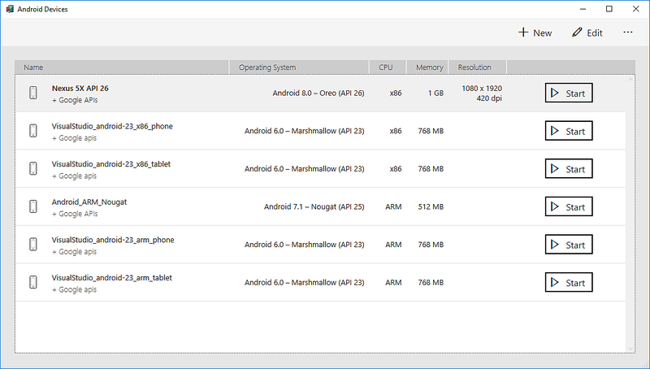](xamarin-device-manager-images/win/01-devices-dialog.png)

# [Visual Studio for Mac](#tab/vsmac)

This guide explains how to install and use the Xamarin Android Device
Manager for Visual Studio for Mac (or [for Windows](?tabs=vswin)):

[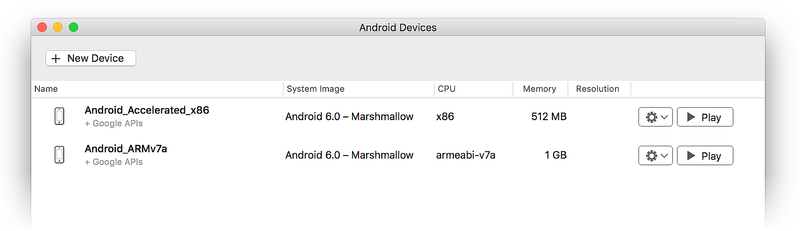](xamarin-device-manager-images/mac/01-devices-dialog.png)

> [!NOTE]
> **Note:** This guide applies only to Visual Studio for Mac.
Xamarin Studio is incompatible with the Xamarin Android Device Manager.

-----

You use the Xamarin Android Device Manager to create and configure
*Android Virtual Devices* (AVDs) that you run in the
[Android SDK Emulator](~/android/deploy-test/debugging/android-sdk-emulator/index.md).
Each AVD is an emulator configuration that simulates a physical Android
device. This makes it possible to run and test your app in a variety of
configurations that simulate different physical Android devices. The
Xamarin Android Device Manager replaces Google's standalone AVD Manager
(which has been deprecated).

In this guide, you will learn how to install and start the Android
Device Manager. You will learn how to create, duplicate, customize,
and launch virtual devices. This guide also explains how to configure
properties for each virtual device (such as API Level, CPU, memory, and
resolution), to enable/disable simulated sensors such as accelerometer,
GPS, orientation, and light sensor, and to configure the type of
hardware acceleration used by that virtual device.


<a name="requirements" />

## Requirements

# [Visual Studio](#tab/vswin)

To use the Xamarin Android Device Manager, you will need the following:

-   Visual Studio 2017 version 15.5 or later is required. Visual Studio
    Community edition and higher is supported.

-   Xamarin for Visual Studio version 4.8 or later. For
    information about updating Xamarin, see
    [Change the Updates Channel](https://developer.xamarin.com/recipes/cross-platform/ide/change_updates_channel/).

-   The latest version of the [Xamarin Device Manager installer](https://go.microsoft.com/fwlink/?linkid=865528) for Windows.

-   **Android SDK** &ndash; The Android SDK must be installed (see
    [Android SDK Setup](~/android/get-started/installation/android-sdk.md)),
    and SDK tools version 26.0 must be installed as explained in the
    next section. Be sure to install the Android SDK at the following location (if it
    is not already installed): **C:\\Program Files (x86)\\Android\\android-sdk**.

# [Visual Studio for Mac](#tab/vsmac)

-   Visual Studio for Mac 7.4 or later.

-   The latest version of the [Xamarin Device Manager installer](https://go.microsoft.com/fwlink/?linkid=865527) 
    for macOS.

-   **Android SDK** &ndash; Android SDK 8.0 (API 26) or later must be
    installed via the SDK Manager.

-----

 
## Installing the Device Manager

Use the following steps to install the Xamarin Android Device Manager:

# [Visual Studio](#tab/vswin)

1. Download the [Xamarin Device Manager installer](https://go.microsoft.com/fwlink/?linkid=865528) for Windows.

2. Double-click **Xamarin.DeviceManager.msi** and follow the installation directions: 

    

# [Visual Studio for Mac](#tab/vsmac)

1. Download the [Xamarin Device Manager installer](https://go.microsoft.com/fwlink/?linkid=865527) for macOS.

2. Double-click **AndroidDevices.pkg** and follow the installation directions: 

    [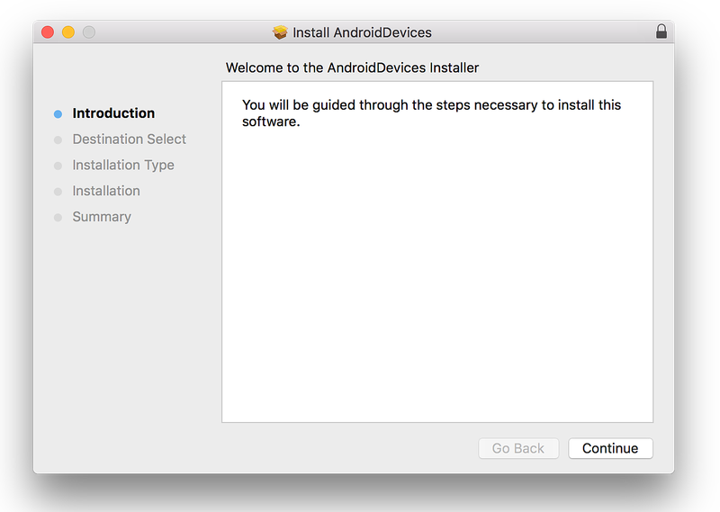](xamarin-device-manager-images/mac/30-installer.png)

-----

<a name="dev-manager" /> 
 
## Launching the Device Manager

# [Visual Studio](#tab/vswin)

In Visual Studio 15.6 Preview 3 and later, you can launch the Xamarin
Android Device Manager from the **Tools** menu. If you are using Visual
Studio 15.6 Preview 3 or later, start the Device Manager by clicking
**Tools > Android Emulator Manager**:

[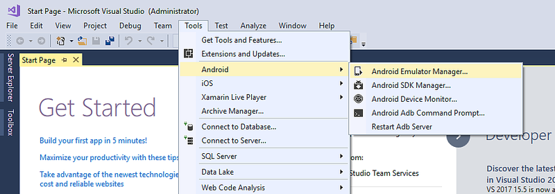](xamarin-device-manager-images/win/04-tools-menu.png)

If you are using an earlier version of Visual Studio, the Xamarin
Android Device Manager must be launched from the Windows **Start**
menu.


Right-click **Xamarin Android Device Manager** and select **More > Run
as administrator**. If you see the following
error dialog on launch, see the
[Troubleshooting](#troubleshooting) section for workaround
instructions:


# [Visual Studio for Mac](#tab/vsmac)

In Visual Studio for Mac 7.6 Preview 3 (currently in the alpha channel)
or later, you can launch the Xamarin Android Device Manager by selecting
**Tools > Emulator Manager**:

[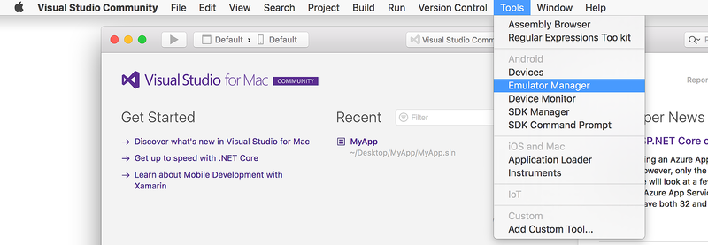](xamarin-device-manager-images/mac/16-tools-menu.png)

If you are using an earlier version of Visual Studio for Mac, the
Xamarin Android Device Manager must be launched independently. Locate
**Android Devices** in the **Applications** folder and double-click it
to launch it:

[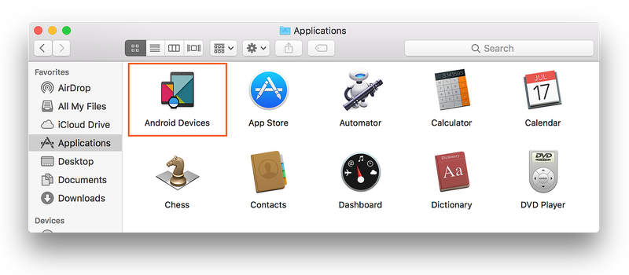](xamarin-device-manager-images/mac/31-location-in-finder.png)


-----

Before you can use the Android Device Manager, you must install Android
SDK tools version 26.0.0 or later. If Android SDK tools 26.0.0 or later
is not installed, you will see this error dialog on launch:

# [Visual Studio](#tab/vswin)

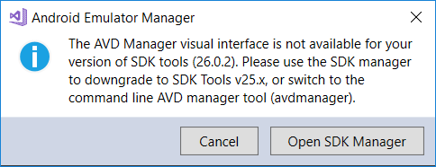

# [Visual Studio for Mac](#tab/vsmac)


-----

If you see this error dialog, click **OK** to open the Android SDK
Manager. In the Android SDK Manager, click the **Tools** tab and
install **Android SDK Tools 26.0.2** or later, **Android SDK
Platform-Tools 26.0.0** or later, and **Android SDK Build-Tools
26.0.0** (or later):


# [Visual Studio](#tab/vswin)

[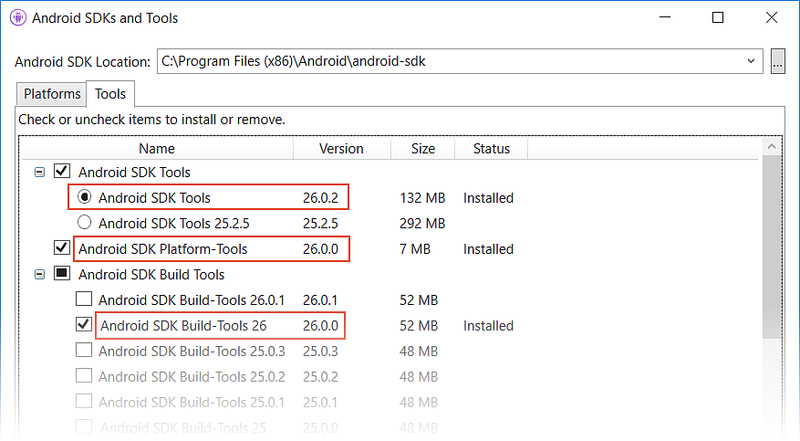](xamarin-device-manager-images/win/03-sdk-tools.png)

After these packages are installed, you can close the SDK Manager
and re-launch the Android Device Manager.

# [Visual Studio for Mac](#tab/vsmac)

[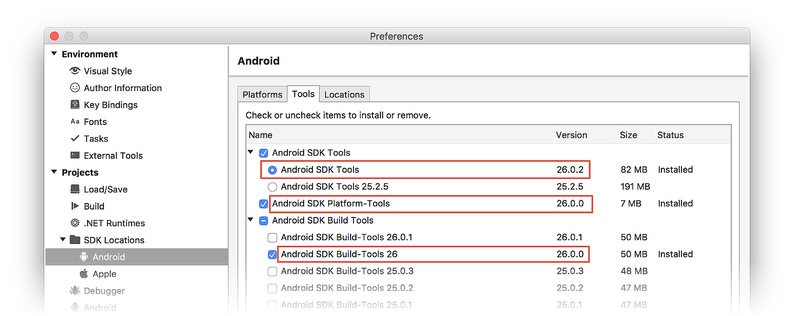](xamarin-device-manager-images/mac/03-sdk-tools.png)

-----

<a name="devices" />
 
## Main Screen

# [Visual Studio](#tab/vswin)

When you first launch the Android Device Manager, it presents a screen
that displays all currently-configured virtual devices. For each
device, the **Name**, **Operating System** (Android API Level),
**CPU**, **Memory** size, and screen resolution are displayed:

[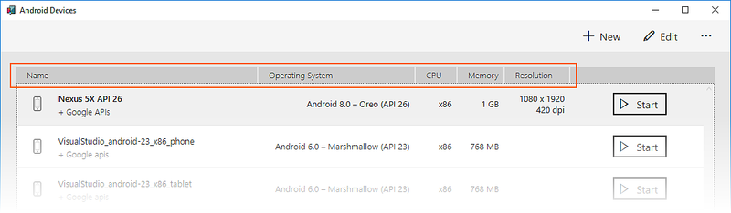](xamarin-device-manager-images/win/05-installed-list.png)

# [Visual Studio for Mac](#tab/vsmac)

When you first launch the Android Device Manager, it presents a screen
that displays all currently-configured virtual devices. For each
device, the **Name**, **System Image** (Android API Level), **CPU**,
**Memory** size, and screen resolution are displayed:

[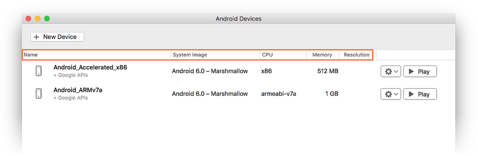](xamarin-device-manager-images/mac/05-devices-list.png)

-----

# [Visual Studio](#tab/vswin)

When you click a device in the list, the **Start** button appears on
the right. You can click the **Start** button to launch the emulator
with this virtual device:

[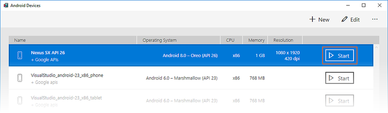](xamarin-device-manager-images/win/06-start-button.png)

# [Visual Studio for Mac](#tab/vsmac)

Click a **Play** button to launch the emulator with the virtual
device of your choice:
 
[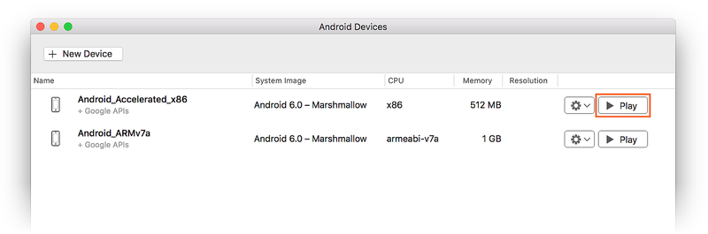](xamarin-device-manager-images/mac/06-start-button.png)
 
-----

# [Visual Studio](#tab/vswin)

After the emulator starts with the selected virtual device, the
**Start** button changes to a **Stop** button that you can use to halt
the emulator:

[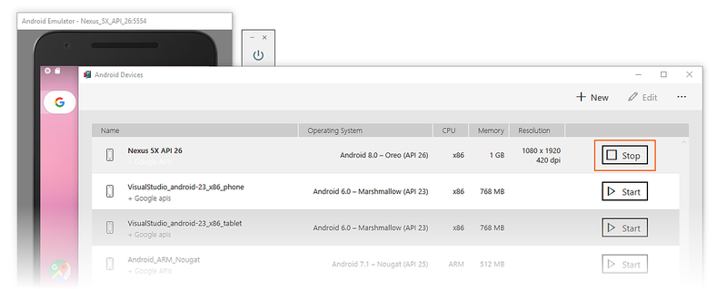](xamarin-device-manager-images/win/07-stop-button.png)

# [Visual Studio for Mac](#tab/vsmac)

After the emulator starts with the selected virtual device, the
**Play** button changes to a **Stop** button that you can use to halt
the emulator:
 
[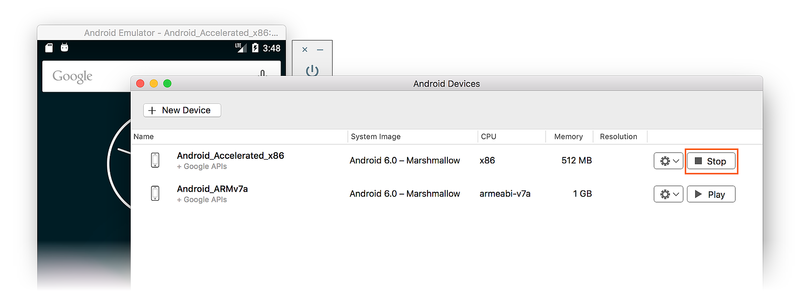](xamarin-device-manager-images/mac/07-stop-button.png)
 
-----

<a name="device-new" />
 
### New Device

# [Visual Studio](#tab/vswin)

To create a new device, click the **New** button (located in the upper
right-hand area of the screen):

[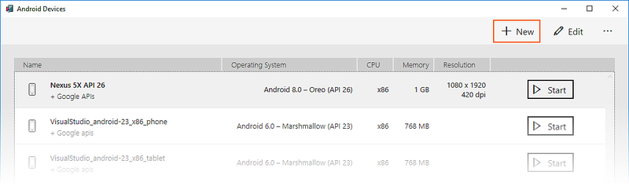](xamarin-device-manager-images/win/08-new-button.png)

# [Visual Studio for Mac](#tab/vsmac)

To create a new device, click the **New Device** button (located in the upper
right-hand area of the screen):
 
[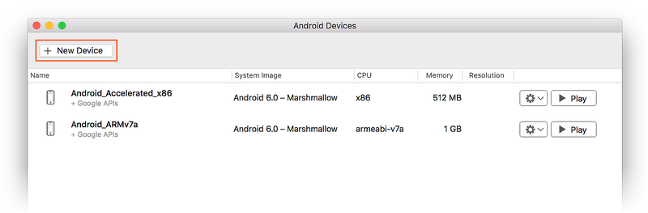](xamarin-device-manager-images/mac/08-new-button.png)
 
-----

# [Visual Studio](#tab/vswin)

Clicking **New** launches the **New Device** screen:

[](xamarin-device-manager-images/win/09-new-device-editor.png)

To configure a new device in the **New Device** screen, use the
following steps:

1. Select a physical device to emulate by clicking the **Device**
   pull-down menu:

    [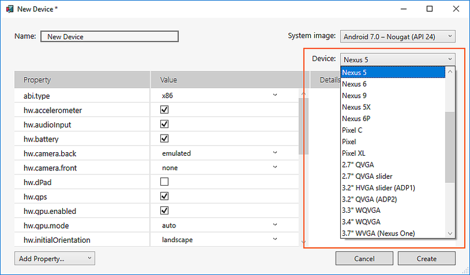](xamarin-device-manager-images/win/10-device-menu.png)

2. Select a system image to use with this virtual device by clicking the 
   **System image** pull-down menu. This menu lists the installed system images
   under **Installed**. The **Download** section lists system images that are
   currently unavailable on your development computer but can be automatically
   installed:

    [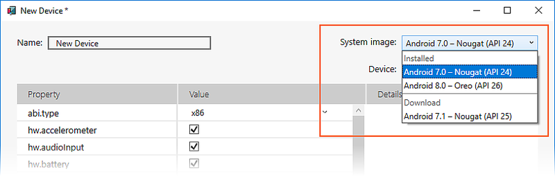](xamarin-device-manager-images/win/11-system-image-menu.png)

3. Give the device a new name. In the following example, the new device
   is named **Nexus 5 API 25**:

    [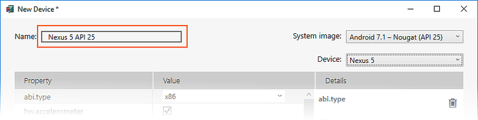](xamarin-device-manager-images/win/12-device-name.png)

4. Edit any properties that you need to modify. To make changes to
   properties, see
   [Profile Properties](#properties) later in this guide.

5. Add any additional properties that you need to explicitly set. The
   **New Device** screen lists only the most commonly-modified
   properties, but you can click the **Add Property** pull-down menu
   (in the bottom left-hand corner) to add additional properties. In
   the following example, the `hw.lcd.backlight` property is being
   added:

    [](xamarin-device-manager-images/win/13-add-property-menu.png)

6. Click the **Create** button (lower right-hand corner) to create the new device:

    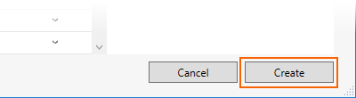

7. You might get a **License Acceptance** screen. Click **Accept** if you
   agree to the license terms:

    

8. The Android Device Manager adds the new device to the list of
   installed virtual devices with a **Creating** progress indicator
   while it creates the device:

    [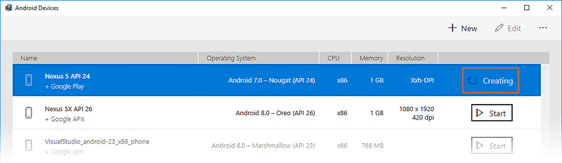](xamarin-device-manager-images/win/16-creating-the-device.png)

9. When the creation process is complete, the new device is shown in
   the list of installed virtual devices with a **Start** button, ready
   to launch:

   [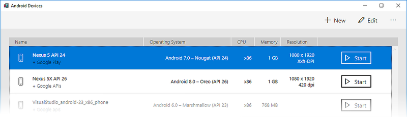](xamarin-device-manager-images/win/17-created-device.png)

# [Visual Studio for Mac](#tab/vsmac)

Clicking **New Device** launches the **New Device** screen:

[](xamarin-device-manager-images/mac/09-new-device-editor.png)

Use the following steps to configure a new device in the **New Device**
screen:

1. Select a physical device to emulate by clicking the **Device** pull-down menu:

    [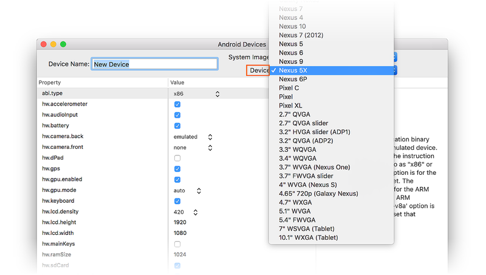](xamarin-device-manager-images/mac/10-device-menu.png)

2. Select a system image to use with this virtual device by clicking
   the **System image** pull-down menu. This menu lists the installed
   system images under **Installed**. the **Download** section (if
   shown) lists system images that are currently unavailable on your
   development computer but can be automatically installed:

    [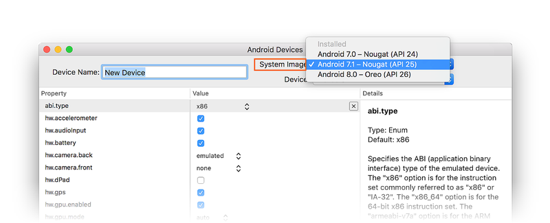](xamarin-device-manager-images/mac/11-system-image-menu.png)

3. Give the device a new name. In the following example, the new device
   is named **Nexus 5X API 25**:

    [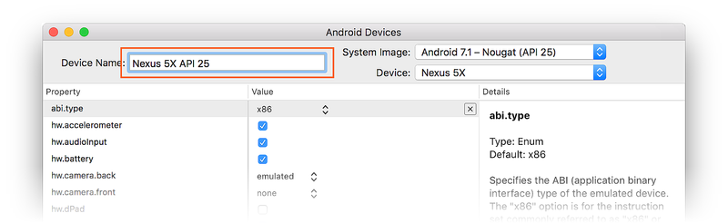](xamarin-device-manager-images/mac/12-device-name.png)

4. Edit any properties that you need to modify. To make changes to
   properties, see
   [Profile Properties](#properties) later in this guide.

5. Add any additional properties that you need to explicitly set. The
   **New Device** screen lists only the most commonly-modified
   properties, but you can click the **Add Property** pull-down menu
   (in the bottom left-hand corner) to add additional properties:

    [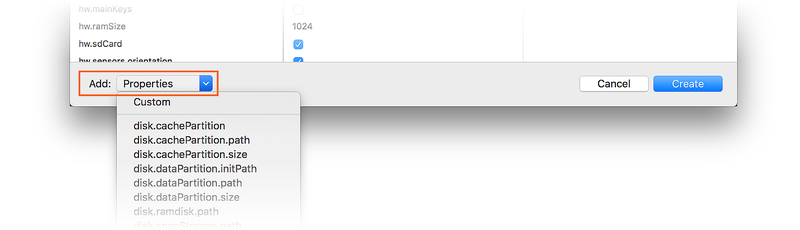](xamarin-device-manager-images/mac/13-add-property-menu.png)

6. You can also click **Custom** to define a new property for the device:

    

7. Click the **Create** button (lower right-hand corner) to create the new device:

    

8. You might get a **License Acceptance** screen. Click **Accept** if
   you agree to the license terms.

9. While it creates the device, the Android Device Manager adds the new
   device to the device list with a **Creating** progress indicator:

    [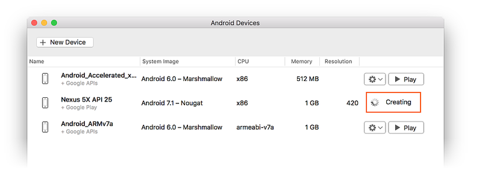](xamarin-device-manager-images/mac/17-creating-the-device.png)

10. When the creation process is complete, the new device is shown in
    the device list with a **Play** button, ready to launch:

   [](xamarin-device-manager-images/mac/18-created-device.png)

-----


<a name="device-edit" />
 
### Edit Device

# [Visual Studio](#tab/vswin)

To edit an existing virtual device, select the device and click the
**Edit** button (located in the upper right-hand corner of the screen):

[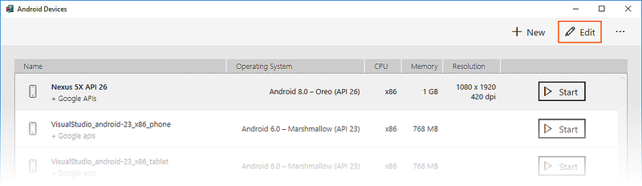](xamarin-device-manager-images/win/19-edit-button.png)

# [Visual Studio for Mac](#tab/vsmac)

To edit an existing virtual device, select the **Additional Options**
pull-down menu (gear icon) and select **Edit**:
 
[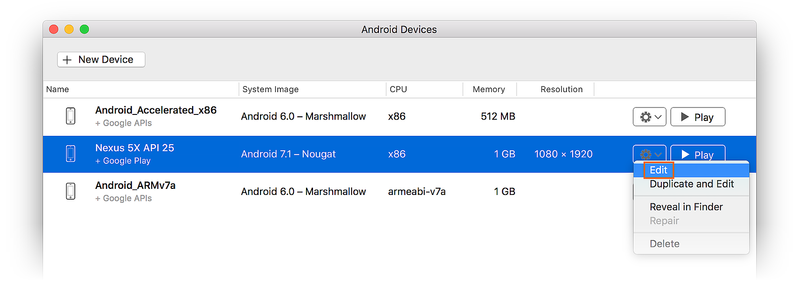](xamarin-device-manager-images/mac/19-edit-button.png)
 
-----

Clicking **Edit** launches the Device Editor for the selected virtual device:

# [Visual Studio](#tab/vswin)

[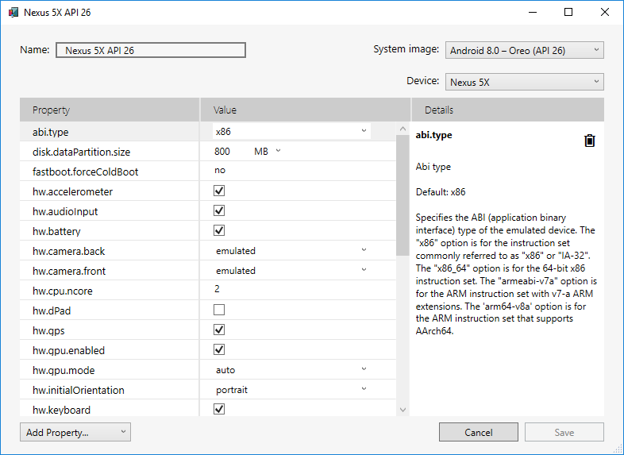](xamarin-device-manager-images/win/20-device-editor.png)

# [Visual Studio for Mac](#tab/vsmac)
 
[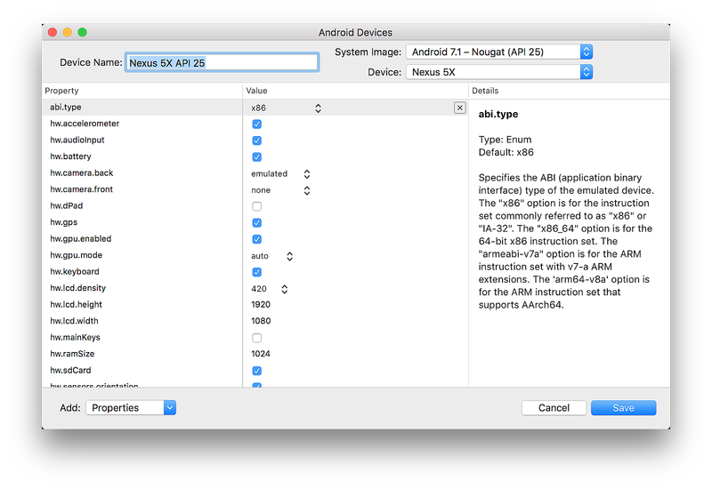](xamarin-device-manager-images/mac/20-device-editor.png)
 
-----

The **Device Editor** screen lists the properties of the virtual device
in the first column, with the corresponding values of each property in
the second column. When you select a property, a detailed description
of that property is displayed on the right.

# [Visual Studio](#tab/vswin)

For example, in the following screenshot the `hw.lcd.density` property
is being changed from **420** to **240**:

[](xamarin-device-manager-images/win/21-device-editing.png)

# [Visual Studio for Mac](#tab/vsmac)

For example, in the following screenshot the `hw.lcd.density` property
is changed from **320** to **240** and the `hw.ramSize` property
is changed to **768**:
 
[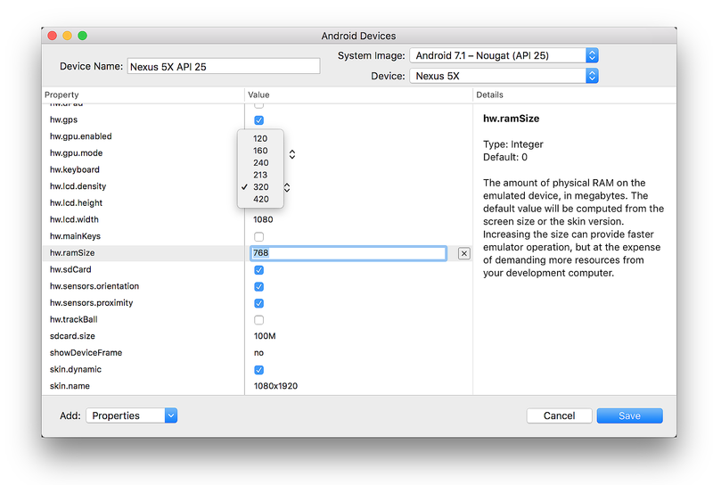](xamarin-device-manager-images/mac/21-device-editing.png)
 
-----

After you have made the necessary configuration changes, click the **Save** button.
For more information about changing virtual device properties, see
[Profile Properties](#properties) later in this guide.


<a name="addopt" />
 
### Additional Options

# [Visual Studio](#tab/vswin)

Additional options for working with devices are available from the
&hellip; menu in the upper right-hand corner:

[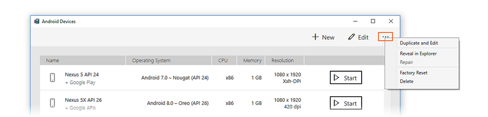](xamarin-device-manager-images/win/22-overflow-menu.png)

# [Visual Studio for Mac](#tab/vsmac)

Additional options for working with a device are available from the
pull-down menu located to the left of the **Play** button:

[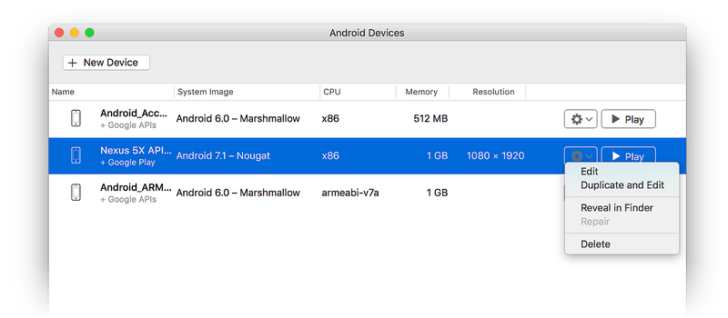](xamarin-device-manager-images/mac/22-overflow-menu.png)

-----

# [Visual Studio](#tab/vswin)

The additional options menu contains the following items:

-   **Duplicate and Edit** &ndash; Duplicates the currently-selected
    device and opens it in the **New Device** screen with a different
    unique name. For example, selecting
    **VisualStudio_android-23_x86_phone** and clicking **Duplicate and
    Edit** appends a counter to the name:

    [](xamarin-device-manager-images/win/23-dupe-and-edit.png)

-   **Reveal in Explorer** &ndash; Opens a Windows Explorer window in
    the folder that holds the files for the virtual device. For
    example, selecting **Nexus 5X API 25** and clicking **Reveal in
    Explorer** opens a window like the following:

    [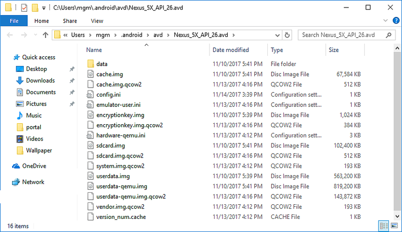](xamarin-device-manager-images/win/24-reveal-in-explorer.png)

-   **Factory Reset** &ndash; Resets the selected device to its default
    settings, erasing any user changes made to the internal state of
    the device while it was running. This change does not alter
    modifications that you make to the virtual device during creation
    and editing. A dialog box will appear with the reminder that this
    reset cannot be undone. Click **Wipe user data** to confirm the
    reset.

-   **Delete** &ndash; Permanently deletes the selected virtual device.
    A dialog box will appear with the reminder that deleting a device
    cannot be undone. Click **Delete** if you are certain that you want
    to delete the device.

# [Visual Studio for Mac](#tab/vsmac)

The additional options menu contains the following items:

-   **Edit** &ndash; Opens the currently-selected device in the device
    editor as described earlier in [Edit Device](#device-edit).

-   **Duplicate and Edit** &ndash; Duplicates the currently-selected device
    and opens it in the **New Device** screen with a different unique name.
    For example, selecting **Nexus 5X API 25** and
    clicking **Duplicate and Edit** appends a counter to the name:

    [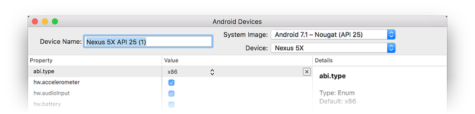](xamarin-device-manager-images/mac/23-dupe-and-edit.png)

-   **Reveal in Finder** &ndash; Opens a macOS Finder window in the
    folder that holds the files for the virtual device. For example,
    selecting **Nexus 5X API 25** and clicking **Reveal in Finder**
    opens a window like the following:

    [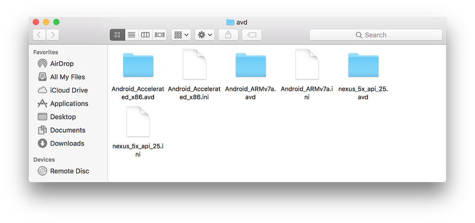](xamarin-device-manager-images/mac/24-reveal-in-finder.png)

-   **Factory Reset** &ndash; Resets the selected device to its default
    settings, erasing any user changes made to the internal state of
    the device while it was running. This change does not alter
    modifications that you make to the virtual device during creation
    and editing. A dialog box will appear with the reminder that this
    reset cannot be undone. Click **Wipe user data** to confirm the
    reset.

-   **Delete** &ndash; Permanently deletes the selected virtual device.
    A dialog box will appear with the reminder that deleting a device
    cannot be undone." Click **Delete** if you are certain that you
    want to delete the device.

-----

<a name="properties" />
 
## Profile Properties

The **New Device** and **Device Edit** screens list the properties of
the virtual device in the first column, with the corresponding values
of each property in the second column. When you select a property, a
detailed description of that property is displayed on the right. You
can modify its *hardware profile properties* and its *AVD properties*.
Hardware profile properties (such as `hw.ramSize` and
`hw.accelerometer`) describe the physical characteristics of the
emulated device. These characteristics include screen size, the amount
of available RAM, whether or not an accelerometer is present. AVD
properties specify the operation of the AVD when it runs. For example,
AVD properties can be configured to specify how the AVD uses your
development computer's graphics card for rendering.

# [Visual Studio](#tab/vswin)

You can change properties by using the following guidelines:

-   To change a boolean property, click the check mark to the right of
    the boolean property:

    

-   To change an *enum* (enumerated) property, click the down-arrow to
    the right of the property and choose a new value.

    

-   To change a string or integer property, double-click the current
    string or integer setting in the value column and enter a new value.

    


# [Visual Studio for Mac](#tab/vsmac)

You can change properties by using the following guidelines:

-   To change a boolean property, click the check mark to the right of
    the boolean property:

    

-   To change an *enum* (enumerated) property, click the pull-down menu
    to the right of the property and choose a new value.

    

-   To change a string or integer property, double-click the current
    string or integer setting in the value column and enter a new value.

    


-----

The following table provides a detailed explanation of the properties
listed in the **New Device** and **Device Editor** screens:

[!include[](~/android/includes/table.html)]

For more information about these properties, see
[Hardware Profile Properties](https://developer.android.com/studio/run/managing-avds.html#hpproperties).


<a name="troubleshooting" />

## Troubleshooting

# [Visual Studio](#tab/vswin)

The following describes common Xamarin Android Device Manager problems and
workarounds:

### Android SDK in Non-Standard Location

Typically, the Android SDK is installed at the following location:

**C:\\Program Files (x86)\\Android\\android-sdk**

If the SDK is not installed at this location, you may get this error on launch:


To workaround this problem, do the following:

1. From the Windows desktop, navigate to **C:\\Users\\*username*\\AppData\\Roaming\\XamarinDeviceManager**:

    

2. Double-click to open one of the log files and locate the **Config
   file path**. For example:

    [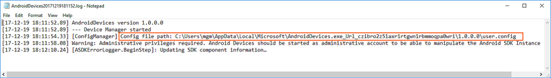](xamarin-device-manager-images/win/34-config-file-path.png)

3. Navigate to this location and double-click **user.config** to open it. 

4. In **user.config**, locate the **&lt;UserSettings&gt;** element and add an **AndroidSdkPath** attribute to 
   it. Set this attribute to the path where the Android SDK is installed on
   your computer and save the file. For example, **&lt;UserSettings&gt;** would look like the following if the
   Android SDK was installed at **C:\\Programs\\Android\\SDK**:
        
    ```xml
    <UserSettings SdkLibLastWriteTimeUtcTicks="636409365200000000" AndroidSdkPath="C:\Programs\Android\SDK" />
    ```

After making this change to **user.config**, you should be able to
launch the Xamarin Android Device Manager.

### Generating a Bug Report

If you find a problem with the Xamarin Android Device Manager that
cannot be resolved using the above troubleshooting tips, please file a
bug report by right-clicking the title bar and selecting **Generate Bug
Report**:

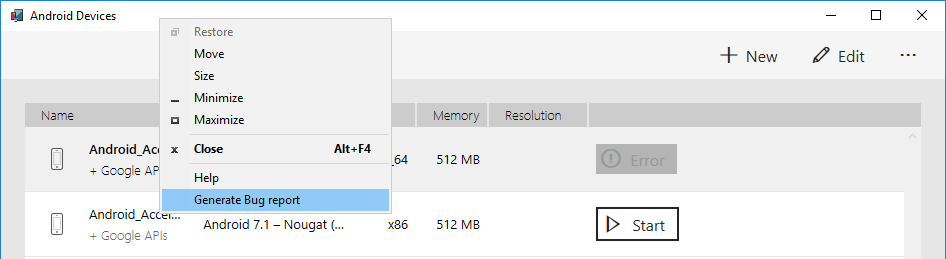

# [Visual Studio for Mac](#tab/vsmac)

Currently, there are no known problems/workarounds for the Xamarin
Android Device Manager on Visual Studio for Mac. 

### Generating a Bug Report

If you find a problem,
please file a bug report by clicking **Help > Generate Bug Report**:


-----

 
<a name="summary" />
 
## Summary

This guide introduced the Xamarin Android Device Manager available in
Visual Studio for Mac and Xamarin for Visual Studio. It explained
essential features such as starting and stopping the Android emulator,
selecting an Android virtual device (AVD) to run, creating new virtual
devices, and how to edit a virtual device. It also explained how to
edit profile hardware properties for further customization.


## Related Links

- [Changes to the Android SDK Tooling](~/android/troubleshooting/sdk-cli-tooling-changes.md)
- [Debugging with the Android SDK Emulator](~/android/deploy-test/debugging/android-sdk-emulator/index.md)
- [SDK Tools Release Notes (Google)](https://developer.android.com/studiohttps://developer.xamarin.com/releases/sdk-tools.html)
- [avdmanager](https://developer.android.com/studio/command-line/avdmanager.html)
- [sdkmanager](https://developer.android.com/studio/command-line/sdkmanager.html)
