# Setting up the Android SDK for Xamarin.Android

_Visual Studio includes an Android SDK Manager that you use
to download Android SDK tools, platforms, and other components that you
need for developing Xamarin.Android apps._

## Overview

This guide explains how to use the Xamarin Android SDK Manager in
Visual Studio and Visual Studio for Mac.

> [!NOTE]
> This guide applies to Visual Studio 2019, Visual Studio 2017, and Visual Studio for Mac.  

The Xamarin Android SDK Manager (installed as part of the **Mobile
development with .NET** workload) helps you download the latest Android
components that you need for developing your Xamarin.Android app. It
replaces Google's standalone SDK Manager, which has been deprecated.

# [Visual Studio](#tab/windows)

## Requirements

To use the Xamarin Android SDK Manager, you will need the following:

- Visual Studio 2019 Community, Professional, or Enterprise.

- OR Visual Studio 2017 (Community, Professional, or Enterprise edition). Visual
  Studio 2017 version 15.7 or later is required.

- Visual Studio Tools for Xamarin version 4.10.0 or later
  (installed as part of the **Mobile development with .NET** workload). 

The Xamarin Android SDK Manager also requires the Java Development Kit
(which is automatically installed with Xamarin.Android). There are
several JDK alternatives to choose from:

- By default, Xamarin.Android uses
    [JDK 8](https://www.oracle.com/technetwork/java/javase/downloads/jdk8-downloads-2133151.html),
    which is required if you are developing for API level 24 or greater
    (JDK 8 also supports API levels earlier than 24).

- You can continue to use [JDK 7](https://www.oracle.com/technetwork/java/javase/downloads/jdk7-downloads-1880260.html)
    if you are developing specifically for API level 23 or earlier.

- If you are using Visual Studio 15.8 Preview 5 or later, you can try
    using [Microsoft's Mobile OpenJDK Distribution](openjdk.md) 
    rather than JDK 8.

> [!IMPORTANT]
> Xamarin.Android does not support JDK 9.

## SDK Manager 

To start the SDK Manager in Visual Studio, click **Tools > Android >
Android SDK Manager**:

[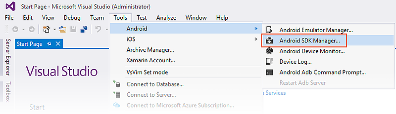](android-sdk-images/win/02-sdk-manager-menu-item.png#lightbox)

The Android SDK Manager opens in the **Android SDKs and
Tools** screen. This screen has two tabs &ndash; **Platforms** and
**Tools**:

[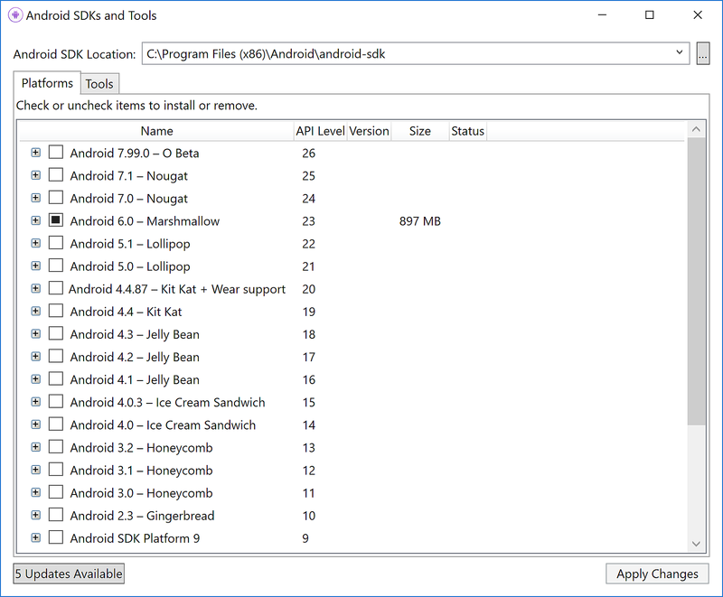](android-sdk-images/win/03-sdk-manager-platforms.png#lightbox)

The **Android SDKs and Tools** screen is described in more detail in
the following sections.

### Android SDK location

The Android SDK location is configured at the top of the **Android SDKs
and Tools** screen, as seen in the previous screenshot. This location must
be configured correctly before the **Platforms** and **Tools** tabs
will function properly. You may need to set the location of the Android
SDK for one or more of the following reasons:

1. The Android SDK Manager was unable to locate the Android SDK. 

2. You have installed the Android SDK in a alternate (non-default) location. 

To set the location of the Android SDK, click the ellipsis (&hellip;)
button to the far right of **Android SDK Location**. This opens the
**Browse For Folder** dialog to use for navigating to the location of
the Android SDK. In the following screenshot, the Android SDK under
**Program Files (x86)\\Android** is being selected:

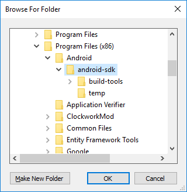

When you click **OK**, the SDK Manager will manage the Android SDK that
is installed at the selected location.

### Tools tab

The **Tools** tab displays a list of _tools_ and _extras_. Use this tab
to install the Android SDK tools, platform tools, and build tools.
Also, you can install the Android Emulator, the low-level debugger
(LLDB), the NDK, HAXM acceleration, and Google Play libraries.

For example, to download the Google Android Emulator package, click the
check mark next to **Android Emulator** and click the **Apply Changes**
button:

[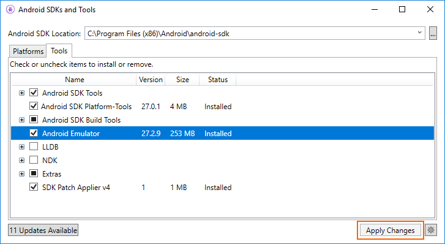](android-sdk-images/win/06-install-emulator.png#lightbox)

A dialog may be shown with the message, _The following package requires
that you accept its license terms before installing_:

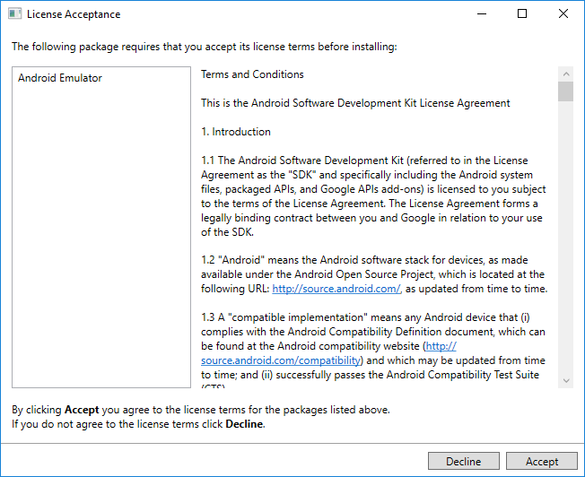

Click **Accept** if you accept the Terms and Conditions. At the bottom
of the window, a progress bar indicates download and installation
progress. After the installation completes, the **Tools** tab will show
that the selected tools and extras were installed.

### Platforms tab

The **Platforms** tab displays a list of platform SDK versions along
with other resources (like system images) for each platform:

[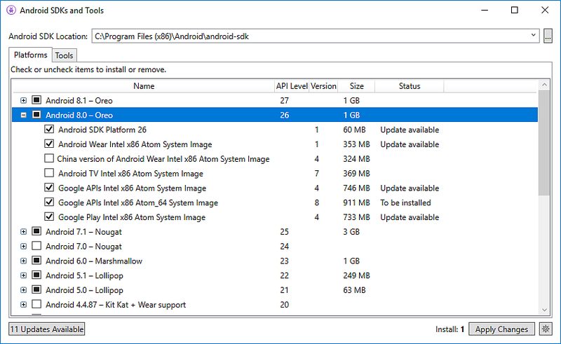](android-sdk-images/win/08-platforms-pane.png#lightbox)

This screen lists the Android version (such as **Android 8.0**), the
code name (**Oreo**), the API level (such as **26**), and the sizes of
the components for that platform (such as **1 GB**). You use the
**Platforms** tab to install components for the Android API level that
you want to target. For more information about Android versions and API
levels, see
[Understanding Android API Levels](~/android/app-fundamentals/android-api-levels.md).

When all components of a platform are installed, a checkmark appears next
to the platform name. If not all components of a platform are
installed, the box for that platform is filled. 
You can expand a platform to see its components (and which components
are installed) by clicking the **+** box to the left of the platform.
Click **-** to unexpand the component listing for a platform.

To add another platform to the SDK, click the box next to the platform
until the checkmark appears to install all of its components, then
click **Apply Changes**:

To install only specific components, click the box next to the platform
once. You can then select any individual components that you need:

[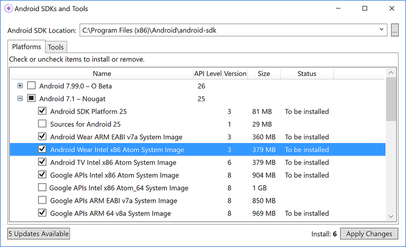](android-sdk-images/win/10-adding-some-components.png#lightbox)

Notice that the number of components to install appears next to the
**Apply Changes** button. After you click the **Apply Changes** button,
you will see the **License Acceptance** screen as shown earlier.
Click **Accept** if you accept the Terms and Conditions. You may see
this dialog more than one time when there are multiple components to
install. At the bottom of the window, a progress bar will indicate
download and installation progress. When the download and installation
process completes (this can take many minutes, depending on how many
components need to be downloaded), the added components are marked with
a checkmark and listed as **Installed**.

### Repository selection

By default, the Android SDK Manager downloads platform components and
tools from a Microsoft-managed repository. If you need access to
experimental alpha/beta platforms and tools that are not yet available
in the Microsoft repository, you can switch the SDK Manager to use
Google's repository. To make this switch, click the gear icon in the
lower right-hand corner and select **Repository > Google
(Unsupported)**:

When the Google repository is selected, additional packages may appear
in the **Platforms** tab that were not available previously. (In the
above screenshot, **Android SDK Platform 28** was added by switching to
the Google repository.) Keep in mind that use of the Google repository
is unsupported and is therefore not recommended for everyday
development.

To switch back to the supported repository of platforms and tools,
click **Microsoft (Recommended)**. This restores the list of packages
and tools to the default selection.

# [Visual Studio for Mac](#tab/macos)

## Requirements

To use the Xamarin Android SDK Manager, you will need the following:

- Visual Studio for Mac 7.5 (or later).

The Xamarin Android SDK Manager also requires the Java Development Kit
(which is automatically installed with Xamarin.Android). There are
several JDK alternatives to choose from:

- By default, Xamarin.Android uses
    [JDK 8](https://www.oracle.com/technetwork/java/javase/downloads/jdk8-downloads-2133151.html),
    which is required if you are developing for API level 24 or greater
    (JDK 8 also supports API levels earlier than 24).

- You can continue to use [JDK 7](https://www.oracle.com/technetwork/java/javase/downloads/jdk7-downloads-1880260.html)
    if you are developing specifically for API level 23 or earlier.

- If you are using Visual Studio for Mac 7.7 or later, you can try
    using [Microsoft's Mobile OpenJDK Distribution](openjdk.md)
    rather than JDK 8.

> [!IMPORTANT]
> Xamarin.Android does not support JDK 9.

## SDK Manager 

To start the SDK Manager in Visual Studio for Mac, click **Tools > SDK Manager**:

The **Android SDK Manager** opens in the **Preferences window**, which
contains three tabs, **Platforms**, **Tools**, and **Locations**:

[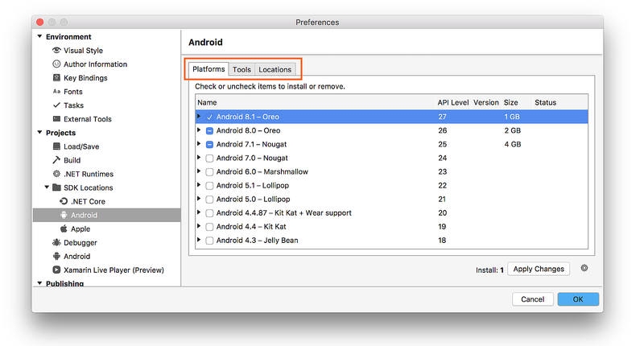](android-sdk-images/mac/02-sdk-manager-platforms-m75.png#lightbox)

The tabs of the Android SDK Manager are described in the
following sections.

### Locations tab

The **Locations** tab has three settings for configuring the locations
of the Android SDK, Android NDK, and the Java SDK (JDK). These
locations must be configured correctly before the **Platforms** and
**Tools** tabs will function properly.

When the SDK Manager starts, it automatically determines the path for
each installed package and indicates that it was **Found** by placing a
green checkmark icon next to the path:

[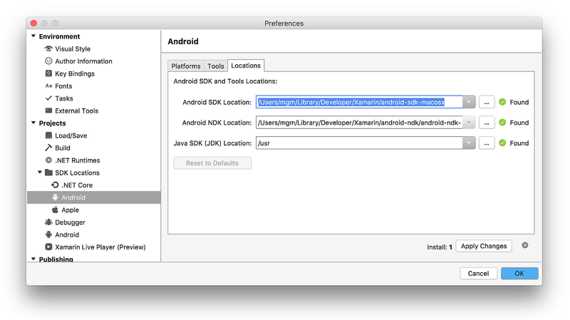](android-sdk-images/mac/03-locations-tab-m75.png#lightbox)

Click the **Reset to Defaults** button to cause the SDK Manager to look
for the SDK, NDK, and JDK at their default locations. 

Typically, you use the **Locations** tab to modify the location of the
Android SDK and/or the Java JDK. You do not need to install the NDK to
develop Xamarin.Android apps &ndash; the NDK is used only when you need
to develop parts of your app using native-code languages such as C and
C++.

### Tools tab

The **Tools** tab displays a list of _tools_ and _extras_. Use this tab
to install the Android SDK tools, platform tools, and build tools.
Also, you can install the Android Emulator, the low-level debugger
(LLDB), the NDK, HAXM acceleration, and Google Play libraries.

For example, to download the Google Android Emulator package, click the
check mark next to **Android Emulator** and click the **Apply Changes**
button:

A dialog may be shown with the message, _The following package requires
that you accept its license terms before installing_:

[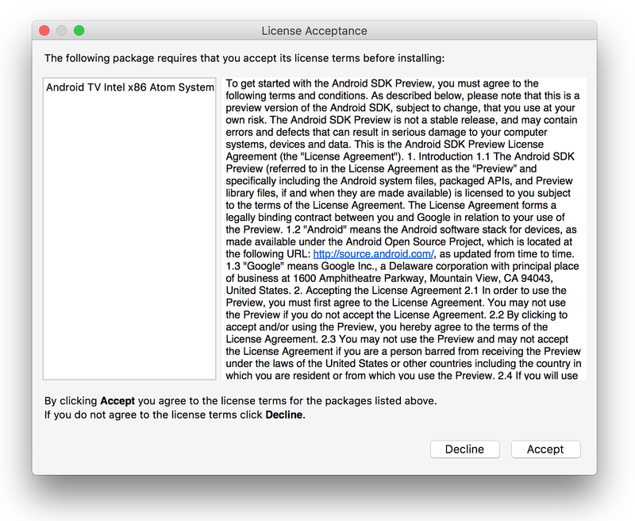](android-sdk-images/mac/05-license-acceptance-m75.png#lightbox)

Click **Accept** if you accept the Terms and Conditions. At the bottom
of the window, a progress bar indicates download and installation
progress. After the installation completes, the **Tools** tab will show
that the selected tools and extras were installed.

### Platforms tab

The **Platforms** tab displays a list of platform SDK versions along
with other resources (like system images) for each platform:

[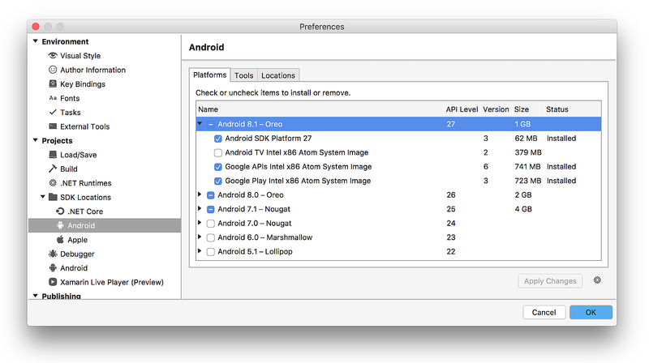](android-sdk-images/mac/06-platforms-tab-m75.png#lightbox)

This screen lists the Android version (such as **Android 8.1**), the
code name (**Oreo**), the API level (such as **27**), and the sizes of
the components for that platform (such as **1 GB**). You use the
**Platforms** tab to install components for the Android API level that
you want to target. For more information about Android versions and API
levels, see [Understanding Android API Levels](~/android/app-fundamentals/android-api-levels.md).

When all components of a platform are installed, a checkmark appears next
to the platform name. If not all components of a platform are
installed, the box for that platform is filled. 
You can expand a platform to see its components (and which components
are installed) by clicking the **arrow** to the left of the platform.
Click **down arrow** to unexpand the component listing for a platform.

To add another platform to the SDK, click the box next to the platform
until the checkmark appears to install all of its components, then
click **Apply Changes**:

[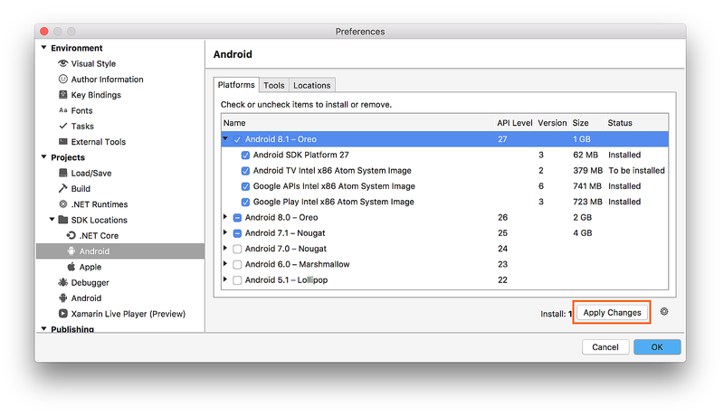](android-sdk-images/mac/07-install-all-m75.png#lightbox)

To install only some components, click the box next to the platform
once. You can then select any individual components that you need:

[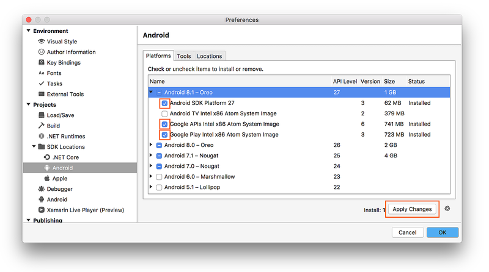](android-sdk-images/mac/08-individual-components-m75.png#lightbox)

Notice that the number of components to install appears next to the
**Apply Changes** button. After you click the **Apply Changes** button,
you will see the **License Acceptance** screen as shown earlier.
Click **Accept** if you accept the Terms and Conditions. You may see
this dialog more than one time when there are multiple components to
install. At the bottom of the window, a progress bar will indicate
download and installation progress. When the download and installation
process completes (this can take many minutes, depending on how many
components need to be downloaded), the added components are marked with
a checkmark and listed as **Installed**.

### Repository selection

By default, the Android SDK Manager downloads platform components and
tools from a Microsoft-managed repository. If you need access to
experimental alpha/beta platforms and tools that are not yet available
in the Microsoft repository, you can switch the SDK Manager to use
Google's repository. To make this switch, click the gear icon in the
lower right-hand corner and select **Repository > Google
(Unsupported)**:

[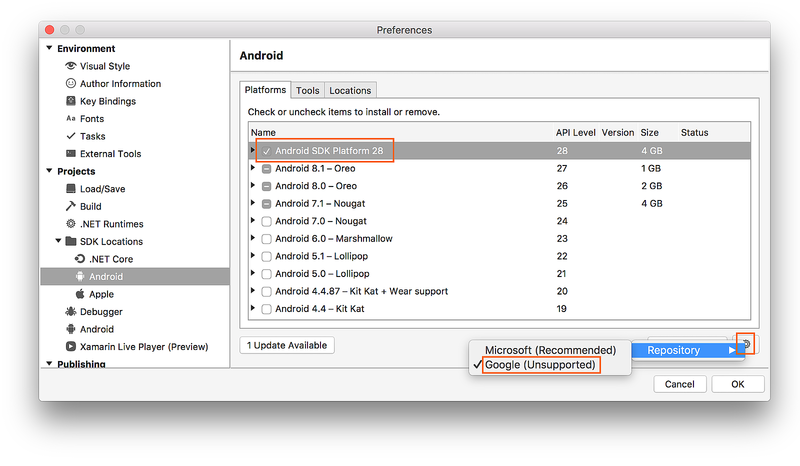](android-sdk-images/mac/09-google-repo-m75.png#lightbox)

When the Google repository is selected, additional packages may appear
in the **Platforms** tab that were not available previously. (In the
above screenshot, **Android SDK Platform 28** was added by switching to
the Google repository.) Keep in mind that use of the Google repository is
unsupported and is therefore not recommended for everyday development.

To switch back to the supported repository of platforms and tools,
click **Microsoft (Recommended)**. This restores the list of packages
and tools to the default selection.

-----

## Summary

This guide explained how to install and use the Xamarin Android SDK
Manager tool in Visual Studio and Visual Studio for Mac.

## Related Links

- [Understanding Android API levels](~/android/app-fundamentals/android-api-levels.md)
- [Changes to the Android SDK Tooling](~/android/troubleshooting/sdk-cli-tooling-changes.md)
