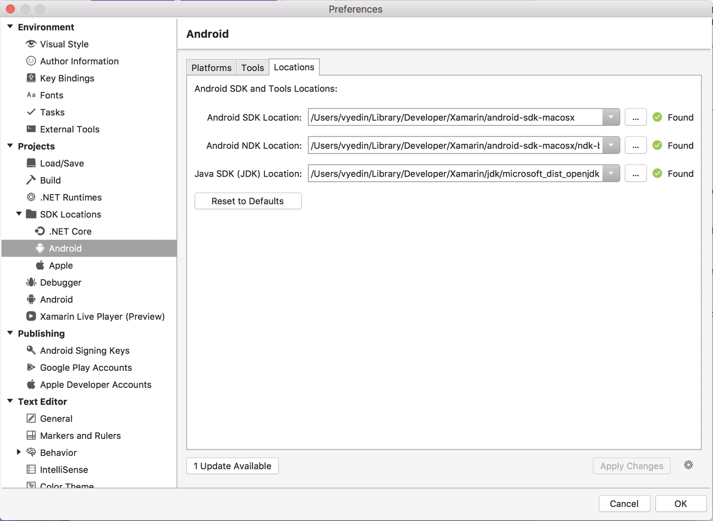
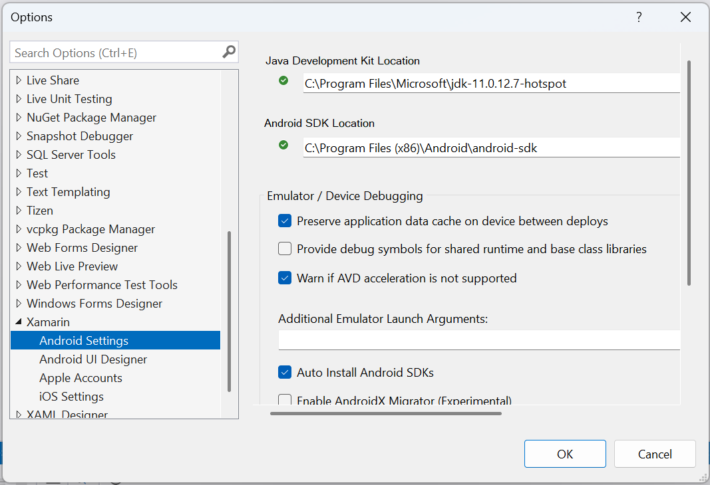

# Microsoft's Mobile OpenJDK Distribution

_This guide describes the steps for switching to an internal distribution of OpenJDK. This distribution is intended for mobile development._

## Overview

Beginning with Visual Studio 15.9 and Visual Studio for Mac 7.7, Visual Studio Tools for Xamarin has moved from Oracle’s JDK to a **lightweight version of the OpenJDK that is intended solely for Android development**. This is a required migration as Oracle is ending support for commercial distribution of JDK 8 in 2019, and JDK 8 is a required dependency for all Android development.

The benefits of this move are:

- You will always have an OpenJDK version that works for Android development.

- Downloading Oracle's JDK 9 or greater won’t affect the development experience.

- Reduced download size and footprint.

- No more issues with 3rd party servers and installers.

If you’d like to move to the improved experience sooner, builds of the Microsoft Mobile OpenJDK distribution are available for you to test on both Windows and Mac. The setup process is described below, and you can revert back to the Oracle JDK at any time.

## Download

The mobile OpenJDK distribution is automatically installed for you if you select the Android SDK packages in the Visual Studio installer on Windows. It will be included in the update to 15.9 for users who have the Android SDK selected.

On Mac, the mobile OpenJDK will be installed for you as part of the Android workload for new installs. For existing Visual Studio for Mac users, you will be prompted to install it as part of your update to 7.7. The IDE will prompt you to move to the new JDK, and will switch to using it at the next restart.

## Troubleshooting

If you encounter issues with the setup on Mac or Windows, you can take the following steps for manual setup:

Check if OpenJDK is installed on the machine in the correct location:

- **Mac** &ndash; **$HOME/Library/Developer/Xamarin/jdk/microsoft_dist_openjdk_1.8.0.9**
- **Windows** &ndash; **C:\\Program Files\\Android\\jdk\\microsoft_dist_openjdk_1.8.0.9**

If this path is empty, you can download one of the following packages:

- **Mac** &ndash; https://dl.xamarin.com/OpenJDK/mac/microsoft-dist-openjdk-1.8.0.9.zip
- **Windows x86** &ndash; https://dl.xamarin.com/OpenJDK/win32/microsoft-dist-openjdk-1.8.0.9.zip
- **Windows x64** &ndash; https://dl.xamarin.com/OpenJDK/win64/microsoft-dist-openjdk-1.8.0.9.zip

Point the IDE to the new JDK:

- **Mac** &ndash; Click **Tools > SDK Manager > Locations** and change the **Java SDK (JDK) Location** to the full path of the OpenJDK installation. In the following example, this path is set to  **$HOME/Library/Developer/Xamarin/jdk/microsoft_dist_openjdk_1.8.0.9**.

- **Windows** &ndash; Click **Tools > Options > Xamarin > Android Settings** and change the **Java Development Kit Location** to the full path of the OpenJDK installation. In the following example, this path is set to **C:\\Program Files\\Android\\jdk\\microsoft_dist_openjdk_1.8.0.9**:

## Known Issues

### Package 'OpenJDKV1.RegKey,version=1.8.0.9,chip=x64' failed to install

This may be an issue in some corporate environments. OpenJDK is already on the machine - follow the [troubleshooting steps above](#troubleshooting) to point your IDE to the correct location. You can follow the status of the issues [here](https://developercommunity.visualstudio.com/content/problem/382549/packageidopenjdkv1regkeypackageactioninstallreturn.html).

### "unknown update type: zip" when upgrading Visual Studio for Mac to 7.7

This issue may come up if trying to upgrade an older version of Visual Studio for Mac to 7.7. To work around it, uncheck OpenJDK in the updater, install the rest of the update, and check for updates again to get the OpenJDK package. If you're still having issues, you can follow the [troubleshooting steps above](#troubleshooting) to install OpenJDK manually. Please file a bug with logs attached if you encounter this issue.

## Summary

In this article, you learned how to configure your IDE to use Microsoft's Mobile OpenJDK distribution, and how to troubleshoot should you encounter issues.
