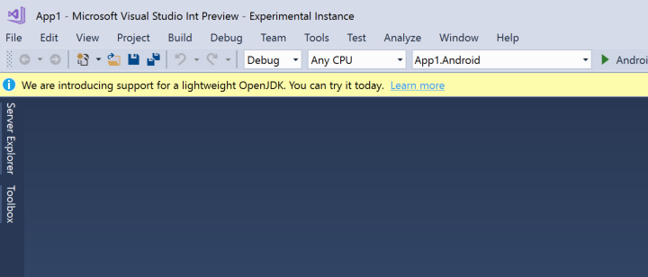

# Microsoft's Mobile OpenJDK Distribution Preview

_This guide describes the steps for switching to the preview release of Microsoft's distribution of the OpenJDK. This distribution is intended for mobile development._

## Overview

Beginning with Visual Studio 15.9 and Visual Studio for Mac 7.7, Visual Studio Tools for Xamarin will move from Oracle’s JDK to a **lightweight version of the OpenJDK that is intended solely for Android development**:

The benefits of this move are:

- You will always have an OpenJDK version that works for Android development.

- Downloading JDK 9 or 10 won’t affect the development experience.

- Significantly reduced download size and footprint.

- No more issues with 3rd party servers and installers.

If you’d like to move to the improved experience sooner, builds of the Microsoft Mobile OpenJDK distribution are available for you to test on both Windows and Mac. The setup process is described below, and you can revert back to the Oracle JDK at any time.

## Download

To get started, download the correct build for your system:

- **Mac** &ndash; https://dl.xamarin.com/OpenJDK/mac/microsoft-dist-openjdk-1.8.0.9.zip
- **Windows x86** &ndash; https://dl.xamarin.com/OpenJDK/win32/microsoft-dist-openjdk-1.8.0.9.zip
- **Windows x64** &ndash; https://dl.xamarin.com/OpenJDK/win64/microsoft-dist-openjdk-1.8.0.9.zip

## Configure

Unzip to the correct location:

- **Mac** &ndash; **$HOME/Library/Developer/Xamarin/jdk/microsoft_dist_openjdk_1.8.0.9**
- **Windows** &ndash; **C:\\Program Files\\Android\\jdk\\microsoft_dist_openjdk_1.8.0.9**

> [!IMPORTANT]
> This example uses build 1.8.0.9; however, the version you download may be newer.

Point the IDE to the new JDK:

- **Mac** &ndash; Click **Tools > SDK Manager > Locations** and change the **Java SDK (JDK) Location** to the full path of the OpenJDK installation. In the following example, this path is set to  **$HOME/Library/Developer/Xamarin/jdk/microsoft_dist_openjdk_1.8.0.9**.

- **Windows** &ndash; Click **Tools > Options > Xamarin > Android Settings** and change the **Java Development Kit Location** to the full path of the OpenJDK installation. In the following example, this path is set to **C:\\Program Files\\Android\\jdk\\microsoft_dist_openjdk_1.8.0.9**:

## Revert

To revert to the Oracle JDK, change the Java SDK location to the previously-used Oracle JDK path and rebuild the solution. On Mac, you can revert to the Oracle JDK path by clicking **Reset to Defaults**.

If you have any problems with the Microsoft Mobile OpenJDK distribution, please report issues by using the feedback tool in your IDE so that they can be tracked and corrected quickly.

## Known Issues & Planned Fix Dates

The `JAVA_HOME` environment variable may not be correctly exported to the SDK and the Device Manager. As a workaround, you can set this environment variable to the location of the OpenJDK on your computer. This is fixed in the 15.9 Previews.

## Summary

In this article, you learned how to configure your IDE to use the preview release of Microsoft's Mobile OpenJDK distribution, which is slated for stable release later in 2018.
