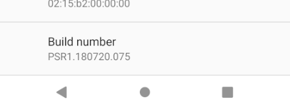

# Set Up Device for Development

_This article explains how to setup an Android device and connect it to a computer so that the device may be used to run and debug Xamarin.Android applications._

After testing on an Android emulator, you will want to see and test your apps running on an Android device. You will need to enable debugging and connect the device to the computer.

Each of these steps will be covered in more detail in the sections
below.

## Enable Debugging on the Device

A device must be enabled for debugging in order to test an Android
application. Developer options on Android have been hidden by default
since version 4.2, and enabling them can vary based on the Android 
version.

### Android 9.0+

For Android 9.0 and higher, debugging is enabled by following
these steps:

1. Go to the  **Settings** screen.
2. Select  **About Phone** .
3. Tap **Build Number** 7 times until **You are now a developer!** is visible.

### Android 8.0 and Android 8.1

1. Go to the **Settings** screen.
2. Select **System**.
3. Select **About Phone**
4. Tap **Build Number** 7 times until **You are now a developer!** is visible.

### Android 7.1 and lower

1. Go to the **Settings** screen.
2. Select **About Phone**.
3. Tap **Build Number** 7 times until **You are now a developer!** is visible.

[](set-up-device-for-development-images/build-version.png#lightbox)

### Verify that USB debugging is enabled

After enabling developer mode on your device, you must ensure that USB debugging
is enabled on the device. This also varies based on the Android version.

### Android 9.0+

Navigate to **Settings > System > Advanced > Developer Options** and enable **USB Debugging**.

### Android 8.0 and Android 8.1

Navigate to **Settings > System > Developer Options** and enable **USB Debugging**.

### Android 7.1 and lower

Navigate to **Settings > Developer Options** and enable **USB Debugging**.

Once the **Developer Options** tab is available under **Settings >
System**, open it to reveal developer settings:

[](set-up-device-for-development-images/usb-debugging.png#lightbox)

This is the place to enable developer options such as USB debugging and
stay awake mode.

## Connect the device to the computer

The final step is to connect the device to the computer. The easiest and
most reliable way is to do so over USB.

You will receive a prompt to trust the computer on your device if you have
not used it for debugging before. You can also check **Always allow from this 
computer** to prevent requiring this prompt each time you connect the device.


## Alternate connection via Wifi

It is possible to connect an Android device to a computer without using a USB cable, over WiFi. This technique requires more effort but could be useful when the device is too far from the computer to remain constantly plugged-in via cable. 

### Connecting over WiFi

By default, the
[Android Debug Bridge](https://developer.android.com/tools/help/adb.html) (*ADB*)
is configured to communicate with an Android device via USB. It is
possible to reconfigure it to use TCP/IP instead of USB. To
do this, both the device and the computer must be on the same WiFi
network. To setup your environment to debug over WiFi complete the following steps
from the command line:

1. Determine the IP address of your Android device. One way to find
    out the IP address is to look under **Settings > Network & internet > Wi-Fi**, 
    then tap on the WiFi network that the device is connected to, and then tap on
    **Advanced**. This will open a dropdown showing information about the network
    connection, similar to what is seen in the screenshot below:

    [](set-up-device-for-development-images/ip-settings.png#lightbox)

    On some versions of Android the IP address won't be listed there
    but can be found instead under **Settings > About phone > Status**.

2. Connect your Android device to your computer via USB.

3. Next, restart ADB so that it using TCP on port 5555. From a command
    prompt, type the following command:

    ```command
    adb tcpip 5555
    ```

    After this command is issued, your computer will not be able to listen to devices that are connected via USB.

4. Disconnect the USB cable connecting your device to your computer.

5. Configure ADB so that it will connect to your Android device on the port that was specified in step 1 above:

    ```command
    adb connect 192.168.1.28:5555
    ```

    Once this command finishes the Android device is connected to the computer via WiFi.

    When you're finished debugging via WiFi, it's possible to reset ADB back to
    USB mode with the following command:
    
    ```command
    adb usb
    ```
    
    It's possible to request ADB to list the devices that are connected to the
    computer. Regardless of how the devices are connected, you can issue
    the following command at the command prompt to see what is connected:
    
    ```command
    adb devices
    ```

## Troubleshooting

In some cases you might find that your device cannot connect to the computer. In this case you may want to verify that USB drivers are installed.

## Install USB Drivers

This step is not necessary for macOS; just connect the device to the
Mac with a USB cable.

It may be necessary to install some extra drivers before a Windows
computer will recognize an Android device connected by USB.

> [!NOTE]
> These are the steps to set up a Google Nexus device
> and are provided as a reference. Steps for your specific device may
> vary, but will follow a similar pattern. Search the internet for your
> device if you have trouble.

Run the **android.bat** application in the **[Android SDK install path]\tools**
directory. By default, the Xamarin.Android installer will put the
Android SDK in following location on a Windows computer:

`C:\Users\[username]\AppData\Local\Android\android-sdk`

### Download the USB Drivers

Google Nexus devices (with the exception of the Galaxy Nexus) require
the Google USB Driver. The driver for the Galaxy Nexus is
[distributed by Samsung](https://www.samsung.com/us/support/downloads/).
All other Android devices should use the
[USB driver from their respective manufacturer](https://developer.android.com/tools/extras/oem-usb.html#Drivers).

Install the **Google USB Driver** package by starting the Android SDK
Manager, and expanding the **Extras** folder, as can be seen in the
follow screenshot:


Check the **Google USB Driver** box, and click the **Apply Changes** button.
The driver files are downloaded to the following location:

`[Android SDK install path]\extras\google\usb\_driver`

The default path for a Xamarin.Android installation is:

`C:\Users\[username]\AppData\Local\Android\android-sdk\extras\google\usb_driver`

### Installing the USB Driver

After the USB drivers are downloaded, it is necessary to install them.
To install the drivers on Windows 7:

1. Connect your device to the computer with a USB cable.

2. Right-click on the Computer from your desktop or Windows Explorer,
    and select **Manage** .

3. Select **Devices** in the left pane.

4. Locate and expand **Other Devices** in the right pane.

5. Right-click the device name and select **Update Driver Software** .
    This will launch the Hardware Update Wizard.

6. Select **Browse my computer for driver software** and click
    **Next** .

7. Click **Browse** and locate the USB driver folder (the Google USB
    driver is located in **[Android SDK install path]\extras\google\usb_driver**).

8. Click  **Next** to install the driver.

## Summary

This article discussed how to configure an Android device for
development by enabling debugging on the device. It also covered how to
connect the device to a computer using either USB or WiFi.

## Related Links

- [Android Debug Bridge](https://developer.android.com/tools/help/adb.html)
- [Using Hardware Devices](https://developer.android.com/tools/device.html)
- [Samsung Driver Downloads](https://www.samsung.com/us/support/downloads/)
- [OEM USB Drivers](https://developer.android.com/tools/extras/oem-usb.html#Drivers)
- [Google USB Driver](https://developer.android.com/sdk/win-usb.html)
- [XDA Developers : Windows 8 - ADB/fastboot driver problem solved](https://forum.xda-developers.com/showthread.php?t=1583801)
