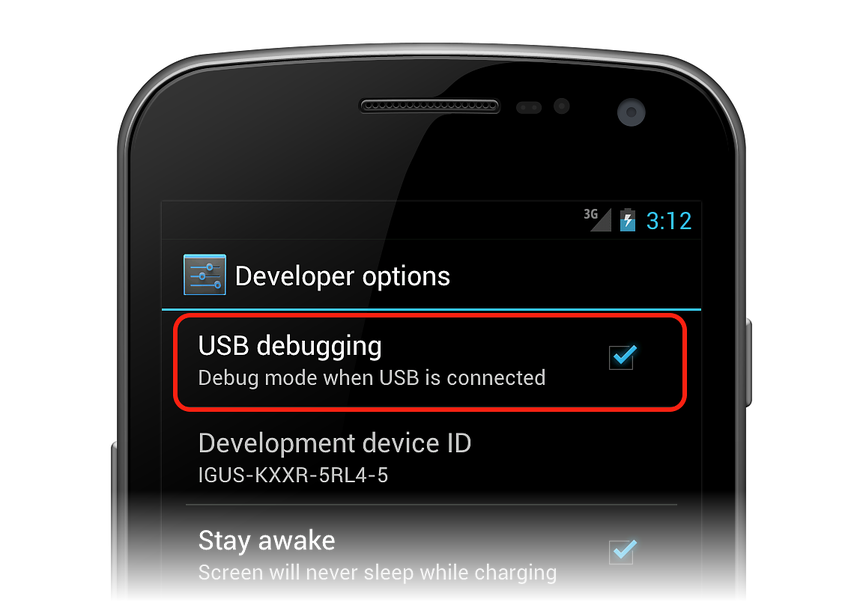
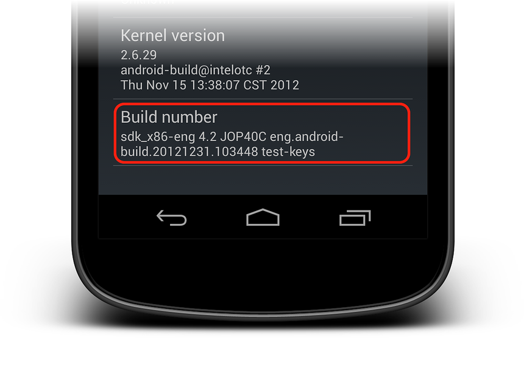
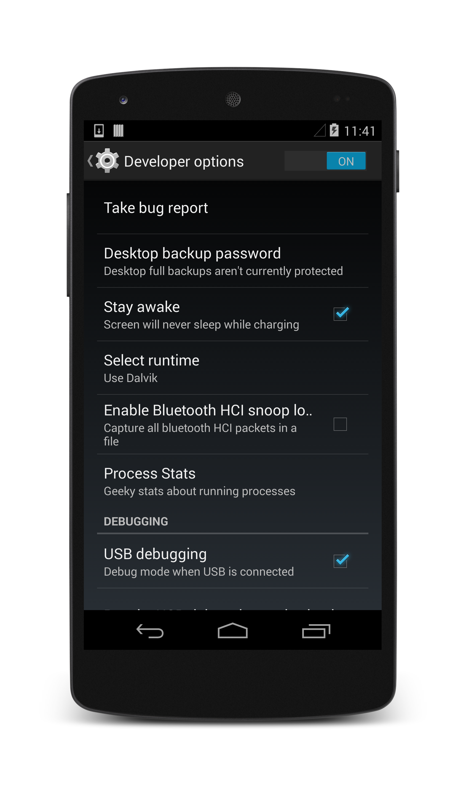
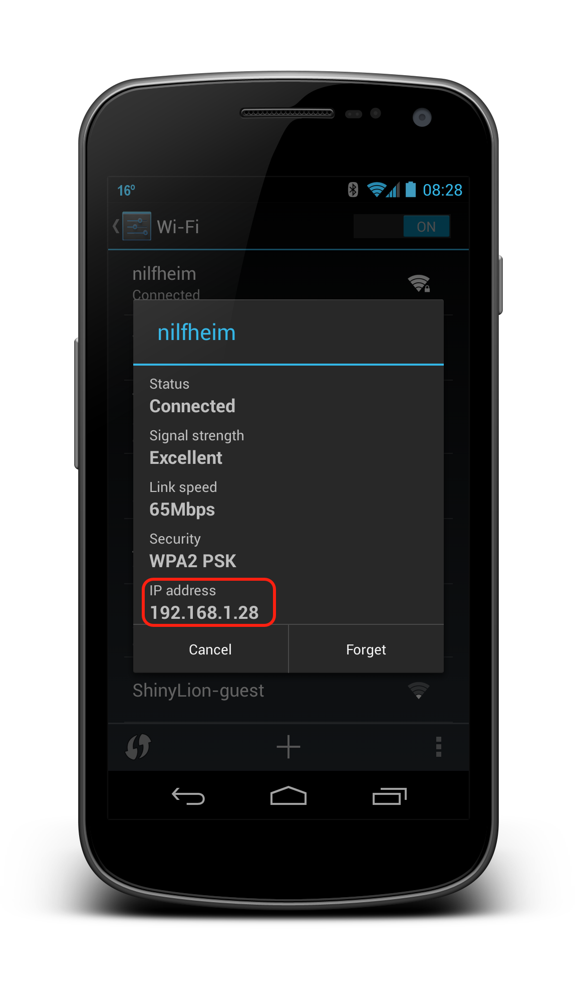

# Set Up Device for Development

_This article will discuss how to setup an Android device and connect it to a computer so that the device may be used to run and debug Xamarin.Android applications._

By now, you've probably seen your great new application running on the
Android emulator, and want to see it running on your shiny Android
device. Here are the steps involved with connecting a device to a
computer for debugging:

1.  **Enable Debugging on the Device** - By default, it will not be
    possible to debug applications on a Android device.

2.  **Install USB Drivers** - This step is not necessary for OS X
    computers. Windows computers may require the installation of USB
    drivers.

3.  **Connect the Device to the Computer** - The final step involves
    connecting the device to the computer by either USB or WiFi.

Each of these steps will be covered in more detail in the sections
below.

## Enable Debugging on the Device

It is possible to use any Android device to test an Android
application. However the device must be properly configured before
debugging can occur. The steps involved are slightly different,
depending on the version of Android running on the device.

### Android 4.0 to Android 4.1

For Android 4.0.x to Android 4.1.x, debugging is enabled by following
these steps:

1.  Go to the  **Settings** screen.
2.  Select  **Developer options** .
3.  Check off the  **USB debugging** option.

This screenshot shows the **Developer options** screen on a device
running Android 4.0.3:

### Android 4.2 and higher

Starting in Android 4.2 and higher, the **Developer options** is hidden
by default. To make it available, go to **Settings > About phone**, and
tap the **Build number** item seven times to reveal the **Developer
Options** tab:

Once the **Developer Options** tab is available under **Settings >
System**, open it to reveal developer settings:

This is the place to enable developer options such as USB debugging and
stay awake mode.

## Install USB Drivers

This step is not necessary for OS X. Just connect the device to the
Mac with a USB cable.

It may be necessary to install some extra drivers before a Windows
computer will recognize an Android device connected by USB.

> [!NOTE]
> These are the steps to set up a Google Nexus device
> and are provided as a reference. Steps for your specific device may
> vary, but will follow a similar pattern. Search the internet for your
> device if you have trouble.

Run the **android.bat** application in the **[Android SDK install path]\tools**
directory. By default, the Xamarin.Android installer will put the
Android SDK in following location on a Windows computer:

    C:\Users\[username]\AppData\Local\Android\android-sdk

### Download the USB Drivers

Google Nexus devices (with the exception of the Galaxy Nexus) require
the Google USB Driver. The driver for the Galaxy Nexus is
[distributed by Samsung](http://www.samsung.com/us/support/downloads/).
All other Android devices should use the
[USB driver from their respective manufacturer](http://developer.android.com/tools/extras/oem-usb.html#Drivers).

Install the **Google USB Driver** package by starting the Android SDK
Manager, and expanding the **Extras** folder, as can be seen in the
follow screenshot:

Check the **Google USB Driver** box, and click the **Install** button.
The driver files are downloaded to the following location:

    [Android SDK install path]\extras\google\usb\_driver

The default path for a Xamarin.Android installation is:

    C:\Users\[username]\AppData\Local\Android\android-sdk\extras\google\usb_driver

### Installing the USB Driver

After the USB drivers are downloaded, it is necessary to install them.
To install the drivers on Windows 7:

1.  Connect your device to the computer with a USB cable.

2.  Right-click on the Computer from your desktop or Windows Explorer,
    and select **Manage** .

3.  Select **Devices** in the left pane.

4.  Locate and expand **Other Devices** in the right pane.

5.  Right-click the device name and select **Update Driver Software** .
    This will launch the Hardware Update Wizard.

6.  Select **Browse my computer for driver software** and click
    **Next** .

7.  Click **Browse** and locate the USB driver folder (the Google USB
    driver is located in **[Android SDK install path]\extras\google\usb_driver**).

8.  Click  **Next** to install the driver.

### Installing Unverified Drivers in Windows 8

Extra steps may be required to install an unverified driver in 
Windows 8. The following steps describe how to install the drivers for a Galaxy
Nexus:

1.  **Access the Windows 8 Advanced Boot Options** - This step involves
    rebooting the computer to access the Advanced Boot Options. Start
    up a command line prompt and reboot the computer by using the
    following command:

        shutdown.exe /r /o

2.  **Connect the device** - Connect the device to the computer

3.  **Start Device Manager** - Run **devmgmt.msc**; you should see your
    device listed with a yellow triangle over it.

4.  **Install the Device Drivers** - Install the device drivers as
    described above.

## Connect the Device to the Computer

The final step is to connect the device to the computer. There are two
ways to do so:

-   **USB cable** - This is the easiest and most common way. Just plug
    the USB cable into the device and then into the computer.

-   **WiFi** - It is possible to connect an Android device to a
    computer without using a USB cable, over WiFi. This technique
    requires a bit more effort but could be useful when there is no USB
    cable or the device is to far away for a USB cable. Connecting via
    WiFi will be covered in the next section.

### Connecting over WiFi

By default, the
[Android Debug Bridge](http://developer.android.com/tools/help/adb.html) (*ADB*)
is configured to communicate with an Android device via USB. It is
possible to reconfigure it to use TCP/IP instead of USB. To
do this, both the device and the computer must be on the same WiFi
network. To setup your environment to debug over WiF issue these steps
from the command line:

1.  Determine the IP address of your Android device. One way to find
    out the IP address is to look under **Settings > Wi-Fi** , and then
    tap on the WiFi network that the device is connected to. This will
    bring up a settings screen showing information about the network
    connection, similar to what is seen in the screenshot below:

    

    On some versions of Android the IP address won't be listed there
    but can be found instead under **Settings > About phone > Status**.

2.  Connect your Android device to your computer via USB.

3.  Next, restart ADB so that it using TCP on port 5555. From a command
    prompt, type the following command:

        adb tcpip 5555

    After this command is issued, your computer will not be able to listen to devices that are connected via USB.

4.  Disconnect the USB cable connecting your device to your computer.

5.  Configure ADB so that it will connect to your Android device on the port that was specified in step 1 above:

        adb connect 192.168.1.28:5555

    Once this command finished the Android device is connected to the computer via WiFi.

When you're done debugging via WiFi, it is possible reset ADB back to
USB mode with the following command:

    adb usb

It is possible to ask ADB to list the devices that are connected to the
computer. Regardless of how the devices are connected, you can issue
the following command at the command prompt to see what is connected:

    adb devices

## Summary

This article discussed how to configure an Android device for
development by enabling debugging on the device. It also covered how to
connect the device to a computer using either USB or WiFi.

## Related Links

- [Android Debug Bridge](http://developer.android.com/tools/help/adb.html)
- [Using Hardware Devices](http://developer.android.com/tools/device.html)
- [Samsung Driver Downloads](http://www.samsung.com/us/support/downloads/)
- [OEM USB Drivers](http://developer.android.com/tools/extras/oem-usb.html#Drivers)
- [Google USB Driver](http://developer.android.com/sdk/win-usb.html)
- [XDA Developers : Windows 8 - ADB/fastboot driver problem solved](http://forum.xda-developers.com/showthread.php?t=1583801)
