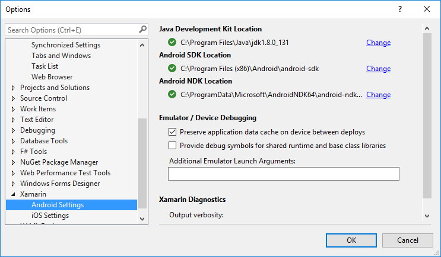
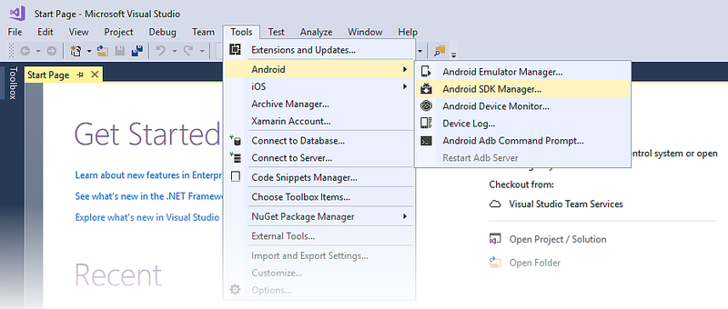
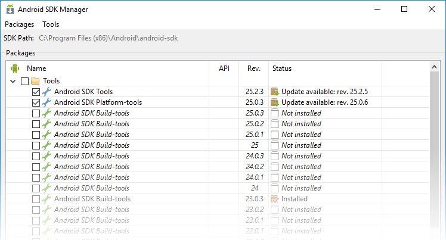
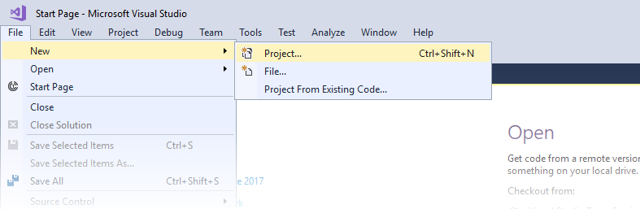
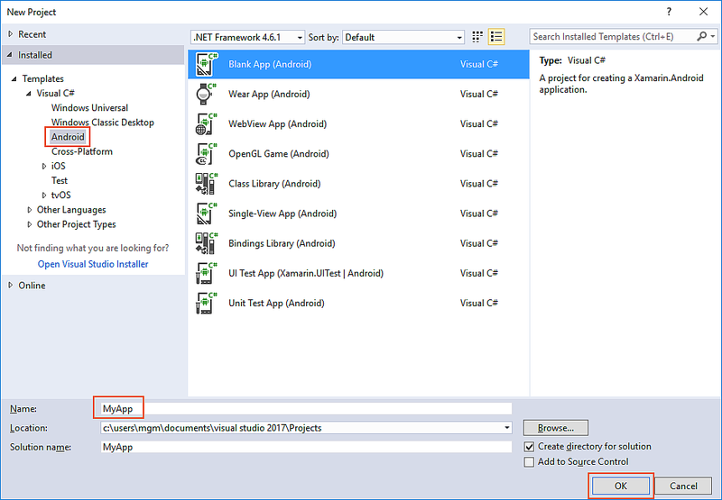

# Windows Installation

_This guide describes the steps for installing Xamarin.Android for Visual Studio on Windows, and it explains how to configure Xamarin.Android for building your first Xamarin.Android application._

## Overview

Because Xamarin is now included with all editions of Visual Studio at
no extra cost and does not require a separate license, you can use the
Visual Studio installer to download and install Xamarin.Android tools.
(The manual installation and licensing steps that were required for
earlier versions of Xamarin.Android are no longer necessary.) In this
guide, you will learn the following:

-   How to configure custom locations for the Java Development Kit,
    Android SDK, and Android NDK.

-   How to launch the Android SDK Manager to download and install
    additional Android SDK components.

-   How to prepare an Android device or emulator for debugging and
    testing.

-   How to create your first Xamarin.Android app project.

By the end of this guide, you will have a working Xamarin.Android
installation integrated into Visual Studio, and you will be ready to
start building your first Xamarin.Android application.

## Installation

For detailed information on installing Xamarin for use with Visual
Studio on Windows, see the
[Windows Install](~/cross-platform/get-started/installation/windows.md)
guide.

## Configuration

Xamarin.Android uses the Java Development Kit (JDK) and the Android SDK
to build apps. During installation, the Visual Studio installer places
these tools in their default locations and configures the development
environment with the appropriate path configuration. You can view and
change these locations by clicking **Tools > Options > Xamarin >
Android Settings**:

For most users these default locations will work without further
changes. However, you may wish to configure Visual Studio with custom
locations for these tools (for example, if you have installed the Java
JDK, Android SDK, or NDK in a different location). Click **Change**
next to a path that you want to change, then navigate to the new
location.

Xamarin.Android uses
[JDK 8](http://www.oracle.com/technetwork/java/javase/downloads/jdk8-downloads-2133151.html),
which is required if you are developing for API level 24 or greater
(JDK 8 also supports API levels earlier than 24). You can continue to
use
[JDK 7](http://www.oracle.com/technetwork/java/javase/downloads/jdk7-downloads-1880260.html)
if you are developing specifically for API level 23 or earlier.

> [!IMPORTANT]
> Xamarin.Android does not support JDK 9.

### Android SDK Manager

Android uses multiple Android API level settings to determine your
app's compatibility across the various versions of Android (for more
information about Android API levels, see
[Understanding Android API Levels](~/android/app-fundamentals/android-api-levels.md)).
Depending on what Android API level(s) you want to target, you may need
to download and install additional Android SDK components. In addition,
you may need to install optional tools and emulator images provided in
the Android SDK. To do this, use the **Android SDK Manager**. You can
launch the **Android SDK Manager** by clicking **Tools > Android >
Android SDK Manager**:

By default, Visual Studio installs the Google Android SDK Manager:

You can use the Google Android SDK Manager to install versions of the
Android SDK Tools package up to version 25.2.3. However, if you need to
use a later version of the Android SDK Tools package, you must install
the Xamarin Android SDK Manager plugin for Visual Studio (available
from the Visual Studio Marketplace). This is necessary because Google's
standalone SDK Manager was deprecated in version 25.2.3 of the Android
SDK Tools package. 

For more information about using the Xamarin Android SDK Manager, see
[Android SDK Setup](~/android/get-started/installation/android-sdk.md).

### Android Emulator

If you don't have a physical Android device to use for testing, you can
use an Android emulator to test your app. For more information about
the Google Android emulator, see
[Android SDK Emulator](~/android/deploy-test/debugging/android-sdk-emulator/index.md).

The Google Android emulator uses Intel's HAXM (Hardware Accelerated
Execution Manager), which can conflict with the virtualization
technologies used by other emulators. The three main virtualization
technologies are:

-   **Hyper-V** (used by the Visual Studio Emulator for Android and the 
    Windows Phone emulator) 

-   **Virtual Box** (used by Genymotion)

-   **Intel HAXM** (used by the Google Android SDK emulator) 

Because a development computer's CPU can support only one
virtualization technology at a time, it's best to have only one in use
on a development computer.

<a name="device" />

### Android Device

If you have a physical Android device to use for testing, this is a
good time to set it up for development use. See
[Set Up Device for Development](~/android/get-started/installation/set-up-device-for-development.md)
to configure your Android device for development, then connect it to
your computer for running and debugging Xamarin.Android applications.

## Create an Application

Now that you have installed Xamarin.Android, you can launch Visual
Studio create a new project. Click **File > New > Project** to begin
creating your app:

In the **New Project** dialog, select **Android** under **Templates** and
click **Blank App (Android)** in the right pane. Enter a name for
your app (in the screenshot below, the app is called **MyApp**), then
click **OK**:

That's it! Now you are ready to use Xamarin.Android to create
Android applications!

## Summary

In this article, you learned how to set up and install the
Xamarin.Android platform on Windows, how to (optionally) configure
Visual Studio with custom Java JDK and Android SDK installation
locations, how to launch the SDK Manager to install additional Android
SDK components, how to setup an Android device or emulator, and how to
start building your first application.

The next step is to have a look at the 
[Hello, Android](~/android/get-started/hello-android/index.md)
tutorials to learn how to create a working Xamarin.Android app.

## Related Links

- [Download Visual Studio](https://www.visualstudio.com/vs/)
- [Installing Visual Studio Tools for Xamarin](~/cross-platform/get-started/installation/windows.md)
- [System Requirements](~/cross-platform/get-started/requirements.md)
- [Android SDK Setup](~/android/get-started/installation/android-sdk.md)
- [Android SDK Emulator](~/android/get-started/installation/android-emulator/index.md)
- [Set Up Device For Development](~/android/get-started/installation/set-up-device-for-development.md)
