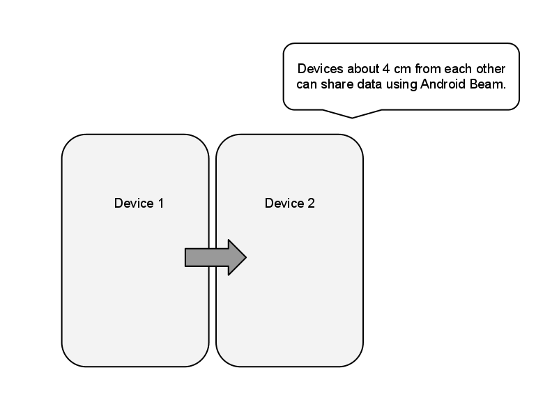
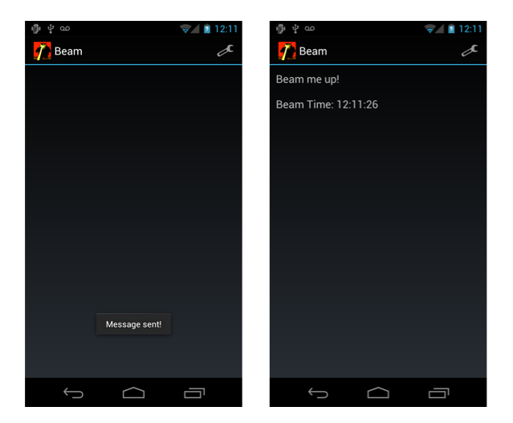

# Android Beam

Android Beam is a Near Field Communication (NFC) technology introduced in
Android 4.0 that allows applications to share information over NFC when
in close proximity.

[](android-beam-images/androidbeam.png#lightbox)

Android Beam works by pushing messages over NFC when two devices are in
range. Devices about 4cm from each other can share data using Android
Beam. An Activity on one device creates a message and specifies an
Activity (or Activities) that can handle pushing it. When the specified
Activity is in the foreground and the devices are in range, Android
Beam will push the message to the second device. On the receiving
device, an Intent is invoked containing the message data.

Android supports two ways of setting messages with Android Beam:

- `SetNdefPushMessage` - Before Android Beam is initiated, an
    application can call SetNdefPushMessage to specify an NdefMessage
    to push over NFC, and the Activity that is pushing it. This
    mechanism is best used when a message doesn’t change while an
    application is in use.

- `SetNdefPushMessageCallback` - When Android Beam is initiated, an
    application can handle a callback to create an NdefMessage. This
    mechanism allows for message creation to be delayed until devices
    are in range. It supports scenarios where the message may vary
    based upon what’s happening in the application.

In either case, to send data with Android Beam, an application sends an
`NdefMessage`, packaging the data in several `NdefRecords`. Let’s
take a look at the key points that must be addressed before we can
trigger Android Beam. First, we’ll work with the callback style of
creating an `NdefMessage`.

## Creating a Message

We can register callbacks with an `NfcAdapter` in the Activity’s
`OnCreate` method. For example, assuming an `NfcAdapter` named
`mNfcAdapter` is declared as a class variable in the Activity, we can
write the following code to create the callback that will construct the
message:

```csharp
mNfcAdapter = NfcAdapter.GetDefaultAdapter (this);
mNfcAdapter.SetNdefPushMessageCallback (this, this);
```

The Activity, which implements `NfcAdapter.ICreateNdefMessageCallback`,
is passed to the `SetNdefPushMessageCallback` method above. When
Android Beam is initiated, the system will call `CreateNdefMessage`,
from which the Activity can construct an `NdefMessage` as shown below:

```csharp
public NdefMessage CreateNdefMessage (NfcEvent evt)
{
    DateTime time = DateTime.Now;
    var text = ("Beam me up!\n\n" + "Beam Time: " +
        time.ToString ("HH:mm:ss"));
    NdefMessage msg = new NdefMessage (
        new NdefRecord[]{ CreateMimeRecord (
            "application/com.example.android.beam",
            Encoding.UTF8.GetBytes (text)) });
        } };
    return msg;
}

public NdefRecord CreateMimeRecord (String mimeType, byte [] payload)
{
    byte [] mimeBytes = Encoding.UTF8.GetBytes (mimeType);
    NdefRecord mimeRecord = new NdefRecord (
        NdefRecord.TnfMimeMedia, mimeBytes, new byte [0], payload);
    return mimeRecord;
}
```

## Receiving a Message

On the receiving side, the system invokes an Intent with the
`ActionNdefDiscovered` action, from which we can extract the
NdefMessage as follows:

```csharp
IParcelable [] rawMsgs = intent.GetParcelableArrayExtra (NfcAdapter.ExtraNdefMessages);
NdefMessage msg = (NdefMessage) rawMsgs [0];
```

For a complete code example that uses Android Beam, shown running in the
screenshot below, see the [Android Beam demo](/samples/xamarin/monodroid-samples/androidbeamdemo) in the Sample Gallery.

[](android-beam-images/24.png#lightbox)

## Related Links

- [Android Beam Demo (sample)](/samples/xamarin/monodroid-samples/androidbeamdemo)