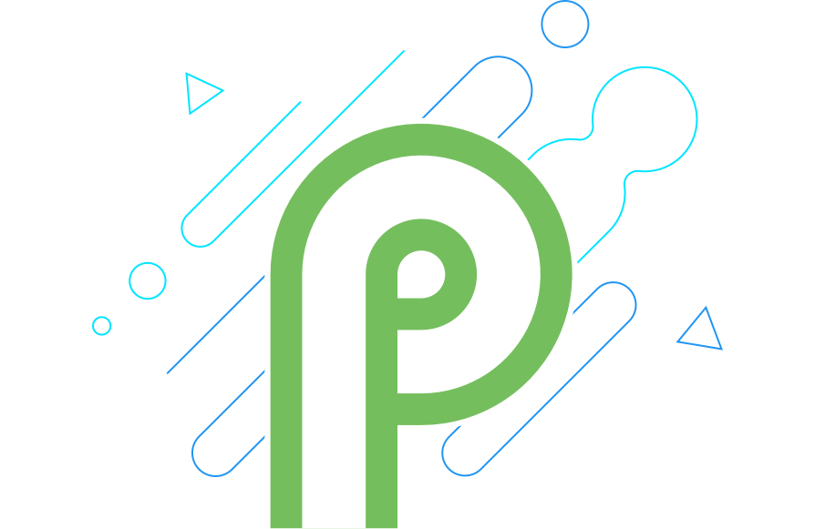
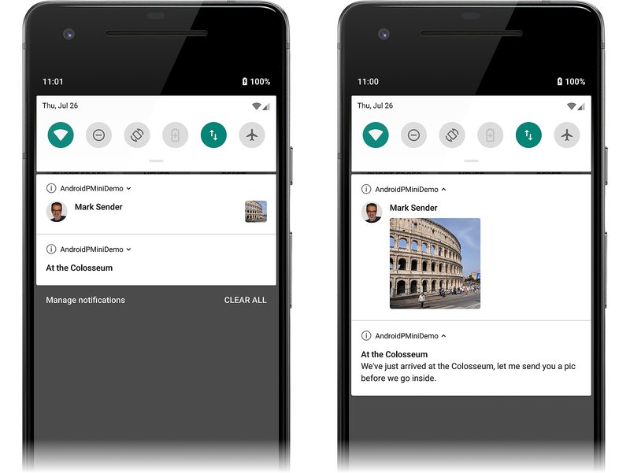

# Android P Preview

_How to get started using Xamarin.Android to develop apps for the latest version of Android._


The [Android P Developer Preview](https://developer.android.com/preview/)
is now available from Google. A number of new features and APIs are
being made available in this release, and many of them are necessary to
take advantage of new hardware capabilities in the latest Android
devices.



This article is structured to help you get started in developing
Xamarin.Android apps for the Android P Preview. It explains how to
install the necessary updates, configure the SDK, and prepare an
emulator or device for testing. It also provides an outline of the new
features in Android P and provides example source code that illustrates
how to use some of the key Android P features.


## Requirements

The following is required to use Android P features in Xamarin-based
apps:

-   **Visual Studio** &ndash; If you are using Windows, version 15.8 
    Preview 5 or later of Visual Studio is required.  If you are using
    a Mac, the current Beta version of Visual Studio for Mac or later
    is required.

-   **Xamarin.Android** &ndash; Xamarin.Android 9.0.0.17 or later must
    be installed with Visual Studio.

-   **Java Developer Kit** &ndash; Xamarin Android 9.0 development requires
    [JDK 8](http://www.oracle.com/technetwork/java/javase/downloads/jdk8-downloads-2133151.html)
    (or you can try the preview of Microsoft's distribution of the
    [OpenJDK](~/android/get-started/installation/openjdk.md)).

-   **Android SDK** &ndash; Android SDK API 28 or later must be 
    installed via the Android SDK Manager.

## Getting Started

To get started using Android P with Xamarin.Android, you must download
and install the latest tools and SDK packages before you can create your
first Android P project:

1. Update to Visual Studio 15.8 Preview 5 or later. If you are using
   Visual Studio for Mac, switch to the Visual Studio for 
   Mac [Beta](https://docs.microsoft.com/visualstudio/mac/update) channel.

2. Install the **Android P (API 28)** or later packages and tools
   via the SDK Manager.

3. Create a new Xamarin.Android project that targets Android P (API 28).

4. Configure an emulator or device for testing Android P apps.

Each of these steps is explained in the following sections:


### Update Visual Studio

To add Android P support to Visual Studio, Update to Visual Studio 2017
version 15.8 Preview 5 or later as explained in
[Update Visual Studio 2017 to the most recent release](https://docs.microsoft.com/visualstudio/install/update-visual-studio).
To add Android P support to Visual Studio for Mac, update to the latest
Beta version of Visual Studio 2017 for Mac as explained in
[Updating Visual Studio for Mac](https://docs.microsoft.com/visualstudio/mac/update).


### Install the Android SDK

To create a project with Xamarin.Android 9.0, you must first use the
Android SDK Manager to install the SDK platform for **Android P (API level 28)** or later.

1. Start the SDK Manager. In Visual Studio, click **Tools >
   Android > Android SDK Manager**. In Visual Studio for Mac, click
   **Tools > SDK Manager**.

2. In the lower right-hand corner, click the gear icon and select **Repository > Google (Unsupported)**:

    [](android-p-images/vs/set-repo.png#lightbox)

3. Install the **Android P** packages, which are displayed as **Android SDK Platform 28**
   in the **Platforms** tab (for more information about using the SDK Manager, see
   (Android SDK Setup)[~/android/get-started/installation/android-sdk.md]): 

    [](android-p-images/vs/sdk-manager.png#lightbox)

4. If you are using an emulator, create a virtual device that supports
   **API Level 28**. For more information about creating virtual devices,
   see [Managing VIrtual Devices with the Android Device Manager](~/android/get-started/installation/android-emulator/device-manager.md).


### Start a Xamarin.Android Project

Create a new Xamarin.Android project. If you are new to Android
development with Xamarin, see
[Hello, Android](~/android/get-started/hello-android/index.md) to
learn about creating Xamarin.Android projects.

When you create an Android project, you must configure the version
settings to target Android P or later. For example, to target your
project for Android P, you must configure the target Android API
level of your project to **Android P (API 28)**. It is
recommended that you also set your target framework level to API 28 or
later. For more about configuring Android API level levels, see
[Understanding Android API Levels](~/android/app-fundamentals/android-api-levels.md).


### Configure a Device or Emulator

If you are using a physical device such as a Pixel, you can update your
device to the Android P Preview by following the instructions in
[Android P Beta Devices](https://developer.android.com/preview/devices/).

If you are using an Emulator, create a virtual device for API level 28
using an x86-based image. For information about using the Android
Device Manager to create and manage virtual devices, see
[Managing Virtual Devices with the Android Device Manager](~/android/get-started/installation/android-emulator/device-manager.md).
For information about using the Android emulator for testing and
debugging, see
[Debugging with the Google Android Emulator](~/android/deploy-test/debugging/android-sdk-emulator/index.md).


## New Features

Android P introduces a variety of new features. Some of these new
features are intended to leverage new hardware capabilities offered by
the latest Android devices, while others are designed to further
enhance the Android user experience:

-   **Display Cutout Support** &ndash; Provides APIs to find the
    location and shape of the _cutout_ at the top of the screen on 
    newer Android devices.

-   **Notification Enhancements** &ndash; Notification messages can
    now display images, and a new `Person` class is used to simplify
    conversation participants.

-   **Indoor Positioning** &ndash; Platform support for the 
    WiFi Round-Trip-Time protocol, which makes it possible for apps to 
    use WiFi devices for navigation in indoor settings.

-   **Multi-Camera Support** &ndash; Offers the capability to access
    streams simultaneously from multiple physical cameras (such as
    dual-front and dual-back cameras).


The following sections highlight these features and provide brief code
examples to help you get started using them in your app.

### Display Cutout Support

Many newer Android devices with edge-to-edge screens have a *Display
Cutout* (or "notch") at the top of the display for camera and speaker.
The following screenshot provides an emulator example of a cutout:

[](android-p-images/02-example-cutout.png#lightbox)

To manage how your app window displays its content on devices with a
display cutout, Android P has added a new
[LayoutInDisplayCutoutMode](https://developer.android.com/reference/android/view/WindowManager.LayoutParams.html#layoutInDisplayCutoutMode)
window layout attribute. This attribute can be set to one of the
following values:

-   [LayoutInDisplayCutoutModeNever](https://developer.android.com/reference/android/view/WindowManager.LayoutParams.html#LAYOUT_IN_DISPLAY_CUTOUT_MODE_NEVER)
    &ndash; The window is never allowed to overlap with the cutout area.

-   [LayoutInDisplayCutoutModeShortEdges](https://developer.android.com/reference/android/view/WindowManager.LayoutParams.html#LAYOUT_IN_DISPLAY_CUTOUT_MODE_SHORT_EDGES)
    &ndash; The window is allowed to extend into the cutout area but only on the short edges of the screen. 

-   [LayoutInDisplayCutoutModeDefault](https://developer.android.com/reference/android/view/WindowManager.LayoutParams.html#LAYOUT_IN_DISPLAY_CUTOUT_MODE_DEFAULT)
    &ndash; The window is allowed to extend into the cutout area if the cutout is contained within a system bar.

For example, to prevent the app window from overlapping with the cutout
area, set the layout cutout mode to *never*: 

```csharp
Window.Attributes.LayoutInDisplayCutoutMode =
    Android.Views.LayoutInDisplayCutoutMode.Never;
```

The following examples provide examples of these cutout modes. The
first screenshot on the left is of the app in non-fullscreen mode. In
the center screenshot, the app goes full-screen with
`LayoutInDisplayCutoutMode` set to
`LayoutInDisplayCutoutModeShortEdges`. Notice that the app's white
background extends into the display cutout area:

[](android-p-images/03-cutout-modes.png#lightbox)

In the final screenshot (above on the right),
`LayoutInDisplayCutoutMode` is set to
`LayoutInDisplayCutoutModeShortNever` before it goes to full-screen.
Notice that the app's white background is not allowed to extend into
the display cutout area.

If you need more detailed information about the cutout area on the
device, you can use the new
[DisplayCutout](https://developer.android.com/reference/android/view/DisplayCutout.html)
class. `DisplayCutout` represents the area of the display that cannot
be used to display content. You can use this information to retrieve
the location and shape of the cutout so that your app does not attempt
to display content in this non-functional area.

For more information about the new cutout features in Android P, see 
[Display cutout support](https://developer.android.com/preview/features#cutout).


### Notifications Enhancements

Android P introduces the following enhancements to improve the messaging experience:

-   Notification channels (introduced in
    [Android Oreo](~/android/platform/oreo.md)) now supports blocking
    of channel groups.

-   The notification system has three new Do-Not-Disturb categories
    (prioritizing alarms, system sounds, and media sources). In
    addition, there are seven new Do-Not-Disturb modes that can be used
    to suppress visual interruptions (such as badges, notification
    lights, status bar appearances, and launching of full-screen
    activities).

-   A new [Person](https://developer.android.com/reference/android/app/Person.html)
    class has been added to represent the sender of a message. Use of
    this class helps to optimize the rendering of each notification by
    identifying people involved in a conversation (including their
    avatars and URIs).

-   Notifications can now display images. 

The following example illustrates how to use the new APIs to generate a
notification that contains an image. In the following screenshots, a
text notification is posted and is followed by a notification with an
embedded image. When the notifications are expanded (as seen on the
right), the text of the first notification is displayed and the
image embedded in the second notification is enlarged:

[](android-p-images/04-example-notifications.png#lightbox)

The following example illustrates how to include an image in an Android
P notification, and it demonstrates usage of the new `Person` class:

1. Create a `Person` object that represents the sender. For example, the
   sender's name and icon are included in `fromPerson`:

    ```csharp
    Icon senderIcon = Icon.CreateWithResource(this, Resource.Drawable.sender_icon);
    Person fromPerson = new Person.Builder()
        .SetIcon(senderIcon)
        .SetName("Mark Sender")
        .Build();
    ```

2. Create a `Notification.MessagingStyle.Message` that contains the image to send,
   passing the image to the new [Notification.MessagingStyle.Message.SetData](https://developer.android.com/reference/android/app/Notification.MessagingStyle.Message.html#setData%28java.lang.String,%20android.net.Uri) method.
   For example:

    ```csharp
    Uri imageUri = Uri.Parse("android.resource://com.xamarin.pminidemo/drawable/example_image");
    Notification.MessagingStyle.Message message = new Notification.MessagingStyle
            .Message("Here's a picture of where I'm currently standing", 0, fromPerson)
            .SetData("image/", imageUri);
    ```

3. Add the message to a `Notification.MessagingStyle` object. For example:

    ```csharp
    Notification.MessagingStyle style = new Notification.MessagingStyle(fromPerson)
            .AddMessage(message);
    ```

4. Plug this style into the notification builder. For example:

    ```csharp
    builder = new Notification.Builder(this, MY_CHANNEL)
        .SetContentTitle("Tour of the Colosseum")
        .SetContentText("I'm standing right here!")
        .SetSmallIcon(Resource.Mipmap.ic_notification)
        .SetStyle(style)
        .SetChannelId(MY_CHANNEL);
    ```

5. Publish the notification. For example:

    ```csharp
    const int notificationId = 1000;
    notificationManager.Notify(notificationId, builder.Build());
    ```

For more information about creating notifications, see
[Local Notifications](~/android/app-fundamentals/notifications/local-notifications.md).


### Indoor Positioning

Android P provides support for IEEE 802.11mc (also known as _WiFi
Round-Trip-Time_ or _WiFi RTT_), which makes it possible for apps to
detect the distance to one or more Wi-Fi access points. Using this
information, it is possible for your app to take advantage of *indoor
positioning* with an accuracy of one to two meters. On Android devices
that provide hardware support for IEEE 801.11mc, your app can offer
navigation features such as location-based control of smart appliances
or turn-by-turn instructions through a store:

[](android-p-images/05-wifi-rtt.png#lightbox)

The new
[WifiRttManager](https://developer.android.com/reference/android/net/wifi/rtt/WifiRttManager)
class and several helper classes provides the means for measuring
distance to Wi-Fi devices. For more information about the indoor
positioning APIs introduced in Android P, see
[Android.Net.Wifi.Rtt](https://developer.android.com/reference/android/net/wifi/rtt/package-summary).


### Multi-Camera Support

Many newer Android devices have dual-front and/or dual-back cameras
that are useful for such features as stereo vision, enhanced visual
effects, and improved zoom capability. Android P introduces a new
[Multi-Camera](https://developer.android.com/preview/features#camera)
API that makes it possible for your app to use a *logical camera* (or
*logical multi-camera*) that is backed by two or more physical cameras.
To determine if the device supports a logical multi camera, you can
look at the capabilities of each camera on the device to see if it
supports
[RequestAvailableCapabilitiesLogicalMultiCamera](https://developer.android.com/reference/android/hardware/camera2/CameraMetadata#REQUEST_AVAILABLE_CAPABILITIES_LOGICAL_MULTI_CAMERA).

Android P also includes a new
[SessionConfiguration](https://developer.android.com/reference/android/hardware/camera2/params/SessionConfiguration.html)
class that can be used to help reduce delays during initial capture and
eliminate the need to start and start the camera stream.

For more information about Multi-Camera support in Android P, see 
[Multi-camera support and camera updates](https://developer.android.com/preview/features#camera).


### Other Features

In addition, Android P supports several other new features:

-   The new [AnimatedImageDrawable](https://developer.android.com/reference/android/graphics/drawable/AnimatedImageDrawable.html)
    class, which can be used for drawing and displaying animated images.

-   A new [ImageDecoder](https://developer.android.com/reference/android/graphics/ImageDecoder.html) class
    that replaces `BitmapFactory`. `ImageDecoder` can be used to decode an `AnimatedImageDrawable`.

-   Support for HDR (High Dynamic Range) video and HEIF (High
    Efficiency Image File Format) images.

-   The [JobScheduler](https://developer.android.com/reference/android/app/job/JobScheduler.html) has been
    enhanced to more intelligently handle network-related jobs. The new 
    [GetNetwork](https://developer.android.com/reference/android/app/job/JobParameters#getNetwork%28%29) method 
    of the [JobParameters](https://developer.android.com/reference/android/app/job/JobParameters) class
    returns the best network for performing any network requests for a given job.

For more information about the latest Android P features, see
[Android P features and APIs](https://developer.android.com/preview/features).


## Behavior Changes

When the Target Android Version is set to API level 28, there are
several platform changes that can affect your app's behavior even if
you are not implementing the new features described above. The following
is a brief summary of these changes:

-  Apps must now request foreground permission before using foreground
   services.

-  If your app has more than one process, it cannot share a single
   [WebView](https://developer.xamarin.com/api/type/Android.Webkit.WebView/) data 
   directory across processes.

-  Directly accessing another app's data directory by path is no longer allowed.

For more information about behavior changes for apps targeting Android P,
see [Behavior Changes](https://developer.android.com/preview/behavior-changes.html#p-apps).


## Sample Code

[AndroidPMiniDemo](https://github.com/xamarin/monodroid-samples/tree/master/android-p/AndroidPMiniDemo)
is a Xamarin.Android sample app for Android P that demonstrates how to
set display cutout modes, how to use the new `Person` class, and how to
send an notification that includes an image.


## Summary

This article introduced the Android P Preview and explained how to
install and configure the latest tools and packages for Xamarin.Android
development with the Android P preview. It provided an overview of the
key features available in Android P, with example source code for
several of these features. It included links to API documentation and
Android Developer topics to help you get started in creating apps for
Android P. It also highlighted the most important Android P behavior
changes that could impact existing apps.


## Related Links

- [Android P Developer Preview](https://developer.android.com/preview/)
