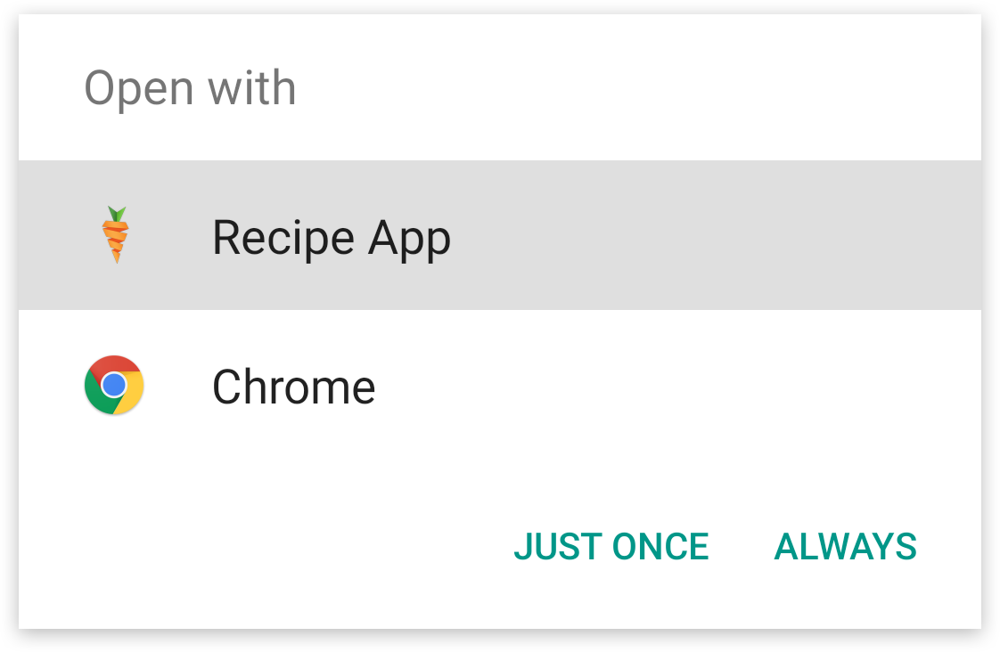

# App-Linking in Android

_This guide will discuss how Android 6.0 supports app-linking, a technique that allows mobile apps to respond to URLs on websites. It will discuss what app-linking is, how to implement app-linking in an Android 6.0 application, and how to configure a website to grant permissions to the mobile app for a domain._

## App Linking Overview

Mobile applications no longer live in a silo &ndash; in many cases they are an important components of their businesses, along with their website. It's desirable for businesses to seamlessly connect their web presence and mobile applications, with links on a website launching mobile applications and displaying relevant content in the mobile app. *App-linking* (also referred to as *deep-linking*) is one technique that allows a mobile device to respond to a URI and launch a mobile application that corresponds to that URI.

Android handles app-linking through the *intent system* &ndash; when the user clicks on a link in a mobile browser, the mobile browser will dispatch an intent that Android will delegate to a registered application. For example, clicking on a link on a cooking website would open a mobile app that is associated with that website and display a specific recipe to the user. If there is more than one application registered to handle that intent, then Android will raise what is known as a *disambiguation dialog* that will ask a user what application to select the application that should handle the intent, for example:



Android 6.0 improves on this by using automatic link handling. It is possible for Android to automatically register an application as the default handler for a URI &ndash; the app will automatically launch and navigate directly to the relevant Activity. How Android 6.0 decides to handle a URI click depends on the following criteria:

1. **An existing app is already associated with the URI** &ndash; The user may have already associated an existing app with a URI. In that case, Android will continue to use that application.
2. **No existing app is associated with the URI, but a supporting app is installed** &ndash; In this scenario, the user has not specified an existing app, so Android will use the installed supporting application to handle the request.
3. **No existing app is associated with the URI, but many supporting apps are installed** &ndash; Because there are multiple applications that support the URI, the disambiguation dialog will be displayed and the user must select which app will handle the URI.

If the user has no apps installed that support the URI, and  one is subsequently installed, then Android will set that application as the default handler for the URI after verifying the association with the website that is associated with the URI.

This guide will discuss how to configure an Android 6.0 application and how to create and publish the Digital Asset Links file to support app-linking in Android 6.0.

## Requirements

This guide requires Xamarin.Android 6.1 and an application that targets Android 6.0 (API level 23) or higher.

App-linking is possible in earlier versions of Android by using the [Rivets NuGet package](https://www.nuget.org/packages/Rivets/) from the Xamarin Component store. The Rivets package is not compatible with app-linking in Android 6.0; it does not support Android 6.0 app linking.

## Configuring App-Linking in Android 6.0

Setting up app-links in Android 6.0 involves two major steps:

1. **Adding one or more intent-filters for the website URI's** &ndash; the intent filters guide Android in how to handle a URL click in a mobile browser.
2. **Publishing a *Digital Asset Links JSON* file on the website** &ndash; this is a file that is uploaded to a website and is used by Android to verify the relationship between the mobile app and the domain of the website. Without this,  Android cannot install the app as the default handle for URI's; the user must do so manually.

<a name="configure-intent-filter"></a>

### Configuring the Intent Filter

It is necessary to configure an intent filter that maps a URI (or possible a set of URIs) from a website to an Activity in an Android application. In Xamarin.Android, this relationship is established by  adorning an Activity with the [IntentFilterAttribute](xref:Android.App.IntentFilterAttribute). The intent filter must declare the following information:

- **`Intent.ActionView`** &ndash; This will register the intent filter to respond to requests to view information
- **`Categories`** &ndash;  The intent filter should register both **[Intent.CategoryBrowsable](xref:Android.Content.Intent.CategoryBrowsable)** and **[Intent.CategoryDefault](xref:Android.Content.Intent.CategoryDefault)** to be able to properly handle the web URI.
- **`DataScheme`** &ndash; The intent filter must declare `http` and/or `https`. These are the only two valid schemes.
- **`DataHost`** &ndash; This is the domain which the URIs will originate from.
- **`DataPathPrefix`** &ndash; This is an optional path to resources on the website.
- **`AutoVerify`** &ndash; The `autoVerify` attribute tells Android to verify the relationship between the application and the website. This will be discussed more below.

The following example shows how to use the [IntentFilterAttribute](xref:Android.App.IntentFilterAttribute) to handle links from `https://www.recipe-app.com/recipes` and from `http://www.recipe-app.com/recipes`:

```csharp
[IntentFilter(new [] { Intent.ActionView },
              Categories = new[] { Intent.CategoryBrowsable, Intent.CategoryDefault },
              DataScheme = "http",
              DataHost = "recipe-app.com",
              DataPathPrefix = "/recipe",
              AutoVerify=true)]
public class RecipeActivity : Activity
{
    // Code for the activity omitted
}
```

Android will verify every host that is identified by the intent filters against the Digital Assets File on the website before registering the application as the default handler for a URI. All the intent filters must pass verification before Android can establish the app as the default handler.

### Creating the Digital Assets Link File

Android 6.0 app-linking requires that Android verify the association between the application and the website before setting the application as the default handler for the URI. This verification will occur when the application is first installed. The *Digital Assets Links* file is a JSON file that is hosted by the relevant webdomain(s).

> [!NOTE]
> The `android:autoVerify` attribute must be set by the intent filter &ndash; otherwise Android will not perform the verification.

The file is placed by the webmaster of the domain at the location **https://domain/.well-known/assetlinks.json**.

The Digital Asset File contains the meta-data necessary for Android to verify the association. An **assetlinks.json** file has the following key-value pairs:

- `namespace` &ndash; the namespace of the Android application.
- `package_name` &ndash; the package name of the Android application (declared in the application manifest).
- `sha256_cert_fingerprints` &ndash; the SHA256 fingerprints of the signed application. Please see the guide [Finding your Keystore's MD5 or SHA1 Signature](~/android/deploy-test/signing/keystore-signature.md) for more information on how to obtain the SHA1 fingerprint of an application.

The following snippet is an example of **assetlinks.json** with a
single application listed:

```json
[
   {
      "relation":[
         "delegate_permission/common.handle_all_urls"
      ],
      "target":{
         "namespace":"android_app",
         "package_name":"com.example",
         "sha256_cert_fingerprints":[
            "14:6D:E9:83:C5:73:06:50:D8:EE:B9:95:2F:34:FC:64:16:A0:83:42:E6:1D:BE:A8:8A:04:96:B2:3F:CF:44:E5"
         ]
      }
   }
]
```

It is possible to register more than one SHA256 fingerprint to support
different versions or builds of your application. This next
**assetlinks.json** file is an example of registering multiple
applications:

```json
[
   {
      "relation":[
         "delegate_permission/common.handle_all_urls"
      ],
      "target":{
         "namespace":"android_app",
         "package_name":"example.com.puppies.app",
         "sha256_cert_fingerprints":[
            "14:6D:E9:83:C5:73:06:50:D8:EE:B9:95:2F:34:FC:64:16:A0:83:42:E6:1D:BE:A8:8A:04:96:B2:3F:CF:44:E5"
         ]
      }
   },
   {
      "relation":[
         "delegate_permission/common.handle_all_urls"
      ],
      "target":{
         "namespace":"android_app",
         "package_name":"example.com.monkeys.app",
         "sha256_cert_fingerprints":[
            "14:6D:E9:83:C5:73:06:50:D8:EE:B9:95:2F:34:FC:64:16:A0:83:42:E6:1D:BE:A8:8A:04:96:B2:3F:CF:44:E5"
         ]
      }
   }
]
```

The [Google Digital Asset Links website](https://developers.google.com/digital-asset-links/tools/generator)
has an online tool that may assist with creating and testing the
Digital Assets file.

### Testing App-Links

After implementing app-links, the various pieces should be tested to
ensure that they work as expected.

It is possible to confirm that the Digital Assets file is properly
formatted and hosted by using Google's Digital Asset Links API, as
shown in this example:

```html
https://digitalassetlinks.googleapis.com/v1/statements:list?source.web.site=
  https://<WEB SITE ADDRESS>:&relation=delegate_permission/common.handle_all_urls
```

There are two tests that can be performed to ensure that the intent
filters have been properly configured and that the app is set as the
default handler for a URI:

1. The Digital Asset File is properly hosted as described above. The
    first test will dispatch an intent which Android should redirect to
    the mobile application. The Android application should launch and
    display the Activity registered for the URL. At a command prompt
    type:

    ```shell
    $ adb shell am start -a android.intent.action.VIEW \
        -c android.intent.category.BROWSABLE \
        -d "http://<domain1>/recipe/scalloped-potato"
    ```

2. Display the existing link handling policies for the applications
    installed on a given device. The following command will dump a
    listing of link policies for each user on the device with the
    following information. At the command prompt, type the following
    command:

    ```shell
    $ adb shell dumpsys package domain-preferred-apps
    ```

    - **`Package`** &ndash; The package name of the application.
    - **`Domain`** &ndash; The domains (separated by spaces) whose web links will be handled by the application
    - **`Status`** &ndash; This is the current link-handling status for the app. A value of **always** means that the  application has `android:autoVerify=true` declared and has passed system verification. It is followed by a hexadecimal number representing the Android system's record of the preference.

    For example:

    ```shell
    $ adb shell dumpsys package domain-preferred-apps

    App linkages for user 0:
    Package: com.android.vending
    Domains: play.google.com market.android.com
    Status: always : 200000002
    ```

## Summary

This guide discussed how app-linking works in Android 6.0. It then
covered how to configure an Android 6.0 application to support and
respond to app links. It also discussed how to test app-linking in an
Android application.

## Related Links

- [Finding your Keystore's MD5 or SHA1 Signature](~/android/deploy-test/signing/keystore-signature.md)
- [AppLinks](https://developers.facebook.com/docs/applinks)
- [Google Digital Assets Links](https://developers.google.com/digital-asset-links/)
- [Statement List Generator and Tester](https://developers.google.com/digital-asset-links/tools/generator)
