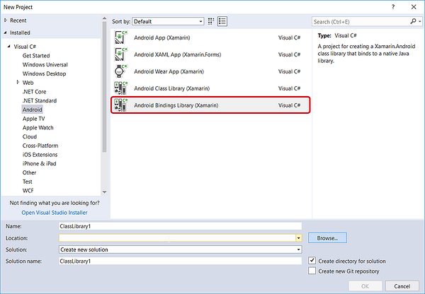
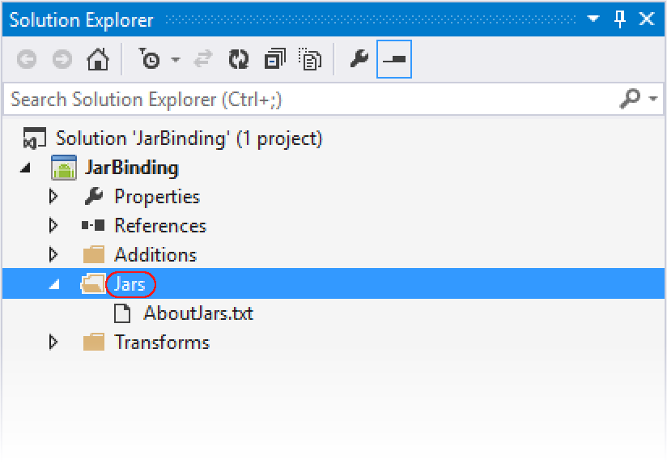
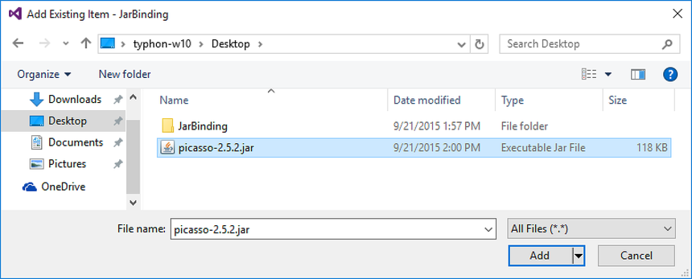
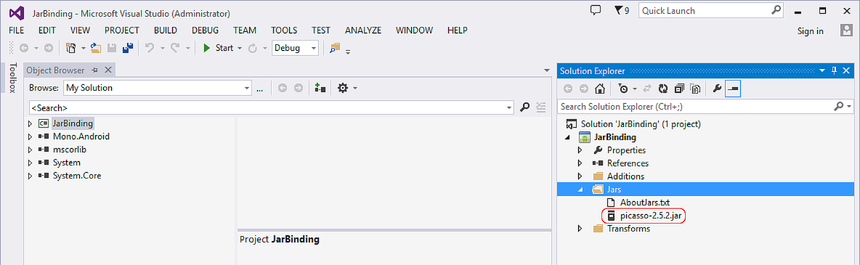
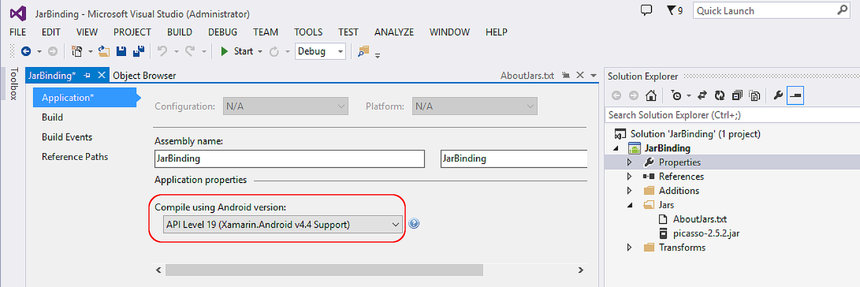
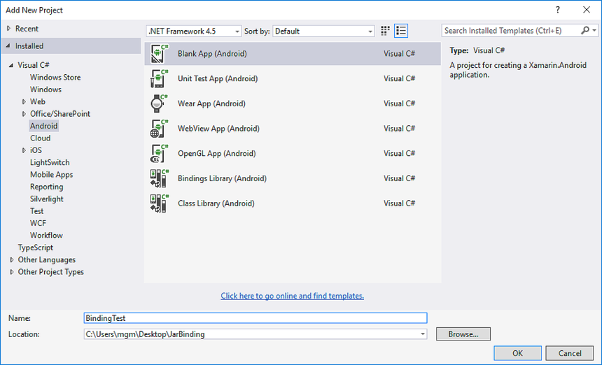
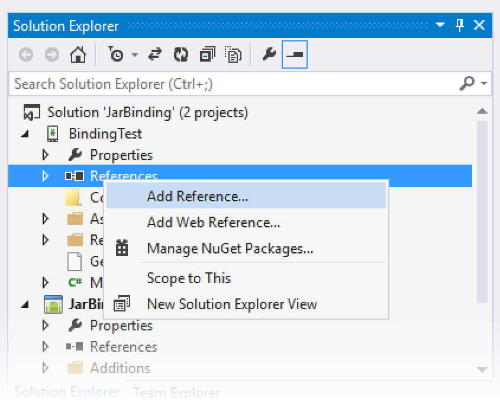
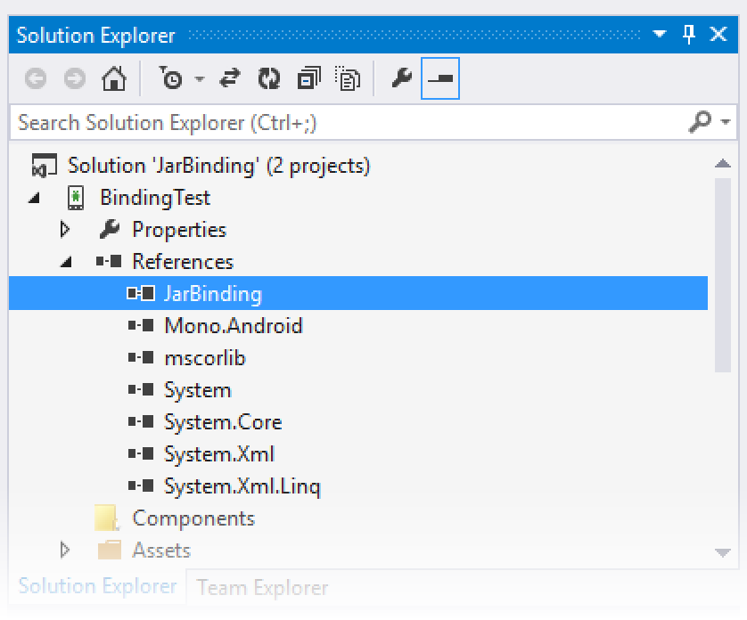
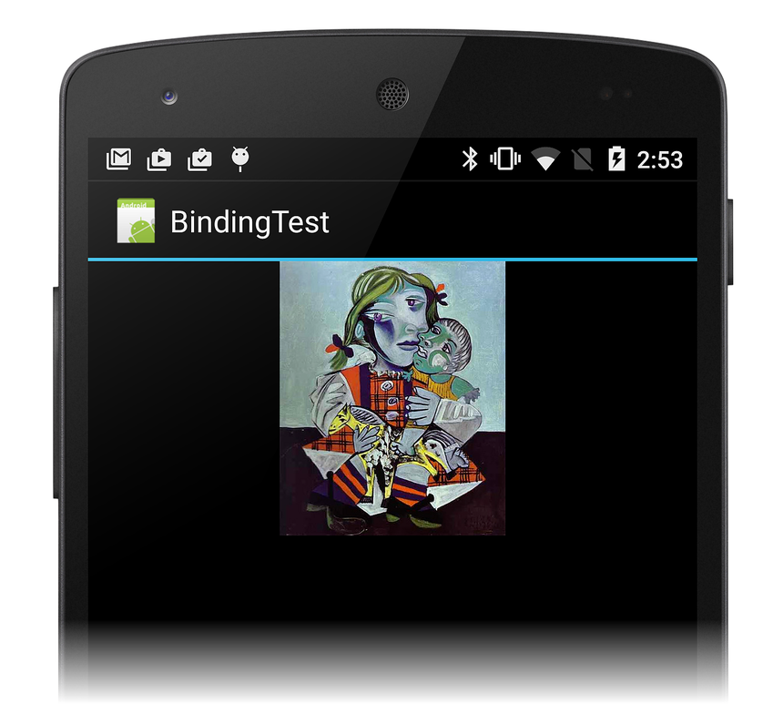

# Binding a .JAR

> [!IMPORTANT]
> We're currently investigating custom binding usage on the Xamarin platform. Please take [**this survey**](https://www.surveymonkey.com/r/KKBHNLT) to inform future development efforts.

_This walkthrough provides step-by-step instructions for creating a Xamarin.Android Java Bindings Library from an Android .JAR file._

## Overview

The Android community offers many Java libraries that you may want to
use in your app. These Java libraries are often packaged in .JAR (Java
Archive) format, but you can package a .JAR it in a *Java Bindings
Library* so that its functionality is available to Xamarin.Android
apps. The purpose of the Java Bindings library is to make the APIs in
the .JAR file available to C# code through automatically-generated code
wrappers.

Xamarin tooling can generate a Bindings Library from one or more input
.JAR files. The Bindings Library (.DLL assembly) contains the
following:

- The contents of the original .JAR file(s).

- Managed Callable Wrappers (MCW), which are C# types that wrap corresponding
    Java types within the .JAR file(s).

The generated MCW code uses JNI (Java Native Interface) to forward your
API calls to the underlying .JAR file. You can create bindings
libraries for any .JAR file that was originally targeted to be used
with Android (note that Xamarin tooling does not currently support the
binding of non-Android Java libraries). You can also elect to build
the Bindings Library without including the contents of the .JAR
file so that the DLL has a dependency on the .JAR at runtime.

In this guide, we'll step through the basics of creating a Bindings
Library for a single .JAR file. We'll illustrate with an example where
everything goes right &ndash; that is, where no customization or
debugging of bindings is required.
[Creating Bindings Using Metadata](~/android/platform/binding-java-library/customizing-bindings/java-bindings-metadata.md)
offers an example of a more advanced scenario where the binding process
is not entirely automatic and some amount of manual intervention is
required. For an overview of Java library binding in general (with a
basic code example), see
[Binding a Java Library](~/android/platform/binding-java-library/index.md).

## Walkthrough

In the following walkthrough, we'll create a Bindings Library for
[Picasso](https://square.github.io/picasso/), a popular Android .JAR
that provides image loading and caching functionality. We will use the
following steps to bind **picasso-2.x.x.jar** to create a new .NET
assembly that we can use in a Xamarin.Android project:

1. Create a new Java Bindings Library project.

2. Add the .JAR file to the project.

3. Set the appropriate build action for the .JAR file.

4. Choose a target framework that the .JAR supports.

5. Build the Bindings Library.

Once we've created the Bindings Library, we'll develop a small Android
app that demonstrates our ability to call APIs in the Bindings Library.
In this example, we want to access methods of **picasso-2.x.x.jar**:

```java
package com.squareup.picasso

public class Picasso
{
    ...
    public static Picasso with (Context context) { ... };
    ...
    public RequestCreator load (String path) { ... };
    ...
}
```

After we generate a Bindings Library for **picasso-2.x.x.jar**,
we can call these methods from C#. For example:

```csharp
using Com.Squareup.Picasso;
...
Picasso.With (this)
    .Load ("https://mydomain.myimage.jpg")
    .Into (imageView);

```

### Creating the Bindings Library

Before commencing with the steps below, please download
[picasso-2.x.x.jar](http://repo1.maven.org/maven2/com/squareup/picasso/picasso/2.5.2/picasso-2.5.2.jar).

First, create a new Bindings Library project. In Visual Studio for Mac or
Visual Studio, create a new Solution and select the *Android
Bindings Library* template. (The screenshots in this walkthrough
use Visual Studio, but Visual Studio for Mac is very similar.) Name the
Solution **JarBinding**:

[](binding-a-jar-images/01-new-bindings-library.w157.png#lightbox)

The template includes a **Jars** folder where you add your .JAR(s)
to the Bindings Library project. Right-click the **Jars** folder
and select **Add > Existing Item**:

[](binding-a-jar-images/02-add-existing-item.png#lightbox)

Navigate to the **picasso-2.x.x.jar** file downloaded earlier, select it and
click **Add**:

[](binding-a-jar-images/03-select-jar-file.png#lightbox)

Verify that the **picasso-2.x.x.jar** file was successfully added
to the project:

[](binding-a-jar-images/04-jar-added.png#lightbox)

When you create a Java Bindings library project, you must specify
whether the .JAR is to be embedded in the Bindings Library
or packaged separately. To do that, you specify one of the
following *build actions*:

- **EmbeddedJar** &ndash; the .JAR will be embedded in the Bindings Library.

- **InputJar** &ndash; the .JAR will be kept separate from the Bindings
    Library.

Typically, you use the **EmbeddedJar** build action so that the
.JAR is automatically packaged into the bindings library. This is
the simplest option &ndash; Java bytecode in the .JAR is converted
into Dex bytecode and is embedded (along with the Managed Callable
Wrappers) into your APK. If you want to keep the .JAR separate from
the bindings library, you can use the **InputJar** option; however,
you must ensure that the .JAR file is available on the device that
runs your app.

Set the build action to **EmbeddedJar**:

[](binding-a-jar-images/05-embeddedjar.png#lightbox)

Next, open the project Properties to configure the *Target
Framework*. If the .JAR uses any Android APIs, set the Target
Framework to the API level that the .JAR expects. Typically, the
developer of the .JAR file will indicate which API level (or
levels) that the .JAR is compatible with.
(For more information about the Target Framework setting and Android API levels
in general, see
[Understanding Android API Levels](~/android/app-fundamentals/android-api-levels.md).)

Set the target API level for your Bindings Library (in this example, we are using
API level 19):

[](binding-a-jar-images/06-set-target-framework.png#lightbox)

Finally, build the Bindings Library. Although some warning messages may be displayed,
the Bindings Library project should build successfully and produce an output .DLL
at the following location: **JarBinding/bin/Debug/JarBinding.dll**

### Using the Bindings Library

To consume this .DLL in your Xamarin.Android app, do the following:

1. Add a reference to the Bindings Library.

2. Make calls into the .JAR through the Managed Callable Wrappers.

In the following steps, we'll create a minimal app that uses the
Bindings Library to download and display an image in an `ImageView`;
the "heavy lifting" is done by the code that resides in the .JAR file.

First, create a new Xamarin.Android app that consumes
the Bindings Library. Right-click the Solution and select **Add New
Project**; name the new project **BindingTest**. We're
creating this app in the same Solution as the Bindings Library in
order to simplify this walkthrough; however, the app that consumes
the Bindings Library could, instead, reside in a different Solution:

[](binding-a-jar-images/07-add-new-project.w157.png#lightbox)

Right-click the **References** node of the **BindingTest** project and
select **Add Reference...**:

[](binding-a-jar-images/08-add-reference.png#lightbox)

Check the **JarBinding** project created earlier and click **OK**:

[](binding-a-jar-images/09-choose-jar-binding.png#lightbox)

Open the **References** node of the **BindingTest** project and
verify that the **JarBinding** reference is present:

[](binding-a-jar-images/10-references-shows-jarbinding.png#lightbox)

Modify the **BindingTest** layout (**Main.axml**) so that it has a single `ImageView`:

```xml
<?xml version="1.0" encoding="utf-8"?>
<LinearLayout xmlns:android="http://schemas.android.com/apk/res/android"
    android:orientation="vertical"
    android:layout_width="match_parent"
    android:layout_height="match_parent"
    android:minWidth="25px"
    android:minHeight="25px">
    <ImageView
        android:layout_width="match_parent"
        android:layout_height="wrap_content"
        android:id="@+id/imageView" />
</LinearLayout>
```

Add the following `using` statement to **MainActivity.cs** &ndash; this makes it possible
to easily access the methods of the Java-based `Picasso` class that resides in the
Bindings Library:

```csharp
using Com.Squareup.Picasso;
```

Modify the `OnCreate` method so that it uses the `Picasso` class to
load an image from a URL and display it in the `ImageView`:

```csharp
public class MainActivity : Activity
{
    protected override void OnCreate(Bundle bundle)
    {
        base.OnCreate(bundle);
        SetContentView(Resource.Layout.Main);
        ImageView imageView = FindViewById<ImageView>(Resource.Id.imageView);

        // Use the Picasso jar library to load and display this image:
        Picasso.With (this)
            .Load ("https://i.imgur.com/DvpvklR.jpg")
            .Into (imageView);
    }
}
```

Compile and run the **BindingTest** project. The app will startup, and after a short delay
(depending on network conditions), it should download and display an image similar to
the following screenshot:

[](binding-a-jar-images/11-result.png#lightbox)

Congratulations! You've successfully bound a Java library .JAR and used it in your
Xamarin.Android app.

## Summary

In this walkthrough, we created a Bindings Library for a third-party
.JAR file, added the Bindings Library to a minimal test app, and then
ran the app to verify that our C# code can call Java code residing in
the .JAR file.

## Related Links

- [Building a Java Bindings Library (video)](https://university.xamarin.com/classes#10090)
- [Binding a Java Library](~/android/platform/binding-java-library/index.md)
