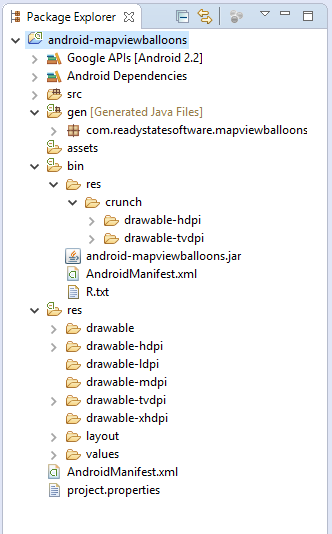
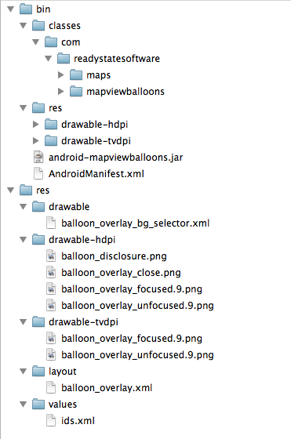
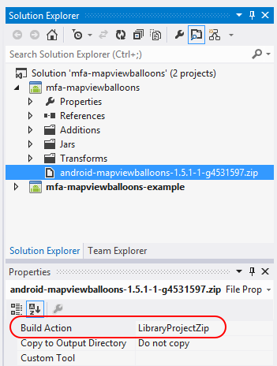
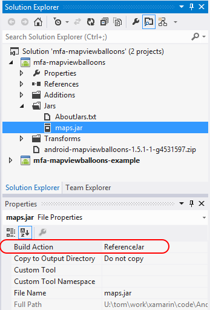

# Binding an Eclipse Library Project

> [!IMPORTANT]
> We're currently investigating custom binding usage on the Xamarin platform. Please take [**this survey**](https://www.surveymonkey.com/r/KKBHNLT) to inform future development efforts.

_This walkthrough explains how to use Xamarin.Android project templates to bind an Eclipse Android library project._

## Overview

Although .AAR files are increasingly becoming the norm for Android library
distribution, in some cases it is necessary to create a binding for an
*Android library project*. Android library projects are special Android
projects that contain shareable code and resources that can be
referenced by Android application projects. Typically, you bind to an
Android library project when the library is created in the Eclipse IDE.
This walkthrough provides examples of how to create an Android
library project .ZIP from the directory structure of an Eclipse
project.

Android library projects are different from regular Android projects in
that they are not compiled into an APK and are not, on their own,
deployable to a device. Instead, an Android library project is meant to
be referenced by an Android application project. When an Android
application project is built, the Android library project is compiled
first. The Android application project will then be absorbed into the
compiled Android library project and include the code and resources
into the APK for distribution. Because of this difference, creating a
binding for an Android library project is slightly different than
creating a binding for a Java .JAR or .AAR file.

## Walkthrough

To use an Android library project in a Xamarin.Android Java Binding 
project it is first necessary to build the Android library project in 
Eclipse. The following screenshot shows an example of one Android 
library project after compilation: 

Notice that the source code from the Android library project has been 
compiled to a temporary .JAR file named 
**android-mapviewballoons.jar**, and that the resources have been copied 
to the **bin/res/crunch** folder. 

Once the Android library project has been compiled in Eclipse, it can 
then be bound using a Xamarin.Android Java Binding project. First a 
.ZIP file must be created which contains the **bin** and **res** 
folders of the Android library project. It is important that you remove
the intervening **crunch** subdirectory so that the resources
reside in **bin/res**. The following screenshot shows 
the contents of one such .ZIP file: 

This .ZIP file is then added to Xamarin.Android Java Binding
project, as shown in the following screenshot:

Notice that the Build Action of the .ZIP file has been
automatically set to **LibraryProjectZip**.

If there are any .JAR files that are required by the Android library 
project, they should be added to the **Jars** folder of the Java 
Binding Library project and the **Build Action** set to 
**ReferenceJar**. An example of this can be seen in the screenshot 
below: 

Once these steps are complete, the Xamarin.Android Java Binding project can
be used as described earlier on in this document.

> [!NOTE]
> Compiling the Android library projects in other IDEs is not supported at this time. Other IDEs may not create the same directory structure or files in the **bin** folder as Eclipse. 

## Summary

In this article, we walked through the process of binding an Android 
library project. We built the Android library project in Eclipse, then 
we created a zip file from the **bin** and **res** folders of the 
Android library project. Next, we used this zip to create a 
Xamarin.Android Java Binding project. 
