# Binding an .AAR

> [!IMPORTANT]
> We're currently investigating custom binding usage on the Xamarin platform. Please take [**this survey**](https://www.surveymonkey.com/r/KKBHNLT) to inform future development efforts.

_This walkthrough provides step-by-step instructions for creating a Xamarin.Android Java Bindings Library from an Android .AAR file._

## Overview

The *Android Archive (.AAR)* file is the file format for Android libraries.
An .AAR file is a .ZIP archive that contains the following:

- Compiled Java code
- Resource IDs
- Resources
- Meta-data (for example, Activity declarations, permissions)

In this guide, we'll step through the basics of creating a Bindings
Library for a single .AAR file. For an overview of Java library binding
in general (with a basic code example), see
[Binding a Java Library](~/android/platform/binding-java-library/index.md).

> [!IMPORTANT]
> A binding project can only include one .AAR file. If the .AAR depends on other .AAR, then those dependencies should be contained in their own binding project and then referenced.

## Walkthrough

We'll create a Bindings Library for an example Android archive file
that was created in Android Studio,
[textanalyzer.aar](https://github.com/xamarin/monodroid-samples/blob/master/JavaIntegration/AarBinding/Resources/textanalyzer.aar?raw=true). This .AAR contains a
`TextCounter` class with static methods that count the number of vowels
and consonants in a string. In addition, **textanalyzer.aar** contains
an image resource to help display the counting results.

We'll use the following steps to create a Bindings Library from the
.AAR file:

1. Create a new Java Bindings Library project.

2. Add a single .AAR file to the project. A binding project may only contain a single .AAR.

3. Set the appropriate build action for the .AAR file.

4. Choose a target framework that the .AAR supports.

5. Build the Bindings Library.

Once we've created the Bindings Library, we'll develop a small Android
app that prompts the user for a text string, calls .AAR methods to
analyze the text, retrieves the image from the .AAR, and displays the
results along with the image.

The sample app will access the `TextCounter` class of
**textanalyzer.aar**:

```java
package com.xamarin.textcounter;

public class TextCounter
{
    ...
    public static int numVowels (String text) { ... };
    ...
    public static int numConsonants (String text) { ... };
    ...
}
```

In addition, this sample app will retrieve and display an image
resource that is packaged in **textanalyzer.aar**:

[](binding-an-aar-images/00-monkey.png#lightbox)

This image resource resides at **res/drawable/monkey.png**
in **textanalyzer.aar**.

### Creating the Bindings Library

Before commencing with the steps below, please download the example
[textanalyzer.aar](https://github.com/xamarin/monodroid-samples/blob/master/JavaIntegration/AarBinding/Resources/textanalyzer.aar?raw=true) Android archive file:

1. Create a new Bindings Library project starting with the Android
    Bindings Library template. You can use either Visual Studio for Mac or
    Visual Studio (the screenshots below show Visual Studio, but
    Visual Studio for Mac is very similar). Name the solution **AarBinding**:

    [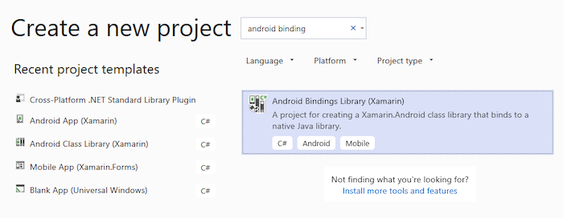](binding-an-aar-images/01-new-bindings-library-vs.w160.png#lightbox)

2. The template includes a **Jars** folder where you add your .AAR(s)
    to the Bindings Library project. Right-click the **Jars** folder
    and select **Add > Existing Item**:

    [](binding-an-aar-images/02-add-existing-item-vs.png#lightbox)

3. Navigate to the **textanalyzer.aar** file downloaded earlier, select it, and
    click **Add**:

    [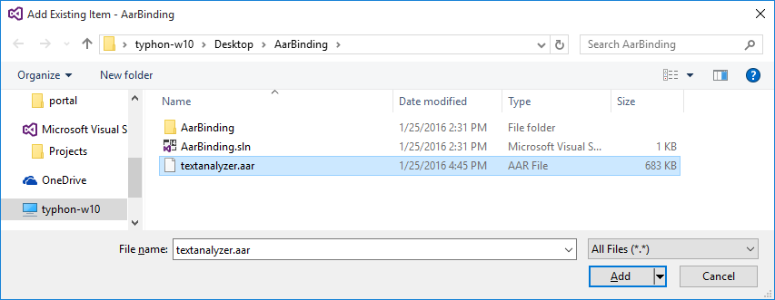](binding-an-aar-images/03-select-aar-file-vs.png#lightbox)

4. Verify that the **textanalyzer.aar** file was successfully added
    to the project:

    [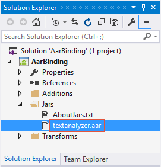](binding-an-aar-images/04-aar-added-vs.png#lightbox)

5. Set the Build Action for **textanalyzer.aar** to
    `AndroidLibrary`. In Visual Studio for Mac, right-click
    **textanalyzer.aar** to set the Build Action. In Visual Studio,
    the Build Action can be set in the **Properties** pane):

    [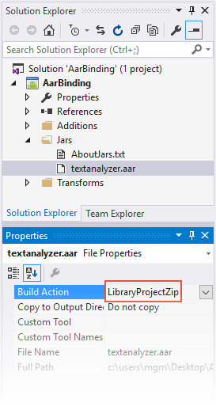](binding-an-aar-images/05-embedded-aar-vs.png#lightbox)

6. Open the project Properties to configure the *Target Framework*. If
    the .AAR uses any Android APIs, set the Target Framework to the API
    level that the .AAR expects. (For more information about the Target
    Framework setting and Android API levels in general, see
    [Understanding Android API Levels](~/android/app-fundamentals/android-api-levels.md).)

    Set the target API level for your Bindings Library. In this
    example, we are free to use the latest platform API level (API
    level 23) because our **textanalyzer** does not have a dependency
    on Android APIs:

    [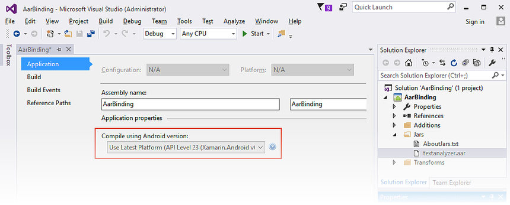](binding-an-aar-images/06-set-target-framework-vs.png#lightbox)

7. Build the Bindings Library. The Bindings Library project should
    build successfully and produce an output .DLL at the following
    location: **AarBinding/bin/Debug/AarBinding.dll**

### Using the Bindings Library

To consume this .DLL in your Xamarin.Android app, you must first add
a reference to the Bindings Library. Use the following steps:

1. We're creating this app in the same Solution as the Bindings
    Library to simplify this walkthrough. (The app 
    that consumes the Bindings Library could also reside in a
    different Solution.) Create a new Xamarin.Android app: right-click
    the Solution and select **Add New Project**. Name the new project
    **BindingTest**:

    [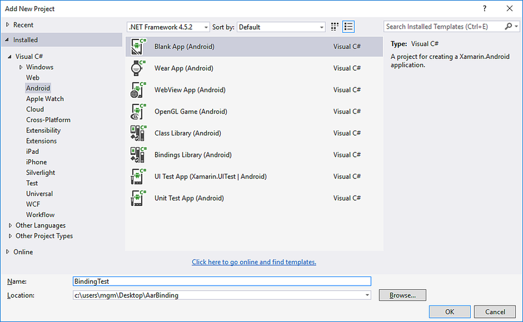](binding-an-aar-images/07-add-new-project-vs.w157.png#lightbox)

2. Right-click the **References** node of the **BindingTest** project and
    select **Add Reference...**:

    [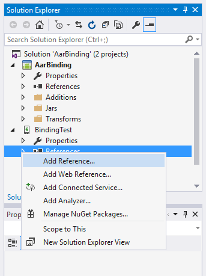](binding-an-aar-images/08-add-reference-vs.png#lightbox)

3. Select the **AarBinding** project created earlier and click **OK**:

    [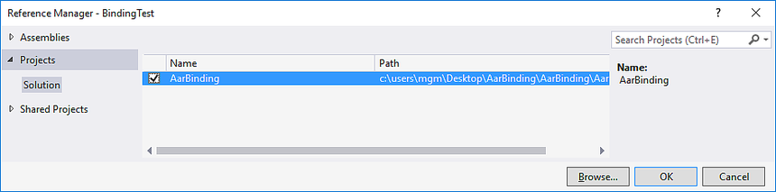](binding-an-aar-images/09-choose-aar-binding-vs.png#lightbox)

4. Open the **References** node of the **BindingTest** project to
    verify that the **AarBinding** reference is present:

    [](binding-an-aar-images/10-references-shows-aarbinding-vs.png#lightbox)

If you would like to view the contents of the Binding Library project,
you can double-click the reference to open it in the **Object
Browser**. You can see the mapped contents of the
`Com.Xamarin.Textcounter` namespace (mapped from the Java
`com.xamarin.textanalyzezr` package) and you can view the members of
the `TextCounter` class:

[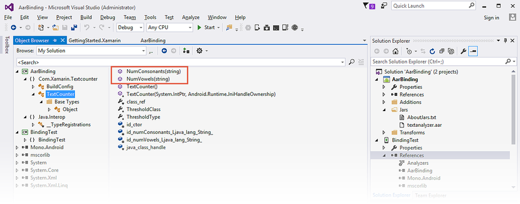](binding-an-aar-images/11-object-browser-vs.png#lightbox)

The above screenshot highlights the two `TextAnalyzer` methods that the
example app will call: `NumConsonants` (which wraps the underlying Java
`numConsonants` method), and `NumVowels` (which wraps the underlying
Java `numVowels` method).

### Accessing .AAR Types

After you add a reference to your app that points to the Binding
Library, you can access Java types in the .AAR as you would access C#
types (thanks to the C# wrappers). C# app code can call `TextAnalyzer`
methods as illustrated in this example:

```csharp
using Com.Xamarin.Textcounter;
...
int numVowels = TextCounter.NumVowels (myText);
int numConsonants = TextCounter.NumConsonants (myText);
```

In the above example, we're calling static methods in the `TextCounter`
class. However, you can also instantiate classes and call instance
methods. For example, if your .AAR wraps a class called `Employee` that
has the instance method `buildFullName`, you can instantiate `MyClass` and
use it as seen here:

```csharp
var employee = new Com.MyCompany.MyProject.Employee();
var name = employee.BuildFullName ();
```

The following steps add code to the app so that it prompts the user for
text, uses `TextCounter` to analyze the text, and then displays the results.

Replace the **BindingTest** layout (**Main.axml**) with the
following XML. This layout has an `EditText` for text input
and two buttons for initiating vowel and consonant counts:

```xml
<?xml version="1.0" encoding="utf-8"?>
<LinearLayout xmlns:android="http://schemas.android.com/apk/res/android"
    android:orientation             ="vertical"
    android:layout_width            ="fill_parent"
    android:layout_height           ="fill_parent" >
    <TextView
        android:text                ="Text to analyze:"
        android:textSize            ="24dp"
        android:layout_marginTop    ="30dp"
        android:layout_gravity      ="center"
        android:layout_width        ="wrap_content"
        android:layout_height       ="wrap_content" />
    <EditText
        android:id                  ="@+id/input"
        android:text                ="I can use my .AAR file from C#!"
        android:layout_marginTop    ="10dp"
        android:layout_gravity      ="center"
        android:layout_width        ="300dp"
        android:layout_height       ="wrap_content"/>
    <Button
        android:id                  ="@+id/vowels"
        android:layout_marginTop    ="30dp"
        android:layout_width        ="240dp"
        android:layout_height       ="wrap_content"
        android:layout_gravity      ="center"
        android:text                ="Count Vowels" />
    <Button
        android:id                  ="@+id/consonants"
        android:layout_width        ="240dp"
        android:layout_height       ="wrap_content"
        android:layout_gravity      ="center"
        android:text                ="Count Consonants" />
</LinearLayout>
```

Replace the contents of **MainActivity.cs** with the following
code. As seen in this example, the button event handlers call
wrapped `TextCounter` methods that reside in the .AAR and use
toasts to display the results. Notice the `using` statement for
the namespace of the bound library (in this case,
`Com.Xamarin.Textcounter`):

```csharp
using System;
using Android.App;
using Android.Content;
using Android.Runtime;
using Android.Views;
using Android.Widget;
using Android.OS;
using Android.Views.InputMethods;
using Com.Xamarin.Textcounter;

namespace BindingTest
{
    [Activity(Label = "BindingTest", MainLauncher = true, Icon = "@drawable/icon")]
    public class MainActivity : Activity
    {
        InputMethodManager imm;

        protected override void OnCreate(Bundle bundle)
        {
            base.OnCreate(bundle);

            SetContentView(Resource.Layout.Main);

            imm = (InputMethodManager)GetSystemService(Context.InputMethodService);

            var vowelsBtn = FindViewById<Button>(Resource.Id.vowels);
            var consonBtn = FindViewById<Button>(Resource.Id.consonants);
            var edittext = FindViewById<EditText>(Resource.Id.input);
            edittext.InputType = Android.Text.InputTypes.TextVariationPassword;

            edittext.KeyPress += (sender, e) =>
            {
                imm.HideSoftInputFromWindow(edittext.WindowToken, HideSoftInputFlags.NotAlways);
                e.Handled = true;
            };

            vowelsBtn.Click += (sender, e) =>
            {
                int count = TextCounter.NumVowels(edittext.Text);
                string msg = count + " vowels found.";
                Toast.MakeText (this, msg, ToastLength.Short).Show ();
            };

            consonBtn.Click += (sender, e) =>
            {
                int count = TextCounter.NumConsonants(edittext.Text);
                string msg = count + " consonants found.";
                Toast.MakeText (this, msg, ToastLength.Short).Show ();
            };

        }
    }
}
```

Compile and run the **BindingTest** project. The app will start and present
the screenshot on the left (the `EditText` is initialized with some
text, but you can tap it to change it). When you tap **COUNT VOWELS**, a
toast displays the number of vowels as shown on the right:

[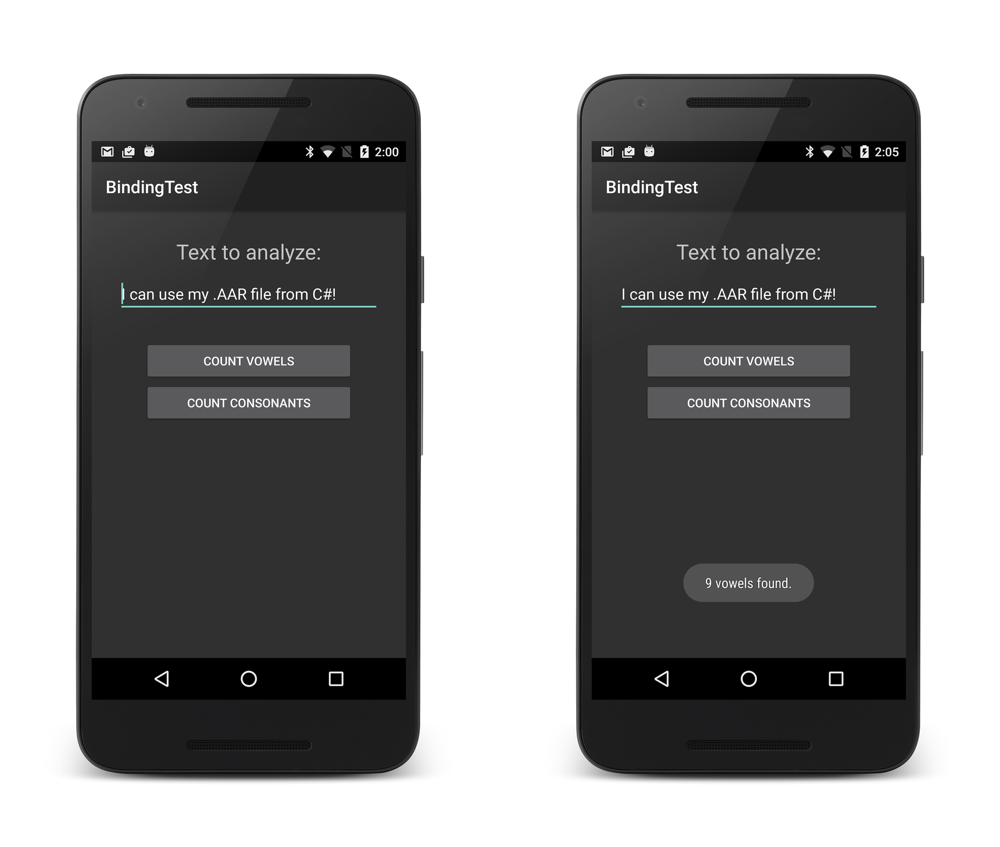](binding-an-aar-images/12-count-vowels.png#lightbox)

Try tapping the **COUNT CONSONANTS** button. Also, you can modify the
line of text and tap these buttons again to test for different vowel
and consonant counts.

### Accessing .AAR Resources

The Xamarin tooling merges the **R** data from the .AAR into your app's
**Resource** class. As a result, you can access .AAR resources from
your layout (and from code-behind) in the same way as you would access
resources that are in the **Resources** path of your project.

To access an image resource, you use the **Resource.Drawable** name for
the image packed inside the .AAR. For example, you can reference
**image.png** in the .AAR file by using `@drawable/image`:

```xml
<ImageView android:src="@drawable/image" ... />
```

You can also access resource layouts that reside in the .AAR. To
do this, you use the **Resource.Layout** name for the layout packaged
inside the .AAR. For example:

```csharp
var a = new ArrayAdapter<string>(this, Resource.Layout.row_layout, ...);
```

The **textanalyzer.aar** example contains an image file that resides at
**res/drawable/monkey.png**. Let's access this image resource and use
it in our example app:

Edit the **BindingTest** layout (**Main.axml**) and add an
`ImageView` to the end of the `LinearLayout` container. This
`ImageView` displays the image found at **\@drawable/monkey**; this
image will be loaded from the resource section of
**textanalyzer.aar**:

```xml
    ...
    <ImageView
        android:src                 ="@drawable/monkey"
        android:layout_marginTop    ="40dp"
        android:layout_width        ="200dp"
        android:layout_height       ="200dp"
        android:layout_gravity      ="center" />

</LinearLayout>
```

Compile and run the **BindingTest** project. The app will start and present
the screenshot on the left &ndash; when you tap **COUNT CONSONANTS**, the
results are displayed as shown on the right:

[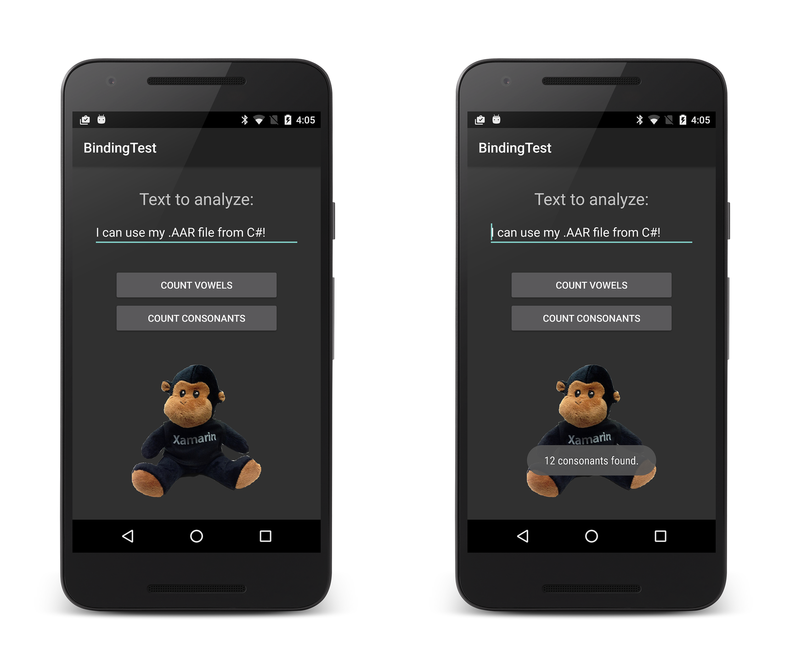](binding-an-aar-images/13-count-consonants.png#lightbox)

Congratulations! You've successfully bound a Java library .AAR!

## Summary

In this walkthrough, we created a Bindings Library for an .AAR file,
added the Bindings Library to a minimal test app, and ran the app to
verify that our C# code can call Java code residing in the .AAR file.
In addition, we extended the app to access and display an image
resource that resides in the .AAR file.

## Related Links

- [Building a Java Bindings Library (video)](https://university.xamarin.com/classes#10090)
- [Binding a .JAR](~/android/platform/binding-java-library/binding-a-jar.md)
- [Binding a Java Library](~/android/platform/binding-java-library/index.md)
- [AarBinding (sample)](/samples/xamarin/monodroid-samples/javaintegration-aarbinding)
