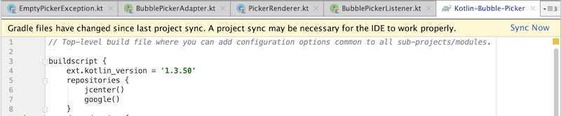
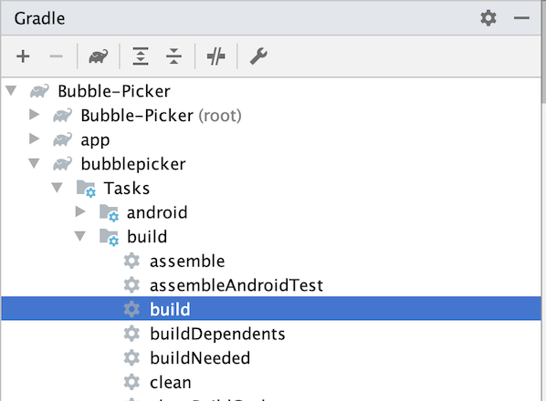
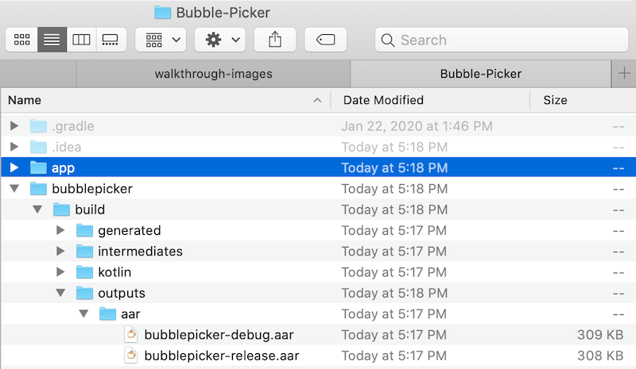
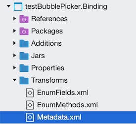
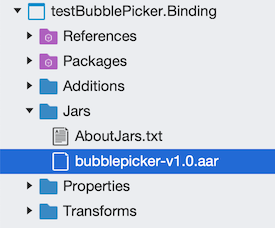
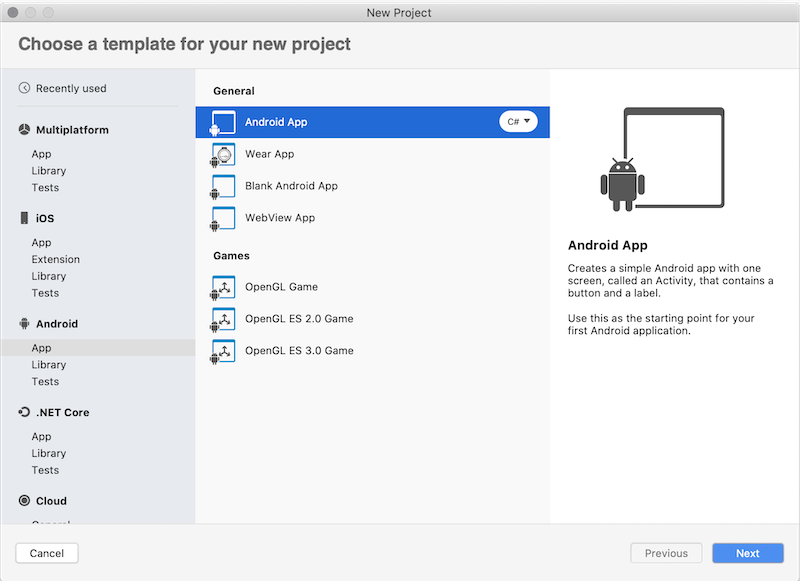
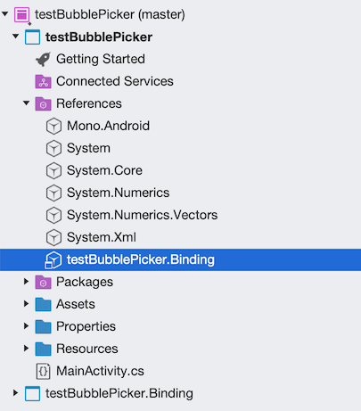
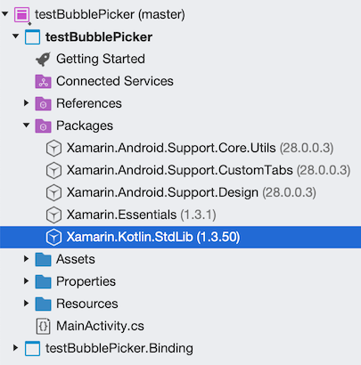

# Walkthrough: Bind an Android Kotlin library

> [!IMPORTANT]
> We're currently investigating custom binding usage on the Xamarin platform. Please take [**this survey**](https://www.surveymonkey.com/r/KKBHNLT) to inform future development efforts.

Xamarin enables mobile developers to create cross-platform native mobile apps using Visual Studio and C#. You can use the Android platform SDK components out of the box but in many cases you also want to use third-party SDKs written for that platform and Xamarin allows you to do it via bindings. In order to incorporate a third-party Android framework into your Xamarin.Android application, you need to create a Xamarin.Android binding for it before you can use it in your applications.

The Android platform, along with its native languages and tooling, are constantly evolving, including the recent introduction of the Kotlin language, which is set eventually to replace Java. There are a number of 3d party SDKs, which have already been migrated from Java to Kotlin and it presents us with new challenges. Even though the Kotlin binding process is similar to Java, it requires additional steps and configuration settings to successfully build and run as part of a Xamarin.Android application.  

The goal of this document is to outline a high-level approach for addressing this scenario and provide a detailed step-by-step guide with a simple example.

## Background

Kotlin was released in February 2016 and was positioned as an alternative to the standard Java compiler into Android Studio by 2017. Later in 2019, Google announced that the Kotlin programming language would became its preferred language for Android app developers. The high-level binding approach is similar to [the binding process of regular Java libraries](../binding-java-library/index.md) with a few important Kotlin specific steps.

## Prerequisites

In order to complete this walkthrough, you will need:

- [Android Studio](https://developer.android.com/studio)
- [Visual Studio for Mac](https://visualstudio.microsoft.com/downloads)
- [Java Decompiler](http://java-decompiler.github.io/)

## Build a native library

The first step is to build a native Kotlin library using Android Studio. The library is usually provided by a third-party developer or available at [the Google's Maven repository](https://maven.google.com/web/index.html) and other remote repositories. As an example, in this tutorial a binding for the Bubble Picker Kotlin Library is created:


1. Download [the source code](https://github.com/igalata/Bubble-Picker/archive/develop.zip) from GitHub for the library and unpack it to a local folder **Bubble-Picker**.

1. Launch the Android Studio and select **Open an existing Android Studio project** menu option choosing the Bubble-Picker local folder:

    

1. Verify that the Android Studio is up to date including Gradle. The source code can be successfully built on Android Studio v3.5.3, Gradle v5.4.1. Instructions on how to update Gradle to the latest Gradle version [could be found here](https://gradle.org/install/).

1. Verify that required Android SDK is installed. The source code requires Android SDK v25. Open **Tools > SDK Manager** menu option to install SDK components.

1. Update and synchronize the main **build.gradle** configuration file located at the root of the project folder:

    - Set the Kotlin version to 1.3.10

        ```gradle
        buildscript {
            ext.kotlin_version = '1.3.10'
        }
        ```

    - Register default Google's Maven repository so the support library dependency could be resolved:

        ```gradle
        allprojects {
            repositories {
                jcenter()
                maven {
                    url "https://maven.google.com"
                }
            }
        }
        ```

    - Once the configuration file is updated, it's out of sync and Gradle shows the **Sync Now** button, press it and wait for the synchronization process to be completed:

        

        > [!TIP]
        > Gradle's dependency cache may be corrupt, this sometimes occurs after a network connection timeout. Redownload dependencies and sync project (requires network).

        > [!TIP]
        > The state of a Gradle build process (daemon) may be corrupt. Stopping all Gradle daemons may solve this problem. Stop Gradle build processes (requires restart). In the case of corrupt Gradle processes, you can also try closing the IDE and then killing all Java processes.

        > [!TIP]
        > Your project may be using a third-party plugin, which is not compatible with the other plugins in the project or the version of Gradle requested by the project.

1. Open the Gradle menu on the right, navigate to the **bubblepicker > Tasks** menu, execute the **build** task by double tapping on it, and wait for the build process to complete:

    

1. Open the root folder files browser and navigate to the build folder: **Bubble-Picker -> bubblepicker ->  build -> outputs -> aar**, save the **bubblepicker-release.aar** file as **bubblepicker-v1.0.aar**, this file will be used later in the binding process:

    

The AAR file is an Android archive, which contains the compiled Kotlin source code and assets, required by Android to run an application using this SDK.  

## Prepare metadata

The second step is to prepare the metadata transformation file, which is used by Xamarin.Android to generate respective C# classes. A Xamarin.Android Binding Project will discover all native classes and members from a given Android archive subsequently generating an XML file with the appropriate metadata. The manually created metadata transformation file is then applied to the previously generated baseline to create the final XML definition file used to generate the C# code.

The metadata uses [XPath](https://www.w3.org/TR/xpath/) syntax and is used by the Bindings Generator to influence the creation of the binding assembly. The [Java Binding Metadata](../binding-java-library/customizing-bindings/java-bindings-metadata.md) article provides more information on transformations, which could be applied:

1. Create an empty **Metadata.xml** file:

    ```xml
    <?xml version="1.0" encoding="UTF-8"?>
    <metadata>
    </metadata>
    ```

1. Define xml transformations:

- The native Kotlin library has two dependencies, which you don't want to expose to C# world, define two transformations to ignore them completely. Important to say, the native members won't be stripped from the resulting binary, only C# classes won't be generated. [Java Decompiler](http://java-decompiler.github.io/) can be used to identify the dependencies. Run the tool and open the AAR file created earlier, as a result the structure of the Android archive will be shown, reflecting all dependencies, values, resources, manifest, and classes:  

    

    The transformations to skip processing these packages are defined using XPath instructions:

    ```xml
    <remove-node path="/api/package[starts-with(@name,'org.jbox2d')]" />
    <remove-node path="/api/package[starts-with(@name,'org.slf4j')]" />
    ```

- The native `BubblePicker` class has two methods `getBackgroundColor` and `setBackgroundColor` and the following transformation will change it into a C# `BackgroundColor` property:

    ```xml
    <attr path="/api/package[@name='com.igalata.bubblepicker.rendering']/class[@name='BubblePicker']/method[@name='getBackground' and count(parameter)=0]" name="propertyName">BackgroundColor</attr>
    <attr path="/api/package[@name='com.igalata.bubblepicker.rendering']/class[@name='BubblePicker']/method[@name='setBackground' and count(parameter)=1 and parameter[1][@type='int']]" name="propertyName">BackgroundColor</attr>
    ```

- Unsigned types `UInt, UShort, ULong, UByte` require special handling. For these types Kotlin changes method names and parameters types automatically, which is reflected in the generated code:

    ```Kotlin
    public open fun fooUIntMethod(value: UInt) : String {
        return "fooUIntMethod${value}"
    }
    ```

    This code is compiled into the following Java byte code:

    ```Java byte code
    @NotNull
    public String fooUIntMethod-WZ4Q5Ns(int value) {
    return "fooUIntMethod" + UInt.toString-impl(value);
    }
    ```

    Moreover, related types such as `UIntArray, UShortArray, ULongArray, UByteArray` are also affected by Kotlin. The method name is changed to include an additional suffix and parameters are changed to an array of elements of signed versions of the same types. In the example below a parameter of type `UIntArray` is converted automatically into `int[]` and the method name is changed from `fooUIntArrayMethod` to `fooUIntArrayMethod--ajY-9A`. The latter is discovered by Xamarin.Android tools and generated as a valid method name:

    ```Kotlin
    public open fun fooUIntArrayMethod(value: UIntArray) : String {
        return "fooUIntArrayMethod${value.size}"
    }
    ```

    This code is compiled into the following Java byte code:

    ```Java byte code
    @NotNull
    public String fooUIntArrayMethod--ajY-9A(@NotNull int[] value) {
        Intrinsics.checkParameterIsNotNull(value, "value");
        return "fooUIntArrayMethod" + UIntArray.getSize-impl(value);
    }
    ```

    In order to give it a meaningful name, the following metadata can be added to the **Metadata.xml**, which will update the name back to originally defined in the Kotlin code:

    ```xml
    <attr path="/api/package[@name='com.microsoft.simplekotlinlib']/class[@name='FooClass']/method[@name='fooUIntArrayMethod--ajY-9A']" name="managedName">fooUIntArrayMethod</attr>
    ```

    In the BubblePicker sample, there are no members using unsigned types thus no additional changes are required.

- Kotlin members with generic parameters by default transformed into parameters of Java.`Lang.Object` type. For example, a Kotlin method has a generic parameter \<T>:

    ```Kotlin
    public open fun <T>fooGenericMethod(value: T) : String {
    return "fooGenericMethod${value}"
    }
    ```

    Once a Xamarin.Android binding is generated, the method is exposed to C# as below:

    ```csharp
    [Register ("fooGenericMethod", "(Ljava/lang/Object;)Ljava/lang/String;", "GetFooGenericMethod_Ljava_lang_Object_Handler")]
    [JavaTypeParameters (new string[] {
        "T"
    })]

    public virtual string FooGenericMethod (Java.Lang.Object value);
    ```

    Java and Kotlin generics are not supported by Xamarin.Android bindings, thus a generalized C# method to access the generic API is created. As a work-around you can create a wrapper Kotlin library and expose required APIs in a strong-typed manner without generics. Alternatively, you can create helpers on C# side to address the issue in the same way via strong-typed APIs.

    > [!TIP]
    > By transforming the metadata, any changes could be applied to the generated binding. The [Binding Java Library](../binding-java-library/index.md) article explains in details how the metadata is generated and processed.

## Build a binding library

The next step is to create a Xamarin.Android binding project using the Visual Studio binding template, add required metadata, native references and then build the project to produce a consumable library:

1. Open Visual Studio for Mac and create a new Xamarin.Android Binding Library project, give it a name, in this case **testBubblePicker.Binding** and complete the wizard. The Xamarin.Android binding template is located by the following path: **Android > Library > Binding Library**:

    

    In the Transformations folder there are three main transformation files:

    - **Metadata.xml** – Allows changes to be made to the final API, such as changing the namespace of the generated binding.
    - **EnumFields.xml** – Contains the mapping between Java int constants and C# enums.
    - **EnumMethods.xml** – Allows changing method parameters and return types from Java int constants to C# enums.

    Keep empty the **EnumFields.xml** and **EnumMethods.xml** files and update the **Metadata.xml** to define your transformations.

1. Replace the existing **Transformations/Metadata.xml** file with the **Metadata.xml** file created at the previous step. In the properties window, verify that the file **Build Action** is set to **TransformationFile**:

    

1. Add the **bubblepicker-v1.0.aar** file you built in Step 1 to the binding project as a native reference. To add native library references, open finder and navigate to the folder with the Android archive. Drag and drop the archive into the Jars folder in Solution Explorer. Alternatively, you can use the **Add** context menu option on the Jars folder and choose **Existing Files…**. Choose to copy the file to the directory for the purposes of this walkthrough. Be sure to verify that the **Build Action** is set to **LibraryProjectZip**:

    

1. Add a reference to the [Xamarin.Kotlin.StdLib NuGet](https://www.nuget.org/packages/Xamarin.Kotlin.StdLib/) package. This package is a binding for Kotlin Standard Library. Without this package, the binding will only work if the Kotlin library doesn't use any Kotlin specific types, otherwise all these members will not be exposed to C# and any app that tries to consume the binding will crash at runtime.

    > [!TIP]
    > Due to a limitation of the Xamarin.Android, binding tools only a single Android archive (AAR) can be added per binding project. If multiple AAR files need to be included, then multiple Xamarin.Android projects are required, one per each AAR. If this were the case for this walkthrough, then the previous four actions of this step would have to be repeated for each archive. As an alternative option, it is possible to manually merge multiple Android archives as a single archive and as a result you could use a single Xamarin.Android binding project.

1. The final action is to build the library and make don't have any compilation errors. In case of compilation errors, they can be addressed and handled using the Metadata.xml file, which you created earlier by adding xml transformation metadata, which will add, remove, or rename library members.

## Consume the binding library

The final step is to consume the Xamarin.Android binding library in a Xamarin.Android application. Create a new Xamarin.Android project, add reference to the binding library and render Bubble Picker UI:

1. Create Xamarin.Android project. Use the **Android > App > Android App** as a starting point and select **Latest and Greatest** as you Target Platforms option to avoid compatibility issues. All the following steps target this project:

    

1. Add a project reference to the binding project or add a reference the DLL created previously:

    

1. Add a reference to the [Xamarin.Kotlin.StdLib NuGet](https://www.nuget.org/packages/Xamarin.Kotlin.StdLib/) package, that you added to the Xamarin.Android binding project earlier. It adds support to any Kotlin specific types that need handing in runtime.  Without this package the app can be compiled but will crash at runtime:

    

1. Add the `BubblePicker` control to the Android layout for `MainActivity`. Open **testBubblePicker/Resources/layout/content_main.xml** file and append the BubblePicker control node as the last element of the root RelativeLayout control:

    ```xml
    <?xml version="1.0" encoding="utf-8"?>
    <RelativeLayout …>
        …
        <com.igalata.bubblepicker.rendering.BubblePicker
            android:id="@+id/picker"
            android:layout_width="match_parent"
            android:layout_height="match_parent"
            app:backgroundColor="@android:color/white" />
    </RelativeLayout>
    ```

1. Update the source code of the app and add the initialization logic to the `MainActivity`, which activates the Bubble Picker SDK:

    ```csharp
    protected override void OnCreate(Bundle savedInstanceState)
    {
        ...
        var picker = FindViewById<BubblePicker>(Resource.Id.picker);
        picker.BubbleSize = 20;
        picker.Adapter = new BubblePickerAdapter();
        picker.Listener = new BubblePickerListener(picker);
        ...
    }
    ```

    `BubblePickerAdapter` and `BubblePickerListener` are two classes to be created from scratch, which handle the bubbles data and control interaction:

    ```csharp
    public class BubblePickerAdapter : Java.Lang.Object, IBubblePickerAdapter
    {
        private List<string> _bubbles = new List<string>();
        public int TotalCount => _bubbles.Count;
        public BubblePickerAdapter()
        {
            for (int i = 0; i < 10; i++)
            {
                _bubbles.Add($"Item {i}");
            }
        }

        public PickerItem GetItem(int itemIndex)
        {
            if (itemIndex < 0 || itemIndex >= _bubbles.Count)
                return null;

            var result = _bubbles[itemIndex];
            var item = new PickerItem(result);
            return item;
        }
    }

    public class BubblePickerListener : Java.Lang.Object, IBubblePickerListener
    {
        public View Picker { get; }
        public BubblePickerListener(View picker)
        {
            Picker = picker;
        }

        public void OnBubbleDeselected(PickerItem item)
        {
            Snackbar.Make(Picker, $"Deselected: {item.Title}", Snackbar.LengthLong)
                .SetAction("Action", (Android.Views.View.IOnClickListener)null)
                .Show();
        }

        public void OnBubbleSelected(PickerItem item)
        {
            Snackbar.Make(Picker, $"Selected: {item.Title}", Snackbar.LengthLong)
            .SetAction("Action", (Android.Views.View.IOnClickListener)null)
            .Show();
        }
    }
    ```

1. Run the app, which should render the Bubble Picker UI:

    

    The sample requires additional code to render elements style and handle interactions but the `BubblePicker` control has been successfully created and activated.

Congratulations! You have successfully created a Xamarin.Android app and a binding library, which consumes a Kotlin library.  

You should now have a basic Xamarin.Android application that uses a native Kotlin library via a Xamarin.Android binding library. This walkthrough intentionally uses a basic example to better emphasize the key concepts being introduced. In real world scenarios, you will likely be required to expose a greater number of APIs and apply metadata transformations to them.

## Related links

- [Android Studio](https://developer.android.com/studio)
- [Gradle Installation](https://gradle.org/install/)
- [Visual Studio for Mac](https://visualstudio.microsoft.com/downloads)
- [Java Decompiler](http://java-decompiler.github.io/)
- [BubblePicker Kotlin Library](https://github.com/igalata/Bubble-Picker)
- [Binding Java Library](../binding-java-library/index.md)
- [XPath](https://www.w3.org/TR/xpath/)
- [Java Binding Metadata](../binding-java-library/customizing-bindings/java-bindings-metadata.md)
- [Xamarin.Kotlin.StdLib NuGet](https://www.nuget.org/packages/Xamarin.Kotlin.StdLib/)
- [Sample project repository](https://github.com/alexeystrakh/xamarin-binding-kotlin-framework)