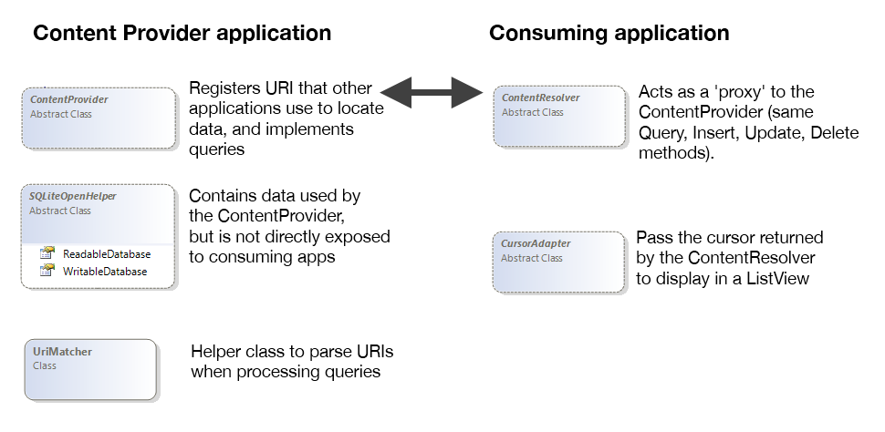

# How Content Providers Work

There are two classes involved in a `ContentProvider` interaction:

- **ContentProvider** &ndash; Implements an API that exposes a set of data
  in a standard way. The main methods are Query, Insert, Update and
  Delete.

- **ContentResolver** &ndash; A static proxy that communicates with a
  `ContentProvider` to access its data, either from within the same
  application or from another application.

A content provider is normally backed by an SQLite database, but the
API means that consuming code does not need to know anything about the
underlying SQL. Queries are done via a Uri using constants to reference
column names (to reduce dependencies on the underlying data structure),
and an `ICursor` is returned for the consuming code to iterate over.

## Consuming a ContentProvider

`ContentProviders` expose their functionality through a Uri that is
registered in the **AndroidManifest.xml** of the application that
publishes the data. There is a convention where the Uri and the data
columns that are exposed should be available as constants to make it
easy to bind to the data. Android's built-in `ContentProviders` all
provide convenience classes with constants that reference the data
structure in the
[`Android.Providers`](https://developer.xamarin.com/api/namespace/Android.Provider/) namespace.

### Built-In Providers

Android offers access to a wide range of system and user data using `ContentProviders`:

- *Browser* &ndash; bookmarks and browser history (requires permission
  `READ_HISTORY_BOOKMARKS` and/or `WRITE_HISTORY_BOOKMARKS`).

- *CallLog* &ndash; recent calls made or received with the device.

- *Contacts* &ndash; detailed information from the user's contact list,
  including people, phones, photos & groups.

- *MediaStore* &ndash; contents of the user's device: audio (albums,
  artists, genres, playlists), images (including thumbnails) & video.

- *Settings* &ndash; system-wide device settings and preferences.

- *UserDictionary* &ndash; contents of the user-defined dictionary used for
  predictive text input.

- *Voicemail* &ndash; history of voicemail messages.

## Classes Overview

The primary classes used when working with a `ContentProvider` are
shown here:

In this diagram, the `ContentProvider` implements queries and registers
URI's that other applications use to locate data. The `ContentResolver`
acts as a 'proxy' to the `ContentProvider` (Query, Insert, Update, and
Delete methods). The `SQLiteOpenHelper` contains data used by the
`ContentProvider`, but it is not directly exposed to consuming apps.
The `CursorAdapter` passes the cursor returned by the `ContentResolver`
to display in a `ListView`. The `UriMatcher` is a helper class that
parses URIs when processing queries.

The purpose of each class is described below:

- **ContentProvider** &ndash; Implement this abstract class's methods to
  expose data. The API is made available to other classes and
  applications via the Uri attribute that is added to the class
  definition.

- **SQLiteOpenHelper** &ndash; Helps implement the SQLite datastore that is
  exposed by the `ContentProvider`.

- **UriMatcher** &ndash; Use `UriMatcher` in your `ContentProvider`
  implementation to help manage Uris that are used to query the
  content.

- **ContentResolver** &ndash; Consuming code uses a `ContentResolver` to
  access a `ContentProvider` instance. The two classes together take
  care of the inter-process communication issues, allowing data to be
  easily shared between applications. Consuming code never creates a
  `ContentProvider` class explicity; instead, the data is accessed by
  creating a cursor based on a Uri exposed by the `ContentProvider`
  application.

- **CursorAdapter** &ndash; Use `CursorAdapter` or `SimpleCursorAdapter` to
  display data accessed via a `ContentProvider`.

The `ContentProvider` API allows consumers to perform a variety of
operations on the data, such as:

-  Query data to return lists or individual records.
-  Modify individual records.
-  Add new records.
-  Delete records.

This document contains an example that uses a system-provided
`ContentProvider`, as well as a simple read-only example that
implements a custom `ContentProvider`.

