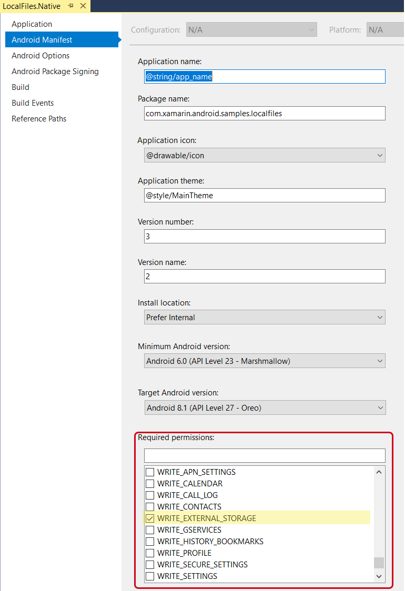
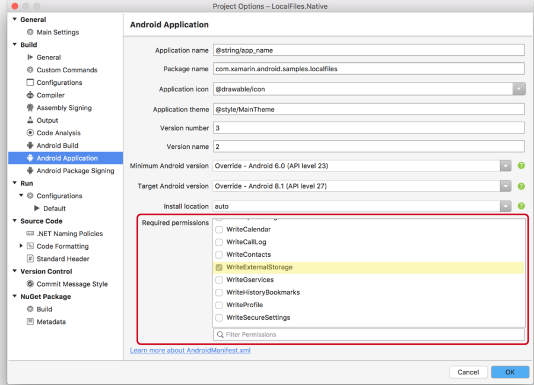
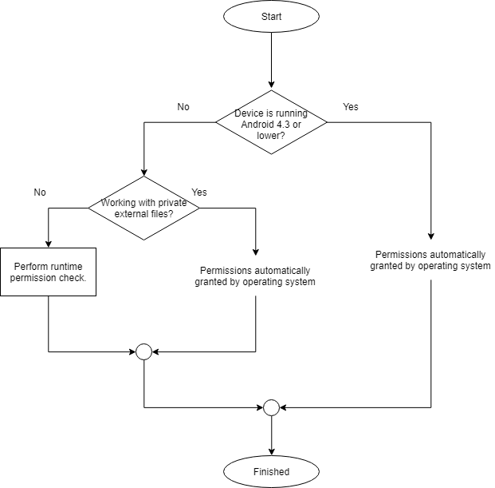

# External storage

External storage refers to file storage that is not on internal storage and not exclusively accessible to the app that is responsible for the file. The primary purpose of external storage is to provide a place to put files that are meant to be shared between apps or that are too large to fit on the internal storage.

Historically speaking, external storage referred to a disk partition on removable media such as an SD card (was also known as _portable storage_). This distinction is no longer as relevant as Android devices have evolved and many Android devices no longer support removable storage. Instead some devices will allocate some of their internal non-volatile memory which Android to perform the same function removable media. This is known as _emulated_ storage and is still considered to be external storage. Alternately, some Android devices may have multiple external storage partitions. For example, an Android tablet (in addition to its internal storage) might have emulated storage and one or more slots for an SD card. All of these partitions are treated by Android as external storage.

On devices that have multiple users, each user will have a dedicated directory on the primary external storage partition for their external storage. Apps running as one user will not have access to files from another user on the device. The files for all users are still world-readable and world-writeable; however, Android will sandbox each user profile fromthe others.

Reading and writing to files is almost identical in Xamarin.Android as it is to any other .NET application. The Xamarin.Android app determines the path to the file that will be manipulated, then uses standard .NET idioms for file access. Because the actual paths to internal and external storage may vary from device to device or from Android version to Android version, it is not recommended to hard code the path to the files. Instead, Xamarin.Android exposes the native Android APIs that will help with determining the path to files on internal and external storage.

This guide will discuss the concepts and APIs in Android that are specific to external storage.

## Public and private files on external storage

There are two different types of files that an app may keep on external storage:

* **Private** files &ndash; Private files are files that are specific to your application (but are still world-readable and world-writable). Android expects that private files are stored in a specific directory on external storage. Even though the files are called "private", they are still visible and accessible by other apps on the device, they are not afforded any special protection by Android.

* **Public** files &ndash; These are files that are not considered to be specific to the application and are meant to be freely shared.

The differences between these files is primarily conceptual. Private files are private in the sense that they are considered to be a part of the application, while public files are any other files that exist on external storage. Android provides two different APIs for resolving the paths to private and public files, but otherwise the same .NET APIs are used to read and write to these files. These are the same APIs that are discussed in the section on [reading and writing](~/android/platform/files/index.md#reading-or-writing-to-files-on-internal-storage).

### Private external files

Private external files are considered to be specific to an application (similar to internal files) but are being kept on external storage for any number of reasons (such as being too large for internal storage). Similar to internal files, these files will be deleted when the app is uninstalled by the user.

The primary location for private external files is found by calling the method `Android.Content.Context.GetExternalFilesDir(string type)`. This method will return a `Java.IO.File` object that represents the private external storage directory for the app. Passing `null` to this method will return the path to the user's storage directory for the application. As an example, for an application with the package name `com.companyname.app`, the "root" directory of the private external files would be:

```bash
/storage/emulated/0/Android/data/com.companyname.app/files/
```

This document will refer to the storage directory for private files on external storage as _PRIVATE\_EXTERNAL\_STORAGE_.

The parameter for `GetExternalFilesDir()` is a string that specifies an _application directory_. This is a directory intended to provide a standard location for a logical organization of files. The string values are available through constants on the `Android.OS.Environment` class:

| Android.OS.Environment | Directory |
|-|-|
| DirectoryAlarms | **_PRIVATE\_EXTERNAL\_STORAGE_/Alarms** |
| DirectoryDcim | **_PRIVATE\_EXTERNAL\_STORAGE_/DCIM** |
| DirectoryDownloads | **_PRIVATE\_EXTERNAL\_STORAGE_/Download** |
| DirectoryDocuments | **_PRIVATE\_EXTERNAL\_STORAGE_/Documents** |
| DirectoryMovies | **_PRIVATE\_EXTERNAL\_STORAGE_/Movies** |
| DirectoryMusic | **_PRIVATE\_EXTERNAL\_STORAGE_/Music** |
| DirectoryNotifications | **_PRIVATE\_EXTERNAL\_STORAGE_/Notifications** |
| DirectoryPodcasts | **_PRIVATE\_EXTERNAL\_STORAGE_/Podcasts** |
| DirectoryRingtones | **_PRIVATE\_EXTERNAL\_STORAGE_/Ringtones** |
| DirectoryPictures | **_PRIVATE\_EXTERNAL\_STORAGE_/Pictures** |

For devices that have multiple external storage partitions, each partition will have a directory that is intended for private files. The method `Android.Content.Context.GetExternalFilesDirs(string type)` will return an array of `Java.IO.Files`. Each object will represent a private application-specific directory on all shared/external storage devices where the application can place the files it owns.

> [!IMPORTANT]
> The exact path to the private external storage directory can vary from device to device and between versions of Android. Because of this, apps must not hard code the path to this directory, and instead use the Xamarin.Android APIs, such as `Android.Content.Context.GetExternalFilesDir()`.

### Public external files

Public files are files that exist on external storage that are not stored in the directory that Android allocates for private files. Public files will not be deleted when the app is uninstalled. Android apps must be granted permission before they can read or write any public files. It is possible for public files to exist anywhere on external storage, but by convention Android expects public files to exist in the directory identified by the property `Android.OS.Environment.ExternalStorageDirectory`. This property will return a `Java.IO.File` object that represents the primary external storage directory. As an example, `Android.OS.Environment.ExternalStorageDirectory` may refer to the following directory:

```bash
/storage/emulated/0/
```

This document will refer to the storage directory for public files on external storage as _PUBLIC\_EXTERNAL\_STORAGE_.

Android also supports the concept of application directories on _PUBLIC\_EXTERNAL\_STORAGE_. These directories are exactly the same as the application directories for `PRIVATE_EXTERNAL_STORAGE` and are described in the table in the previous section. The method `Android.OS.Environment.GetExternalStoragePublicDirectory(string directoryType)` will return a `Java.IO.File` object that correspond to a public application directory. The `directoryType` parameter is a mandatory parameter and cannot be `null`.

For example, calling `Environment.GetExternalStoragePublicDirectory(Environment.DirectoryDocuments).AbsolutePath` will return a string which will resemble:

```bash
/storage/emulated/0/Documents
```

> [!IMPORTANT]
> The exact path to the public external storage directory can vary from device to device and between versions of Android. Because of this, apps must not hard code the path to this directory, and instead use the Xamarin.Android APIs, such as `Android.OS.Environment.ExternalStorageDirectory`.

## Working with external storage

Once a Xamarin.Android app has obtained the full path to a file, it should utilize any of the standard .NET APIs for creating, reading, writing, or deleting files. This maximizes the amount of cross platform compatible code for an app. However, before attempting to access a file a Xamarin.Android app must ensure that is it possible to access that file.

1. **Verify external storage** &ndash; Depending on the nature of the external storage, it is possible that it might not be mounted and usable by the app. All apps should check the state of the external storage before attempting to use it.
2. **Perform a runtime permission check** &ndash; An Android app must request permission from the user in order to access external storage. This means that a run time permission request should be performed prior to any file access. The guide  [Permissions In Xamarin.Android](~/android/app-fundamentals/permissions.md) contains more details on Android permissions.

Each of these two tasks will be discussed below.

### Verifying that external storage is available

The first step before writing to external storage is to check that it is readable or writeable. The `Android.OS.Environment.ExternalStorageState` property holds a string that identifies the state of the external storage. This property will return a string that represents the state. This table is a list of the `ExternalStorageState` values that might be returned by `Environment.ExternalStorageState`:

| ExternalStorageState | Description  |
|----------------------|---|
| MediaBadRemoval      | The media was abruptly removed without being properly unmounted. |
| MediaChecking        | The media is present but undergoing a disk check.  |
| MediaEjecting        | Media is in the process of being unmounted and ejected.  |
| MediaMounted         | Media is mounted and can be read or written to.  |
| MediaMountedReadOnly | Media is mounted but can only be read from. |
| MediaNofs            | Media is present but does not contain a filesystem suitable for Android. |
| MediaRemoved         | There is no media present. |
| MediaShared          | Media is present, but is not mounted. It is being shared via USB with another device.|
| MediaUnknown         | The state of the media is unrecognized by Android. |
| MediaUnmountable     | The media is present but cannot be mounted by Android. |
| MediaUnmounted       | The media is present but is not mounted. |

Most Android apps will only need to check if external storage is mounted. The following code snippet shows how to verify that external storage is mounted for read-only access or read-write access:

```csharp
bool isReadonly = Environment.MediaMountedReadOnly.Equals(Environment.ExternalStorageState);
bool isWriteable = Environment.MediaMounted.Equals(Environment.ExternalStorageState);
```

## External storage permissions

Android considers accessing external storage to be a _dangerous permission_, which typically requires the user to grant their permission to access the resource. The user may revoke this permission at any time.  This means that a run time permission request should be performed prior to any file access. Apps are automatically granted permissions to read and write their own private files. It is possible for apps to read and write the private files that belong to other apps after being [granted permission](~/android/app-fundamentals/permissions.md) by the user.

All Android apps must declare one of the two permissions for external storage in the **AndroidManifest.xml** . To identify the permissions, one of the following two `uses-permission` elements must be add to **AndroidManifest.xml**:

```xml
<uses-permission android:name="android.permission.READ_EXTERNAL_STORAGE" />
<uses-permission android:name="android.permission.WRITE_EXTERNAL_STORAGE" />
```

> [!NOTE]
> If the user grants `WRITE_EXTERNAL_STORAGE`, then `READ_EXTERNAL_STORAGE` is also implicitly granted. It is not necessary to request both permissions in **AndroidManifest.xml**.

# [Visual Studio](#tab/windows)

The permissions may also be added using the **Android Manifest** tab of the **solution properties**:



# [Visual Studio for Mac](#tab/macos)

The permissions may also be added using the **Android Manifest** tab of the **solution properties pad**:

[](./images/required-permissions.m752.png#lightbox)

-----

Generally speaking, all dangerous permissions must be approved by the user. The permissions for external storage are an anomaly in that there are exceptions to this rule, depending on the version of Android that the app is running:



For more information on performing runtime permission requests, please consult the guide [Permissions In Xamarin.Android](~/android/app-fundamentals/permissions.md). The **monodroid-sample** [LocalFiles](https://github.com/xamarin/monodroid-samples/tree/master/LocalFiles) also demonstrates one way of performing runtime permission checks.

#### Granting and revoking permissions with ADB

In the course of developing an Android app, it may be necessary to grant and revoke permissions to test the various work flows involved with runtime permission checks. It is possible to do this at the command prompt using ADB. The following command line snippets demonstrate how  to grant or revoke permissions using ADB for an Android app whose package name is  **com.companyname.app**:

```bash
$ adb shell pm grant com.companyname.app android.permission.WRITE_EXTERNAL_STORAGE

$ adb shell pm revoke com.companyname.app android.permission.WRITE_EXTERNAL_STORAGE
```

## Deleting files

Any of the standard C# APIs can be used to delete a file from external storage, such as [`System.IO.File.Delete`](xref:System.IO.File.Delete*). It is also possible to use the Java APIs at the expense of code portability. For example:

```csharp
System.IO.File.Delete("/storage/emulated/0/Android/data/com.companyname.app/files/count.txt");
```

## Related Links

* [Xamarin.Android Local Files sample on **monodroid-samples**](https://github.com/xamarin/monodroid-samples/tree/master/LocalFiles)
* [Permissions In Xamarin.Android](~/android/app-fundamentals/permissions.md)
