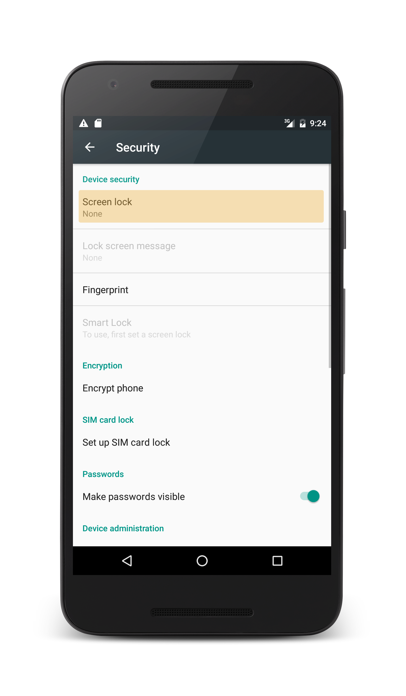
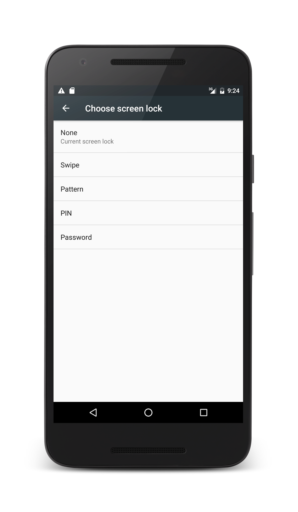
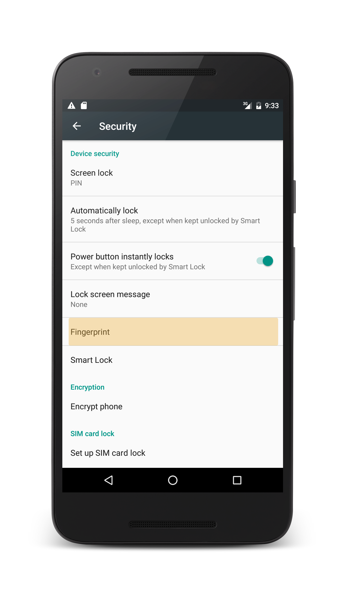
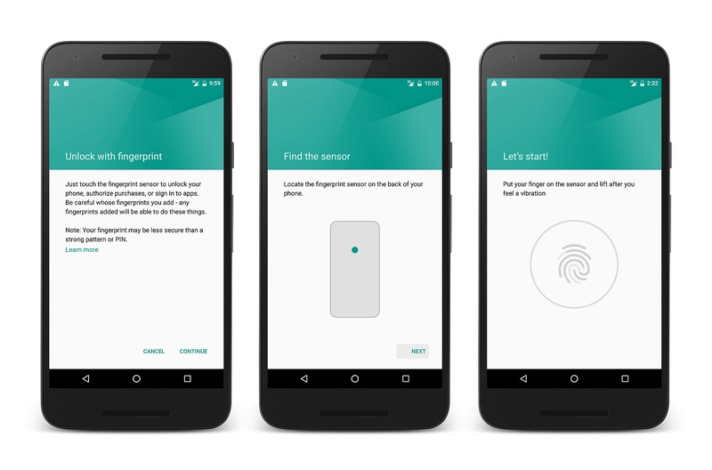
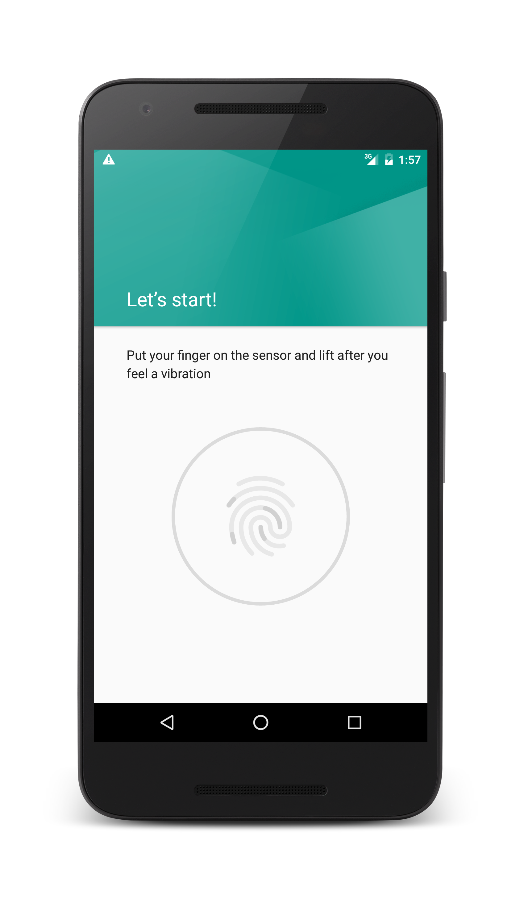
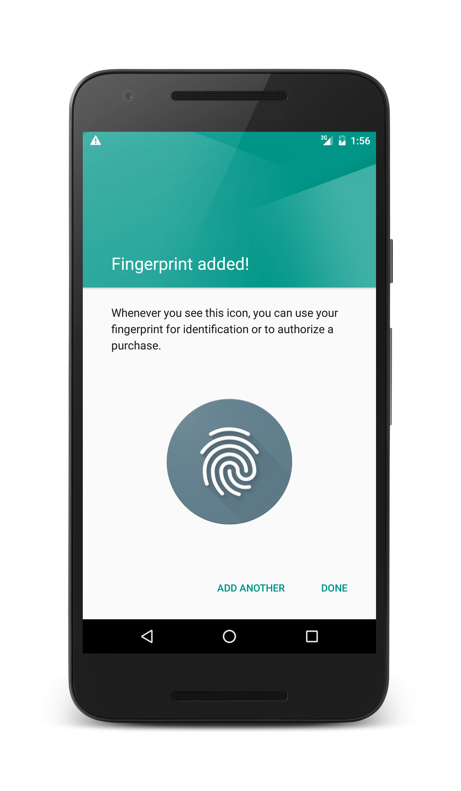

# Enrolling a Fingerprint

## Enrolling a Fingerprint Overview

It is only possible for an Android application to leverage fingerprint authentication if the device has already been configured with fingerprint authentication. This guide will discuss how to enroll a fingerprint on an Android device or Emulator. Emulators do not have the actual hardware to perform a fingerprint scan, but it is possible to simulate a fingerprint scan with the help of the Android Debug Bridge (described below).  This guide will discuss how to enable screen lock on an Android device and enroll a fingerprint for authentication.

## Requirements

To enroll a fingerprint, you must have an Android device or an emulator running API level 23 (Android 6.0).

The use of the Android Debug Bridge (ADB) requires familiarity with the command prompt, and the **adb** executable must be in the PATH of your Bash, PowerShell, or Command Prompt environment.

## Configuring a Screen Lock and Enrolling a Fingerprint 

To setup a screen lock, perform the following steps:

1. Go to **Settings > Security**, and select **Screen lock**:

    

2. The next screen that appears will allow you select and configure one of the screen lock security methods: 

    

   Select and complete one of the available screen lock methods.

3. Once the screenlock is configured, return to the **Settings > Security** page and select **Fingerprint**:

    

4. From there, follow the sequence to add a fingerprint to the device:

    [](enrolling-fingerprint-images/testing-04.png#lightbox)

5. In the final screen you are prompted to place your finger on the fingerprint scanner: 

    

    If you are using an Android device, complete the process by touching a finger to the scanner. 
    
    
### Simulating a Fingerprint Scan on the Emulator

On an Android emulator, it is possible to simulate a fingerprint scan
by using the Android Debug Bridge. On OS X start a Terminal session
while on Windows start a command prompt or a Powershell session and run
`adb`:

```shell
$ adb -e emu finger touch 1
```

The value of **1** is the _finger\_id_ for the finger that was
"scanned". It is a unique integer that you assign for each virtual
fingerprint. In the future when the app is running you can run this
same ADB command each time the emulator prompts you for a fingerprint,
you can run the `adb` command and pass it the _finger\_id_ to simulate
the fingerprint scan.

After the fingerprint scan is complete, Android will notify you that the fingerprint has been added:  



## Summary 

This guide covered how to setup a screen lock and enroll a fingerprint on an Android device or in an Android emulator. 

