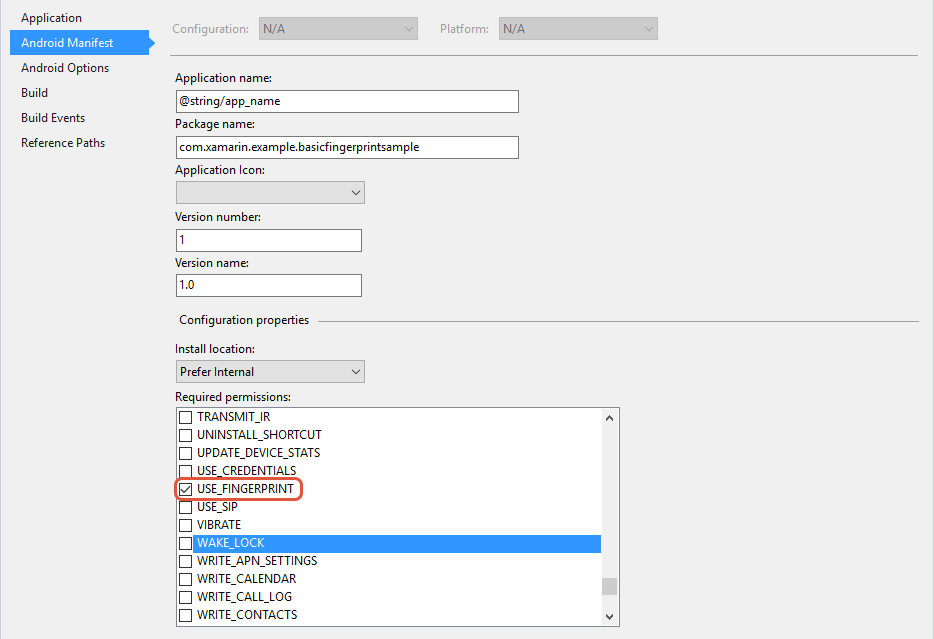
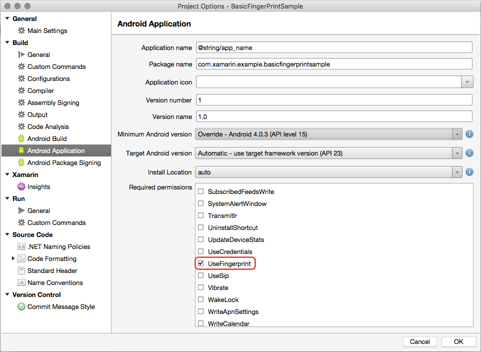

# Getting Started with Fingerprint Authentication

To get started, let's first cover how to configure a Xamarin.Android project so that the application is able to use fingerprint authentication:

1. Update **AndroidManifest.xml** to declare the permissions that the Fingerprint APIs require.
2. Obtain a reference to the `FingerprintManager`.
3. Check that the device is capable of fingerprint scanning.

## Requesting Permissions in the Application Manifest

# [Visual Studio](#tab/windows)

An Android application must request the `USE_FINGERPRINT` permission in the manifest. The following screenshot shows how to add this permission to the application in Visual Studio:

[](get-started-images/fingerprint-01-vs.png#lightbox) 

# [Visual Studio for Mac](#tab/macos)

An Android application must request the `USE_FINGERPRINT` permission in the manifest. The following screenshot shows how to add this permission to the application in Visual Studio for Mac:

[](get-started-images/fingerprint-01-xs.png#lightbox) 

-----

## Getting an Instance of the FingerprintManager

Next, the application must get an instance of the `FingerprintManager` or the `FingerprintManagerCompat` class. To be compatible with older versions of Android, an Android application should use the compatibility API's found in the Android Support v4 NuGet package. The following snippet demonstrates how to get the appropriate object from the operating system: 

```csharp
// Using the Android Support Library v4
FingerprintManagerCompat fingerprintManager = FingerprintManagerCompat.From(context);

// Using API level 23:
FingerprintManager fingerprintManager = context.GetSystemService(Context.FingerprintService) as FingerprintManager;
```  

In the previous snippet, the `context` is any Android `Android.Content.Context`. Typically this is the Activity which is performing the authentication.

## Checking for Eligibility

An application must perform several checks to ensure that it is possible to use fingerprint authentication. In total, there are five conditions that the application uses to check for eligibility:  

**API level 23** &ndash; The Fingerprint APIs require API level 23
or higher. The `FingerprintManagerCompat` class will wrap the API
level check for you. For this reason it is recommend to use the
**Android Support Library v4** and `FingerprintManagerCompat`; this
will account for the one of these checks.

**Hardware** &ndash; When the application starts up for the first
time, it should check for the presence of a fingerprint scanner:

```csharp
FingerprintManagerCompat fingerprintManager = FingerprintManagerCompat.From(context);
if (!fingerprintManager.IsHardwareDetected)
{
    // Code omitted
}
```

**Device Is Secured** &ndash; The user must have the device secured
with a screen lock. If the user has not secured the device with a
screen lock and security is important to the application, then the
user should be notified that a screen lock must be configured. The
following code snippet shows how to check this pre-requiste:

```csharp
KeyguardManager keyguardManager = (KeyguardManager) GetSystemService(KeyguardService);
if (!keyguardManager.IsKeyguardSecure)
{
}
```

**Enrolled Fingerprints** &ndash; The user must have at least one
fingerprint registered with the operating system. This permission
check should occur prior to each authentication attempt:

```csharp
FingerprintManagerCompat fingerprintManager = FingerprintManagerCompat.From(context);
if (!fingerprintManager.HasEnrolledFingerprints)
{
    // Can't use fingerprint authentication - notify the user that they need to
    // enroll at least one fingerprint with the device.
}
```

**Permissions** &ndash; The application must request permission
from the user before using the application. For Android 5.0 and
lower, the user grants the permission as a condition of installing
the app. Android 6.0 introduced a new permission model that checks
permissions at run-time. This code snippet is an example of how to
check for permissions on Android 6.0:

```csharp
// The context is typically a reference to the current activity.
Android.Content.PM.Permission permissionResult = ContextCompat.CheckSelfPermission(context, Manifest.Permission.UseFingerprint);
if (permissionResult == Android.Content.PM.Permission.Granted)
{
    // Permission granted - go ahead and start the fingerprint scanner.
}
else
{
    // No permission. Go and ask for permissions and don't start the scanner. See
    // https://developer.android.com/training/permissions/requesting.html
}
```

Checking all of these conditions each time the application offers authentication options
will ensure the user gets the best user experience. Changes or upgrades to their device
or operating system might affect the availability of fingerprint authentication. If you
choose to cache the results of any of these checks, make sure to cater for upgrade scenarios.

For more information on how to request permissions in Android 6.0,
consult the Android guide
[Requesting Permissions at Run-Time](https://developer.android.com/training/permissions/requesting.html).

## Related Links

- [Context](xref:Android.Content.Context)
- [KeyguardManager](xref:Android.App.KeyguardManager)
- [ContextCompat](https://developer.android.com/reference/android/support/v4/content/ContextCompat)
- [FingerprintManager](https://developer.android.com/reference/android/hardware/fingerprint/FingerprintManager.html)
- [FingerprintManagerCompat](https://developer.android.com/reference/android/support/v4/hardware/fingerprint/FingerprintManagerCompat.html)
- [Requesting Permissions at Run-Time](https://developer.android.com/training/permissions/requesting.html)
