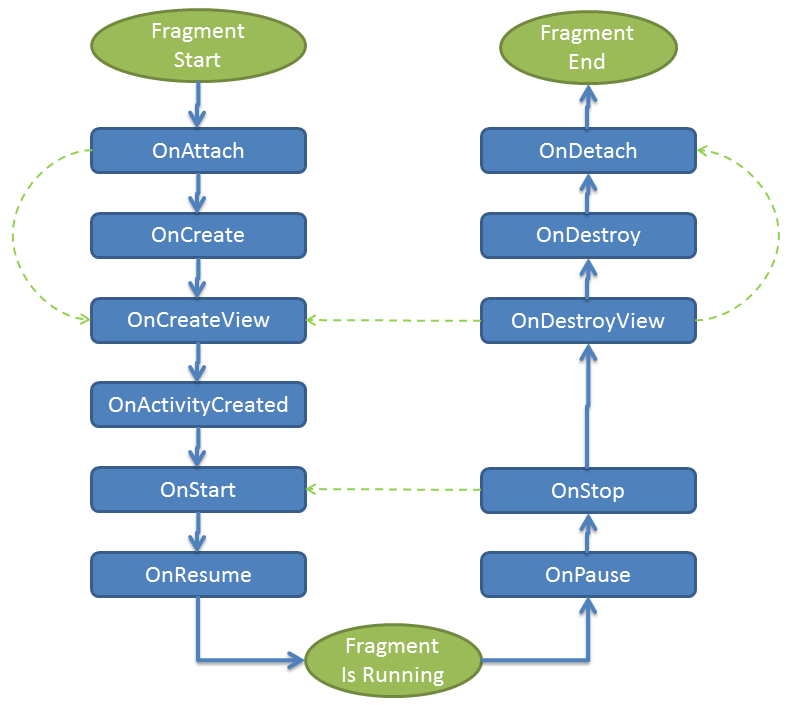

# Creating A Fragment

To create a Fragment, a class must inherit from `Android.App.Fragment`
and then override the `OnCreateView` method. `OnCreateView` will be
called by the hosting Activity when it is time to put the Fragment on
the screen, and will return a `View`. A typical `OnCreateView` will
create this `View` by inflating a layout file and then attaching it to
a parent container. The container's characteristics are important as
Android will apply the layout parameters of the parent to the UI of the
Fragment. The following example illustrates this:

```csharp
public override View OnCreateView(LayoutInflater inflater, ViewGroup container, Bundle savedInstanceState)
{
    return inflater.Inflate(Resource.Layout.Example_Fragment, container, false);
}
```

The code above will inflate the view
`Resource.Layout.Example_Fragment`, and add it as a child view to the
`ViewGroup` container.


> [!NOTE]
> Fragment sub-classes must have a public default no argument constructor.

## Adding a Fragment to an Activity

There are two ways that a Fragment may be hosted inside an Activity:

-   **Declaratively** &ndash; Fragments can be used declaratively
    within `.axml` layout files by using the `<Fragment>` tag.

-   **Programmatically** &ndash; Fragments can also be instantiated
    dynamically by using the `FragmentManager` class's API.

Programmatic usage via the `FragmentManager` class will be discussed
later in this guide.

### Using a Fragment Declaratively

Adding a Fragment inside the layout requires using the `<fragment>` tag
and then identifying the Fragment by providing either the `class`
attribute or the `android:name` attribute. The following snippet shows
how to use the `class` attribute to declare a `fragment`:

```xml
<?xml version="1.0" encoding="utf-8"?>
<fragment class="com.xamarin.sample.fragments.TitlesFragment"
            android:id="@+id/titles_fragment"
            android:layout_width="fill_parent"
            android:layout_height="fill_parent" />
```

This next snippet shows how to declare a `fragment` by using the
`android:name` attribute to identify the Fragment class :

```xml
<?xml version="1.0" encoding="utf-8"?>
<fragment android:name="com.xamarin.sample.fragments.TitlesFragment"
            android:id="@+id/titles_fragment"
            android:layout_width="fill_parent"
            android:layout_height="fill_parent" />
```

When the Activity is being created, Android will instantiate each
Fragment specified in the layout file and insert the view that is
created from `OnCreateView` in place of the `Fragment` element.
Fragments that are declaratively added to an Activity are static and
will remain on the Activity until it is destroyed; it is not possible
to dynamically replace or remove such a Fragment during the lifetime of
the Activity to which it is attached.

Each Fragment must be assigned a unique identifier:

-  **android:id** &ndash; As with other UI elements in a layout file, this is a unique ID.

-  **android:tag** &ndash; This attribute is a unique string.

If neither of the previous two methods is used, then the Fragment will
assume the ID of the container view. In the following example where
neither `android:id` nor `android:tag` is provided, Android will assign
the ID `fragment_container` to the Fragment:

```xml
<LinearLayout xmlns:android="http://schemas.android.com/apk/res/android"
                android:id="+@id/fragment_container"
                android:orientation="horizontal"
                android:layout_width="match_parent"
                android:layout_height="match_parent">

        <fragment class="com.example.android.apis.app.TitlesFragment"
                android:layout_width="match_parent"
                android:layout_height="match_parent" />
</LinearLayout>
```

### Package Name Case

Android does not allow for uppercase characters in package names; it
will throw an exception when trying to inflate the view if a package
name contains an uppercase character. However, Xamarin.Android is more
forgiving, and will tolerate uppercase characters in the namespace.

For example, both of the following snippets will work with
Xamarin.Android. However, the second snippet will cause an
`android.view.InflateException` to be thrown by a pure Java-based
Android application.

```xml
<fragment class="com.example.DetailsFragment" android:id="@+id/fragment_content" android:layout_width="match_parent" android:layout_height="match_parent" />
```

OR

```xml
<fragment class="Com.Example.DetailsFragment" android:id="@+id/fragment_content" android:layout_width="match_parent" android:layout_height="match_parent" />
```


## Fragment Lifecycle

Fragments have their own lifecycle that is somewhat independent of, but
still affected by, the
[lifecycle of the hosting Activity](~/android/app-fundamentals/activity-lifecycle/index.md).
For example, when an Activity pauses, all of its associated Fragments
are paused. The following diagram outlines the lifecycle of the
Fragment.

[](creating-a-fragment-images/fragment-lifecycle.png#lightbox)


### Fragment Creation Lifecycle Methods

The list below shows the flow of the various callbacks in the lifecycle
of a Fragment as it is being created:

-   **`OnInflate()`** &ndash; Called when the Fragment is being created
    as part of a view layout. This may be called immediately after the
    Fragment is created declaratively from an XML layout file. The
    Fragment is not associated with its Activity yet, but the
    **Activity**, **Bundle**, and **AttributeSet** from the view
    hierarchy are passed in as parameters. This method is best used for
    parsing the **AttributeSet** and for saving the attributes that
    might be used later by the Fragment.

-   **`OnAttach()`** &ndash; Called after the Fragment is associated
    with the Activity. This is the first method to be run when the
    Fragment is ready to be used. In general, Fragments should not
    implement a constructor or override the default constructor. Any
    components that are required for the Fragment should be initialized
    in this method.

-   **`OnCreate()`** &ndash; Called by the Activity to create the
    Fragment. When this method is called, the view hierarchy of the
    hosting Activity may not be completely instantiated, so the
    Fragment should not rely on any parts of the Activity's view
    hierarchy until later on in the Fragment's lifecycle. For example,
    do not use this method to perform any tweaks or adjustments to the
    UI of the application. This is the earliest time at which the
    Fragment may begin gathering the data that it needs. The Fragment
    is running in the UI thread at this point, so avoid any lengthy
    processing, or perform that processing on a background thread. This
    method may be skipped if **SetRetainInstance(true)** is called.
    This alternative will be described in more detail below.

-   **`OnCreateView()`** &ndash; Creates the view for the Fragment.
    This method is called once the Activity's **OnCreate()** method is
    complete. At this point, it is safe to interact with the view
    hierarchy of the Activity. This method should return the view that
    will be used by the Fragment.

-   **`OnActivityCreated()`** &ndash; Called after
    **Activity.OnCreate** has been completed by the hosting Activity.
    Final tweaks to the user interface should be performed at this
    time.

-   **`OnStart()`** &ndash; Called after the containing Activity has
    been resumed. This makes the Fragment visible to the user. In many
    cases, the Fragment will contain code that would otherwise be in
    the **OnStart()** method of an Activity.

-   **`OnResume()`** &ndash; This is the last method called before the
    user can interact with the Fragment. An example of the kind of code
    that should be performed in this method would be enabling features
    of a device that the user may interact with, such as the camera
    that the location services. Services such as these can cause
    excessive battery drain, though, and an application should minimize
    their use to preserve battery life.


### Fragment Destruction Lifecycle Methods

The next list explains the lifecycle methods that are called as a Fragment
is being destroyed:

-   **`OnPause()`** &ndash; The user is no longer able to interact with
    the Fragment. This situation exists because some other Fragment
    operation is modifying this Fragment, or the hosting Activity is
    paused. It is possible that the Activity hosting this Fragment
    might still be visible, that is, the Activity in focus is partially
    transparent or does not occupy the full screen. When this method
    becomes active, it's the first indication that the user is leaving
    the Fragment. The Fragment should save any changes.

-   **`OnStop()`** &ndash; The Fragment is no longer visible. The host
    Activity may be stopped, or a Fragment operation is modifying it in
    the Activity. This callback serves the same purpose as **Activity.OnStop**.

-   **`OnDestroyView()`** &ndash; This method is called to clean up
    resources associated with the view. This is called when the view
    associated with the Fragment has been destroyed.

-   **`OnDestroy()`** &ndash; This method is called when the Fragment
    is no longer in use. It is still associated with the Activity, but
    the Fragment is no longer functional. This method should release
    any resources that are in use by the Fragment, such as a
    [**SurfaceView**](https://developer.xamarin.com/api/type/Android.Views.SurfaceView/)
    that might be used for a camera. This method may be skipped if
    **SetRetainInstance(true)** is called. This
    alternative will be described in more detail below.

-   **`OnDetach()`** &ndash; This method is called just before the
    Fragment is no longer associated with the Activity. The view
    hierarchy of the Fragment no longer exists, and all resources that
    are used by the Fragment should be released at this point.


### Using SetRetainInstance

It is possible for a Fragment to specify that it should not be
completely destroyed if the Activity is being re-created. The
`Fragment` class provides the method `SetRetainInstance` for this
purpose. If `true` is passed to this method, then when the Activity is
restarted, the same instance of the Fragment will be used. If this
happens, then all callback methods will be invoked except the
`OnCreate` and `OnDestroy` lifecycle callbacks. This process is
illustrated in the lifecycle diagram shown above (by the green dotted
lines).


## Fragment State Management

Fragments may save and restore their state during the Fragment
lifecycle by using an instance of a `Bundle`. The Bundle allows a
Fragment to save data as key/value pairs and is useful for simple data
that doesn't require much memory. A Fragment can save its state with
a call to `OnSaveInstanceState`:

```csharp
public override void OnSaveInstanceState(Bundle outState)
{
    base.OnSaveInstanceState(outState);
    outState.PutInt("current_choice", _currentCheckPosition);
}
```

When a new instance of a Fragment is created, the state saved in the
`Bundle` will become available to the new instance via the `OnCreate`,
`OnCreateView`, and `OnActivityCreated` methods of the new instance.
The following sample demonstrates how to retrieve the value
`current_choice` from the `Bundle`:

```csharp
public override void OnActivityCreated(Bundle savedInstanceState)
{
    base.OnActivityCreated(savedInstanceState);
    if (savedInstanceState != null)
    {
        _currentCheckPosition = savedInstanceState.GetInt("current_choice", 0);
    }
}
```

Overriding `OnSaveInstanceState` is an appropriate mechanism for saving
transient data in a Fragment across orientation changes, such as the
`current_choice` value in the above example. However, the default
implementation of `OnSaveInstanceState` takes care of saving transient
data in the UI for every view that has an ID assigned. For example,
look at an application that has an `EditText` element defined in XML as
follows:

```xml
<EditText android:id="@+id/myText"
        android:layout_width="fill_parent"
        android:layout_height="wrap_content"/>
```

Since the `EditText` control has an `id` assigned, the Fragment
automatically saves the data in the widget when `OnSaveInstanceState`
is called.


### Bundle Limitations

Although using `OnSaveInstanceState` makes it easy to save transient
data, use of this method has some limitations:

-  If the Fragment is not added to the back stack, then its state will
   not be restored when the user presses the **Back** button.

-  When the Bundle is used to save data, that data is serialized. This
   can lead to processing delays.


## Contributing to the Menu

Fragments may contribute items to the menu of their hosting Activity.
An Activity handles menu items first. If the Activity does not have a
handler, then the event will be passed on to the Fragment, which will
then handle it.

To add items to the Activity's menu, a Fragment must do two things.
First, the Fragment must implement the method `OnCreateOptionsMenu` and
place its items into the menu, as shown in the following code:

```csharp
public override void OnCreateOptionsMenu(IMenu menu, MenuInflater menuInflater)
{
    menuInflater.Inflate(Resource.Menu.menu_fragment_vehicle_list, menu);
    base.OnCreateOptionsMenu(menu, menuInflater);
}
```

The menu in the previous code snippet is inflated from the following
XML, located in the file `menu_fragment_vehicle_list.xml`:

```xml
<?xml version="1.0" encoding="utf-8"?>
<menu xmlns:android="http://schemas.android.com/apk/res/android">
  <item android:id="@+id/add_vehicle"
        android:icon="@drawable/ic_menu_add_data"
        android:title="@string/add_vehicle" />
</menu>
```

Next, the Fragment must call `SetHasOptionsMenu(true)`. The call to
this method announces to Android that the Fragment has menu items to
contribute to the option menu. Unless the call to this method is made,
the menu items for the Fragment will not be added to the Activity's
option menu. This is typically done in the lifecycle method
`OnCreate()`, as shown in the next code snippet:

```csharp
public override void OnCreate(Bundle savedState)
{
    base.OnCreate(savedState);
    SetHasOptionsMenu(true);
}
```

The following screen shows how this menu would look:

[](creating-a-fragment-images/fragment-menu-example.png#lightbox)
