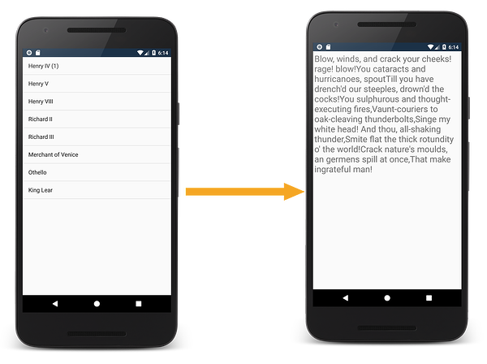
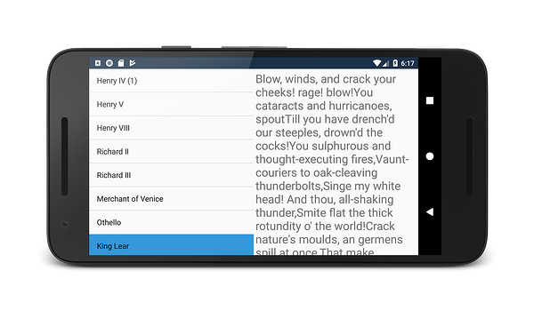
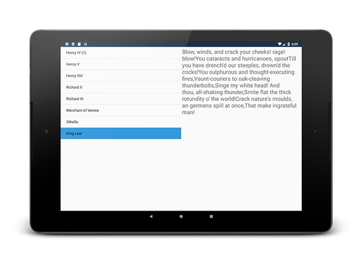

# Implementing fragments - walkthrough

_Fragments are self-contained, modular components that can help address the complexity of Android apps that target devices with a variety of screen sizes. This article walks through how to create and use fragments when developing Xamarin.Android applications._

## Overview

In this section, you'll walk through how to create and use fragments in a Xamarin.Android application. This application will display the titles of several plays by William Shakespeare in a list. When the user taps on the title of a play, then the app will display a quote from that play in a separate activity:

When the phone is rotated to landscape mode, the appearance of the app will change: both the list of plays and quotes will appear in the same activity. When a play is selected, the quote will be display in the same activity:

Finally, if the app is running on a tablet:

This sample application can easily adapt to the different form factors and orientations with minimal code changes by using fragments and [Alternate Layouts](../../../app-fundamentals/resources-in-android/alternate-resources.md).

The data for the application will exist in two string arrays that are hardcoded in the app as C# string arrays. Each of the arrays will serve as the data source for one fragment.  One array will hold the name of some plays by Shakespeare, and the other array will hold a quote from that play. When the app starts up, it will display the play names in a `ListFragment`. When the user clicks on a play in the `ListFragment`, the app will start up another activity which will display the quote.

The user interface for the app will consist of two layouts, one for portrait and one for landscape mode. At run time, Android will determine what layout to load based on the orientation of the device and will provide that layout to the Activity to render. All of the logic for responding to user clicks and displaying the data will be contained in fragments. The Activities in the app exist only as containers that will host the fragments.

This walkthrough will be broken down into two guides. The [first part](./walkthrough.md) will focus on the core parts of the application. A single set of layouts (optimized for portrait mode) will be created, along with two fragments and two Activities:

1. `MainActivity` &nbsp; This is the startup Activity for the app.
1. `TitlesFragment` &nbsp; This fragment will display a list of titles of plays that were written by William Shakespeare. It will be hosted by `MainActivity`.
1. `PlayQuoteActivity` &nbsp; `TitlesFragment` will start the `PlayQuoteActivity` in response to the user selecting a play in `TitlesFragment`.
1. `PlayQuoteFragment` &nbsp; This fragment will display a quote from a play by William Shakespeare. It will be hosted by `PlayQuoteActivity`.

The [second part of this walkthrough](./walkthrough-landscape.md) will discuss adding an alternate layout (optimized for landscape mode) which will display both fragments on the screen. Also, some minor code changes will be made to the code so that the app will adapt its behavior to the number of fragments that are concurrently displayed on the screen.

## Related Links

- [FragmentsWalkthrough (sample)](/samples/xamarin/monodroid-samples/fragmentswalkthrough)
- [Designer Overview](~/android/user-interface/android-designer/index.md)
- [Implementing Fragments](https://developer.android.com/guide/topics/fundamentals/fragments.html)
- [Support Package](https://developer.android.com/sdk/compatibility-library.html)