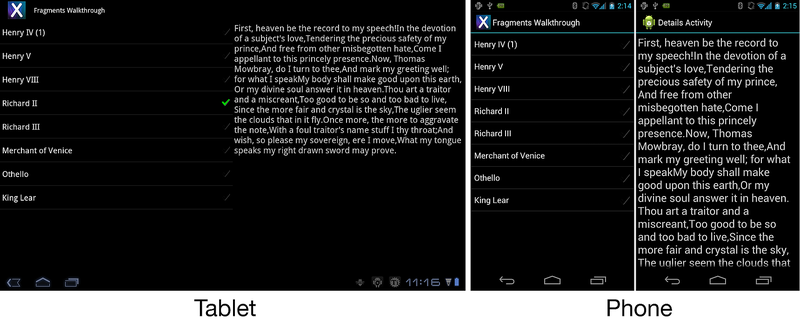

# Implementing With Fragments

_Android 3.0 introduced Fragments. Fragments are self-contained, modular components that are used to help address the complexity of writing applications that may run on screens of different sizes. This article walks through how to use fragments to develop Xamarin.Android applications, and how to support fragments on pre-Android 3.0 devices._

<a name="Overview" />

## Overview

In this section, we'll walk through how to create an application that will
display a list of Shakespeare's plays and a quote from each selected play. Our
app will utilize fragments so that we can define our UI components in one place,
but then use them on different form factors. For example, the following screen
shots show the application running on a 10" tablet, as well as on a phone:

This section will cover the following topics:

- **Creating Fragments** &ndash; shows how to create a fragment to
display a list of Shakespeare's plays, and another fragment to display a quote
from each play.

- **Supporting different screen sizes** &ndash; shows how to layout
the application to take advantage of larger screen sizes.

- **Using the Android Support Package** &ndash; implements the Android
Support Package, then makes some minor changes to the Activities in the
application, allowing it to run on older versions of Android.

<a name="Requirements" />

## Requirements

This walkthrough requires Xamarin.Android 4.0 or higher. It will also be
necessary to install the Android Support Package, as outlined in the Fragments
documentation.

<a name="Introduction" />

## Introduction

In the example we’ll build in this section, the Activities do not
contain logic for loading the list, responding to user selection, or displaying
the quote for the selected play. This logic exists in the individual fragments.
By placing this logic in the fragments themselves, we can break up the workflow
of the application to support large screens with one Activity or small screens
with multiple Activities without having to write different logic for each
Activity. On a tablet, both fragments will be in one Activity. On a phone, the
fragments will be hosted in different Activities.

This application includes the following parts:

 **MainActivity** – displays one or both of the fragments,
depending on the size of the screen. This is the startup Activity.

 **TitlesFragment** – displays a list of Shakespeare’s plays
from which the user may select.

 **DetailsFragment** – displays the quote from the selected
play.

 **DetailsActivity** – hosts and displays the DetailsFragment.
This Activity is used by devices with small screens, such as phones.

## Related Links

- [FragmentsWalkthrough (sample)](https://developer.xamarin.com/samples/monodroid/FragmentsWalkthrough/)
- [Designer Overview](~/android/user-interface/android-designer/index.md)
- [Xamarin.Android samples: Honeycomb Gallery](https://developer.xamarin.com/samples/HoneycombGallery/)
- [Implementing Fragments](http://developer.android.com/guide/topics/fundamentals/fragments.html)
- [Support Package](http://developer.android.com/sdk/compatibility-library.html)
