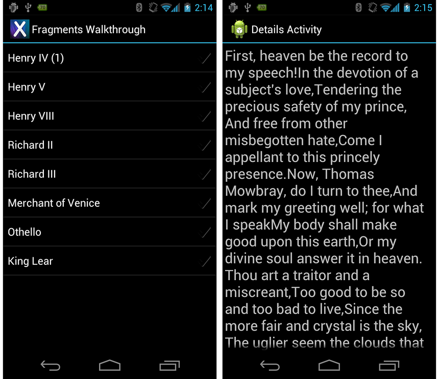
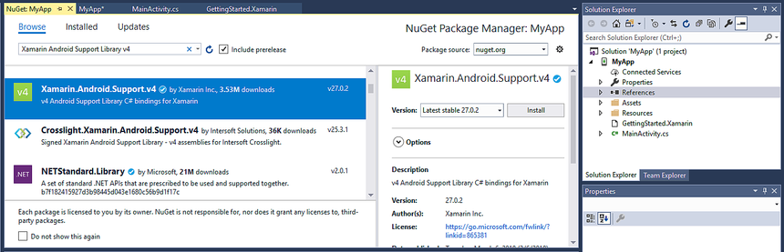
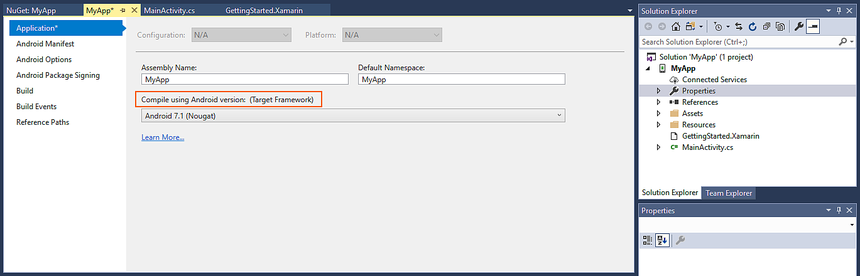
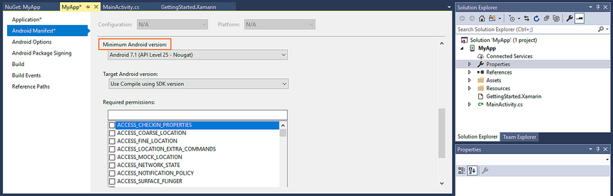

# Supporting pre-Honeycomb Android using Support Packages

The *Android Support Package* consists of libraries that back port some
of the new API's &ndash; such as fragments &ndash; to older versions of
Android. So by adding the Android Support Package, we can run our
application on Android 2.3 devices, as shown by the following screens:

[](supporting-pre-honeycomb-images/01.png#lightbox)

## Adding the Support Package

The Android Support Package is not automatically added to a
Xamarin.Android application. Xamarin provides the
[Android Support Library v4 NuGet package](https://www.nuget.org/packages/Xamarin.Android.Support.v4/) to
simplify adding the support libraries to a Xamarin.Android application.
To include the support packages into your Xamarin.Android application
include the
[Android Support Library v4](https://www.nuget.org/packages/Xamarin.Android.Support.v4/)
component into your Xamarin.Android project, as illustrated in the
following screenshot:

[](supporting-pre-honeycomb-images/02.png#lightbox)

Once the package has been added, change the target framework to Android 2.2 or higher:

[](supporting-pre-honeycomb-images/03.png#lightbox)

Also, ensure that the minimum Android version targets the same API level:

[](supporting-pre-honeycomb-images/04.png#lightbox)

### Change MainActivity to derive from FragmentActivity

Any Activity that uses fragments must inherit from
`Xamarin.Support.V4.App.FragmentActivity`. This class is a necessary
part of the Support Package because it allows fragments to be hosted by
activities, regardless of the version of Android. `MainActivity`
requires only one small change—it must now inherit from
`Android.Support.V4.App.FragmentActivity`:

```csharp
[Activity(Label = "Fragments Walkthrough", MainLauncher = true, Icon = "@drawable/launcher")]
public class MainActivity : Android.Support.V4.App.FragmentActivity
{
   protected override void OnCreate(Bundle bundle)
   {
       base.OnCreate(bundle);
       SetContentView(Resource.Layout.activity_main);
   }
}
```


### Change DetailsActivity to derive from FragmentActivity

`DetailsActivity` must also be changed from an `Activity` to a
`FragmentActivity`. As `FragmentManager` is not compatible with
pre-Honeycomb versions of Android, the Android Support Package includes
a wrapper class, `SupportFragmentManager`, that provides backward
compatibility. Each `FragmentActivity` has a `SupportFragmentManager`
property, and `DetailsActivity` is changed to use the
`SupportFragmentManager` instead of the `FragmentManager`:

```csharp
[Activity(Label = "Details Activity")]
public class DetailsActivity : Android.Support.V4.App.FragmentActivity
{
   protected override void OnCreate(Bundle bundle)
   {
       base.OnCreate(bundle);
       var index = Intent.Extras.GetInt("index", 0);
       var details = DetailsFragment.NewInstance(index);
       var fragmentTransaction = SupportFragmentManager.BeginTransaction(); // Notice the change from FragmentManager to SupportFragmentManager
       fragmentTransaction.Add(Android.Resource.Id.Content, details);
       fragmentTransaction.Commit();
   }
}
```

After we complete these changes, we now have an application that can
run on Android 1.6 and higher, and that uses fragments to adjust our UI
to the size of our target device.


## Related Links

- [Android Support Library v4](https://www.nuget.org/packages/Xamarin.Android.Support.v4)
