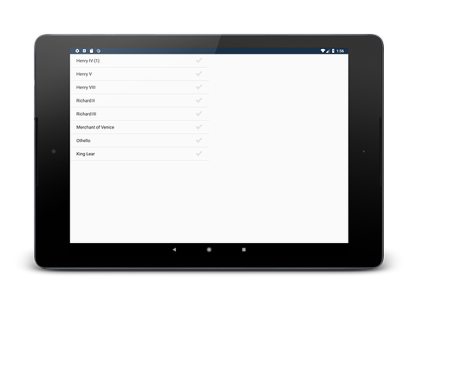
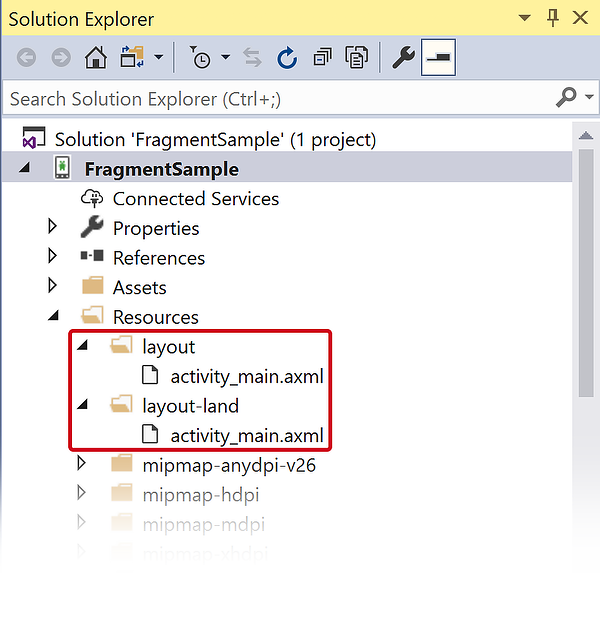
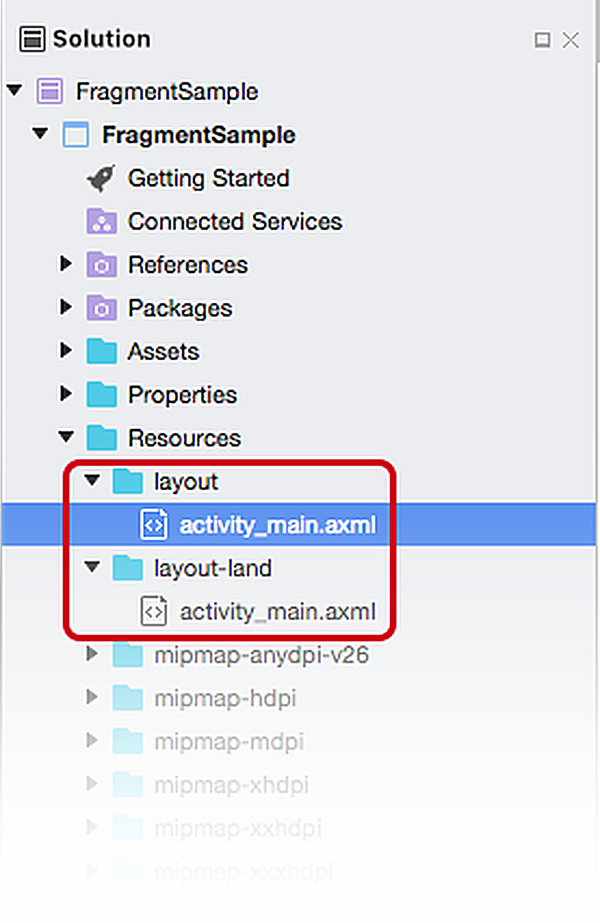

# Fragments walkthrough &ndash; landscape

The [Fragments Walkthrough &ndash; Part 1](./walkthrough.md) demonstrated how to create and use fragments in an Android app that targets the smaller screens on a phone. The next step in this walkthrough is to modify the application to take advantage of the extra horizontal space on tablet &ndash;  there will be one activity that will always be the list of plays (the `TitlesFragment`) and  `PlayQuoteFragment` will be dynamically added to the Activity in response to a selection made by the user:

[](./walkthrough-landscape-images/01-tablet-screenshot.png#lightbox)

Phones that are running in landscape mode will also benefit from this enhancement:

[](./images/intro-screenshot-phone-land.png#lightbox)

## Updating the app to handle landscape orientation

The following modifications will build upon the work that was done in the [Fragments Walkthrough - Phone](./walkthrough.md)

1. Create an alternate layout to display both the `TitlesFragment` and `PlayQuoteFragment`.
1. Update `TitlesFragment` to detect if the device is displaying both fragments simultaneously and change behavior accordingly.
1. Update `PlayQuoteActivity` to close when the device is in landscape mode.

## 1. Create an alternate layout

When Main Activity is created on an Android device, Android will decide which layout to load based on the orientation of the device. By default, Android will provide the **Resources/layout/activity_main.axml** layout file. For devices that load in landscape mode Android will provide the **Resources/layout-land/activity_main.axml** layout file. The guide on [Android Resources](../../../app-fundamentals/resources-in-android/index.md) contains more details on how Android decides what resource files to load for an application.

Create an alternate layout that targets **Landscape** orientation by following the steps described in the [Alternate Layouts](../../../user-interface/android-designer/alternative-layout-views.md) guide. This should add a new layout resource file to the project, **Resources/layout/activity_main.axml**:

# [Visual Studio](#tab/windows)

[](./walkthrough-landscape-images/02-alternate-layout.w157.png#lightbox)

# [Visual Studio for Mac](#tab/macos)

[](./walkthrough-landscape-images/02-alternate-layout.m743.png#lightbox)

-----

After creating the alternate layout, edit the source of the file **Resources/layout-land/activity_main.axml** so that it matches this XML:

```xml
<?xml version="1.0" encoding="utf-8"?>
<LinearLayout xmlns:android="http://schemas.android.com/apk/res/android"
    xmlns:app="http://schemas.android.com/apk/res-auto"
    xmlns:tools="http://schemas.android.com/tools"
    android:id="@+id/two_fragments_layout"
    android:orientation="horizontal"
    android:layout_width="match_parent"
    android:layout_height="match_parent">

    <fragment android:name="FragmentSample.TitlesFragment"
        android:id="@+id/titles"
        android:layout_weight="1"
        android:layout_width="0px"
        android:layout_height="match_parent" />

    <FrameLayout android:id="@+id/playquote_container"
            android:layout_weight="1"
            android:layout_width="0px"
            android:layout_height="match_parent"
             />
</LinearLayout>
```

The root view of the activity is given the resource ID `two_fragments_layout` and has two sub-views, a `fragment` and a `FrameLayout`. While the `fragment` is statically loaded, the `FrameLayout` acts as a "placeholder" that will be replaced at run-time by the `PlayQuoteFragment`. Each time a new play is selected in the `TitlesFragment`, the `playquote_container` will be updated with a new instance of the `PlayQuoteFragment`.

Each of the sub-views will occupy the full height of their parent. The width of each subview is controlled by the `android:layout_weight` and `android:layout_width` attributes. In this example, each subview will occupy 50% of width provide by the parent. See [Google's document on the LinearLayout](https://developer.android.com/guide/topics/ui/layout/linear.html) for details about _Layout Weight_.

## 2. Changes to TitlesFragment

Once the alternate layout has been created, it is necessary to update `TitlesFragment`. When the app is displaying the two fragments on one activity, then `TitlesFragment` should load the `PlayQuoteFragment` in the parent Activity. Otherwise, `TitlesFragment` should launch the `PlayQuoteActivity` which host the `PlayQuoteFragment`. A boolean flag will help `TitlesFragment` determine which behavior it should use. This flag will be initialized in the `OnActivityCreated` method.

First, add an instance variable at the top of the `TitlesFragment` class:

```csharp
bool showingTwoFragments;
```

Then, add the following code snippet to  `OnActivityCreated` to initialize the variable: 

```csharp
var quoteContainer = Activity.FindViewById(Resource.Id.playquote_container);
showingTwoFragments = quoteContainer != null &&
                      quoteContainer.Visibility == ViewStates.Visible;
if (showingTwoFragments)
{
    ListView.ChoiceMode = ChoiceMode.Single;
    ShowPlayQuote(selectedPlayId);
}
```

If the device is running in landscape mode, then the `FrameLayout` with the resource ID `playquote_container` will be visible on the screen, so `showingTwoFragments` will be initialized to `true`. If the device is running in portrait mode, then `playquote_container` will not be on the screen, so `showingTwoFragments` will be `false`.

The `ShowPlayQuote` method will need to change how it displays a quote &ndash; either in a fragment or launch a new activity.  Update the `ShowPlayQuote` method to load a fragment when showing two fragments, otherwise it should launch an Activity:

```csharp
void ShowPlayQuote(int playId)
{
    selectedPlayId = playId;
    if (showingTwoFragments)
    {
        ListView.SetItemChecked(selectedPlayId, true);

        var playQuoteFragment = FragmentManager.FindFragmentById(Resource.Id.playquote_container) as PlayQuoteFragment;

        if (playQuoteFragment == null || playQuoteFragment.PlayId != playId)
        {
            var container = Activity.FindViewById(Resource.Id.playquote_container);
            var quoteFrag = PlayQuoteFragment.NewInstance(selectedPlayId);

            FragmentTransaction ft = FragmentManager.BeginTransaction();
            ft.Replace(Resource.Id.playquote_container, quoteFrag);
            ft.Commit();
        }
    }
    else
    {
        var intent = new Intent(Activity, typeof(PlayQuoteActivity));
        intent.PutExtra("current_play_id", playId);
        StartActivity(intent);
    }
}
```

If the user has selected a play that is different from the one that is currently being displayed in `PlayQuoteFragment`, then a new `PlayQuoteFragment` is created and will replace the contents of the `playquote_container` within the context of a `FragmentTransaction`.

### Complete code for TitlesFragment

After completing all the previous changes to `TitlesFragment`, the complete class should match this code:

```csharp
public class TitlesFragment : ListFragment
{
    int selectedPlayId;
    bool showingTwoFragments;

    public override void OnActivityCreated(Bundle savedInstanceState)
    {
        base.OnActivityCreated(savedInstanceState);
        ListAdapter = new ArrayAdapter<string>(Activity, Android.Resource.Layout.SimpleListItemActivated1, Shakespeare.Titles);

        if (savedInstanceState != null)
        {
            selectedPlayId = savedInstanceState.GetInt("current_play_id", 0);
        }

        var quoteContainer = Activity.FindViewById(Resource.Id.playquote_container);
        showingTwoFragments = quoteContainer != null &&
                                quoteContainer.Visibility == ViewStates.Visible;
        if (showingTwoFragments)
        {
            ListView.ChoiceMode = ChoiceMode.Single;
            ShowPlayQuote(selectedPlayId);
        }
    }

    public override void OnSaveInstanceState(Bundle outState)
    {
        base.OnSaveInstanceState(outState);
        outState.PutInt("current_play_id", selectedPlayId);
    }

    public override void OnListItemClick(ListView l, View v, int position, long id)
    {
        ShowPlayQuote(position);
    }

    void ShowPlayQuote(int playId)
    {
        selectedPlayId = playId;
        if (showingTwoFragments)
        {
            ListView.SetItemChecked(selectedPlayId, true);

            var playQuoteFragment = FragmentManager.FindFragmentById(Resource.Id.playquote_container) as PlayQuoteFragment;

            if (playQuoteFragment == null || playQuoteFragment.PlayId != playId)
            {
                var container = Activity.FindViewById(Resource.Id.playquote_container);
                var quoteFrag = PlayQuoteFragment.NewInstance(selectedPlayId);

                FragmentTransaction ft = FragmentManager.BeginTransaction();
                ft.Replace(Resource.Id.playquote_container, quoteFrag);
                ft.AddToBackStack(null);
                ft.SetTransition(FragmentTransit.FragmentFade);
                ft.Commit();
            }
        }
        else
        {
            var intent = new Intent(Activity, typeof(PlayQuoteActivity));
            intent.PutExtra("current_play_id", playId);
            StartActivity(intent);
        }
    }
}
```

## 3. Changes to PlayQuoteActivity

There is one final detail to take care of: `PlayQuoteActivity` is not necessary when the device is in landscape mode. If the device is in landscape mode the `PlayQuoteActivity` should not be visible. Update the `OnCreate` method of `PlayQuoteActivity` so that it will close itself. This code is the final version of `PlayQuoteActivity.OnCreate`:

```csharp
protected override void OnCreate(Bundle savedInstanceState)
{
    base.OnCreate(savedInstanceState);

    if (Resources.Configuration.Orientation == Android.Content.Res.Orientation.Landscape)
    {
        Finish();
    }

    var playId = Intent.Extras.GetInt("current_play_id", 0);
    var playQuoteFrag = PlayQuoteFragment.NewInstance(playId);
    FragmentManager.BeginTransaction()
                    .Add(Android.Resource.Id.Content, playQuoteFrag)
                    .Commit();
}
```

This modification adds a check for the device orientation. If it is in landscape mode, then `PlayQuoteActivity` will close itself.

## 4. Run the application

Once these changes are complete, run the app, rotate the device to landscape mode (if necessary), and then select a play. The quote should be displayed on the same screen as the list of plays:

[](./images/intro-screenshot-phone-land.png#lightbox)

[](./images/intro-screenshot-tablet.png#lightbox)