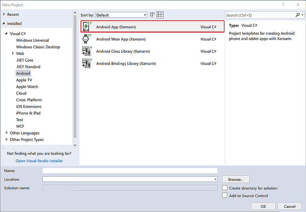
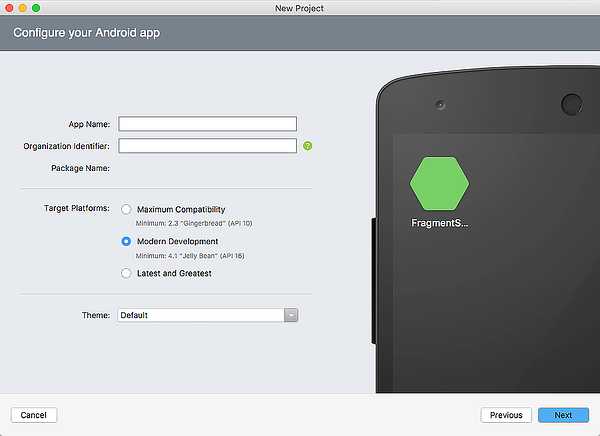
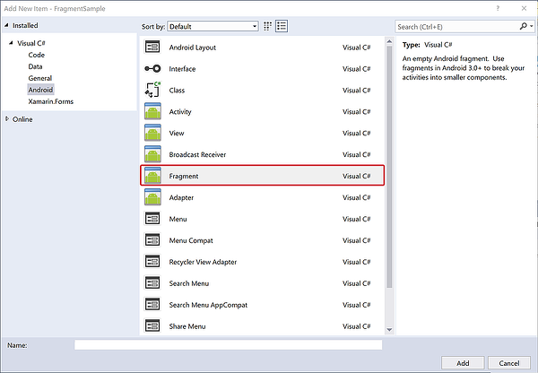
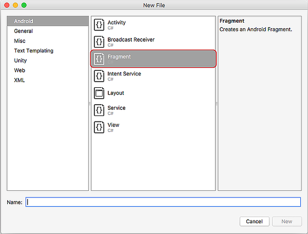
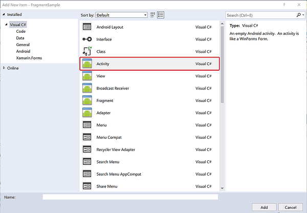
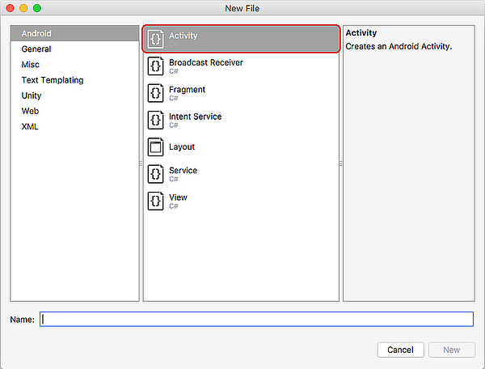
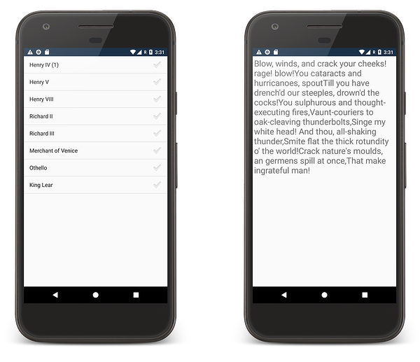

# Fragments walkthrough &ndash; phone

This is the first part of a walkthrough that will create a Xamarin.Android app that targets an Android device in portrait orientation. This walkthrough will discuss how to create fragments in Xamarin.Android and how to add them to a sample.

[](./images/intro-screenshot-phone.png#lightbox)

The following classes will be created for this app:

1. `PlayQuoteFragment` &nbsp; This fragment will display a quote from a play by William Shakespeare. It will be hosted by `PlayQuoteActivity`.
1. `Shakespeare` &nbsp; This class will hold two hardcoded arrays as properties.
1. `TitlesFragment` &nbsp; This fragment will display a list of titles of plays that were written by William Shakespeare. It will be hosted by `MainActivity`.
1. `PlayQuoteActivity` &nbsp; `TitlesFragment` will start the `PlayQuoteActivity` in response to the user selecting a play in `TitlesFragment`.

## 1. Create the Android project

Create a new Xamarin.Android project called **FragmentSample**.
# [Visual Studio](#tab/windows)

[](./walkthrough-images/01-newproject.w157.png#lightbox)

# [Visual Studio for Mac](#tab/macos)

[](./walkthrough-images/01-newproject.m742.png#lightbox)

It is recommended to select **Modern Development** for this walkthrough.

After creating the project, rename the file **layout/Main.axml** to **layout/activity_main.axml**.

-----

## 2. Add the data

The data for this application will be stored in  two hardcoded string arrays that are properties of a class name `Shakespeare`:

* `Shakespeare.Titles` &nbsp; This array will hold a list of plays from William Shakespeare. This is the data source for the `TitlesFragment`.
* `Shakespeare.Dialogue` &nbsp; This array will hold a list of quotes from one of the plays contained in `Shakespeare.Titles`. This is the data source for the `PlayQuoteFragment`.

Add a new C# class to the **FragmentSample** project and name it **Shakespeare.cs**. Inside this file, create a new C# class called `Shakespeare` with the following contents

```csharp
class Shakespeare
{
    public static string[] Titles = {
                                      "Henry IV (1)",
                                      "Henry V",
                                      "Henry VIII",
                                      "Richard II",
                                      "Richard III",
                                      "Merchant of Venice",
                                      "Othello",
                                      "King Lear"
                                    };

    public static string[] Dialogue = {
                                        "So shaken as we are, so wan with care, Find we a time for frighted peace to pant, And breathe short-winded accents of new broils To be commenced in strands afar remote. No more the thirsty entrance of this soil Shall daub her lips with her own children's blood; Nor more shall trenching war channel her fields, Nor bruise her flowerets with the armed hoofs Of hostile paces: those opposed eyes, Which, like the meteors of a troubled heaven, All of one nature, of one substance bred, Did lately meet in the intestine shock And furious close of civil butchery Shall now, in mutual well-beseeming ranks, March all one way and be no more opposed Against acquaintance, kindred and allies: The edge of war, like an ill-sheathed knife, No more shall cut his master. Therefore, friends, As far as to the sepulchre of Christ, Whose soldier now, under whose blessed cross We are impressed and engaged to fight, Forthwith a power of English shall we levy; Whose arms were moulded in their mothers' womb To chase these pagans in those holy fields Over whose acres walk'd those blessed feet Which fourteen hundred years ago were nail'd For our advantage on the bitter cross. But this our purpose now is twelve month old, And bootless 'tis to tell you we will go: Therefore we meet not now. Then let me hear Of you, my gentle cousin Westmoreland, What yesternight our council did decree In forwarding this dear expedience.",
                                        "Hear him but reason in divinity, And all-admiring with an inward wish You would desire the king were made a prelate: Hear him debate of commonwealth affairs, You would say it hath been all in all his study: List his discourse of war, and you shall hear A fearful battle render'd you in music: Turn him to any cause of policy, The Gordian knot of it he will unloose, Familiar as his garter: that, when he speaks, The air, a charter'd libertine, is still, And the mute wonder lurketh in men's ears, To steal his sweet and honey'd sentences; So that the art and practic part of life Must be the mistress to this theoric: Which is a wonder how his grace should glean it, Since his addiction was to courses vain, His companies unletter'd, rude and shallow, His hours fill'd up with riots, banquets, sports, And never noted in him any study, Any retirement, any sequestration From open haunts and popularity.",
                                        "I come no more to make you laugh: things now, That bear a weighty and a serious brow, Sad, high, and working, full of state and woe, Such noble scenes as draw the eye to flow, We now present. Those that can pity, here May, if they think it well, let fall a tear; The subject will deserve it. Such as give Their money out of hope they may believe, May here find truth too. Those that come to see Only a show or two, and so agree The play may pass, if they be still and willing, I'll undertake may see away their shilling Richly in two short hours. Only they That come to hear a merry bawdy play, A noise of targets, or to see a fellow In a long motley coat guarded with yellow, Will be deceived; for, gentle hearers, know, To rank our chosen truth with such a show As fool and fight is, beside forfeiting Our own brains, and the opinion that we bring, To make that only true we now intend, Will leave us never an understanding friend. Therefore, for goodness' sake, and as you are known The first and happiest hearers of the town, Be sad, as we would make ye: think ye see The very persons of our noble story As they were living; think you see them great, And follow'd with the general throng and sweat Of thousand friends; then in a moment, see How soon this mightiness meets misery: And, if you can be merry then, I'll say A man may weep upon his wedding-day.",
                                        "First, heaven be the record to my speech! In the devotion of a subject's love, Tendering the precious safety of my prince, And free from other misbegotten hate, Come I appellant to this princely presence. Now, Thomas Mowbray, do I turn to thee, And mark my greeting well; for what I speak My body shall make good upon this earth, Or my divine soul answer it in heaven. Thou art a traitor and a miscreant, Too good to be so and too bad to live, Since the more fair and crystal is the sky, The uglier seem the clouds that in it fly. Once more, the more to aggravate the note, With a foul traitor's name stuff I thy throat; And wish, so please my sovereign, ere I move, What my tongue speaks my right drawn sword may prove.",
                                        "Now is the winter of our discontent Made glorious summer by this sun of York; And all the clouds that lour'd upon our house In the deep bosom of the ocean buried. Now are our brows bound with victorious wreaths; Our bruised arms hung up for monuments; Our stern alarums changed to merry meetings, Our dreadful marches to delightful measures. Grim-visaged war hath smooth'd his wrinkled front; And now, instead of mounting barded steeds To fright the souls of fearful adversaries, He capers nimbly in a lady's chamber To the lascivious pleasing of a lute. But I, that am not shaped for sportive tricks, Nor made to court an amorous looking-glass; I, that am rudely stamp'd, and want love's majesty To strut before a wanton ambling nymph; I, that am curtail'd of this fair proportion, Cheated of feature by dissembling nature, Deformed, unfinish'd, sent before my time Into this breathing world, scarce half made up, And that so lamely and unfashionable That dogs bark at me as I halt by them; Why, I, in this weak piping time of peace, Have no delight to pass away the time, Unless to spy my shadow in the sun And descant on mine own deformity: And therefore, since I cannot prove a lover, To entertain these fair well-spoken days, I am determined to prove a villain And hate the idle pleasures of these days. Plots have I laid, inductions dangerous, By drunken prophecies, libels and dreams, To set my brother Clarence and the king In deadly hate the one against the other: And if King Edward be as true and just As I am subtle, false and treacherous, This day should Clarence closely be mew'd up, About a prophecy, which says that 'G' Of Edward's heirs the murderer shall be. Dive, thoughts, down to my soul: here Clarence comes.",
                                        "To bait fish withal: if it will feed nothing else, it will feed my revenge. He hath disgraced me, and hindered me half a million; laughed at my losses, mocked at my gains, scorned my nation, thwarted my bargains, cooled my friends, heated mine enemies; and what's his reason? I am a Jew. Hath not a Jew eyes? hath not a Jew hands, organs, dimensions, senses, affections, passions? fed with the same food, hurt with the same weapons, subject to the same diseases, healed by the same means, warmed and cooled by the same winter and summer, as a Christian is? If you prick us, do we not bleed? if you tickle us, do we not laugh? if you poison us, do we not die? and if you wrong us, shall we not revenge? If we are like you in the rest, we will resemble you in that. If a Jew wrong a Christian, what is his humility? Revenge. If a Christian wrong a Jew, what should his sufferance be by Christian example? Why, revenge. The villany you teach me, I will execute, and it shall go hard but I will better the instruction.",
                                        "Virtue! a fig! 'tis in ourselves that we are thus or thus. Our bodies are our gardens, to the which our wills are gardeners: so that if we will plant nettles, or sow lettuce, set hyssop and weed up thyme, supply it with one gender of herbs, or distract it with many, either to have it sterile with idleness, or manured with industry, why, the power and corrigible authority of this lies in our wills. If the balance of our lives had not one scale of reason to poise another of sensuality, the blood and baseness of our natures would conduct us to most preposterous conclusions: but we have reason to cool our raging motions, our carnal stings, our unbitted lusts, whereof I take this that you call love to be a sect or scion.",
                                        "Blow, winds, and crack your cheeks! rage! blow! You cataracts and hurricanoes, spout Till you have drench'd our steeples, drown'd the cocks! You sulphurous and thought-executing fires, Vaunt-couriers to oak-cleaving thunderbolts, Singe my white head! And thou, all-shaking thunder, Smite flat the thick rotundity o' the world! Crack nature's moulds, an germens spill at once, That make ingrateful man!"
                                    };
}
```

## 3. Create the PlayQuoteFragment

The `PlayQuoteFragment` is an Android fragment that will display a quote for a Shakespeare play that was selected by the user earlier on in the application, This fragment will not use an Android layout file; instead, it will dynamically create its user interface. Add a new `Fragment` class named `PlayQuoteFragment` to the project:

# [Visual Studio](#tab/windows)

[](./walkthrough-images/02-addclass.w157.png#lightbox)

# [Visual Studio for Mac](#tab/macos)

[](./walkthrough-images/02-addclass.m742.png#lightbox)

-----

Then, change the code for the fragment to resemble this snippet:

```csharp
public class PlayQuoteFragment : Fragment
{
    public int PlayId => Arguments.GetInt("current_play_id", 0);

    public static PlayQuoteFragment NewInstance(int playId)
    {
        var bundle = new Bundle();
        bundle.PutInt("current_play_id", playId);
        return new PlayQuoteFragment {Arguments = bundle};
    }

    public override View OnCreateView(LayoutInflater inflater, ViewGroup container, Bundle savedInstanceState)
    {
        if (container == null)
        {
            return null;
        }

        var textView = new TextView(Activity);
        var padding = Convert.ToInt32(TypedValue.ApplyDimension(ComplexUnitType.Dip, 4, Activity.Resources.DisplayMetrics));
        textView.SetPadding(padding, padding, padding, padding);
        textView.TextSize = 24;
        textView.Text = Shakespeare.Dialogue[PlayId];

        var scroller = new ScrollView(Activity);
        scroller.AddView(textView);

        return scroller;
    }
}
```

It is a common pattern in Android apps to provide a factory method that will instantiate a fragment. This ensures that the fragment will be created with the necessary parameters for proper functioning. In this walkthrough, the app is expected to use the `PlayQuoteFragment.NewInstance` method to create a new fragment each time a quote is selected. The `NewInstance` method will take a single parameter &ndash;  the index of the quote to display.

The `OnCreateView` method will be invoked by Android when it is time to render the fragment on the screen. It will return an Android `View` object that is the fragment. This fragment does not use a layout file to create a view. Instead, it will programmatically create the view by instantiating a **TextView** to hold the quote, and will display that widget in a **ScrollView**.

> [!NOTE]
> Fragment sub-classes must have a public default constructor that has no parameters.

## 4. Create the PlayQuoteActivity

Fragments must be hosted inside an Activity, so this app requires an Activity that will host the `PlayQuoteFragment`. The Activity will dynamically add the fragment to its layout at run-time. Add a new Activity to the application and name it `PlayQuoteActivity`:

# [Visual Studio](#tab/windows)

[](./walkthrough-images/03-addactivity.w157.png#lightbox)

# [Visual Studio for Mac](#tab/macos)

[](./walkthrough-images/03-addactivity.m742.png#lightbox)

-----

Edit the code in `PlayQuoteActivity`:

```csharp
[Activity(Label = "PlayQuoteActivity")]
public class PlayQuoteActivity : Activity
{
    protected override void OnCreate(Bundle savedInstanceState)
    {
        base.OnCreate(savedInstanceState);

        var playId = Intent.Extras.GetInt("current_play_id", 0);

        var detailsFrag = PlayQuoteFragment.NewInstance(playId);
        FragmentManager.BeginTransaction()
                        .Add(Android.Resource.Id.Content, detailsFrag)
                        .Commit();
    }
}
```

When `PlayQuoteActivity` is created, it will instantiate a new `PlayQuoteFragment` and load that fragment in its root view in the context of a `FragmentTransaction`. Notice that this activity does not load an Android layout file for its user interface. Instead, a new `PlayQuoteFragment` is added to the root view of the application. The resource identifier `Android.Resource.Id.Content` is used to refer to the root view of an Activity without knowing its specific identifier.

## 5. Create TitlesFragment

The `TitlesFragment` will subclass a specialized fragment known as a `ListFragment` which encapsulates the logic for displaying a `ListView` in a fragment. A `ListFragment` exposes a `ListAdapter` property (used by the `ListView` to display its contents) and an event handler named `OnListItemClick` which allows the fragment to respond to clicks on a row that is displayed by the `ListView`.

To get started, add a new fragment to the project and name it **TitlesFragment**:

# [Visual Studio](#tab/windows)

[](./walkthrough-images/04-addfragment.w157.png#lightbox)

# [Visual Studio for Mac](#tab/macos)

[](./walkthrough-images/04-addfragment.m742.png#lightbox)

-----

Edit the code inside the fragment:

```csharp
public class TitlesFragment : ListFragment
{
    int selectedPlayId;

    public TitlesFragment()
    {
        // Being explicit about the requirement for a default constructor.
    }

    public override void OnActivityCreated(Bundle savedInstanceState)
    {
        base.OnActivityCreated(savedInstanceState);
        ListAdapter = new ArrayAdapter<String>(Activity, Android.Resource.Layout.SimpleListItemActivated1, Shakespeare.Titles);

        if (savedInstanceState != null)
        {
            selectedPlayId = savedInstanceState.GetInt("current_play_id", 0);
        }
    }

    public override void OnSaveInstanceState(Bundle outState)
    {
        base.OnSaveInstanceState(outState);
        outState.PutInt("current_play_id", selectedPlayId);
    }

    public override void OnListItemClick(ListView l, View v, int position, long id)
    {
        ShowPlayQuote(position);
    }

    void ShowPlayQuote(int playId)
    {
        var intent = new Intent(Activity, typeof(PlayQuoteActivity));
        intent.PutExtra("current_play_id", playId);
        StartActivity(intent);
    }
}
```

When the Activity is created Android will invoke the `OnActivityCreated` method of the fragment; this is where the list adapter for the `ListView` is created.  The `ShowQuoteFromPlay` method will start an instance of the `PlayQuoteActivity` to display the quote for the selected play.

## Display TitlesFragment in MainActivity

The final step is to display `TitlesFragment` within `MainActivity`. The Activity does not dynamically load the fragment. Instead the fragment will be statically loaded by declaring it in the layout file of the activity using a `fragment` element. The fragment to load is identified by setting the `android:name` attribute to the fragment class (including the namespace of the type). For example, to use the `TitlesFragment`, then `android:name` would be set to `FragmentSample.TitlesFragment`.

Edit the layout file **activity_main.axml**, replacing the existing XML with the following:

```xml
<?xml version="1.0" encoding="utf-8"?>
<LinearLayout xmlns:android="http://schemas.android.com/apk/res/android"
    xmlns:app="http://schemas.android.com/apk/res-auto"
    xmlns:tools="http://schemas.android.com/tools"
    android:orientation="horizontal"
    android:layout_width="match_parent"
    android:layout_height="match_parent">
    <fragment
        android:name="FragmentSample.TitlesFragment"
        android:id="@+id/titles"
        android:layout_width="match_parent"
        android:layout_height="match_parent" />
</LinearLayout>
```

> [!NOTE]
> The `class` attribute is a valid substitute for `android:name`. There is no formal guidance on which form is preferred, there are many examples of code bases that will use `class` interchangeably with `android:name`.

There are no code changes required for MainActivity. The code in that class should be very similar to this snippet:

```csharp
[Activity(Label = "@string/app_name", Theme = "@style/AppTheme", MainLauncher = true)]
public class MainActivity : Activity
{
    protected override void OnCreate(Bundle savedInstanceState)
    {
        base.OnCreate(savedInstanceState);
        SetContentView(Resource.Layout.activity_main);
    }
}
```

## Run the app

Now that the code is complete, run the app on a device to see it in action.

[](./walkthrough-images/05-app-screenshots.png#lightbox)

[Part 2 of this walkthrough](./walkthrough-landscape.md) will optimtize this application for devices running in landscape mode.
