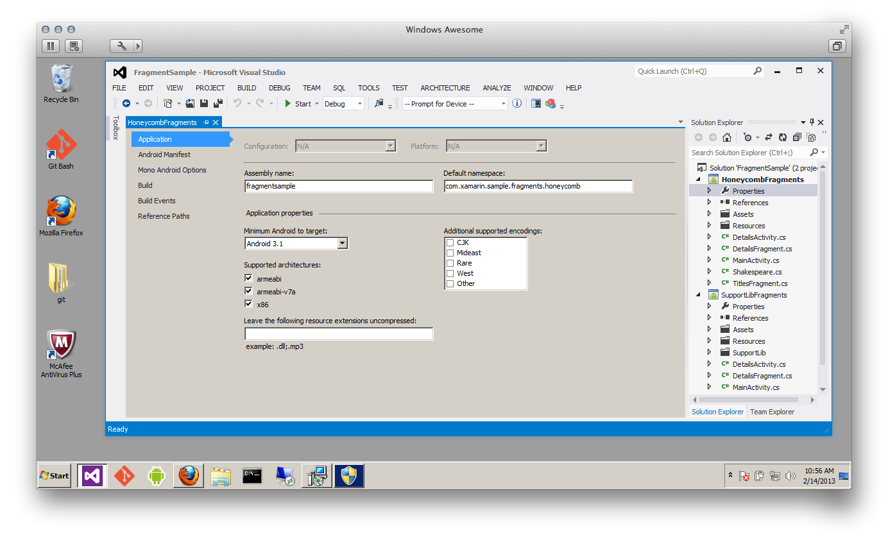
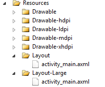
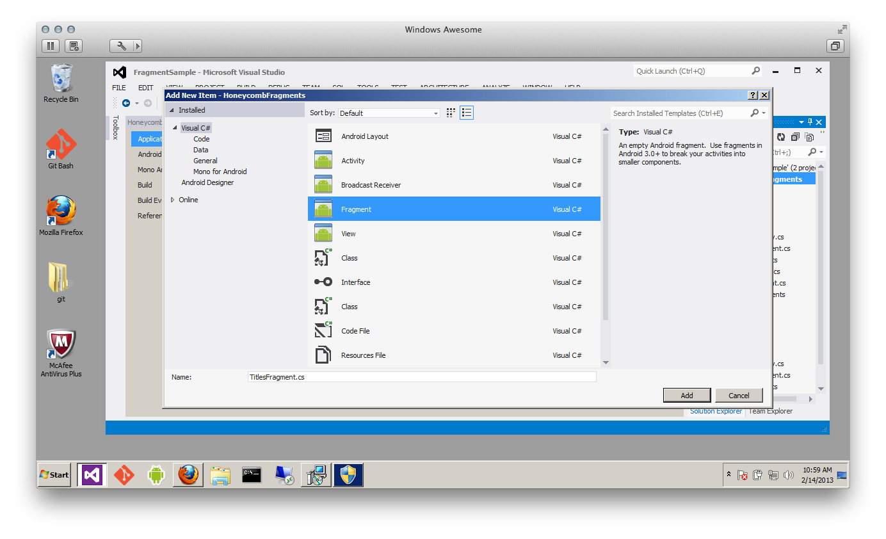

# Walkthrough

In the following steps, a basic app is created with fragments. The
first step is to create a new Xamarin.Android for Android project.

## 1. Create a Project

Create a new Xamarin.Android project called **FragmentSample**. The
**Minimum Android** version should be set to Android 3.1 or later, as
shown in the image below:

[](walkthrough-images/00.png#lightbox)


## 2. Create the MainActivity

Next, we need to create the `MainActivity` class. This is the startup
Activity for the application. This Activity will host one or both
fragments, depending on the screen size. `MainActivity` will do this
by loading the layout file that is appropriate for the device.

```csharp
[Activity(Label = "Fragments Walkthrough", MainLauncher = true, Icon = "@drawable/launcher")]
public class MainActivity : Activity
{
   protected override void OnCreate(Bundle bundle)
   {
       base.OnCreate(bundle);
       SetContentView(Resource.Layout.activity_main);
   }
}
```

> [!NOTE]
> `Note:` Fragment sub-classes must have a public default no argument constructor.

## 3. Create the Layout files

The two different screen sizes require two different layout files. So
let's create a new folder, **Resources/Layout-Large**, and create a new
layout called **activity_main.axml**. We'll also rename the default
layout file as **Resources/Layout/activity_main.axml**. After these
changes, the layout folders should resemble the following screen shot:

[](walkthrough-images/01.png#lightbox)


All devices will load and use the layout file in **Resources/Layout**.
It is a very simple layout that just displays a `TitlesFragment`:

```xml
<LinearLayout xmlns:android="http://schemas.android.com/apk/res/android"
       android:orientation="horizontal"
       android:layout_width="fill_parent"
       android:layout_height="fill_parent">
 <fragment class="com.xamarin.sample.fragments.supportlib.TitlesFragment"
           android:id="@+id/titles_fragment"
           android:layout_width="fill_parent"
           android:layout_height="fill_parent" />
</LinearLayout>
```

For devices that have a large screen, Android will load the layout file
in **Resources/Layout-Large**. The content of the layout for tablets is
as follows:

```xml
<LinearLayout xmlns:android="http://schemas.android.com/apk/res/android"
       android:orientation="horizontal"
       android:layout_width="fill_parent"
       android:layout_height="fill_parent">
 <fragment class="com.xamarin.sample.fragments.supportlib.TitlesFragment"
           android:id="@+id/titles_fragment"
           android:layout_weight="1"
           android:layout_width="0px"
           android:layout_height="match_parent" />
 <FrameLayout android:id="@+id/details"
              android:layout_weight="1"
              android:layout_width="0px"
              android:layout_height="match_parent" />
</LinearLayout>
```

The layout file for the larger screens is slightly different. Not only
is the `TitlesFragment` displayed in this layout file, but a
`FrameLayout` is added right next to the fragment. On the larger
screens, the `DetailsFragment` is programmatically added to
`MainActivity` when the user selects a play. Later on, we'll explain
in more detail how this is done.

Android 3.2 introduced a new way to specify screen layouts. These new
qualifiers specify the amount of space your layout needs, rather than
the size of the screen. If this application was meant to run only
on Android 3.2 or higher, we would create a **Resource/Layout-sw600dp**
folder (instead of the folder **Resource/Layout-Large**) for the layout
file **activity_main.axml**. This resource file would be loaded by all
devices that have a minimum screen width of 600 density-independent
pixels. However, as this application is set to target Android 3.1 or
higher, it uses the older resource qualifier.

## 4. Create the TitlesFragment

`TitlesFragment` will display the titles of the various
plays, so let's add a new fragment to the project called `TitlesFragment`:

[](walkthrough-images/02.png#lightbox)

After `TitlesFragment` has been added, we must change the class so
that it inherits from `Android.App.ListFragment`. `ListFragment` is
a specialized fragment type that includes list functionality.
`TitlesFragment` will also override `OnActivityCreated` (another
fragment lifecycle method) and provide an `Adapter` that
`ListFragment` will use to populate the list:

```csharp
public override void OnActivityCreated(Bundle savedInstanceState)
{
   base.OnActivityCreated(savedInstanceState);
   var adapter = new ArrayAdapter<String>(Activity, Android.Resource.Layout.SimpleListItemChecked, Shakespeare.Titles);
   ListAdapter = adapter;
   if (savedInstanceState != null)
   {
       _currentPlayId = savedInstanceState.GetInt("current_play_id", 0);
   }
   var detailsFrame = Activity.FindViewById<View>(Resource.Id.details);
   _isDualPane = detailsFrame != null && detailsFrame.Visibility == ViewStates.Visible;
   if (_isDualPane)
   {
       ListView.ChoiceMode = (int) ChoiceMode.Single;
       ShowDetails(_currentPlayId);
   }
}
```

As previously mentioned, our application has two layouts for
`MainActivity`. The code in `OnActivityCreated` detects the
presence of the `FrameLayout` and determines which layout file has
been loaded. If the `FrameLayout` exists in the layout, then the
`_isDualPane` flag is set to `true`. The `_isDualPane` flag is
used elsewhere in the Activity, specifically by the `ShowDetails`
method. The `ShowDetails` method will be covered in more detail
below.

`TitlesFragment` is a list, and must respond to user selections in
the list. To do this, `TitlesFragment` will override the method
`OnListItemClick`. Inside `OnListItemClick`, a new
`DetailsFragment` will be created and displayed in the
`FrameLayout`, programmatically. The relevant code inside
`TitlesFragment` is:

```csharp
public override void OnListItemClick(ListView l, View v, int position, long id)
{
   ShowDetails(position);
}
private void ShowDetails(int playId)
{
   _currentPlayId = playId;
   if (_isDualPane)
   {
       // We can display everything in place with fragments.
       // Have the list highlight this item and show the data.
       ListView.SetItemChecked(playId, true);
       // Check what fragment is shown, replace if needed.
       var details = FragmentManager.FindFragmentById(Resource.Id.details) as DetailsFragment;
       if (details == null || details.ShownPlayId != playId)
       {
           // Make new fragment to show this selection.
           details = DetailsFragment.NewInstance(playId);
           // Execute a transaction, replacing any existing
           // fragment with this one inside the frame.
           var ft = FragmentManager.BeginTransaction();
           ft.Replace(Resource.Id.details, details);
           ft.SetTransition(FragmentTransaction.TransitFragmentFade);
           ft.Commit();
       }
   }
   else
   {
       // Otherwise we need to launch a new Activity to display
       // the dialog fragment with selected text.
       var intent = new Intent();
       intent.SetClass(Activity, typeof (DetailsActivity));
       intent.PutExtra("current_play_id", playId);
       StartActivity(intent);
   }
}
```

The code determines from the device how to format and display the quote
from the selected play. In the case of tablets, the `_isDualPane`
flag will be set to `true`, and so the quote will be displayed next
to the `TitlesFragment`. If the selected play `id` is not already
displayed, then a new `DetailsFragment` is created, and then loaded
into the `FrameLayout` on the Activity. For other devices that do not
have a large display &ndash; phones, for example &ndash; `isDualPane`
will be set to `false` so a new `DetailsActivity` will be started.


## 5. Create the DetailsActivity

The `DetailsActivity` displays the `DetailsFragment` for smaller
devices. To see this, first we'll add a new Activity to the project
named `DetailsActivity`. `DetailsActivity` is a very simple
Activity. It will create and then host a new `DetailsFragment` for
the play `id` that was sent:

```csharp
[Activity(Label = "Details Activity")]
public class DetailsActivity : Activity
{
   protected override void OnCreate(Bundle bundle)
   {
       base.OnCreate(bundle);
       var index = Intent.Extras.GetInt("current_play_id", 0);

       var details = DetailsFragment.NewInstance(index); // DetailsFragment.NewInstance is a factory method to create a Details Fragment
       var fragmentTransaction = FragmentManager.BeginTransaction();
       fragmentTransaction.Add(Android.Resource.Id.Content, details);
       fragmentTransaction.Commit();
   }
}
```

Notice that no layout file is loaded for `DetailsActivity`. Instead,
`DetailsFragment` is loaded into the root view of the Activity. This
root view has the special ID `Android.Resource.Id.Content`. A new
`DetailFragment` is created and then added to this root view inside
of a `FragmentTransaction` that is created by the Activity's
`FragmentManager`.


## 6. Create the DetailsFragment

Now, let's add another fragment to the application named
`DetailsFragment`. This fragment will display a quote from the
selected play. The following code shows the complete
`DetailsFragment`:

```csharp
internal class DetailsFragment : Fragment
{
   public static DetailsFragment NewInstance(int playId)
   {
       var detailsFrag = new DetailsFragment {Arguments = new Bundle()};
       detailsFrag.Arguments.PutInt("current_play_id", playId);
       return detailsFrag;
   }
   public int ShownPlayId
   {
       get { return Arguments.GetInt("current_play_id", 0); }
   }
   public override View OnCreateView(LayoutInflater inflater, ViewGroup container, Bundle savedInstanceState)
   {
       if (container == null)
       {
           // Currently in a layout without a container, so no reason to create our view.
           return null;
       }
       var scroller = new ScrollView(Activity);
       var text = new TextView(Activity);
       var padding = Convert.ToInt32(TypedValue.ApplyDimension(ComplexUnitType.Dip, 4, Activity.Resources.DisplayMetrics));
       text.SetPadding(padding, padding, padding, padding);
       text.TextSize = 24;
       text.Text = Shakespeare.Dialogue[ShownPlayId];
       scroller.AddView(text);
       return scroller;
   }
}
```

In order for `DetailsFragment` to function properly, it must have the
index of the play that is selected in the `TitlesFragment`. There are
many ways to provide this value to `DetailsFragment`; in this
example, the play `Id` is placed into a Bundle and that Bundle is
stored to the Arguments property of an instance of the
`DetailsFragment`. The property `ShownPlayId` is provided for
convenience &ndash; it will be used by instances of `DetailsFragment`
to retrieve that value from the Bundle.

`OnCreateView` is called when the fragment needs to draw its user
interface and should return an `Android.Views.View` object. In most
cases, this is a `View` inflated from an existing layout file. In the
case of the above example, the fragment will programmatically build the
view that will be used for display.

Congratulations! You've now created an application that uses fragments to
simplify development across form factors.

In the [next section](supporting-pre-honeycomb.md),
we're going to extend this application so that it will work on
pre-Android 3.0 devices.

