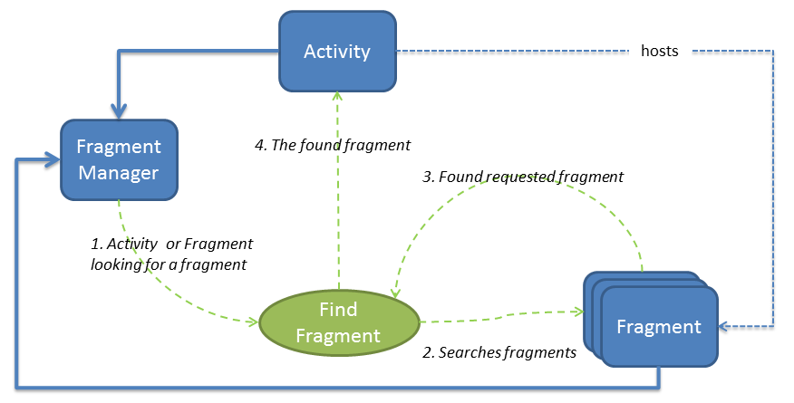
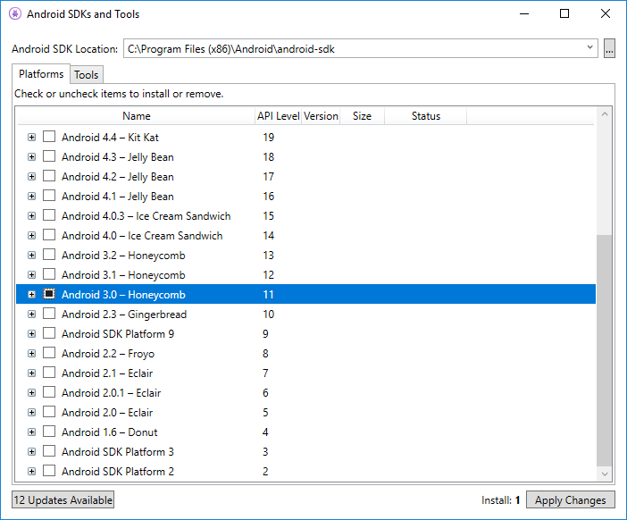
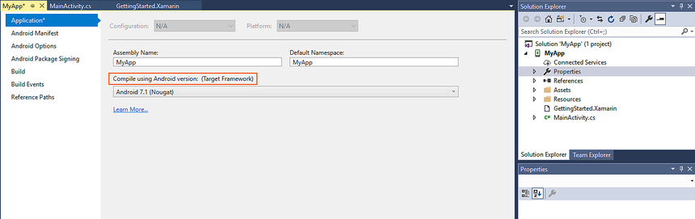

# Fragments

_Android 3.0 introduced Fragments, showing how to support more flexible designs for the many different screen sizes found on phones and tablets. This article will cover how to use Fragments to develop Xamarin.Android applications, and also how to support Fragments on pre-Android 3.0 (API Level 11) devices._

## Fragments Overview

The larger screen sizes found on most tablets added an extra layer of
complexity to Android development—a layout designed for the small screen does
not necessarily work as well for larger screens, and vice-versa. To
reduce the number of complications that this introduced, Android 3.0 added two
new features, *Fragments* and *Support Packages*.

Fragments can be thought of as user interface modules. They let the developer
divide up the user interface into isolated, reusable parts that can be run in
separate Activities. At run time, the Activities themselves will decide which
Fragments to use.

Support Packages were originally called *Compatibility Libraries* and
allowed Fragments to be used on devices that run versions of Android prior to
Android 3.0 (API Level 11).

For example, the image below illustrates how a single application uses
Fragments across varying device form factors.

*Fragment A* contains a list, while *Fragment B* contains
details for an item selected in that list. When the application is run on a
tablet, it can display both Fragments on the same Activity. When the same
application is run on a handset (with its smaller screen size), the Fragments
are hosted in two separate Activities. Fragment A and Fragment B are the same on
both form factors, but the Activities that host them are different.

To help an Activity coordinate and manage all these Fragments, Android
introduced a new class called the *FragmentManager*. Each Activity has
its own instance of a `FragmentManager` for adding, deleting, and
finding hosted Fragments. The following diagram illustrates the relationship
between Fragments and Activities:

In some regards, Fragments can be thought of as composite controls or as
mini-Activities. They bundle up pieces of UI into reusable modules that can then
be used independently by developers in Activities. A Fragment does have a view
hierarchy—just like an Activity—but, unlike an Activity, it can be shared
across screens. Views differ from Fragments in that Fragments have their own
lifecycle; views do not.

While the Activity is a host to one or more Fragments, it is not
directly aware of the Fragments themselves. Likewise, Fragments are not
directly aware of other Fragments in the hosting Activity. However,
Fragments and Activities are aware of the `FragmentManager` in their
Activity. By using the `FragmentManager`, it is possible for an
Activity or a Fragment to obtain a reference to a specific instance of
a Fragment, and then call methods on that instance. In this way, the
Activity or Fragments can communicate and interact with other
Fragments.

This guide contains comprehensive coverage about how to use Fragments,
including:

- **Creating Fragments** – How to create a basic Fragment and key methods that must be implemented.
- **Fragment Management and Transactions** – How to manipulate Fragments at run time.
- **Android Support Package** – How to use the libraries that allow Fragments to be used on older versions of Android.

## Requirements

Fragments are available in the Android SDK starting with API level 11
(Android 3.0), as shown in the following screenshot:

Fragments are available in Xamarin.Android 4.0 and higher. A
Xamarin.Android application must target at least API level 11 (Android 3.0) or higher in
order to use Fragments. The Target Framework may be set in the project Properties
as shown below:

It is possible to use Fragments in older versions of Android by using the
Android Support Package and Xamarin.Android 4.2 or higher. How to do this is
covered in more detail in the documents of this section.

## Related Links

- [Honeycomb Gallery (sample)](/samples/xamarin/monodroid-samples/honeycombgallery)
- [Fragments](https://developer.android.com/guide/topics/fundamentals/fragments.html)
- [Support Package](https://developer.android.com/sdk/compatibility-library.html)