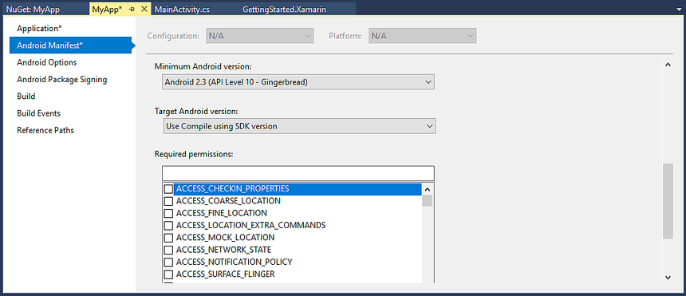

# Providing Backwards Compatibility with the Android Support Package

The usefulness of Fragments would be limited without backwards
compatibility with pre-Android 3.0 (API Level 11) devices. To provide
this capability, Google introduced the
[Support Library](http://developer.android.com/sdk/compatibility-library.html)
(originally called the *Android Compatibility Library* when it was
released) which backports some of the APIs from newer versions of
Android to older versions of Android. It is the Android Support Package
that enables devices running Android 1.6 (API level 4) to Android
2.3.3. (API level 10).

> [!NOTE]
> Only the `ListFragment` and the `DialogFragment` are available via the 
> Android Support Package. None of the other Fragment subclasses, such as 
> the `PreferenceFragment,` are supported in the Android Support Package. 
> They will not work in pre-Android 3.0 applications. 


## Adding the Support Package

The Android Support Package is not automatically added to a 
Xamarin.Android application. Xamarin provides the 
[Android Support Library v4 NuGet package](https://www.nuget.org/packages/Xamarin.Android.Support.v4/) to 
simplify adding the support libraries to a Xamarin.Android 
application.To include the support packages into your Xamarin.Android 
application include the 
[Android Support Library v4](https://www.nuget.org/packages/Xamarin.Android.Support.v4/) 
component into your Xamarin.Android project, as illustrated in the following 
screenshot: 

[](providing-backwards-compatibility-images/02.png#lightbox)

After these steps have been performed, it becomes possible to use 
Fragments in earlier versions of Android. The Fragment APIs will work 
the same now in these earlier versions, with the following exceptions: 

-   **Change the minimum Android Version** &ndash; The application no 
    longer needs to target Android 3.0 or higher, as shown below: 

    [](providing-backwards-compatibility-images/03.png#lightbox)

-   **Extend FragmentActivity** &ndash; The Activities that are hosting 
    Fragments must now inherit from 
    `Android.Support.V4.App.FragmentActivity` , and not from 
    `Android.App.Activity` . 

-   **Update Namespaces** &ndash; Classes that inherit from 
    `Android.App.Fragment` must now inherit from 
    `Android.Support.V4.App.Fragment` . Remove the using statement " 
    `using Android.App;` " at the top of the source code file and 
    replace it with " `using Android.Support.V4.App` ". 

-   **Use SupportFragmentManager** &ndash; 
    `Android.Support.V4.App.FragmentActivity` exposes a 
    `SupportingFragmentManager` property that must be used to get a 
    reference to the `FragmentManager` . For example: 

```csharp
FragmentTransaction fragmentTx = this.SupportingFragmentManager.BeginTransaction();
DetailsFragment detailsFrag = new DetailsFragment();
fragmentTx.Add(Resource.Id.fragment_container, detailsFrag);
fragmentTx.Commit();
```

With these changes in place, it will be possible to run a 
Fragment-based application on Android 1.6 or 2.x as well as on 
Honeycomb and Ice Cream Sandwich. 


## Related Links

- [Android Support Library v4 NuGet](https://www.nuget.org/packages/Xamarin.Android.Support.v4/)
