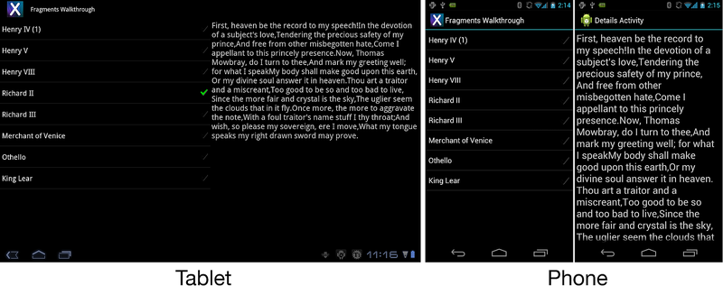
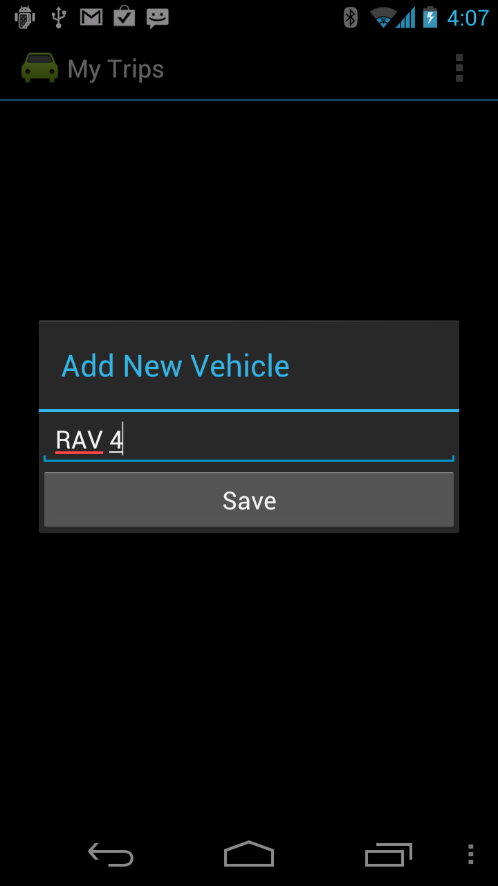
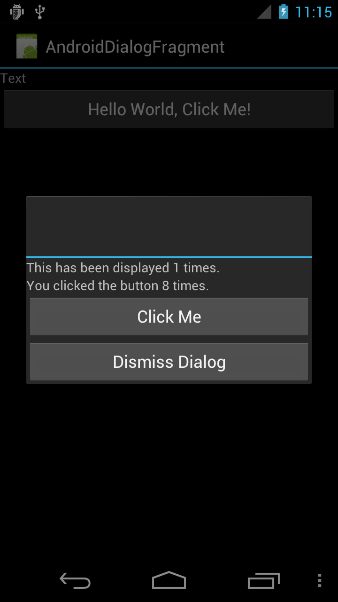
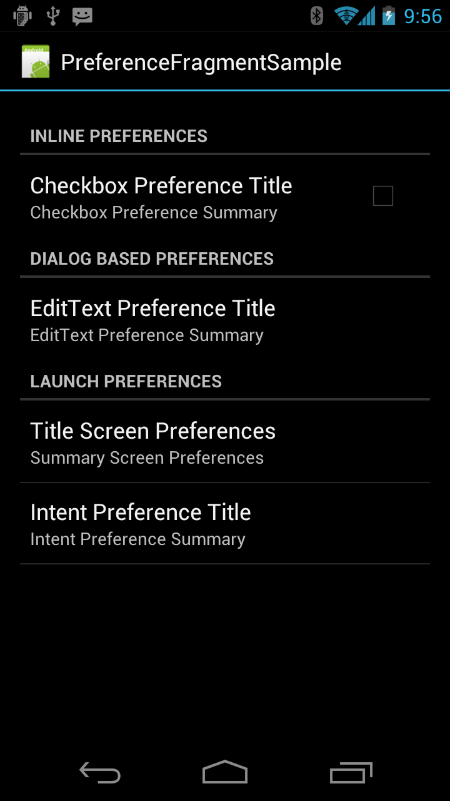
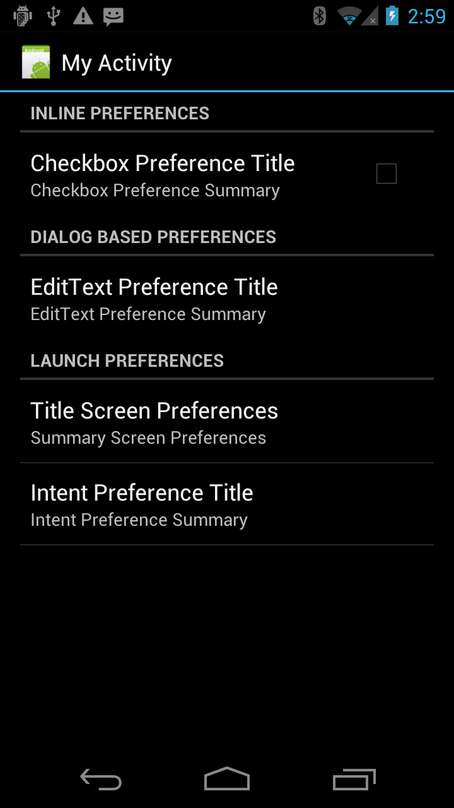

# Specialized Fragment Classes

The Fragments API provides other subclasses that encapsulate some of
the more common functionality found in applications. These subclasses
are:

-   **ListFragment** &ndash; This Fragment is used to display a list of
    items bound to a datasource such as an array or a cursor.

-   **DialogFragment** &ndash; This Fragment is used as a wrapper
    around a dialog. The Fragment will display the dialog on top of its
    Activity.

-   **PreferenceFragment** &ndash; This Fragment is used to show
    Preference objects as lists.


## The ListFragment

The `ListFragment` is very similar in concept and functionality to the
`ListActivity`; it is a wrapper that hosts a `ListView` in a
Fragment. The image below shows a `ListFragment` running on a tablet
and a phone:

[](specialized-fragment-classes-images/intro-screenshot.png#lightbox)


### Binding Data With The ListAdapter

The `ListFragment` class already provides a default layout, so it is
not necessary to override `OnCreateView` to display the contents of the
`ListFragment`. The `ListView` is bound to data by using a
`ListAdapter` implementation. The following example shows how this
could be done by using a simple array of strings:

```csharp
public override void OnActivityCreated(Bundle savedInstanceState)
{
    base.OnActivityCreated(savedInstanceState);
    string[] values = new[] { "Android", "iPhone", "WindowsMobile",
                "Blackberry", "WebOS", "Ubuntu", "Windows7", "Max OS X",
                "Linux", "OS/2" };
    this.ListAdapter = new ArrayAdapter<string>(Activity, Android.Resource.Layout.SimpleExpandableListItem1, values);
}
```

When setting the `ListAdapter`, it is important to use the
`ListFragment.ListAdapter` property, and not the `ListView.ListAdapter`
property. Using `ListView.ListAdapter` will cause important
initialization code to be skipped.


### Responding to User Selection

To respond to user selections, an application must override the
`OnListItemClick` method. The following example shows one such
possibility:

```csharp
public override void OnListItemClick(ListView l, View v, int index, long id)
{
    // We can display everything in place with fragments.
    // Have the list highlight this item and show the data.
    ListView.SetItemChecked(index, true);

    // Check what fragment is shown, replace if needed.
    var details = FragmentManager.FindFragmentById<DetailsFragment>(Resource.Id.details);
    if (details == null || details.ShownIndex != index)
    {
        // Make new fragment to show this selection.
        details = DetailsFragment.NewInstance(index);

        // Execute a transaction, replacing any existing
        // fragment with this one inside the frame.
        var ft = FragmentManager.BeginTransaction();
        ft.Replace(Resource.Id.details, details);
        ft.SetTransition(FragmentTransit.FragmentFade);
        ft.Commit();
    }
}
```

In the code above, when the user selects an item in the `ListFragment`,
a new Fragment is displayed in the hosting Activity, showing more
details about the item that was selected.


## DialogFragment

The *DialogFragment* is a Fragment that is used to display a dialog
object inside of a Fragment that will float on top of the Activity's
window. It is meant to replace the managed dialog APIs (starting in
Android 3.0). The following screenshot shows an example of a
`DialogFragment`:

[](specialized-fragment-classes-images/dialog-fragment-example.png#lightbox)

A `DialogFragment` ensures that the state between the Fragment and the
dialog remain consistent. All interactions and control of the dialog
object should happen through the `DialogFragment` API, and not be made
with direct calls on the dialog object. The `DialogFragment` API
provides each instance with a `Show()` method that is used to display a
Fragment. There are two ways to get rid of a Fragment:

-  Call `DialogFragment.Dismiss()` on the  `DialogFragment` instance. 

-  Display another `DialogFragment`.

To create a `DialogFragment`, a class inherits from
`Android.App.DialogFragment,` and then overrides one of the following
two methods:

- **OnCreateView** &ndash; This creates and returns a view.

- **OnCreateDialog** &ndash; This creates a custom dialog. It is
  typically used to show an *AlertDialog*. When overriding this
  method, it is not necessary to override `OnCreateView` .


### A Simple DialogFragment

The following screenshot shows a simple `DialogFragment` that has a
`TextView` and two `Button`s:

[](specialized-fragment-classes-images/dialog-fragment-example-2.png#lightbox)

The `TextView` will display the number of times that the user has
clicked one button in the `DialogFragment`, while clicking the other
button will close the Fragment. The code for `DialogFragment` is:

```csharp
public class MyDialogFragment : DialogFragment
{
    private int _clickCount;
    public override void OnCreate(Bundle savedInstanceState)
    {
        _clickCount = 0;
    }

    public override View OnCreateView(LayoutInflater inflater, ViewGroup container, Bundle savedInstanceState)
    {
        base.OnCreate(savedInstanceState)
        
        var view = inflater.Inflate(Resource.Layout.dialog_fragment_layout, container, false);
        var textView = view.FindViewById<TextView>(Resource.Id.dialog_text_view);
            
        view.FindViewById<Button>(Resource.Id.dialog_button).Click += delegate
            {
                textView.Text = "You clicked the button " + _clickCount++ + " times.";
            };

        // Set up a handler to dismiss this DialogFragment when this button is clicked.
        view.FindViewById<Button>(Resource.Id.dismiss_dialog_button).Click += (sender, args) => Dismiss();
        return view;
        }
    }
}
```


### Displaying a Fragment

Like all Fragments, a `DialogFragment` is displayed in the context of a
`FragmentTransaction`.

The `Show()` method on a `DialogFragment` takes a `FragmentTransaction`
and a `string` as an input. The dialog will be added to the Activity,
and the `FragmentTransaction` committed.

The following code demonstrates one possible way an Activity may use
the `Show()` method to show a `DialogFragment`:

```csharp
public void ShowDialog()
{
    var transaction = FragmentManager.BeginTransaction();
    var dialogFragment = new MyDialogFragment();
    dialogFragment.Show(transaction, "dialog_fragment");
}
```


### Dismissing a Fragment

Calling `Dismiss()` on an instance of a `DialogFragment` causes a
Fragment to be removed from the Activity and commits that transaction.
The standard Fragment lifecycle methods that are involved with the
destruction of a Fragment will be called.


### Alert Dialog

Instead of overriding `OnCreateView`, a `DialogFragment` may instead
override `OnCreateDialog`. This allows an application to create an
[AlertDialog](https://developer.xamarin.com/api/type/Android.App.AlertDialog/)
that is managed by a Fragment. The following code is an example that
uses the `AlertDialog.Builder` to create a `Dialog`:

```csharp
public class AlertDialogFragment : DialogFragment
{
    public override Dialog OnCreateDialog(Bundle savedInstanceState)
    {
        EventHandler<DialogClickEventArgs> okhandler;
        var builder = new AlertDialog.Builder(Activity)
            .SetMessage("This is my dialog.")
            .SetPositiveButton("Ok", (sender, args) =>
                                         {
                                             // Do something when this button is clicked.
                                         })
            .SetTitle("Custom Dialog");
        return builder.Create();
    }
}
```


## PreferenceFragment

To help manage preferences, the Fragments API provides the
`PreferenceFragment` subclass. The `PreferenceFragment` is similar to
the [PreferenceActivity](https://developer.xamarin.com/api/type/Android.Preferences.PreferenceActivity/) &ndash; 
it will show a hierarchy of preferences to the user in a
Fragment. As the user interacts with the preferences, they will be
automatically saved to
[SharedPreferences](http://developer.android.com/reference/android/content/SharedPreferences.html).
In Android 3.0 or higher applications, use the `PreferenceFragment` to
deal with preferences in applications. The following picture shows an
example of a `PreferenceFragment`:

[](specialized-fragment-classes-images/preferences-dialog.png#lightbox)


### Create A Preference Fragment from a Resource

The preference Fragment may be inflated from an XML resource file by using the
[PreferenceFragment.AddPreferencesFromResource](https://developer.xamarin.com/api/member/Android.Preferences.PreferenceFragment.AddPreferencesFromResource/p/System.Int32/)
method. A logical place to call this method in the lifecycle of the
Fragment would be in the `OnCreate` method.

The `PreferenceFragment` pictured above was created by loading a
resource from XML. The resource file is:

```xml
<?xml version="1.0" encoding="utf-8"?>

<PreferenceScreen xmlns:android="http://schemas.android.com/apk/res/android">

  <PreferenceCategory android:title="Inline Preferences">
    <CheckBoxPreference android:key="checkbox_preference"
                        android:title="Checkbox Preference Title"
                        android:summary="Checkbox Preference Summary" />

  </PreferenceCategory>

  <PreferenceCategory android:title="Dialog Based Preferences">

    <EditTextPreference android:key="edittext_preference"
                        android:title="EditText Preference Title"
                        android:summary="EditText Preference Summary"
                        android:dialogTitle="Edit Text Preferrence Dialog Title" />

  </PreferenceCategory>

  <PreferenceCategory android:title="Launch Preferences">

    <!-- This PreferenceScreen tag serves as a screen break (similar to page break
             in word processing). Like for other preference types, we assign a key
             here so it is able to save and restore its instance state. -->
    <PreferenceScreen android:key="screen_preference"
                      android:title="Title Screen Preferences"
                      android:summary="Summary Screen Preferences">

      <!-- You can place more preferences here that will be shown on the next screen. -->

      <CheckBoxPreference android:key="next_screen_checkbox_preference"
                          android:title="Next Screen Toggle Preference Title"
                          android:summary="Next Screen Toggle Preference Summary" />

    </PreferenceScreen>

    <PreferenceScreen android:title="Intent Preference Title"
                      android:summary="Intent Preference Summary">

      <intent android:action="android.intent.action.VIEW"
              android:data="http://www.android.com" />

    </PreferenceScreen>

  </PreferenceCategory>

</PreferenceScreen>
```

The code for the preference Fragment is as follows:

```csharp
public class PrefFragment : PreferenceFragment
{
    public override void OnCreate(Bundle savedInstanceState)
    {
        base.OnCreate(savedInstanceState);
        AddPreferencesFromResource(Resource.Xml.preferences);
    }
}
```


### Querying Activities to Create a Preference Fragment

Another technique for creating a `PreferenceFragment` involves querying
Activities. Each Activity can use the
[METADATA\_KEY\_PREFERENCE](https://developer.xamarin.com/api/field/Android.Preferences.PreferenceManager.MetadataKeyPreferences/)
attribute that will point to an XML resource file. In Xamarin.Android,
this is done by adorning an Activity with the `MetaDataAttribute`, and
then specifying the resource file to use. The `PreferenceFragment`
class provides the method
[AddPreferenceFromIntent](https://developer.xamarin.com/api/member/Android.Preferences.PreferenceFragment.AddPreferencesFromIntent/p/Android.Content.Intent/))
that can be used to query an Activity to find this XML resource and
inflate a preference hierarchy for it.

An example of this process is provided in the following code snippet,
which uses `AddPreferencesFromIntent` to create a `PreferenceFragment`:

```csharp
public class MyPreferenceFragment : PreferenceFragment
{
    public override void OnCreate(Bundle savedInstanceState)
    {
        base.OnCreate(savedInstanceState);
        var intent = new Intent(this.Activity, typeof (MyActivityWithPreferences));
        AddPreferencesFromIntent(intent);
    }
}
```

Android will look at the class `MyActivityWithPreference`. The class
must be adorned with the `MetaDataAttribute,` as shown in the following
code snippet:

```csharp
[Activity(Label = "My Activity with Preferences")]
[MetaData(PreferenceManager.MetadataKeyPreferences, Resource = "@xml/preference_from_intent")]
public class MyActivityWithPreferences : Activity
{
    protected override void OnCreate(Bundle bundle)
    {
        base.OnCreate(bundle);
        // This is deliberately blank
    }
}
```

The `MetaDataAttribute` declares an XML resource file that the
`PreferenceFragment` will use to inflate the preference hierarchy. If
the `MetatDataAttribute` is not provided, then an exception will be
thrown at run time. When this code runs, the `PreferenceFragment`
appears as in the following screenshot:

[](specialized-fragment-classes-images/preference-fragment-getpreferencesfromintent.png#lightbox)
