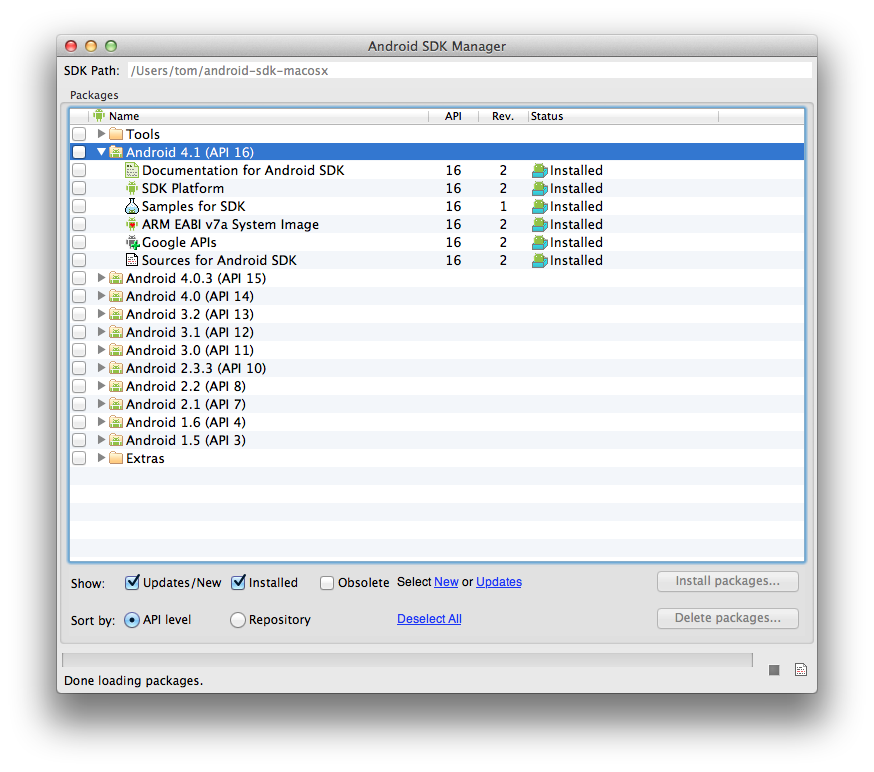
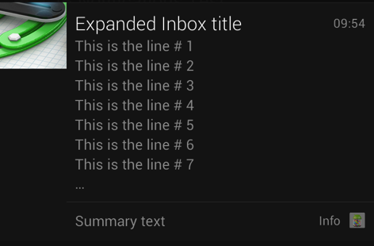
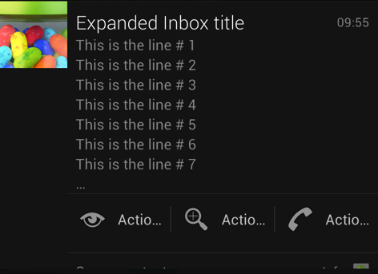

# Jelly Bean Features

_This document will provide a high level overview of the new features for developers that were introduced in Android 4.1. These features include: enhanced notifications, updates to Android Beam to share large files, updates to multimedia, peer-to-peer network discovery, animations, new permissions._

## Overview

Android 4.1 (API Level 16), also known as "Jelly Bean", was release on July
9th, 2012. This article will provide a high level introduction to some of the
new features in Android 4.1 for developers using Xamarin.Android. Some of these
new features introduced are enhancements to animations for launching an
activity, new sounds for a camera, and improved support for application stack
navigation. It is now possible to cut and paste with intents.

The stability of Android applications is improved with the ability to isolate
the dependency on unstable content providers. Services may also be isolated so
that they are accessible only by the activity that started them.

Support has been added for network service discovery using Bonjour, UPnP, or
multicast DNS based services. It is now possible for richer notifications that
have formatted text, action buttons and large images.

Finally several new permissions have been added in Android 4.1.

## Requirements

To develop Xamarin.Android applications using Jelly Bean requires
Xamarin.Android 4.2.6 or higher and Android 4.1 (API Level 16) be installed via the
Android SDK Manager as shown in the following screen shot:

[](jelly-bean-images/image1.png#lightbox)

## What's New

### Animations

Activities may be launched using either zoom animations or custom animations
by using the `ActivityOptions` class. The following new methods are
provided to support these animations:

- `MakeScaleUpAnimation` – This will create an animation that scales up an activity window from a start position and size on the screen.
- `MakeThumbnailScaleUpAnimation` – This will create an animation that scales up from a thumbnail image from specified position on the screen.
- `MakeCustomAnimation` – This creates an animation from resources in the application. There is one animation for when the activity opens and another for when the activity stops.

The new `TimeAnimator` class provides an interface `TimeAnimator.ITimeListener` that can notify an application every
time a frame changes in an animation. For example, consider the following
implementation of `TimeAnimator.ITimeListener`:

```csharp
class MyTimeListener : Java.Lang.Object,  TimeAnimator.ITimeListener
{
    public void OnTimeUpdate(TimeAnimator animation, long totalTime, long deltaTime)
    {
        Log.Debug("Activity1", "totalTime={0}, deltaTime={1}", totalTime, deltaTime);
    }
}
```

And now to use the class, an instance of `TimeAnimator` is
created, and the listener is set:

```csharp
var animator = new TimeAnimator();
animator.SetTimeListener(new MyTimeListener());
animator.Start();
```

As the `TimeAnimator` instance is running, it will invoke `ITimeAnimator.ITimeListener`, which will then log the how long the
animator has been running and how long it as been since the last time the method
has been invoked.

### Application Stack Navigation

Android 4.1 improves on the application stack navigation that was introduced
in Android 3.0. By specifying the `ParentName` property of the `ActivityAttribute`, Android can open the proper parent Activity when
the user presses the [Up button](https://developer.android.com/design/patterns/navigation.html#up-vs-back) on the action bar - Android will instantiate the
Activity specified by the `ParentName` property. This allows
applications to preserve hierarchy of activities that make a given task.

For most applications setting the `ParentName` on the activity is
sufficient information for Android to provide the correct behavior for
navigating the application stack; Android will synthesize the necessary back
stack by creating a series of Intents for each parent activity. However, because
this is an artificial application stack, each synthetic activity will not have
the saved state that a natural activity would have. To provide saved state to a
synthetic parent activity, an Activity may override the `OnPrepareNavigationUpTaskStack` method. This method receives a `TaskStackBuilder` instance that will have a collection of Intent
objects that Android will use to create the back stack. The activity may modify
these Intents so that, as the synthetic activity is created, it will receive the
proper state information.

For more complex scenarios, there are new methods on the Activity class that
may be used to handle the behavior of Up navigation and construct the back
stack:

- `OnNavigateUp` – By overriding this method it is possible to perform a custom action when the **Up** button is pressed.
- `NavigateUpTo` – Calling this method will cause the application to navigate from the current activity to the activity specified by a given intent.
- `ParentActivityIntent` – This is used to obtain an Intent that will launch the parent activity of the current activity.
- `ShouldUpRecreateTask` – This method is used to query if the synthetic back stack must be created to navigate up to a parent activity. Returns  `true` if the synthetic stack must be created. 
- `FinishAffinity` – Calling this method will finish the current activity and all activities below it in the current task that have the same task affinity.
- `OnCreateNavigateUpTaskStack` – This method is overridden when it is necessary to have complete control over how the synthetic stack is created.

### Camera

There is a new interface, `Camera.IAutoFocusMoveCallback`, which
can be used to detect when the auto focus has started or stopped moving. An
example of this new interface can be seen in the following snippet:

```csharp
public class AutoFocusCallbackActivity : Activity, Camera.IAutoFocusCallback
{
    public void OnAutoFocus(bool success, Camera camera)
    {
        // camera is an instance of the camera service object.

        if (success)
        {
            // Auto focus was successful - do something here.
        }
        else
        {
            // Auto focus didn't happen for some reason - react to that here.
        }
    }
}
```

The new class `MediaActionSound` provides a set of API's for
producing sounds for the various media actions. There are several actions that
can occur with a camera, these are defined by the enum `Android.Media.MediaActionSoundType`:

- `MediaActionSoundType.FocusComplete` – This sound that is played when focusing has completed.
- `MediaActionSoundType.ShutterClick` – This sound will be played when a still image picture is taken.
- `MediaActionSoundType.StartVideoRecording` – This sound is used indicate the start of video recording.
- `MediaActionSoundType.StopVideoRecording` – This sound will be played to indicate the end of video recording.

An example of how to use the `MediaActionSound` class can be seen
in the following snippet:

```csharp
var mediaActionPlayer = new MediaActionSound();

// Preload the sound for a shutter click.
mediaActionPlayer.Load(MediaActionSoundType.ShutterClick);
var button = FindViewById<Button>(Resource.Id.MyButton);

// Play the sound on a button click.
button.Click += (sender, args) => mediaActionPlayer.Play(MediaActionSoundType.ShutterClick);

// This releases the preloaded resources. Don’t make any calls on
// mediaActionPlayer after this.
mediaActionPlayer.Release();
```

### Connectivity

#### Android Beam

Android Beam is an NFC based technology that allows two Android devices to
communicate with each other. Android 4.1 provides better support for the
transfer of large files. When using the new method `NfcAdapter.SetBeamPushUris()` Android will switch between alternate
transport mechanisms (such as Bluetooth) to achieve a fast transfer speed.

#### Network Services Discovery

Android 4.1 contains new API’s for multicast DNS-based service discovery.
This allows an application to detect and connect over Wi-Fi to other devices
such as printers, cameras, and media devices. These new API’s are in the `Android.Net.Nsd` package.

To create a service that may be consumed by other services, the `NsdServiceInfo` class is used to create an object that will define
the properties of a service. This object is then provided to `NsdManager.RegisterService()` along with an implementation of `NsdManager.ResolveListener`. Implementations of `NsdManager.ResolveListener` are used to notify of a successful
registration and to unregister the service.

To discover services on the network, and implementation of `Nsd.DiscoveryListener` passed to `NsdManager.discoverServices()`.

#### Network Usage

A new method, `ConnectivityManager.IsActiveNetworkMetered` allows
a device to check if it is connected to a metered network. This method can be
used to help manage data usage by accurately informing users that there might be
expensive charges for data operations.

#### WiFi Direct Service Discovery

The `WifiP2pManager` class was introduced in Android 4.0 to
support *zeroconf*. Zeroconf (zero configuration networking) is a set of
techniques that allows devices (computers, printers, phones) to connect to
networks automatically, with the intervention of human network operators or
special configuration servers.

In Jelly Bean, `WifiP2pManager` can discover nearby devices using
either *Bonjour* or *Upnp*. Bonjour is Apple’s implementation of
zeroconf. Upnp is set of networking protocols that also supports zeroconf. The
following methods added to the `WiFiP2pManager` to support Wi-Fi
service discovery:

- `AddLocalService()` – This method is used announce an application as a service over Wi-Fi for discovery by peers.
- `AddServiceRequest(` ) – This method is to send a service discovery request to the framework. It is used to initialize the Wi-Fi service discovery.
- `SetDnsSdResponseListeners()` – This method is used to register callbacks to be invoked on receiving a response to discovery requests from Bonjour.
- `SetUpnpServiceResponseListener()` – This method is used to register callbacks to be invoked on receiving a response to discovery requests Upnp.

### Content Providers

The `ContentResolver` class has received a new method, `AcquireUnstableContentProvider`. This method allows an application
to acquire an “unstable” content provider. Normally, when an application
acquires a content provider, and that content provider crashes, so will the
application. With this method call, an application will not crash if the content
provider crashes. Instead, `Android.OS.DeadObjectionException` will
be thrown from calls on the content provider to inform an application that the
content provider has gone away. An “unstable” content provider is useful
when interacting with content providers from other applications – it is less
likely that buggy code from another application will affect another
application.

### Copy and Paste With Intents

The `Intent` class can now have a `ClipData` object
associated with it via the `Intent.ClipData` property. This method
allows for extra data from the clipboard to be transmitted with the intent. An
instance of `ClipData` can contain one or more `ClipData.Item`. `ClipData.Item`’s are items of the
following types:

- **Text** – This is any string of text, either HTML or any string whose format is supported by the built-in Android style spans.
- **Intent** – Any  `Intent` object.
- **Uri** – This can be any URI, such as an HTTP bookmark or the URI to a content provider.

### Isolated Services

An isolated service is a service that runs under its own special process and
has no permissions of its own. The only communication with the service is when
starting up the service and binding to it via the Service API. It is possible to
declare a service as isolated by setting the property `IsolatedProcess="true"` in the `ServiceAttribute` that
adorns a service class.

### Media

The new `Android.Media.MediaCodec` class provides an API to
low-level media codecs. Applications can query the system to find out what low
level codecs are available on the device.

The new `Android.Media.Audiofx.AudioEffect` subclasses have been
added to support additional audio pre-processing on captured audio:

- `Android.Media.Audiofx.AcousticEchoCanceler` – This class is used for pre-processing audio to remove the signal from a remote party from a captured audio signal. For example, removing the echo from a voice communication application.
- `Android.Media.Audiofx.AutomaticGainControl` – This class is used to normalize the captured signal by boosting or lowering an input signal so that the output signal is constant.
- `Android.Media.Audiofx.NoiseSuppressor` – This class will remove background noise from the captured signal.

Not all devices will support these effects. The method `AudioEffect.IsAvailable` should be called by an application to see
if the audio effect in question is supported on the device running the
application.

The `MediaPlayer` class now supports gapless playback with the `SetNextMediaPlayer()` method. This new method specifies the next
MediaPlayer to start when the current media player finishes its playback.

The following new classes provide standard mechanisms and UI for selecting
where media will be played:

- `MediaRouter` – This class allows applications to control the routing of media channels from a device to external speakers or other devices.
- `MediaRouterActionProvider` and  `MediaRouteButton` – These classes help provide a consistent UI for selecting and playing media.

### Notifications

Android 4.1 allows applications more flexibility and control with displaying
notifications. Applications can now show bigger and better notifications to
users. A new method, `NotificationBuilder.SetStyle()` allows for one
of new three new style to be set on notifications:

- `Notification.BigPictureStyle` – This is a helper class that will generate notifications that will have an image in them. The following image shows an example of a notification with a big image:

 [](jelly-bean-images/image2.png#lightbox)

- `Notification.BigTextStyle` – This is a helper class that will generate notifications that will have multiple lines of text, such as e-mail. An example of this new notification style can be seen in the following screenshot:

 [](jelly-bean-images/image3.png#lightbox)

- `Notification.InboxStyle` – This is a helper class that will generate notifications that contain a list of strings, such as snippets from an e-mail message, as shown in this screenshot:

 [](jelly-bean-images/image4.png#lightbox)

It is possible to add up to two action buttons at the bottom of a
notification message when the notification is using the normal or larger style.
An example of this can be seen in the following screenshot, where the action
buttons are visible at the bottom of the notification:

 [](jelly-bean-images/image5.png#lightbox)

The `Notification` class has received new constants that allow a
developer to specify one of five priority levels for a notification. These can
be set on a notification using the `Priority` property.

### Permissions

The following new permissions have been added:

- `READ_EXTERNAL_STORAGE` - The application requires read only access to external storage. Currently all applications have read access by default, but future releases of Android will require applications explicitly request read access.
- `READ_USER_DICTIONARY` - Allows a read-access to the user's word dictionary.
- `READ_CALL_LOG` - Allows an application to obtain information about incoming and outgoing calls by reading the call log.
- `WRITE_CALL_LOG` - Allows an application to write to the call log on the phone.
- `WRITE_USER_DICTIONARY` - Allows an application to write to the user's word dictionary.

An important change to note `READ_EXTERNAL_STORAGE` – currently
this permission is automatically granted by Android. Future versions of Android
will require an application to request this permission before granted the
permission.

## Summary

This article introduced some of the new API’s that are available in Android
4.1 (API Level 16). It highlighted some of changes for animations and animating
the launch of an activity, and introduced the new API’s for network discovery
of other devices using protocols such as Bonjour or UPnP. Other changes to the
API were highlighted as well, such as the ability to cut and paste data via
intents, the ability to use isolated services or “unstable” content
providers.

This article then went on to introduce the updates to notifications, and
discussed some of the new permissions that have been introduced with Android
4.1

## Related Links

- [Time Animation Example (sample)](/samples/xamarin/monodroid-samples/platformfeatures-timeanimatorexample)
- [Android 4.1 APIs](https://developer.android.com/about/versions/android-4.1.html)
- [Tasks and Back Stacks](https://developer.android.com/guide/components/tasks-and-back-stack.html)
- [Navigation with Back and Up](https://developer.android.com/design/patterns/navigation.html)