# KitKat Features

_Android 4.4 (KitKat) comes loaded with a cornucopia of features for users and developers. This guide highlights several of these features and provides code examples and implementation details to help you make the most out of KitKat._

## Overview

Android 4.4 (API Level 19), also known as "KitKat", was released in
late 2013. KitKat offers a variety of new features and improvements,
including:

- [User Experience](#user_experience) &ndash; Easy animations with
  transition framework, translucent status and navigation bars, and
  full-screen immersive mode help create a better experience for the
  user.

- [User Content](#user_content) &ndash; User file management
  simplified with storage access framework; printing pictures, web
  sites, and other content is easier with improved printing APIs.

- [Hardware](#hardware) &ndash; Turn any app into an NFC card with NFC
  Host-Based Card Emulation; run low-power sensors with the
  `SensorManager` .

- [Developer Tools](#developer_tools) &ndash; Screencast applications
  in action with the Android Debug Bridge client, available as part of
  the Android SDK.

This guide provides guidance for migrating an existing Xamarin.Android
application to KitKat, as well as a high-level overview of KitKat for
Xamarin.Android developers.

## Requirements

To develop Xamarin.Android applications using KitKat, you need
*Xamarin.Android 4.11.0* or higher and Android 4.4 (API Level 19)
installed via the Android SDK Manager, as illustrated by the following
screenshot:

[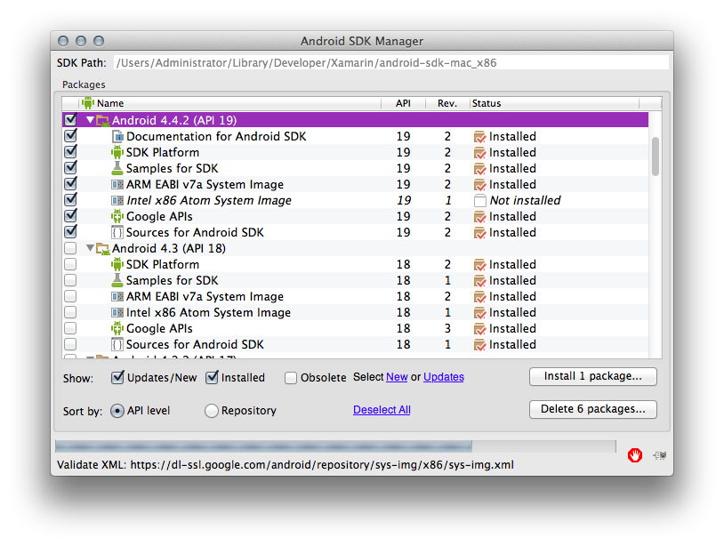](kitkat-images/api19.png#lightbox)

<a name="Migrating_Your_App_to_KitKat"></a>

## Migrating Your App to KitKat

This section provides some first-response items to help transition
existing applications to Android 4.4.

### Check System Version

If an application needs to be compatible with older versions of
Android, be sure to wrap any KitKat-specific code in a system version
check, as illustrated by the code sample below:

```csharp
if (Build.VERSION.SdkInt >= BuildVersionCodes.Kitkat) {
    //KitKat only code here
}
```

### Alarm Batching

Android uses alarm services to wake an app in the background at a
specified time. KitKat takes this a step further by batching alarms to
preserve power. This means that, in lieu of waking each app at an exact
time, KitKat prefers to group several applications that are registered
to wake during the same time interval, and wake them at the same time.
To tell Android to wake an app during a specified time interval, call
`SetWindow` on the
[`AlarmManager`](xref:Android.App.AlarmManager),
passing in the minimum and maximum time, in milliseconds, that can
elapse before the app is woken, and the operation to perform at wakeup.
The following code provides an example of an application that needs to
be woken between a half hour and an hour from the time the window is
set:

```csharp
AlarmManager alarmManager = (AlarmManager)GetSystemService(AlarmService);
alarmManager.SetWindow (AlarmType.Rtc, AlarmManager.IntervalHalfHour, AlarmManager.IntervalHour, pendingIntent);
```

To continue waking an app at an exact time, use `SetExact`, passing in
the exact time that the app should be woken, and the operation to
perform:

```csharp
alarmManager.SetExact (AlarmType.Rtc, AlarmManager.IntervalDay, pendingIntent);
```

KitKat no longer lets you set an exact repeating alarm. Applications
that use
[`SetRepeating`](xref:Android.App.AlarmManager.SetRepeating*)
and require exact alarms to work will now need to trigger each alarm
manually.

### External Storage

External storage is now divided into two types - storage unique to your
application, and data shared by multiple applications. Reading and
writing to your app's specific location on external storage requires no
special permissions. Interacting with data on shared storage now
requires the `READ_EXTERNAL_STORAGE` or `WRITE_EXTERNAL_STORAGE`
permission. The two types can be classified as such:

- If you're getting a file or directory path by calling a method on
  `Context` - for example,
  [`GetExternalFilesDir`](xref:Android.Content.Context.GetExternalFilesDir*)
  or
  [`GetExternalCacheDirs`](xref:Android.Content.Context.GetExternalCacheDirs)
  - your app requires no extra permissions.

- If you're getting a file or directory path by accessing a property or calling a method on
  `Environment` , such as
  [`GetExternalStorageDirectory`](xref:Android.OS.Environment.ExternalStorageDirectory)
  or
  [`GetExternalStoragePublicDirectory`](xref:Android.OS.Environment.GetExternalStoragePublicDirectory*)
  , your app requires the `READ_EXTERNAL_STORAGE` or
  `WRITE_EXTERNAL_STORAGE` permission.

> [!NOTE]
> `WRITE_EXTERNAL_STORAGE` implies the
`READ_EXTERNAL_STORAGE` permission, so you should only ever need to set
one permission.

### SMS Consolidation

KitKat simplifies messaging for the user by aggregating all SMS content
in one default application selected by the user. The developer is
responsible for making the app selectable as the default messaging
application, and behaving appropriately in code and in life if the
application is not selected. For more information on transitioning your
SMS app to KitKat, refer to the
[Getting Your SMS Apps Ready for KitKat](https://android-developers.blogspot.com/2013/10/getting-your-sms-apps-ready-for-kitkat.html)
guide from Google.

### WebView Apps

[WebView](xref:Android.Webkit.WebView)
got a makeover in KitKat. The biggest change is added security for
loading content into a `WebView`. While most applications targeting
older API versions should work as expected, testing applications that
use the `WebView` class is highly recommended. For more information
about affected WebView APIs refer to the Android
[Migrating to WebView in Android
4.4](https://developer.android.com/guide/webapps/migrating.html)
documentation.

<a name="user_experience"></a>

## User Experience

KitKat comes with several new APIs to enhance user experience,
including the new transition framework for handling property animations
and a translucent UI option for theming. These changes are covered
below.

### Transition Framework

The transition framework makes animations easier to implement. KitKat
lets you perform a simple property animation with just one line of
code, or customize transitions using *Scenes*.

#### Simple Property Animation

The new Android Transitions library simplifies the code behind property
animations. The framework allows you to perform simple animations with
minimal code. For example, the following code sample uses
[`TransitionManager.BeginDelayedTransition`](xref:Android.Transitions.TransitionManager.BeginDelayedTransition*)
to animate showing and hiding a `TextView`:

```csharp
using Android.Transitions;

public class MainActivity : Activity
{
    LinearLayout linear;
    Button button;
    TextView text;

    protected override void OnCreate (Bundle bundle)
    {
        base.OnCreate (bundle);
        SetContentView (Resource.Layout.Main);

        linear = FindViewById<LinearLayout> (Resource.Id.linearLayout);
        button = FindViewById<Button> (Resource.Id.button);
        text = FindViewById<TextView> (Resource.Id.textView);

        button.Click += (o, e) => {

            TransitionManager.BeginDelayedTransition (linear);

            if(text.Visibility != ViewStates.Visible)
            {
                text.Visibility = ViewStates.Visible;
            }
            else
            {
                text.Visibility = ViewStates.Invisible;
            }
        };
    }
}
```

The example above uses the transition framework to create an automatic,
default transition between the changing property values. Because the
animation is handled by a single line of code, you can easily make this
compatible with older versions of Android by wrapping the
`BeginDelayedTransition` call in a system version check. See the
[Migrating Your App To KitKat](#Migrating_Your_App_to_KitKat) section
for more.

The screenshot below shows the app before the animation:

[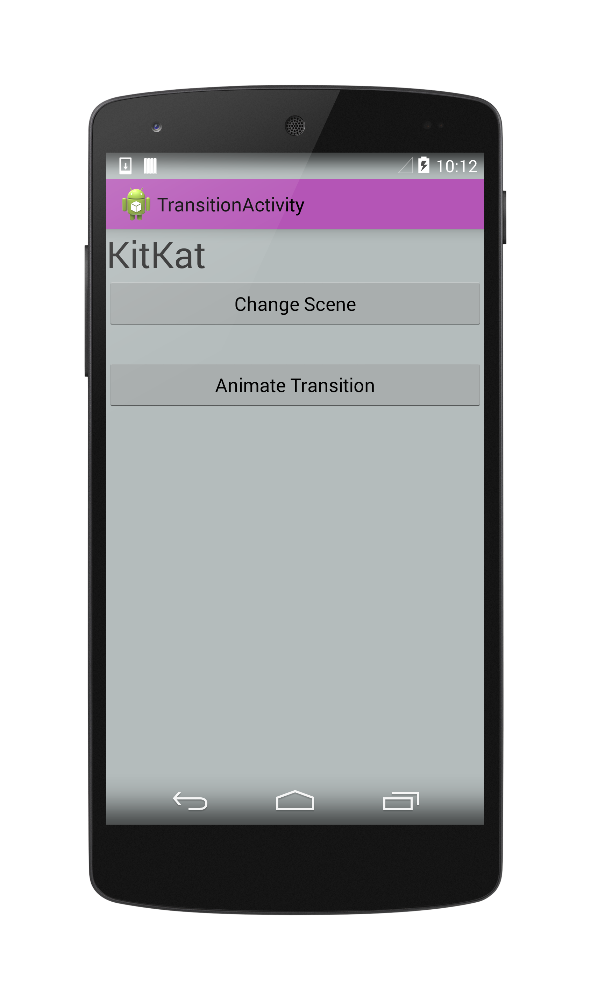](kitkat-images/trans-before.png#lightbox)

The screenshot below shows the app after the animation:

[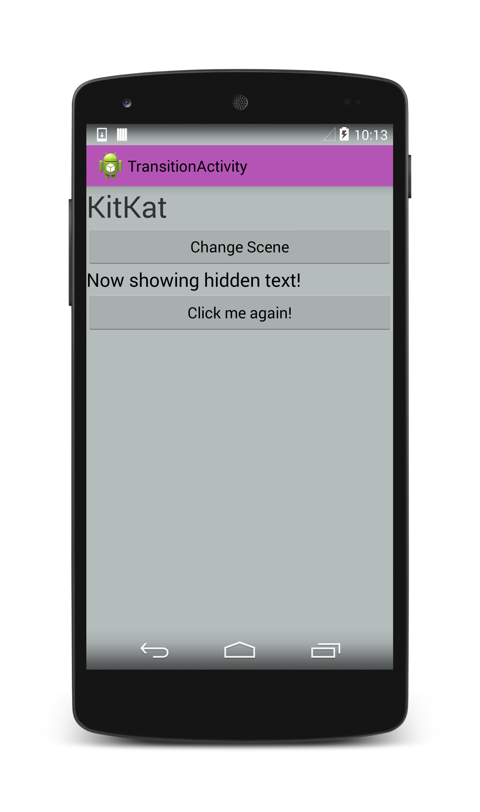](kitkat-images/trans-after.png#lightbox)

You can get more control over the transition with Scenes, which are covered in the next section.

#### Android Scenes

[Scenes](xref:Android.Transitions.Scene)
were introduced as part of the transition framework to give the
developer more control over animations. Scenes create a dynamic area in
the UI: you specify a container and several versions, or "scenes", for
the XML content inside the container, and Android does the rest of the
work to animate the transitions between the scenes. Android Scenes let
you build complex animations with minimal work on the development side.

The static UI element housing the dynamic content is a called a
*container* or *scene base*. The example below uses the Android
Designer to create a `RelativeLayout` called `container`:

[](kitkat-images/container.png#lightbox)

The sample layout also defines a button called `sceneButton` below the
`container`. This button will trigger the transition.

The dynamic content inside the container requires two new Android
layouts. These layouts specify only the code *inside* the container.
The example code below defines a layout called *Scene1* that contains
two text fields reading "Kit" and "Kat" respectively, and a second
layout called *Scene2* that contains the same text fields reversed. The
XML is as follows:

 **Scene1.axml**:

```xml
<?xml version="1.0" encoding="utf-8"?>
<merge xmlns:android="http://schemas.android.com/apk/res/android">
    <TextView
        android:id="@+id/textA"
        android:layout_width="wrap_content"
        android:layout_height="wrap_content"
        android:text="Kit"
        android:textSize="35sp" />
    <TextView
        android:id="@+id/textB"
        android:layout_width="wrap_content"
        android:layout_height="wrap_content"
        android:layout_toRightOf="@id/textA"
        android:text="Kat"
        android:textSize="35sp" />
</merge>
```

 **Scene2.axml**:

```xml
<?xml version="1.0" encoding="utf-8"?>
<merge xmlns:android="http://schemas.android.com/apk/res/android">
    <TextView
        android:id="@+id/textB"
        android:layout_width="wrap_content"
        android:layout_height="wrap_content"
        android:text="Kat"
        android:textSize="35sp" />
    <TextView
        android:id="@+id/textA"
        android:layout_width="wrap_content"
        android:layout_height="wrap_content"
        android:layout_toRightOf="@id/textB"
        android:text="Kit"
        android:textSize="35sp" />
</merge>
```

The example above uses `merge` to make the view code shorter and
simplify the view hierarchy. You can read more about `merge` layouts
[here](https://android-developers.blogspot.com/2009/03/android-layout-tricks-3-optimize-by.html).

A Scene is created by calling
[`Scene.GetSceneForLayout`](xref:Android.Transitions.Scene.GetSceneForLayout*),
passing in the container object, the Resource ID of the Scene's layout
file, and the current `Context`, as illustrated by the code example
below:

```csharp
RelativeLayout container = FindViewById<RelativeLayout> (Resource.Id.container);

Scene scene1 = Scene.GetSceneForLayout(container, Resource.Layout.Scene1, this);
Scene scene2 = Scene.GetSceneForLayout(container, Resource.Layout.Scene2, this);

scene1.Enter();
```

Clicking on the button flips between the two Scenes, which Android
animates with the default transition values:

```csharp
sceneButton.Click += (o, e) => {
    Scene temp = scene2;
    scene2 = scene1;
    scene1 = temp;

    TransitionManager.Go (scene1);
};
```

The screenshot below illustrates the scene before the animation:

[](kitkat-images/trans-after.png#lightbox)

The screenshot below illustrates the scene after the animation:

[](kitkat-images/scene.png#lightbox)

> [!NOTE]
> There is a
> [known bug](https://code.google.com/p/android/issues/detail?id=62450)
> in the Android Transitions library that causes Scenes created using
> `GetSceneForLayout` to break when a user navigates through an Activity
> the second time.

##### Custom Transitions in Scenes

A custom transition can be defined in an xml resource file in the
`transition` directory under `Resources`, as illustrated by the
screenshot below:

[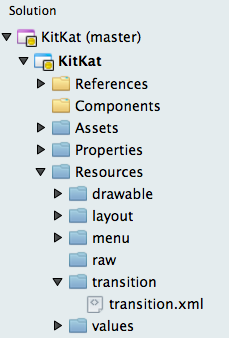](kitkat-images/resources.png#lightbox)

The following code sample defines a transition that animates for 5
seconds. See [more animation info at](https://developer.android.com/reference/android/support/animation/package-summary).

```xml
<changeBounds
  xmlns:android="http://schemas.android.com/apk/res/android"
  android:duration="5000"
  android:interpolator="@android:anim/overshoot_interpolator" />
```

The transition is created in the Activity using the
[TransitionInflater](xref:Android.Transitions.TransitionInflater),
as illustrated by the code below:

```csharp
Transition transition = TransitionInflater.From(this).InflateTransition(Resource.Transition.transition);
```

The new transition is then added to the `Go` call that begins the
animation:

```csharp
TransitionManager.Go (scene1, transition);
```

### Translucent UI

KitKat gives you more control over theming your app with optional
translucent status and navigation bars. You can change the
translucency of system UI elements in the same XML file you use to
define your Android theme. KitKat introduces the following properties:

- `windowTranslucentStatus` - When set to true, makes the top status
  bar translucent.

- `windowTranslucentNavigation` - When set to true, makes the bottom
  navigation bar translucent.

- `fitsSystemWindows` - Setting the top or bottom bar to transcluent
  shifts content under the transparent UI elements by default. Setting
  this property to `true` is a simple way to prevent content from
  overlapping with the translucent system UI elements.

The following code defines a theme with translucent status and
navigation bars:

```xml
<?xml version="1.0" encoding="UTF-8" ?>
<resources>
    <style name="KitKatTheme" parent="android:Theme.Holo.Light">
        <item name="android:windowBackground">@color/xamgray</item>
        <item name="android:windowTranslucentStatus">true</item>
        <item name="android:windowTranslucentNavigation">true</item>
        <item name="android:fitsSystemWindows">true</item>
        <item name="android:actionBarStyle">@style/ActionBar.Solid.KitKat</item>
    </style>

    <style name="ActionBar.Solid.KitKat" parent="@android:style/Widget.Holo.Light.ActionBar.Solid">
        <item name="android:background">@color/xampurple</item>
    </style>
</resources>
```

The screenshot below shows the theme above with translucent status and
navigation bars:

[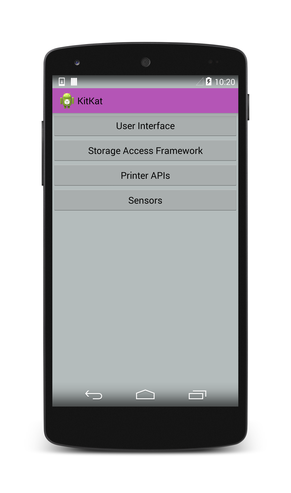](kitkat-images/theme.png#lightbox)

<a name="user_content"></a>

## User Content

### Storage-Access Framework

The Storage Access Framework (SAF) is a new way for users to interact
with stored content such as images, videos, and documents. Instead of
presenting users with a dialog to choose an application to handle
content, KitKat opens a new UI that allows users to access their data
in one aggregate location. Once content has been chosen, the user will
return to the application that requested the content, and the app
experience will continue as normal.

This change requires two actions on the developer side: first, apps
that require content from providers need to be updated to a new way of
requesting content. Second, applications that write data to a
`ContentProvider` need to be modified to use the new framework. Both
scenarios depend on the new
[`DocumentsProvider`](xref:Android.Provider.DocumentsProvider)
API.

#### DocumentsProvider

In KitKat, interactions with `ContentProviders` are abstracted with the
`DocumentsProvider` class. This means that SAF doesn't care where the
data is physically, as long as it is accessible through the
`DocumentsProvider` API. Local providers, cloud services, and external
storage devices all use the same interface, and are treated the same
way, providing the user and the developer with one place to interact
with the user's content.

This section covers how to load and save content with the Storage
Access Framework.

#### Request Content From a Provider

We can tell KitKat that we want to pick content using the SAF UI with
the `ActionOpenDocument` Intent, which signifies that we want to
connect to all content providers available to the device. You can add
some filtering to this Intent by specifying `CategoryOpenable`, which
means only content that can be opened (i.e. accessible, usable content)
will be returned. KitKat also allows filtering of content with the
`MimeType`. For example, the code below filters for image results by
specifying the image `MimeType`:

```csharp
Intent intent = new Intent (Intent.ActionOpenDocument);
intent.AddCategory (Intent.CategoryOpenable);
intent.SetType ("image/*");
StartActivityForResult (intent, save_request_code);
```

Calling `StartActivityForResult` launches the SAF UI, which the user
can then browse to choose an image:

[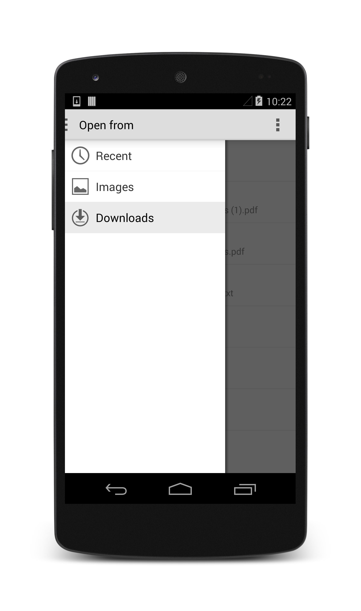](kitkat-images/saf-ui.png#lightbox)

After the user has chosen an image, `OnActivityResult` returns the
`Android.Net.Uri` of the chosen file. The code sample below displays
the user's image selection:

```csharp
protected override void OnActivityResult(int requestCode, Result resultCode, Intent data)
{
    base.OnActivityResult(requestCode, resultCode, data);

    if (resultCode == Result.Ok && data != null && requestCode == save_request_code) {
        imageView = FindViewById<ImageView> (Resource.Id.imageView);
        imageView.SetImageURI (data.Data);
    }
}
```

#### Write Content To a Provider

In addition to loading content from the SAF UI, KitKat also lets you
save content to any `ContentProvider` that implements the
`DocumentProvider` API. Saving content uses an `Intent` with
`ActionCreateDocument`:

```csharp
Intent intentCreate = new Intent (Intent.ActionCreateDocument);
intentCreate.AddCategory (Intent.CategoryOpenable);
intentCreate.SetType ("text/plain");
intentCreate.PutExtra (Intent.ExtraTitle, "NewDoc");
StartActivityForResult (intentCreate, write_request_code);
```

The above code sample loads the SAF UI, letting the user change the
file name and select a directory to house the new file:

[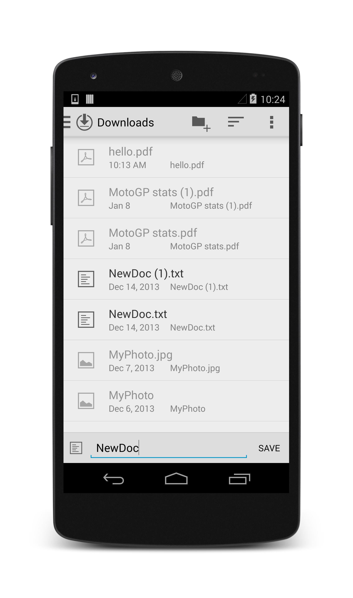](kitkat-images/saf-save.png#lightbox)

When the user presses **Save**, `OnActivityResult` gets passed the
`Android.Net.Uri` of the newly created file, which can be accessed with
`data.Data`. The uri can be used to stream data into the new file:

```csharp
protected override void OnActivityResult(int requestCode, Result resultCode, Intent data)
{
    base.OnActivityResult(requestCode, resultCode, data);

    if (resultCode == Result.Ok && data != null && requestCode == write_request_code) {
        using (Stream stream = ContentResolver.OpenOutputStream(data.Data)) {
            Encoding u8 = Encoding.UTF8;
            string content = "Hello, world!";
            stream.Write (u8.GetBytes(content), 0, content.Length);
        }
    }
}
```

Note that
[`ContentResolver.OpenOutputStream(Android.Net.Uri)`](xref:Android.Content.ContentResolver.OpenOutputStream*)
returns a `System.IO.Stream`, so the entire streaming process can be
written in .NET.

For more information on loading, creating, and editing content with the
Storage Access Framework, refer to the
[Android documentation for the Storage Access Framework](https://developer.android.com/guide/topics/providers/document-provider.html).

### Printing

Printing content is simplified in KitKat with the introduction of the
[Print Services](xref:Android.PrintServices)
and `PrintManager`. KitKat is also the first API version to fully
leverage the
[Google's Cloud Print service APIs](https://developers.google.com/cloud-print/) using the
[Google Cloud Print applications](https://play.google.com/store/search?q=google+cloud+print+plugin&c=apps).
Most devices that ship with KitKat automatically download Google Cloud
Print app and the
[HP Print Service Plugin](https://play.google.com/store/apps/details?id=com.hp.android.printservice)when
they first connect to WiFi. A user can check his or her device's Print
settings by navigating to **Settings > System > Printing**:

[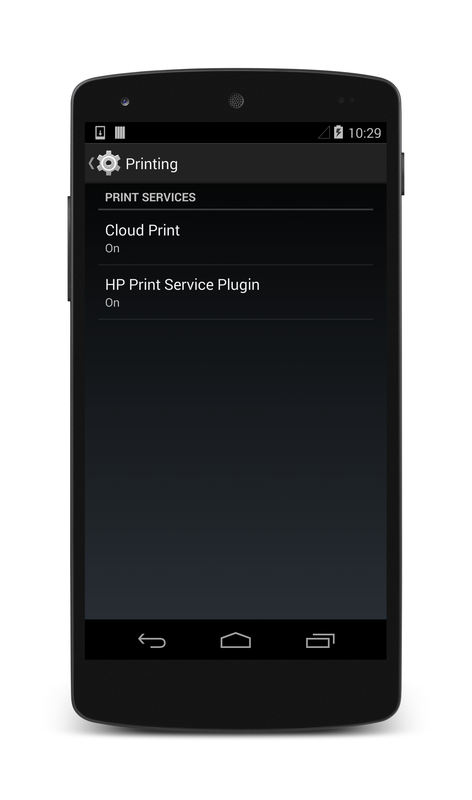](kitkat-images/printing.png#lightbox)

> [!NOTE]
> Although the printing APIs are set up to work with
> Google Cloud Print by default, Android still lets developers prepare
> print content using the new APIs, and send it to other applications to
> handle printing.

#### Printing HTML Content

KitKat automatically creates a
[`PrintDocumentAdapter`](xref:Android.Print.PrintDocumentAdapter) for
a web view with `WebView.CreatePrintDocumentAdapter`. Printing web
content is a coordinated effort between a
[`WebViewClient`](xref:Android.Webkit.WebViewClient) that
waits for the HTML content to load and lets the Activity know to make
the print option available in the options menu, and the Activity, which
waits for the user to select the Print option and calls `Print`on the
`PrintManager`. This section covers the basic setup required to print
on-screen HTML content.

Note that loading and printing web content requires the Internet permission:

[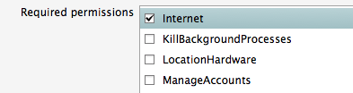](kitkat-images/internet.png#lightbox)

##### Print Menu Item

The print option will typically appear in the Activity's
[options menu](https://developer.android.com/guide/topics/ui/menus.html#options-menu).
The options menu lets users perform actions on an Activity. It is in
the top right corner of the screen, and looks like this:

[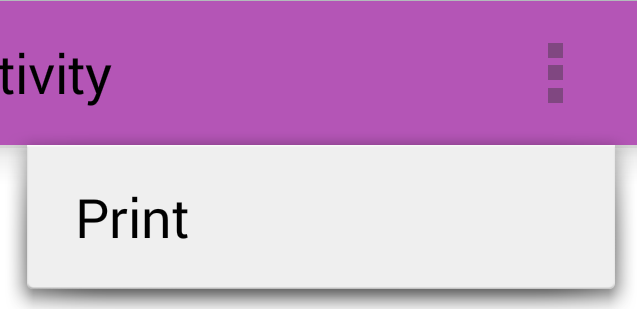](kitkat-images/menu.png#lightbox)

Additional menu items can be defined in the *menu*directory under
*Resources*. The code below defines a sample menu item called
[Print](xref:Android.Print.PrintManager):

```xml
<?xml version="1.0" encoding="utf-8"?>
<menu xmlns:android="http://schemas.android.com/apk/res/android">
    <item android:id="@+id/menu_print"
        android:title="Print"
        android:showAsAction="never" />
</menu>
```

Interaction with the options menu in the Activity happens through the
`OnCreateOptionsMenu` and `OnOptionsItemSelected` methods.
`OnCreateOptionsMenu` is the place to add new menu items, like the
Print option, from the *menu* resources directory.
`OnOptionsItemSelected` listens for the user selecting the Print option
from the menu, and begins printing:

```csharp
bool dataLoaded;

public override bool OnCreateOptionsMenu (IMenu menu)
{
    base.OnCreateOptionsMenu (menu);
    if (dataLoaded) {
        MenuInflater.Inflate (Resource.Menu.print, menu);
    }
    return true;
}

public override bool OnOptionsItemSelected (IMenuItem item)
{
    if (item.ItemId == Resource.Id.menu_print) {
        PrintPage ();
        return true;
    }
    return base.OnOptionsItemSelected (item);
}
```

The code above also defines a variable called `dataLoaded` to keep
track of the status of the HTML content. The `WebViewClient` will set
this variable to true when all content has loaded, so the Activity
knows to add the Print menu item to the options menu.

##### WebViewClient

The job of the `WebViewClient` is to ensure data in the `WebView` is
fully loaded before the print option appears in the menu, which it does
with the `OnPageFinished` method. `OnPageFinished` listens for web
content to finish loading, and tells the Activity to recreate its
options menu with `InvalidateOptionsMenu`:

```csharp
class MyWebViewClient : WebViewClient
{
    PrintHtmlActivity caller;

    public MyWebViewClient (PrintHtmlActivity caller)
    {
        this.caller = caller;
    }

    public override void OnPageFinished (WebView view, string url)
    {
        caller.dataLoaded = true;
        caller.InvalidateOptionsMenu ();
    }
}
```

`OnPageFinished` also sets the `dataLoaded` value to `true`, so
`OnCreateOptionsMenu` can recreate the menu with the Print option in
place.

##### PrintManager

The following code example prints the contents of a `WebView`:

```csharp
void PrintPage ()
{
    PrintManager printManager = (PrintManager)GetSystemService (Context.PrintService);
    PrintDocumentAdapter printDocumentAdapter = myWebView.CreatePrintDocumentAdapter ();
    printManager.Print ("MyWebPage", printDocumentAdapter, null);
}
```

`Print` takes as arguments: a name for the print job ("MyWebPage" in
this example), a
[`PrintDocumentAdapter`](xref:Android.Print.PrintDocumentAdapter)
that generates the print document from the content, and
[`PrintAttributes`](xref:Android.Print.PrintAttributes)
(`null` in the example above). You can specify `PrintAttributes` to
help lay out content on the printed page, although the default
attributes should handle most scenarios.

Calling `Print` loads the print UI, which lists options for the print
job. The UI gives users the option of printing or saving the HTML
content to a PDF, as illustrated by the screenshots below:

[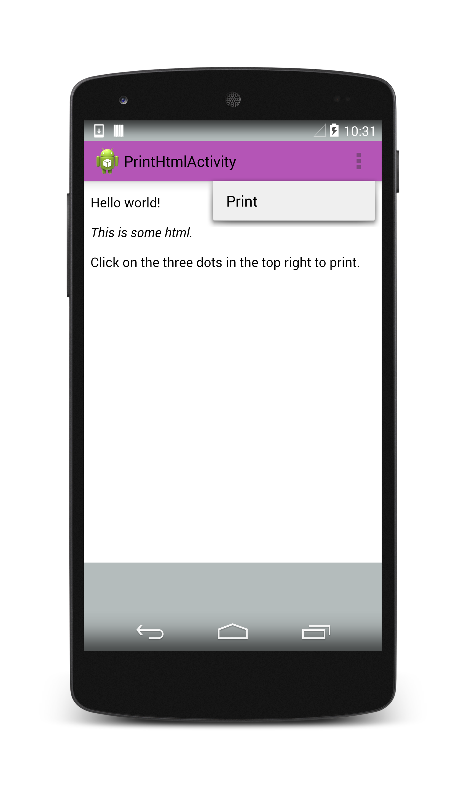](kitkat-images/print1.png#lightbox)

[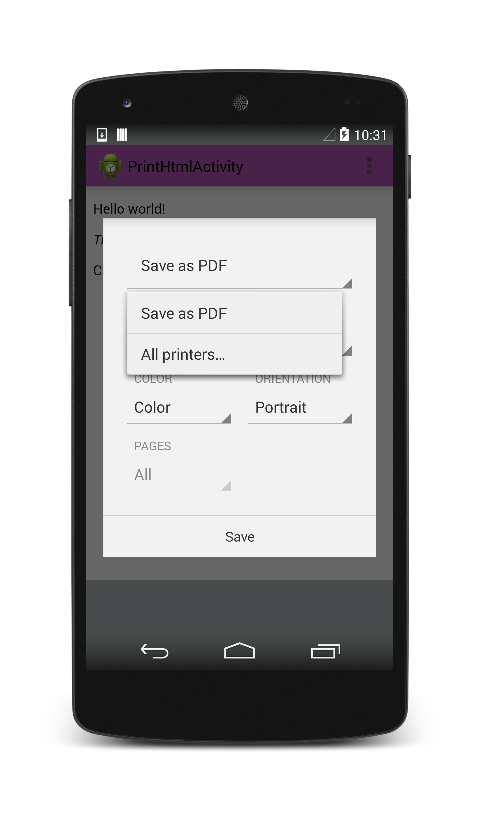](kitkat-images/print2.png#lightbox)

<a name="hardware"></a>

## Hardware

KitKat adds several APIs to accommodate new device features. The most
notable of these are Host-Based Card Emulation and the new
`SensorManager`.

### Host-Based Card Emulation in NFC

Host-Based Card Emulation (HCE) allows applications to behave like NFC
cards or NFC card readers without relying on the carrier's proprietary
Secure Element. Before setting up HCE, ensure HCE is available on the
device with `PackageManager.HasSystemFeature`:

```csharp
bool hceSupport = PackageManager.HasSystemFeature(PackageManager.FeatureNfcHostCardEmulation);
```

HCE requires that both the HCE feature and the `Nfc` permission be
registered with the application's `AndroidManifest.xml`:

```xml
<uses-feature android:name="android.hardware.nfc.hce" />
```

[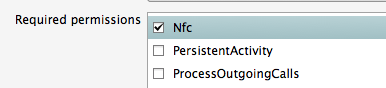](kitkat-images/nfc.png#lightbox)

To work, HCE has to be able to run in the background, and it
has to start when the user makes an NFC transaction, even if the
application using HCE is not running. We can accomplish this by writing
the HCE code as a `Service`. An HCE Service implements the
`HostApduService` interface, which implements the following methods:

- *ProcessCommandApdu* - An Application Protocol Data Unit (APDU) is
  what gets sent between the NFC Reader and the HCE Service. This
  method consumes an ADPU from the reader, and returns a data unit in
  response.

- *OnDeactivated* - The `HostAdpuService` is deactivated when the HCE
  Service is no longer communicating with the NFC Reader.

An HCE Service also needs to be registered with the application's
manifest, and decorated with the proper permissions, intent filter, and
metadata. The following code is an example of a `HostApduService`
registered with the Android Manifest using the `Service` attribute (for
more information on attributes, refer to the Xamarin
[Working with Android Manifest](~/android/platform/android-manifest.md)
guide):

```csharp
[Service(Exported=true, Permission="android.permissions.BIND_NFC_SERVICE"),
    IntentFilter(new[] {"android.nfc.cardemulation.HOST_APDU_SERVICE"}),
    MetaData("android.nfc.cardemulation.host.apdu_service",
    Resource="@xml/hceservice")]

class HceService : HostApduService
{
    public override byte[] ProcessCommandApdu(byte[] apdu, Bundle extras)
    {
        ...
    }

    public override void OnDeactivated (DeactivationReason reason)
    {
        ...
    }
}
```

The above Service provides a way for the NFC reader to interact with
the application, but the NFC reader still has no way of knowing if this
Service is emulating the NFC card it needs to scan. To help the NFC
reader identify the Service, we can assign the Service a unique
*Application ID (AID)*. We specify an AID, along with other metadata
about the HCE Service, in an xml resource file registered with the
`MetaData` attribute (see code example above). This resource file
specifies one or more AID filters - unique identifier strings in
hexadecimal format that correspond to the AIDs of one or more NFC
reader devices:

```xml
<host-apdu-service xmlns:android="http://schemas.android.com/apk/res/android"
    android:description="@string/hce_service_description"
    android:requireDeviceUnlock="false"
    android:apduServiceBanner="@drawable/service_banner">
    <aid-group android:description="@string/aid_group_description"
                android:category="payment">
        <aid-filter android:name="1111111111111111"/>
        <aid-filter android:name="0123456789012345"/>
    </aid-group>
</host-apdu-service>
```

In addition to AID filters, the xml resource file also provides a
user-facing description of the HCE Service, specifies an AID group
(payment application versus "other") and, in the case of a payment
application, a 260x96 dp banner to display to the user.

The setup outlined above provides the basic building blocks for an
application emulating an NFC card. NFC itself requires several more
steps and further testing to configure. For more information on
Host-based Card Emulation, refer to the
[Android documentation portal](https://developer.android.com/guide/topics/connectivity/nfc/hce.html).
For more information on using NFC with Xamarin, check out the
[Xamarin NFC samples](https://github.com/xamarin/monodroid-samples/tree/master/NfcSample).

### Sensors

KitKat provides access to the device's sensors through a
[`SensorManager`](xref:Android.Hardware.SensorManager).
The `SensorManager` allows the OS to schedule the delivery of sensor
information to an application in batches, preserving battery life.

KitKat also ships with two new sensor types for tracking the user's
steps. These are based on accelerometer and include:

- *StepDetector* - App is notified/woken when the user takes a step,
  and the detector provides a time value for when the step occurred.

- *StepCounter* - Keeps track of the number of steps the user has
  taken since the sensor was registered *until the next device reboot*.

The screenshot below depicts the step counter in action:

[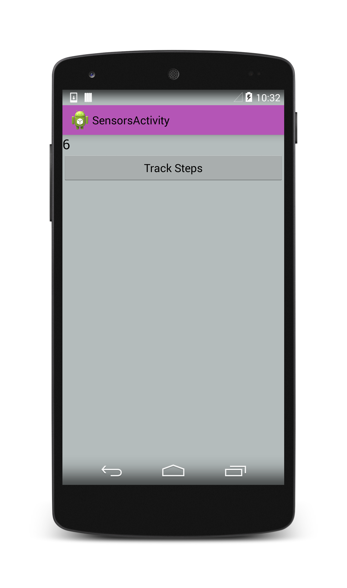](kitkat-images/stepcounter.png#lightbox)

You can create a `SensorManager` by calling
`GetSystemService(SensorService)` and casting the result as a
`SensorManager`. To use the step counter, call `GetDefaultSensor` on
the `SensorManager`. You can register the sensor and listen to changes
in step count with the help of the
[`ISensorEventListener`](xref:Android.Hardware.ISensorEventListener)
interface, as illustrated by the code sample below:

```csharp
public class MainActivity : Activity, ISensorEventListener
{
    float count = 0;

    protected override void OnCreate (Bundle bundle)
    {
        base.OnCreate (bundle);
        SetContentView (Resource.Layout.Main);

        SensorManager senMgr = (SensorManager) GetSystemService (SensorService);
        Sensor counter = senMgr.GetDefaultSensor (SensorType.StepCounter);
        if (counter != null) {
            senMgr.RegisterListener(this, counter, SensorDelay.Normal);
        }
    }

    public void OnAccuracyChanged (Sensor sensor, SensorStatus accuracy)
    {
        Log.Info ("SensorManager", "Sensor accuracy changed");
    }

    public void OnSensorChanged (SensorEvent e)
    {
        count = e.Values [0];
    }
}
```

`OnSensorChanged` is called if the step count updates while the
application is in the foreground. If the application enters the
background, or the device is asleep, `OnSensorChanged` will not be
called; however, the steps will continue to be counted until
`UnregisterListener` is called.

Keep in mind that *the step count value is cumulative across all
applications that register the sensor*. This means that even if you
uninstall and reinstall your application, and initialize the `count`
variable at 0 at application startup, the value reported by the sensor
will remain the total number of steps taken while the sensor was
registered, whether by your application or another. You can prevent
your application from adding to the step counter by calling
`UnregisterListener` on the `SensorManager`, as illustrated by the code
below:

```csharp
protected override void OnPause()
{
    base.OnPause ();
    senMgr.UnregisterListener(this);
}
```

Rebooting the device resets the step count to 0. Your app will require
extra code to ensure it is reporting an accurate count for the
application, regardless of other applications using the sensor or the
state of the device.

> [!NOTE]
> While the API for the step detection and counting
> ships with KitKat, not all phones are outfitted with the sensor. You
> can check if the sensor is available by running
> `PackageManager.HasSystemFeature(PackageManager.FeatureSensorStepCounter);`,
> or check to ensure the returned value of `GetDefaultSensor` isn't
> `null`.

<a name="developer_tools"></a>

## Developer Tools

### Screen Recording

KitKat includes new screen recording capabilities so that developers
can record applications in action. Screen recording is available
through the
[Android Debug Bridge (ADB)](https://developer.android.com/tools/help/adb.html)
client, which can be downloaded as part of the Android SDK.

To record your screen, connect your device; then, locate your Android
SDK installation, navigate to the **platform-tools** directory and run
the **adb** client:

```shell
adb shell screenrecord /sdcard/screencast.mp4
```

The above command will record a default 3-minute video at the default
resolution of 4Mbps. To edit the length, add the *--time-limit* flag.
To change the resolution, add the *--bit-rate* flag. The following
command will record a minute-long video at 8Mbps:

```shell
adb shell screenrecord --bit-rate 8000000 --time-limit 60 /sdcard/screencast.mp4
```

You can find your video on your device - it will appear in your Gallery
when the recording is complete.

## Other KitKat Additions

In addition to the changes described above, KitKat allows you to:

- *Use the Full Screen* - KitKat introduces a new
  [Immersive mode](https://developer.android.com/reference/android/view/View.html#setSystemUiVisibility(int))
  for browsing content, playing games, and running other applications
  that could benefit from a full-screen experience.

- *Customize Notifications* - Get additional details about system
  notifications with the
  [`NotificationListenerService`](xref:Android.Service.Notification.NotificationListenerService)
  . This lets you present the information in a different way inside
  your app.

- *Mirror Drawable Resources* - Drawable resources have a new
  [`autoMirrored`](https://developer.android.com/reference/android/R.attr.html#autoMirrored)
  attribute that tells the system create a mirrored version for images
  that require flipping for left-to-right layouts.

- *Pause Animations* - Pause and resume animations created with the
  [`Animator`](xref:Android.Animation.Animator)
  class.

- *Read Dynamically Changing Text* - Denote parts of UI that update
  dynamically with new text as "live regions" with the new
  [`accessibilityLiveRegion`](https://developer.android.com/reference/android/R.attr.html#accessibilityLiveRegion)
  attribute so the new text will be read automatically in
  accessibility mode.

- *Enhance Audio Experience* - Make tracks louder with the
  [`LoudnessEnhancer`](xref:Android.Media.Audiofx.LoudnessEnhancer)
  , find the Peak and RMS of an audio stream with the
  [`Visualizer`](xref:Android.Media.Audiofx.Visualizer.MeasurementModePeakRms)
  class, and get information from an
  [audio timestamp](xref:Android.Media.AudioTimestamp)
  to help with audio-video synchronization.

- *Sync ContentResolver at Custom Interval* - KitKat adds some
  variability to the time that a sync request is performed. Sync a
  `ContentResolver` at custom time or interval by calling
  `ContentResolver.RequestSync` and passing in a `SyncRequest`.

- *Distinguish Between Controllers* - In KitKat, controllers are
  assigned unique integer identifiers that can be accessed through the
  device's `ControllerNumber` property. This makes it easier to tell
  apart players in a game.

- *Remote Control* - With a few changes on both the hardware and
  software side, KitKat allows you to turn a device outfitted with an
  IR transmitter into a remote control using the `ConsumerIrService`,
  and interact with peripheral devices with the new
  [`RemoteController`](xref:Android.Media.RemoteController)
  APIs.

For more information on the above API changes, please refer to the
Google [Android 4.4 APIs](https://developer.android.com/about/versions/android-4.4.html)
overview.

## Summary

This article introduced some of the new APIs available in Android 4.4
(API Level 19), and covered best practices when transitioning an
application to KitKat. It outlined changes to the APIs affecting user
experience, including the *transition framework* and new options for
*theming*. Next, it introduced the *Storage-Access Framework* and
`DocumentsProvider` class, as well as the new *printing APIs*. It
explored *NFC host-based card emulation* and how to work with
*low-power sensors*, including two new sensors for tracking the user's
steps. Finally, it demonstrated capturing real-time demos of
applications with *screen recording*, and provided a detailed list of
KitKat API changes and additions.

## Related Links

- [KitKat Sample](/samples/xamarin/monodroid-samples/kitkat)
- [Android 4.4 APIs](https://developer.android.com/about/versions/android-4.4.html)
- [Android KitKat](https://developer.android.com/about/versions/kitkat.html)