# Lollipop Features

_This article provides a high level overview of the new features introduced in Android 5.0 (Lollipop). These features include a new user interface style called Material Theme, as well as new supporting features such as animations, view shadows, and drawable tinting. Android 5.0 also includes enhanced notifications, two new UI widgets, a new job scheduler, and a handful of new APIs to improve storage, networking, connectivity, and multimedia capabilities._

## Lollipop Overview

Android 5.0 (Lollipop) introduces a new design language, *Material Design*, and
with it a supporting cast of new features to make apps easier and more
intuitive to use. With Material Design, Android 5.0 not only gives Android
phones a facelift; it also provides a new set of design rules for
Android-based tablets, desktop computers, watches, and smart TVs. These
design rules emphasize simplicity and minimalism while making use of
familiar tactile attributes (such as realistic surface and edge cues) to
help users quickly and intuitively understand the interface.

*Material Theme* is the embodiment of these UI design principles in
Android. This article begins by covering Material Theme's supporting features:

- **Animations** &ndash; *Touch feedback* animations, *activity transition*
    animations, *view state transition* animations, and a *reveal effect*.

- **View shadows and elevation** &ndash; Views now have an `elevation` property;
    views with higher `elevation` values cast larger shadows on the background.

- **Color features** &ndash; *Drawable tinting* makes it possible for you to
    reuse image assets by changing their color, and *prominent color extraction*
    helps you dynamically theme your app based on colors in an image.

Many Material Theme features are already built into the Android 5.0 UI
experience, while others must be explicitly added to apps. For example,
some standard views (such as buttons) already include touch feedback
animations, while apps must enable most view shadows.

In addition to the UI improvements brought about through Material
Theme, Android 5.0 also includes several other new features that are
covered in this article:

- **Enhanced notifications** &ndash; Notifications in Android 5.0 have
    been significantly updated with a new look, support for lockscreen
    notifications, and a new *Heads-up* notification presentation format.

- **New UI widgets** &ndash; The new `RecyclerView` widget makes it easier
    for apps to convey large data sets and complex information, and the new
    `CardView` widget provides a simplified card-like presentation format for
    displaying text and images.

- **New APIs** &ndash; Android 5.0 adds new APIs for multiple network
    support, improved Bluetooth connectivity, easier storage management,
    and more flexible control of multimedia players and camera devices. A
    new job scheduling feature is available to run tasks asynchronously at
    scheduled times. This feature helps to improve battery life by, for
    example, scheduling tasks to take place when the device is plugged in
    and charging.

## Requirements

The following is required to use the new Android 5.0 features in
Xamarin-based apps:

- **Xamarin.Android** &ndash; Xamarin.Android 4.20 or later must be installed and
    configured with either Visual Studio or Visual Studio for Mac.

- **Android SDK** &ndash; Android 5.0 (API 21) or later must be
    installed via the Android SDK Manager.

- **Java Developer Kit** &ndash; Xamarin.Android requires
    [JDK 1.8](https://www.oracle.com/technetwork/java/javase/downloads/jdk8-downloads-2133151.html) or
    later if you are developing for API level 24 or greater (JDK 1.8 also supports API levels earlier
    than 24, including Lollipop). The 64-bit version of JDK 1.8 is required if you
    are using custom controls or the Forms Previewer.

You can continue to use
[JDK 1.7](https://www.oracle.com/technetwork/java/javase/downloads/jdk7-downloads-1880260.html)
if you are developing specifically for API level 23 or earlier.

## Setting Up an Android 5.0 Project

To create an Android 5.0 project, you must install the latest tools and
SDK packages. Use the following steps to set up a Xamarin.Android project
that targets Android 5.0:

1. Install Xamarin.Android tools and activate your Xamarin license. See
   [Setup and Installation](~/android/get-started/installation/index.md) for more
   information about installing Xamarin.Android.

2. If you are using Visual Studio for Mac, install the latest Android 5.0
   updates.

3. Start the Android SDK Manager (in Visual Studio for Mac, use **Tools &gt;
   Open Android SDK Manager&hellip;**) and install Android SDK Tools
   23.0.5 or later:

    [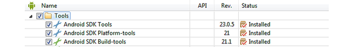](lollipop-images/android-l-tools.png#lightbox)

   Also, install the latest Android 5.0 SDK packages (API 21 or later):

    [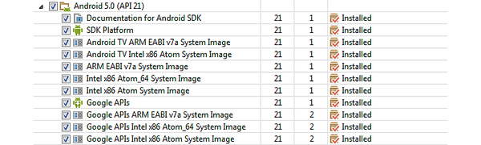](lollipop-images/android-l-sdk-pkgs.png#lightbox)

   For more information about using the Android SDK Manager, see
   [SDK Manager](https://developer.android.com/tools/help/sdk-manager.html).

4. Create a new Xamarin.Android project. If you are new to Android
   development with Xamarin, see
   [Hello, Android](~/android/get-started/hello-android/index.md) to
   learn about creating Android projects. When you create an Android
   project, be sure to configure the version settings for Android 5.0.
   In Visual Studio for Mac, navigate to **Project Options &gt; Build &gt;
   General** and set **Target framework** to **Android 5.0 (Lollipop)**
   or later:

    

   Under **Project Options &gt; Build &gt; Android Application**, set
   minimum and target Android version to **Automatic - use target
   framework version**:

    

5. Configure an emulator or an Android device to test your app. If you
   are using an emulator, see
   [Android Emulator Setup](~/android/get-started/installation/android-emulator/index.md)
   to learn how to configure an Android emulator for use with Xamarin
   Studio or Visual Studio. If you are using an Android device, see
   [Setting Up the Preview SDK](https://developer.android.com/preview/setup-sdk.html) to learn
   how to update your device for Android 5.0. To configure your Android
   device for running and debugging Xamarin.Android applications, see
   [Set Up Device for Development](~/android/get-started/installation/set-up-device-for-development.md).

Note: If you are updating an existing Android project that was targeting
the Android L Preview, you must update the **Target
Framework** and **Android version** to the
values described above.

## Important Changes

Previously published Android apps could be affected by changes
in Android 5.0. In particular, Android 5.0 uses a new runtime and a
significantly changed notification format.

### Android Runtime

Android 5.0 uses the new Android Runtime (ART) as the default runtime
instead of Dalvik. ART implements several major new features:

- **Ahead-of-time (AOT) compilation** &ndash; AOT can improve app
    performance by compiling app code before the app is first launched. When
    an app is installed, ART generates a compiled app executable for the
    target device.

- **Improved garbage collection (GC)** &ndash; GC improvements in ART
    can also improve app performance. Garbage collection now uses one GC
    pause instead of two, and concurrent GC operations complete in a more
    timely fashion.

- **Improved app debugging** &ndash; ART provides more diagnostic detail
    to help in analyzing exceptions and crash reports.

Existing apps should work without change under ART &ndash; except for apps
that exploit techniques unique to the previous Dalvik runtime, which may not
work under ART. For more information about these changes,
see [Verifying App Behavior on the Android Runtime (ART)](https://developer.android.com/guide/practices/verifying-apps-art.html).

### Notification Changes

Notifications have changed significantly in Android 5.0:

- **Sounds and vibration are handled differently** &ndash; Notification
    sounds and vibrations are now handled by `Notification.Builder` instead
    of `Ringtone`, `MediaPlayer`, and `Vibrator`.

- **New color scheme** &ndash; In accordance with Material Theme,
    notifications are rendered with dark text over white or very light
    backgrounds. Also, alpha channels in notification icons may be
    modified by Android to coordinate with system color schemes.

- **Lockscreen notifications** &ndash; Notifications can now
    appear on the device lockscreen.

- **Heads-up** &ndash; High-priority notifications now
    appear in a small floating window (Heads-up notification) when the
    device is unlocked and the screen is turned on.

In most cases, porting existing app notification functionality to
Android 5.0 requires the following steps:

1. Convert your code to use `Notification.Builder` (or
    `NotificationsCompat.Builder`) for creating notifications.

2. Verify that your existing notification assets are viewable
    in the new Material Theme color scheme.

3. Decide what visibility your notifications should have when
    they are presented on the lockscreen. If a notification is not
    public, what content should show up on the lockscreen?

4. Set the category of your notifications so they are handled
    correctly in the new Android 5.0 *Do not disturb* mode.

If your notifications present transport controls, display media playback status,
use `RemoteControlClient`, or call `ActivityManager.GetRecentTasks`, see
[Important Behavior Changes](https://developer.android.com/preview/api-overview.html#Behaviors)
for more information about updating your notifications for Android 5.0.

For information about creating notifications in Android, see
[Local Notifications](~/android/app-fundamentals/notifications/local-notifications.md).

## Material Theme

The new Android 5.0 Material Theme brings sweeping changes to the look and
feel of the Android UI. Visual elements now use tactile surfaces that
take on the bold graphics, typography, and bright colors of print-based
design. Examples of Material Theme are depicted in the following screenshots:

[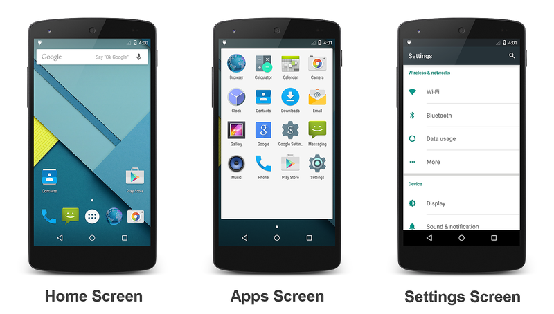](lollipop-images/android-5-gallery-labeled.png#lightbox)

Android 5.0 greets you with the home screen shown on the left. The
center screenshot is the first screen of the app list, and the
screenshot on the right is the **Settings** screen. Google's
[Material Design](https://material.io/guidelines/material-design/introduction.html)
specification explains the underlying design rules behind the new
Material Theme concept.

Material Theme includes three built-in flavors that you can use in your
app: the `Theme.Material` dark theme (the default), the
`Theme.Material.Light` theme, and the
`Theme.Material.Light.DarkActionBar` theme:

[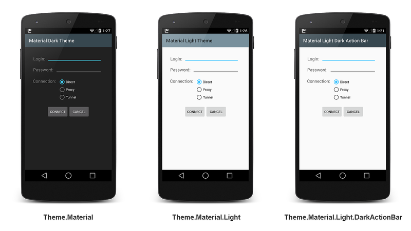](lollipop-images/three-material-themes.png#lightbox)

For more about using Material Theme features in Xamarin.Android apps, see
[Material Theme](~/android/user-interface/material-theme.md).

## Animations

Android 5.0 provides touch feedback animations, activity transition
animations, and view state transition animations to make app interfaces
more intuitive to use. Also, Android 5.0 apps can use *reveal effect*
animations to hide or reveal views. You can use *curved motion* settings
to configure how quickly or slowly animations are rendered.

### Touch Feedback Animations

Touch feedback animations provide users with visual feedback when a view
has been touched. For example, buttons now display a ripple effect when
they are touched &ndash; this is the default touch feedback animation in
Android 5.0. Ripple animation is implemented by the new `RippleDrawable`
class. The ripple effect can be configured to end at the bounds of the
view or extend beyond the bounds of the view. For example, the following
sequence of screenshots illustrates the ripple effect in a button during
touch animation:

Initial touch contact with the button occurs in the first image on the
left, while the remaining sequence (from left to right) illustrates how
the ripple effect spreads out to the edge of the button. When the ripple
animation ends, the view returns to its original appearance. The default
ripple animation takes place in a fraction of a second, but the length
of the animation can be customized for longer or shorter lengths of
time.

For more on touch feedback animations in Android 5.0,
see [Customize Touch Feedback](https://developer.android.com/training/material/animations.html#Touch).

### Activity Transition Animations

Activity transition animations give users a sense of visual continuity
when one activity transitions to another. Apps can specify three types
of transition animations:

- **Enter transition** &ndash; For when an activity enters the scene.

- **Exit transition** &ndash; For when an activity exits the scene.

- **Shared element transition** &ndash; For when a view that is
    common to two activities changes as the first activity transitions to
    the next.

For example, the following sequence of screenshots illustrates a shared
element transition:

[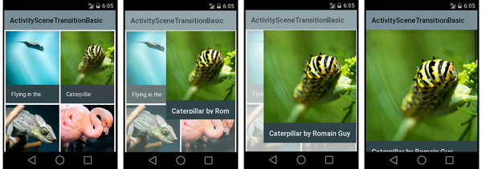](lollipop-images/activity-transition.png#lightbox)

A shared element (a photo of a caterpillar) is one of several views in
the first activity; it enlarges to become the only view in the second
activity as the first activity transitions to the second.

#### Enter Transition Animation Types

For enter transitions, Android 5.0 provides three types of animations:

- **Explode animation** &ndash; Enlarges a view from the center of the scene.

- **Slide animation** &ndash; Moves a view in from one of the edges of a scene.

- **Fade animation** &ndash; Fades a view into the scene.

#### Exit Transition Animation Types

For exit transitions, Android 5.0 provides three types of animations:

- **Explode animation** &ndash; Shrinks a view to the center of the scene.

- **Slide animation** &ndash; Moves a view out to one of the edges of a scene.

- **Fade animation** &ndash; Fades a view out of the scene.

#### Shared Element Transition Animation Types

Shared element transitions support multiple types of animations, such as:

- Changing the layout or clip bounds of a view.

- Changing the scale and rotation of a view.

- Changing the size and scale type for a view.

For more about activity transition animations in Android 5.0, see
[Customize Activity Transitions](https://developer.android.com/training/material/animations.html#Transitions).

### View State Transition Animations

Android 5.0 makes it possible for animations to run when the state of a
view changes. You can animate view state transitions by using one of the
following techniques:

- Create drawables that animate state changes associated with a
    particular view. The new `AnimatedStateListDrawable` class lets you
    create drawables that display animations between view state changes.

- Define animation functionality that runs when the state of a view
    changes. The new `StateListAnimator` class lets you define an animator
    that runs when the state of a view changes.

For more about view state transition animations in
Android 5.0, see [Animate View State Changes](https://developer.android.com/training/material/animations.html#ViewState).

### Reveal Effect

The *reveal effect* is a clipping circle that changes radius to reveal
or hide a view. You can control this effect by setting the initial
and final radius of the clipping circle. The following sequence of
screenshots illustrates a reveal effect animation from the center of the
screen:

[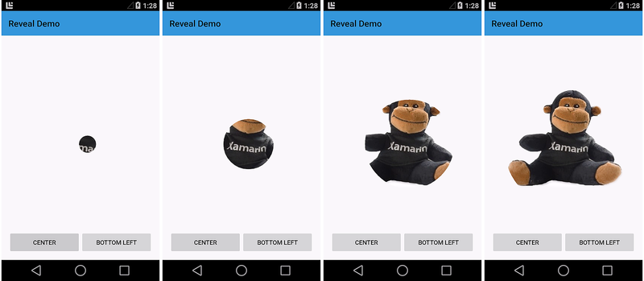](lollipop-images/reveal-center.png#lightbox)

The next sequence illustrates a reveal effect animation that takes place
from the bottom left corner of the screen:

[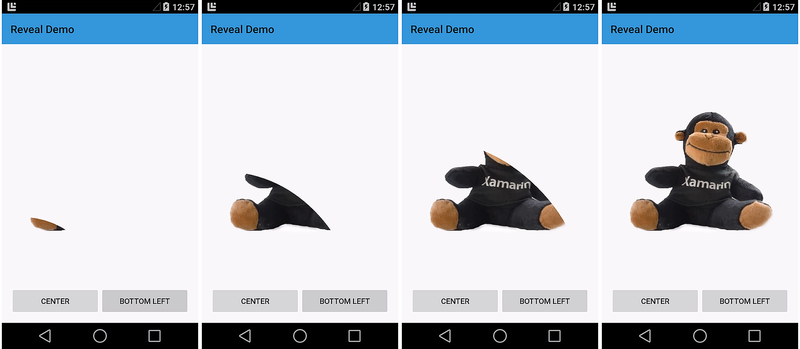](lollipop-images/reveal-left.png#lightbox)

Reveal animations can be reversed; that is, the clipping circle can
shrink to hide the view rather than enlarge to reveal the view.

For more information on the Android 5.0 reveal effect in,
see [Use the Reveal Effect](https://developer.android.com/training/material/animations.html#Reveal).

### Curved Motion

In addition to these animation features, Android 5.0 also provides
new APIs that enable you to specify the time and motion curves of
animations. Android 5.0 uses these curves to interpolate temporal and
spatial movement during animations. Three curves are defined in
Android 5.0:

- **Fast\_out\_linear\_in** &ndash; Accelerates quickly and continues to
    accelerate until the end of the animation.

- **Fast\_out\_slow\_in** &ndash; Accelerates quickly and slowly
    decelerates towards the end of the animation.

- **Linear\_out\_slow\_in** &ndash; Begins with a peak velocity and
    slowly decelerates to the end of the animation.

You can use the new `PathInterpolator` class to specify how motion interpolation
takes place. `PathInterpolator` is an interpolator that traverses animation paths
according to specified control points and motion curves. For more information about
how to specify curved motion settings in Android 5.0,
see [Use Curved Motion](https://developer.android.com/training/material/animations.html#CurvedMotion).

## View Shadows & Elevation

In Android 5.0, you can specify the *elevation* of a view by setting
a new `Z` property. A greater `Z` value causes the view to cast a
larger shadow on the background, making the view appear to float higher
above the background. You can set the initial elevation of a view by
configuring its `elevation` attribute in the layout.

The following example illustrates the shadows cast by an empty
`TextView` control when its elevation attribute is set to 2dp, 4dp, and
6dp, respectively:

View shadow settings can be static (as shown above) or they can be used
in animations to make a view appear to temporarily rise above the
view's background. You can use the `ViewPropertyAnimator` class to
animate the elevation of a view. The elevation of a view is the sum of
its layout `elevation` setting plus a `translationZ` property that you
can set through a `ViewPropertyAnimator` method call.

For more about view shadows in Android 5.0,
see [Defining Shadows and Clipping Views](https://developer.android.com/training/material/shadows-clipping.html).

## Color Features

Android 5.0 provides two new features for managing color in apps:

- *Drawable tinting* lets you alter the colors of image assets by
    changing a layout attribute.

- *Prominent color extraction* makes it possible for you to dynamically
    customize your app's color theme to coordinate with the color palette of
    a displayed image.

### Drawable Tinting

Android 5.0 layouts recognize a new `tint` attribute that you can use to
set the color of drawables without having to create multiple versions
of these assets to display different colors. To use this feature, you
define a bitmap as an alpha mask and use the `tint` attribute to define
the color of the asset. This makes it possible for you to create assets
once and color them in your layout to match your theme.

In the following example, a single image asset &ndash; a white logo with a
transparent background &ndash; is used to create tint variations:

This logo is displayed above a blue circular background as shown in
the following examples. The image on the left is how the logo appears
without a `tint` setting. In the center image, the logo's `tint`
attribute is set to a dark gray. In the image on the right, `tint` is
set to a light gray:

For more about drawable tinting in Android 5.0,
see [Drawable Tinting](https://developer.android.com/training/material/drawables.html#DrawableTint).

### Prominent Color Extraction

The new Android 5.0 `Palette` class lets you extract colors from an image
so that you can dynamically apply them to a custom color palette. The
`Palette` class extracts six colors from an image and labels these
colors according to their relative levels of color saturation and
brightness:

- Vibrant

- Vibrant dark

- Vibrant light

- Muted

- Muted dark

- Muted light

For example, in the following screenshots, a photo viewing app extracts
the prominent colors from the image on display and uses these colors to
adapt the color scheme of the app to match the image:

[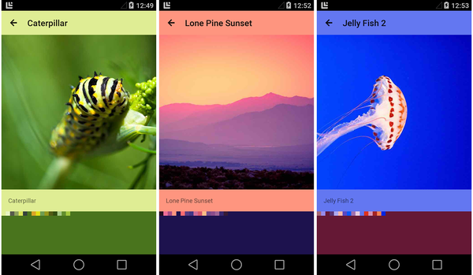](lollipop-images/prominent-color-extraction.png#lightbox)

In the above screenshots, the action bar is set to the extracted
"vibrant light" color and the background is set to the extracted
"vibrant dark" color. In each example above, a row of small color
squares is included to illustrate the palette colors that were
extracted from the image.

For more about color extraction in Android 5.0,
see [Extracting Prominent Colors from an Image](https://developer.android.com/training/material/drawables.html#ColorExtract).

## New UI Widgets

Android 5.0 introduces two new UI widgets:

- `RecyclerView` &ndash; A view group that displays a list of scrollable items.

- `CardView` &ndash; A basic layout with rounded corners.

Both widgets include baked-in support for Material Theme features; for
example, `RecyclerView` uses animations for adding and removing views,
and `CardView` uses view shadows to make each card appear to float above
the background. Examples of these new widgets are shown in the following
screenshots:

[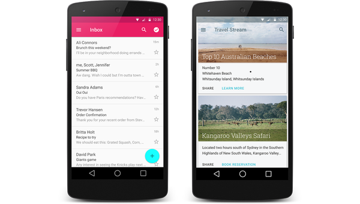](lollipop-images/recyclerview-cardview.png#lightbox)

The screenshot on the left is an example of `RecyclerView` as used in an
email app, and the screenshot on the right is an example of `CardView`
as used in a travel reservation app.

### RecyclerView

`RecyclerView` is similar to `ListView,` but it is better suited for
large sets of views or lists with elements that change dynamically. Like
`ListView,` you specify an adapter to access the underlying data
set. However, unlike `ListView,` you use a *layout manager* to position
items within `RecyclerView`. The layout manager also takes care of view
recycling; it manages the reuse of item views that are no longer visible
to the user.

When you use a `RecyclerView` widget, you must specify a `LayoutManager`
and an adapter. As shown in this figure, `LayoutManager` is the
intermediary between the adapter and the `RecyclerView`:

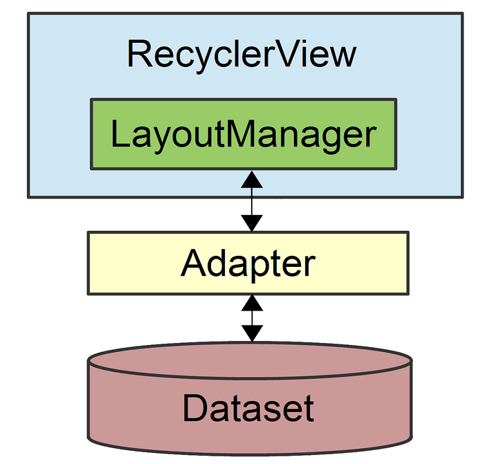

The following screenshots illustrate a `RecyclerView` that contains 100
items (each item consists of an `ImageView` and a `TextView`):

[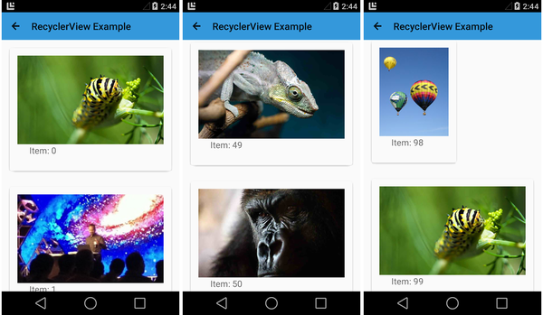](lollipop-images/recyclerview-scroll.png#lightbox)

`RecyclerView` handles this large data set with ease &ndash; scrolling
from the beginning of the list to end of the list in this sample app
takes only a few seconds. `RecyclerView` also supports animations;
in fact, animations for adding and removing items are enabled by
default. When an item is added to a `RecyclerView`, it fades in as shown
in this sequence of screenshots:

[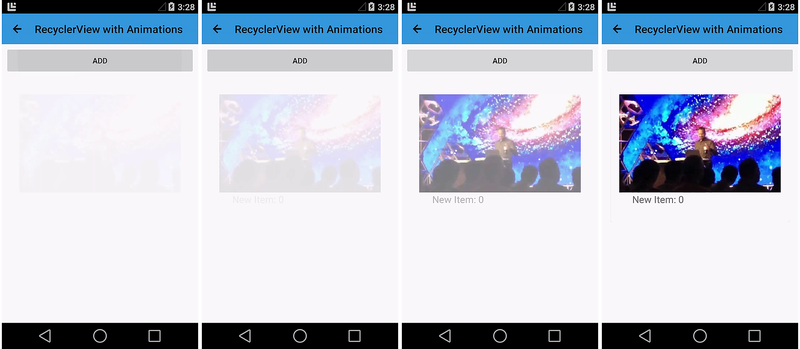](lollipop-images/recyclerview-animation.png#lightbox)

For more about `RecyclerView`,
see [RecyclerView](~/android/user-interface/layouts/recycler-view/index.md).

### CardView

`CardView` is a simple view that simulates a floating card with rounded
corners. Because `CardView` has built-in view shadows, it provides
an easy way for you to add visual depth to your app. The following
screenshots show three text-oriented examples of `CardView`:

Each of the cards in the above example contains a `TextView`; the
background color is set via the `cardBackgroundColor` attribute.

For more about `CardView`,
see [CardView](~/android/user-interface/controls/card-view.md).

## Enhanced Notifications

The notification system in Android 5.0 has been significantly updated with
a new visual format and new features. Notifications have a new look in
Android 5.0. For example, notifications in Android 5.0 now use dark text
over a light background:

When a large icon is displayed in a notification (as shown in the
above example), Android 5.0 presents the small icon as a badge over the
large icon.

In Android 5.0, notifications can also appear on the device lockscreen.
For example, here is an example screenshot of a lockscreen with a single
notification:

[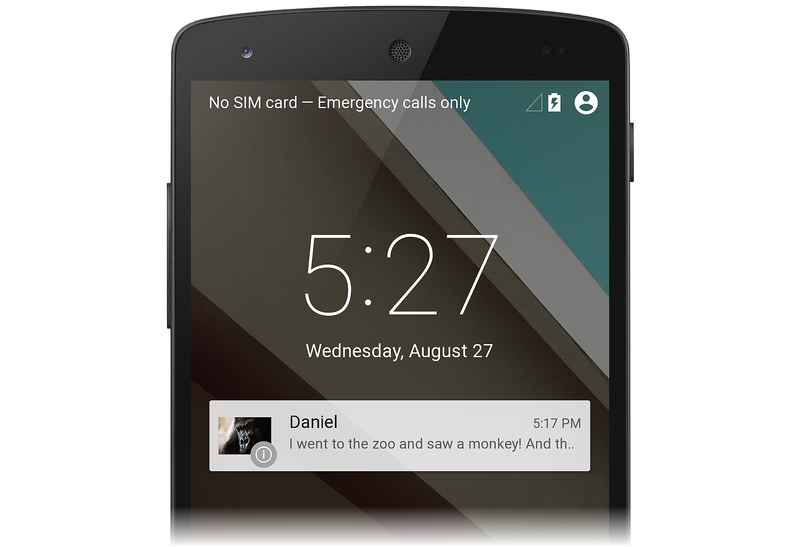](lollipop-images/lockscreen-notification.png#lightbox)

Users can double-tap a notification on the lockscreen to unlock
the device and jump to the app that originated that notification,
or swipe to dismiss the notification. Notifications have a new
*visibility* setting that determines how much content can be displayed
on the lockscreen. Users can choose whether to allow sensitive content
to be shown in lockscreen notifications.

Android 5.0 introduces a new high-priority notification presentation
format called *Heads-up*. Heads-up notifications slide down from the
top of the screen for a few seconds and then retreat back to the
notification shade at the top of the screen. Heads-up notifications make
it possible for the system UI to put important information in front
of the user without disrupting the currently running activity.
The following example illustrates a simple Heads-up notification that
displays on top of an app:

[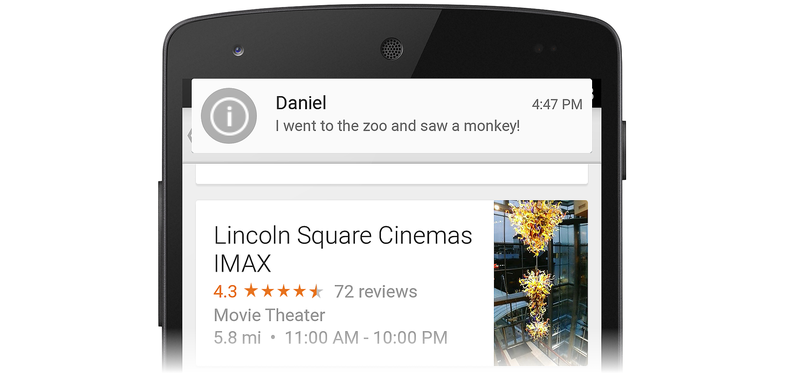](lollipop-images/heads-up-notification.png#lightbox)

Heads-up notifications are typically used for the following events:

- A new next message

- An incoming phone call

- Low battery indication

- An alarm

Android 5.0 displays a notification in Heads-up format only when it has a
high or max priority setting.

In Android 5.0, you can provide notification metadata to help Android
sort and display notifications more intelligently. Android 5.0 organizes
notifications according to priority, visibility, and category.
Notification categories are used to filter which notifications can be
presented when the device is in *Do not disturb* mode.

For detailed information about creating and launching notifications
with the latest Android 5.0 features, see
[Local Notifications](~/android/app-fundamentals/notifications/local-notifications.md).

## New APIs

In addition to the new look-and-feel features described above, Android
5.0 adds new APIs that extend the capabilities of existing multimedia,
storage, and wireless/connectivity functionality. Also, Android 5.0
includes new APIs that provide support for a new job scheduler feature.

### Camera

Android 5.0 provides several new APIs for enhanced camera
capabilities. The new `Android.Hardware.Camera2` namespace includes
functionality for accessing individual camera devices connected to an
Android device. Also, `Android.Hardware.Camera2` models each camera
device as a pipeline: it accepts a capture request, captures the image,
and then outputs the result. This approach makes it possible for apps to
queue multiple capture requests to a camera device.

The following APIs make these new features possible:

- `CameraManager.GetCameraIdList` &ndash; Helps you to programmatically
    access camera devices; you use `CameraManager.OpenCamera` to connect to
    a specific camera device.

- `CameraCaptureSession` &ndash; Captures or streams images from the
    camera device. You implement a `CameraCaptureSession.CaptureListener`
    interface to handle new image capture events.

- `CaptureRequest` &ndash; Defines capture parameters.

- `CaptureResult` &ndash; Provides the results of an image capture operation.

For more about the new camera APIs in Android 5.0,
see [Media](https://developer.android.com/about/versions/android-5.0.html#Media).

### Audio Playback

Android 5.0 updates the `AudioTrack` class for better audio playback:

- `ENCODING_PCM_FLOAT` &ndash; Configures `AudioTrack` to accept
    audio data in floating-point format for better dynamic range, greater
    headroom, and higher quality (thanks to increased precision). Also,
    floating-point format helps to avoid audio clipping.

- `ByteBuffer` &ndash; You can now supply audio data to `AudioTrack`
    as a byte array.

- `WRITE_NON_BLOCKING` &ndash; This option simplifies buffering and
     multithreading for some apps.

For more about `AudioTrack` improvements in Android 5.0,
see [Media](https://developer.android.com/about/versions/android-5.0.html#Media).

### Media Playback Control

Android 5.0 introduces the new `Android.Media.MediaController` class,
which replaces `RemoteControlClient`. `Android.Media.MediaController`
provides simplified transport control APIs and offers thread-safe
control of playback outside of the UI context. The following new APIs
handle transport control:

- `Android.Media.Session.MediaSession` &ndash; A media
    control session that handles multiple controllers. You call
    `MediaSession.GetSessionToken` to request a token that your app uses to
    interact with the session.

- `MediaController.TransportControls` &ndash; Handles transport
    commands such as **Play**, **Stop**, and **Skip**.

Also, you can use the new `Android.App.Notification.MediaStyle` class
to associate a media session with rich notification content (such as
extracting and showing album art).

For more about the new media playback control features in Android 5.0,
see [Media](https://developer.android.com/about/versions/android-5.0.html#Media).

### Storage

Android 5.0 updates the Storage Access Framework to make it easier for
applications to work with directories and documents:

- To select a directory subtree, you can build and send an
    `Android.Intent.Action.OPEN_DOCUMENT_TREE` intent. This intent causes
    the system to display all provider instances that support subtree
    selection; the user then browses and selects a directory.

- To create and manage new documents or directories anywhere under
    a subtree, you use the new `CreateDocument`, `RenameDocument`, and
    `DeleteDocument` methods of `DocumentsContract`.

- To get paths to media directories on all shared storage devices, you
    call the new `Android.Content.Context.GetExternalMediaDirs` method.

For more about new storage APIs in Android 5.0,
see [Storage](https://developer.android.com/preview/api-overview.html#Storage).

### Wireless & Connectivity

Android 5.0 adds the following API enhancements for wireless and connectivity:

- New *multi-network* APIs that make it possible for apps to find and
    select networks with specific capabilities before making a connection.

- Bluetooth broadcasting functionality that enables an Android 5.0 device
    to act as a low-energy Bluetooth peripheral.

- NFC enhancements that make it easier to use near-field communications
    functionality for sharing data with other devices.

For more about the new wireless and connectivity APIs in Android 5.0,
see [Wireless and Connectivity](https://developer.android.com/preview/api-overview.html#Wireless).

### Job Scheduling

Android 5.0 introduces a new `JobScheduler` API that can help users
minimize battery drain by scheduling certain tasks to run only when the
device is plugged in and charging. This job scheduler feature can also
be used for scheduling a task to run when conditions are more suitable
to that task, such as downloading a large file when the device is
connected over a Wi-Fi network instead of a metered network.

For more about the new job scheduling APIs in Android 5.0,
see [Scheduling Jobs](https://developer.android.com/preview/api-overview.html#JobScheduler).

## Summary

This article provided an overview of important new features in Android 5.0
for Xamarin.Android app developers:

- Material Theme

- Animations

- View shadows and elevation

- Color features, such as drawable tinting and prominent
    color extraction

- The new `RecyclerView` and `CardView` widgets

- Notification enhancements

- New APIs for camera, audio playback, media control, storage,
    wireless/connectivity, and job scheduling

If you are new to Xamarin Android development, read
[Setup and Installation](~/android/get-started/installation/index.md)
to help you get started with Xamarin.Android.
[Hello, Android](~/android/get-started/hello-android/index.md) is an
excellent introduction for learning how to create Android projects.

## Related Links

- [Android L Developer Preview](https://developer.android.com/preview/index.html)
- [Get the Android SDK](https://developer.android.com/sdk/index.html#Other)
- [Material Design](https://developer.android.com/preview/material/index.html)
