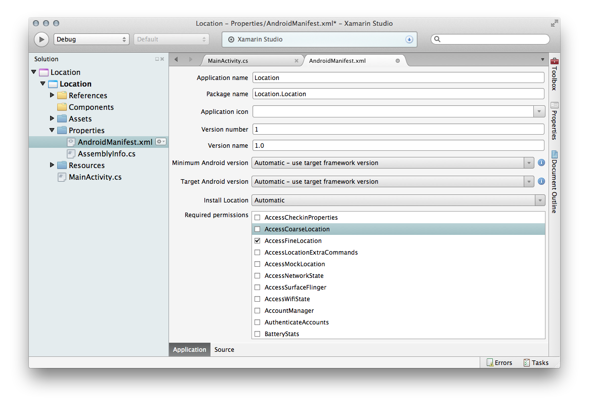
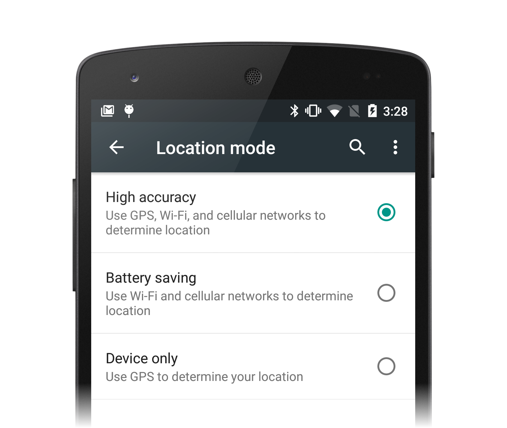
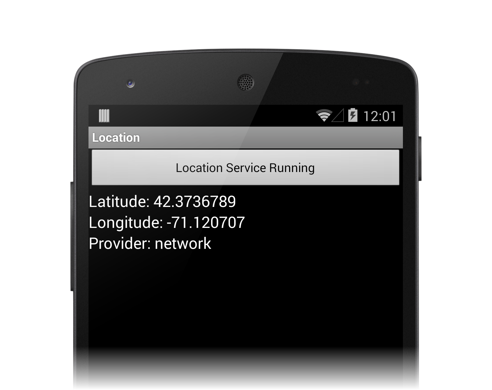

# Location services on Android

_This guide introduces location-awareness in Android applications and illustrates how to get the user's location using the Android Location Service API, as well as the fused location provider available with the Google Location Services API._

Android provides access to various location technologies such as cell tower location, Wi-Fi, and GPS. The details of each location technology are abstracted through *location providers*, allowing applications to obtain locations in the same way regardless of the provider used. This guide introduces the fused location provider, a part of the Google Play Services, which intelligently determines the best way to obtain the location of the devices based on what providers are available and how the device is being used. Android Location Service API and shows how to communicate with the system location Service using a `LocationManager`. The second part of the guide explores the Android Location Services API using the `LocationManager`.

As a general rule of thumb, applications should prefer to use the fused location provider, falling back the older Android Location Service API only when necessary.

## Location fundamentals

In Android, no matter what API you choose for working with location data, several concepts remain the same. This section introduces Location Providers and location-related permissions.

### Location providers

Several technologies are used internally to pinpoint the user's
location. The hardware used depends on the type of *location provider*
selected for the job of collecting data. Android uses three location
providers:

- **GPS Provider** &ndash; GPS gives the most accurate location, uses
    the most power, and works best outdoors. This provider uses a
    combination of GPS and assisted GPS
    ([aGPS](https://en.wikipedia.org/wiki/Assisted_GPS)), which returns
    GPS data collected by cellular towers.

- **Network Provider** &ndash; Provides a combination of WiFi and
    Cellular data, including aGPS data collected by cell towers. It
    uses less power than the GPS Provider, but returns location data of
    varying accuracy.

- **Passive Provider** &ndash; A "piggyback" option using providers
    requested by other applications or Services to generate location
    data in an application. This is a less reliable but power-saving
    option ideal for applications that don't require constant location
    updates to work.

Location providers are not always available. For example, we might want
to use GPS for our application, but GPS might be turned off in
Settings, or the device might not have GPS at all. If a specific
provider is not available, choosing that provider might return `null`.

### Location permissions

A location-aware application needs access a device's hardware sensors
to receive GPS, Wi-Fi, and cellular data. Access is controlled
through appropriate permissions in the application's Android Manifest.
There are two permissions available &ndash; depending on your application's
requirements and your choice of API, you will want to allow one:

- `ACCESS_FINE_LOCATION` &ndash; Allows an application access to GPS.
    Required for the *GPS Provider* and *Passive Provider* options
    (*Passive Provider needs permission to access GPS data collected by
    another application or Service*). Optional permission for the
    *Network Provider*.

- `ACCESS_COARSE_LOCATION` &ndash; Allows an application access to
    Cellular and Wi-Fi location. Required for *Network Provider* if
    `ACCESS_FINE_LOCATION` is not set.

For apps that target API version 21 (Android 5.0 Lollipop) or higher,
you can enable `ACCESS_FINE_LOCATION` and still run on devices that do
not have GPS hardware. If your app requires GPS hardware, you should
explicitly add an `android.hardware.location.gps` `uses-feature`
element to the Android Manifest. For more information, see the Android
[uses-feature](https://developer.android.com/guide/topics/manifest/uses-feature-element.html)
element reference.

To set the permissions, expand the **Properties** folder in the
**Solution Pad** and double-click **AndroidManifest.xml**. The
permissions will be listed under **Required Permissions**:

[](location-images/location-01-xs.png#lightbox)

Setting either of these permissions tells Android that your application needs permission from the user in order to access to the location providers. Devices that run API level 22 (Android 5.1) or lower will ask the user to grant these permissions each time the app is installed. On devices running API level 23 (Android 6.0) or higher, the app should perform a run-time permission check before making a request of the location provider. 

> [!NOTE]
>Note: Setting `ACCESS_FINE_LOCATION` implies access to both coarse and
fine location data. You should never have to set both permissions, only
the *minimal* permission your app requires to work.

This snippet is an example of how to check that an app has permission for the `ACCESS_FINE_LOCATION` permission:

```csharp
 if (ContextCompat.CheckSelfPermission(this, Manifest.Permission.AccessFineLocation) == Permission.Granted)
{
    StartRequestingLocationUpdates();
    isRequestingLocationUpdates = true;
}
else
{
    // The app does not have permission ACCESS_FINE_LOCATION 
}
```

Apps must be tolerant of the scenario where the user will not grant permission (or has revoked the permission) and have a way to gracefully deal with that situation. Please see the [Permissions guide](~/android/app-fundamentals/permissions.md) for more details on implementing run-time permission checks in Xamarin.Android.

## Using the fused location provider

The fused location provider is the preferred way for Android applications to receive location updates from the device because it will efficiently select the location provider during run time to provide the best location information in a battery-efficient fashion. For example, a user walking around outdoors gets the best location reading with GPS. If the user then walks indoors, where GPS works poorly (if at all), the fused location provider may automatically switch to WiFi, which works better indoors.

The fused location provider API provides a variety of other tools to
empower location-aware applications, including geofencing and activity
monitoring. In this section, we are going to focus on the basics of
setting up the `LocationClient`, establishing providers, and getting
the user's location.

The fused location provider is part of
[Google Play Services](https://developer.android.com/google/play-services/index.html).
The Google Play Services package must be installed and configured
properly in the application for the fused location provider API to
work, and the device must have the Google Play Services APK installed.

Before a Xamarin.Android application can use the fused location
provider, it must add the **Xamarin.GooglePlayServices.Location** package
to the project. In addition, the following `using` statements should be
added to any source files that reference the classes described below:

```csharp
using Android.Gms.Common;
using Android.Gms.Location;
```

### Checking if Google Play Services is installed

A Xamarin.Android will crash if it tries to use the fused location provider when Google Play Services is not installed (or out of date) then a runtime exception would occur.  If Google Play Services is not installed, then the application should fall back to the Android Location Service discussed above. If Google Play Services is out of date, then the app could display a message to the user asking them to update the installed version of Google Play Services.

This snippet is an example of how an Android Activity can programmatically check if Google Play Services is installed:

```csharp
bool IsGooglePlayServicesInstalled()
{
    var queryResult = GoogleApiAvailability.Instance.IsGooglePlayServicesAvailable(this);
    if (queryResult == ConnectionResult.Success)
    {
        Log.Info("MainActivity", "Google Play Services is installed on this device.");
        return true;
    }

    if (GoogleApiAvailability.Instance.IsUserResolvableError(queryResult))
    {
        // Check if there is a way the user can resolve the issue
        var errorString = GoogleApiAvailability.Instance.GetErrorString(queryResult);
        Log.Error("MainActivity", "There is a problem with Google Play Services on this device: {0} - {1}",
                  queryResult, errorString);

        // Alternately, display the error to the user.
    }

    return false;
}
```

### FusedLocationProviderClient

To interact with the fused location provider, a Xamarin.Android application must have an instance of the `FusedLocationProviderClient`. This class exposes the necessary methods to subscribe to location updates and to retrieve the last known location of the device.

The `OnCreate` method of an Activity is a suitable place to get a reference to the `FusedLocationProviderClient`, as demonstrated in the following code snippet:

```csharp
public class MainActivity: AppCompatActivity
{
    FusedLocationProviderClient fusedLocationProviderClient;

    protected override void OnCreate(Bundle bundle) 
    {
        fusedLocationProviderClient = LocationServices.GetFusedLocationProviderClient(this);
    }
}
```

### Getting the last known location

The `FusedLocationProviderClient.GetLastLocationAsync()` method provides a simple, non-blocking way for a Xamarin.Android application to quickly obtain the last known location of the device with minimal coding overhead.

This snippet shows how to use the `GetLastLocationAsync` method to retrieve the location of the device:

```csharp
async Task GetLastLocationFromDevice()
{
    // This method assumes that the necessary run-time permission checks have succeeded.
    getLastLocationButton.SetText(Resource.String.getting_last_location);
    Android.Locations.Location location = await fusedLocationProviderClient.GetLastLocationAsync();

    if (location == null)
    {
        // Seldom happens, but should code that handles this scenario
    }
    else
    {
        // Do something with the location 
        Log.Debug("Sample", "The latitude is " + location.Latitude);
    }
}
```

### Subscribing to location updates

A Xamarin.Android application can also subscribe to location updates from the fused location provider using the `FusedLocationProviderClient.RequestLocationUpdatesAsync`  method, as shown in this code snippet:

```csharp
await fusedLocationProviderClient.RequestLocationUpdatesAsync(locationRequest, locationCallback);
```

This method takes two parameters:

- **`Android.Gms.Location.LocationRequest`** &ndash; A
    `LocationRequest` object is how a Xamarin.Android application
    passes the parameters on how the fused location provider should
    work. The `LocationRequest` holds information such as how frequent
    requests should be made or how important an accurate location
    update should be. For example, an important location request will
    cause the device to use the GPS, and consequently more power, when
    determining the location. This code snippet shows how to create a
    `LocationRequest` for a location with high accuracy, checking
    approximately every five minutes for a location update (but not
    sooner than two minutes between requests). The fused location
    provider will use a `LocationRequest` as guidance for which
    location provider to use when trying to determine the device
    location:

    ```csharp
    LocationRequest locationRequest = new LocationRequest()
                                      .SetPriority(LocationRequest.PriorityHighAccuracy)
                                      .SetInterval(60 * 1000 * 5)
                                      .SetFastestInterval(60 * 1000 * 2);
    ```

- **`Android.Gms.Location.LocationCallback`** &ndash; In order to
    receive location updates, a Xamarin.Android application must
    subclass the `LocationProvider` abstract class. This class exposed
    two methods which maybe invoked by the fused location provider to
    update the app with location information. This will be discussed in
    more detail below.

To notify a Xamarin.Android application of a location update, the fused
location provider will invoke the
`LocationCallBack.OnLocationResult(LocationResult result)`. The
`Android.Gms.Location.LocationResult` parameter will contain the update
location information.

When the fused location provider detects a change in the availability
of location data, it will call the
`LocationProvider.OnLocationAvailability(LocationAvailability
locationAvailability)` method. If the
`LocationAvailability.IsLocationAvailable` property returns `true`,
then it can be assumed that the device location results reported by
`OnLocationResult` are as accurate and as up to date as required by the
`LocationRequest`. If `IsLocationAvailable` is false, then no location
results will be return by `OnLocationResult`.

This code snippet is a sample implementation of the `LocationCallback` object:

```csharp
public class FusedLocationProviderCallback : LocationCallback
{
    readonly MainActivity activity;

    public FusedLocationProviderCallback(MainActivity activity)
    {
        this.activity = activity;
    }

    public override void OnLocationAvailability(LocationAvailability locationAvailability)
    {
        Log.Debug("FusedLocationProviderSample", "IsLocationAvailable: {0}",locationAvailability.IsLocationAvailable);
    }

    public override void OnLocationResult(LocationResult result)
    {
        if (result.Locations.Any())
        {
            var location = result.Locations.First();
            Log.Debug("Sample", "The latitude is :" + location.Latitude);
        }
        else
        {
            // No locations to work with.
        }
    }
}
```

## Using the Android Location Service API

The Android Location Service is an older API for using location
information on Android. Location data is collected by hardware sensors
and collected by a system service, which is accessed in the application
with a `LocationManager` class and an `ILocationListener`.

The Location Service is best suited for applications that must run on devices that do not have Google Play Services installed.

The Location Service is a special type of
[Service](https://developer.android.com/guide/components/services.html)
managed by the System. A System Service interacts with the device
hardware and is always running. To tap into location updates in our
application, we will subscribe to location updates from the system
Location Service using a `LocationManager` and a
`RequestLocationUpdates` call.

To obtain the user's location using Android Location Service involves several steps:

1. Get a reference to the `LocationManager` service.
2. Implement the `ILocationListener` interface and handle events when the location changes.
3. Use the `LocationManager` to request location updates for a specified provider. The `ILocationListener` from the previous step will be used to receive callbacks from the `LocationManager`.
4. Stop location updates when the application it is no longer appropriate to receive updates.

### Location Manager

We can access the system location service with an instance of the
`LocationManager` class. `LocationManager` is a special class that lets
us interact with the system location Service and call methods on it. An
application can get a reference to the `LocationManager` by calling
`GetSystemService` and passing in a Service type, as shown below:

```csharp
LocationManager locationManager = (LocationManager) GetSystemService(Context.LocationService);
```

`OnCreate` is a good place to get a reference to the `LocationManager`.
It's a good idea to keep the `LocationManager` as a class variable, so
that we can call it at various points in the Activity lifecycle.

### Request location updates from the LocationManager

Once the application has a reference to the `LocationManager`, it needs to tell the `LocationManager` what type of location information that are required, and how often that information is to be updated. Do this by calling `RequestLocationUpdates` on the `LocationManager` object, and passing in some criteria for updates and a callback that will receive the location updates. This callback is a type that must implement the `ILocationListener` interface (described in more detail later in this guide).

The `RequestLocationUpdates` method tells the system location Service that your application would like to start receiving location updates. This method allows you to specify the provider, as well as time and distance thresholds to control update frequency. For example, the method below requests location updates from the GPS location provider every 2000 milliseconds, and only when the location changes more than 1 metre:

```csharp
// For this example, this method is part of a class that implements ILocationListener, described below
locationManager.RequestLocationUpdates(LocationManager.GpsProvider, 2000, 1, this);
```

An application should request location updates only as often as
required for the application to perform well. This preserves battery
life and creates a better experience for the user.

### Responding to updates from the LocationManager

Once an application has requested updates from the `LocationManager`, it can receive information from the Service by implementing the [`ILocationListener`](xref:Android.Locations.ILocationListener) interface. This interface provides four methods for listening to the location Service and the location provider, `OnLocationChanged`. The System will call `OnLocationChanged` when the user's location changes enough to qualify as a location change according to the Criteria set when requesting location updates. 

The following code shows the methods in the  `ILocationListener` interface:

```csharp
public class MainActivity : AppCompatActivity, ILocationListener
{
    TextView latitude;
    TextView longitude;
    
    public void OnLocationChanged (Location location)
    {
        // called when the location has been updated.
    }
    
    public OnProviderDisabled(string locationProvider)
    {
        // called when the user disables the provider
    }
    
    public OnProviderEnabled(string locationProvider)
    {
        // called when the user enables the provider
    }
    
    public OnStatusChanged(string locationProvider, Availability status, Bundle extras)
    {
        // called when the status of the provider changes (there are a variety of reasons for this)
    }
}
```

### Unsubscribing to LocationManager updates

In order to conserve system resources, an application should unsubscribe to location updates as soon as possible. The `RemoveUpdates` method tells the `LocationManager` to stop sending updates to our application.  As an example, an Activity may call `RemoveUpdates` in the  `OnPause` method so that we are able to conserve power if an application doesn't need location updates while its Activity is not on the screen:

```csharp
protected override void OnPause ()
{
    base.OnPause ();
    locationManager.RemoveUpdates (this);
}
```

If your application needs to get location updates while in the
background, you'll want to create a custom Service that subscribes to
the system Location Service. Refer to the
[Backgrounding with Android Services](~/android/app-fundamentals/services/index.md)
guide for more information.

### Determining the best location provider for the LocationManager

The application above sets GPS as the location provider. However, GPS may not be available in all cases, such as if the device is indoors or does not have a GPS receiver. If this is the case, the result is a `null` return for the Provider.

To get your app to work when GPS is not available, you use the `GetBestProvider` method to ask for the best available (device-supported and user-enabled) location provider at application launch. Instead of passing in a specific provider, you can tell `GetBestProvider` the requirements for the provider - such as accuracy and power - with a [`Criteria` object](xref:Android.Locations.Criteria). `GetBestProvider` returns the best provider for the given Criteria.

The following code shows how to get the best available provider and use
it when requesting location updates:

```csharp
Criteria locationCriteria = new Criteria();   
locationCriteria.Accuracy = Accuracy.Coarse;
locationCriteria.PowerRequirement = Power.Medium;

locationProvider = locationManager.GetBestProvider(locationCriteria, true);

if(locationProvider != null)
{
    locationManager.RequestLocationUpdates (locationProvider, 2000, 1, this);
}
else
{
    Log.Info(tag, "No location providers available");
}
```

> [!NOTE]
> If the user has disabled all location providers,
> `GetBestProvider` will return `null`. To see how this code works on a
> real device, be sure to enable GPS, Wi-Fi, and cellular networks under
> **Google Settings > Location > Mode** as shown in this screenshot:
>
> [](location-images/location-02.png#lightbox)
>
> The screenshot below demonstrates the location application running using `GetBestProvider`:
>
> [](location-images/location-03.png#lightbox)
>
> Keep in mind that `GetBestProvider` does not change the provider dynamically. Rather, it determines the best available provider once during the Activity lifecycle. If the provider status changes after it has been set, the application will require additional code in the `ILocationListener` methods &ndash; `OnProviderEnabled`, `OnProviderDisabled`, and `OnStatusChanged` &ndash; to handle every possibility related to the provider switch.

## Summary

This guide covered obtaining the user's location using both the Android
Location Service and the fused location provider from Google Location
Services API.

## Related links

- [Location (sample)](/samples/xamarin/monodroid-samples/location)
- [FusedLocationProvider (sample)](/samples/xamarin/monodroid-samples/fusedlocationprovider)
- [Google Play Services](https://developer.android.com/google/play-services/index.html)
- [Criteria Class](/dotnet/api/Android.Locations.Criteria)
- [LocationManager Class](/dotnet/api/Android.Locations.LocationManager)
- [LocationListener Class](/dotnet/api/android.locations.ilocationlistener)
- [LocationRequest Class](/dotnet/api/android.locations.locationrequest)