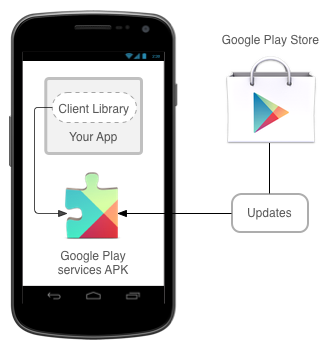
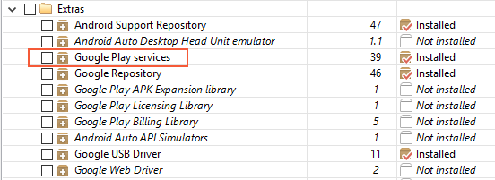
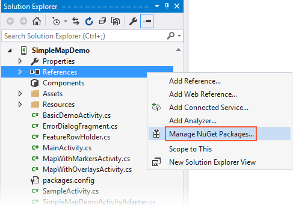
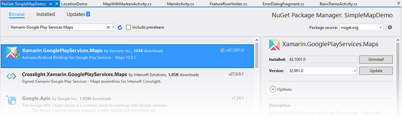
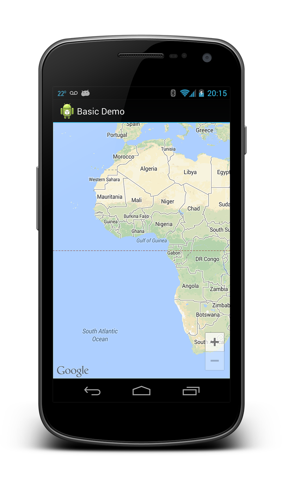
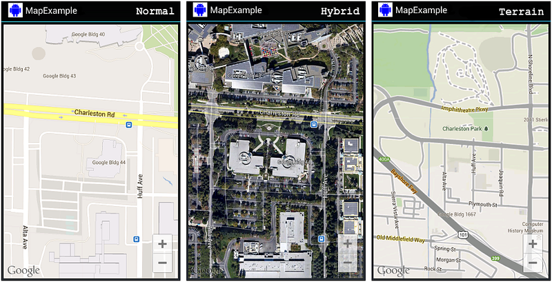
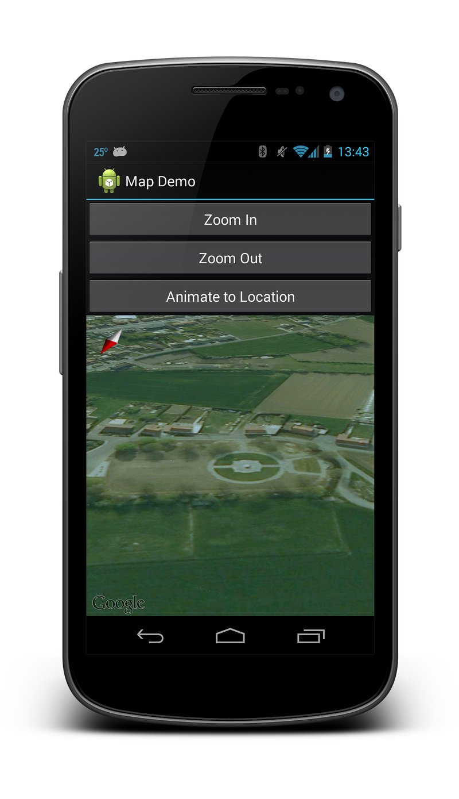
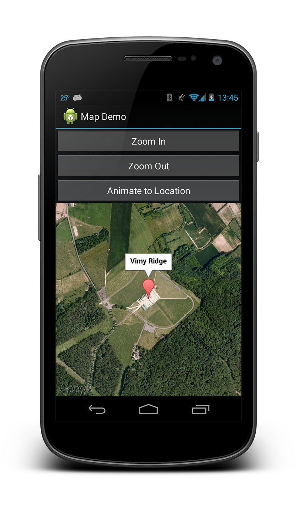
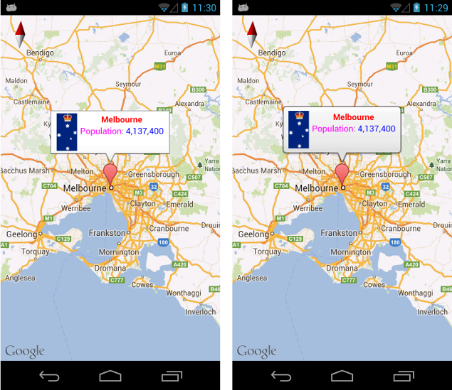
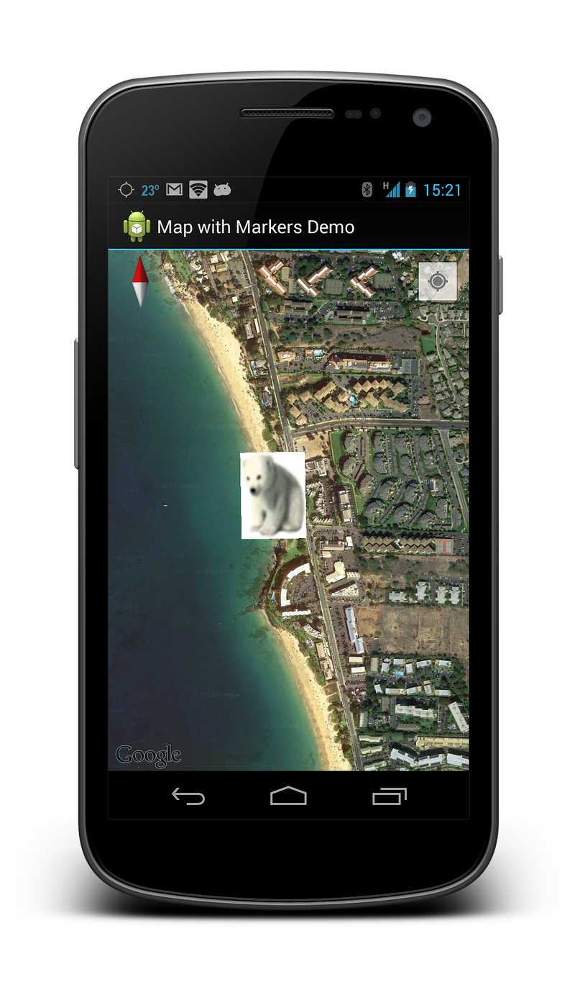

# Using the Google Maps API in your application

Using the Maps application is great, but sometimes you want to include
maps directly in your application. In addition to the built-in maps
application, Google also offers a
[native mapping API for Android](https://developers.google.com/maps/documentation/android-sdk/intro).
The Maps API is suitable for cases where you want to maintain more
control over the mapping experience. Things that are possible with the
Maps API include:

- Programmatically changing the viewpoint of the map.
- Adding and customizing markers.
- Annotating a map with overlays.

Unlike the now-deprecated Google Maps Android API v1, Google Maps
Android API v2 is part of
[Google Play Services](https://developers.google.com/android/guides/overview).
A Xamarin.Android app must meet some mandatory prerequisites before
it is possible to use the Google Maps Android API.

## Google Maps API prerequisites

Several steps need to be taken before you can use the Maps API, including:

- [Obtain a Maps API key](#obtain-maps-key)
- [Install the Google Play Services SDK](#install-gps-sdk)
- [Install the Xamarin.GooglePlayServices.Maps package from NuGet](#install-gpsmaps-nuget)
- [Specify the required permissions](#declare-permissions)
- [Optionally, Create an emulator with the Google APIs](#create-emulator-with-google-api)

### <a name="obtain-maps-key"></a>Obtain a Google Maps API Key

The first step is to get a Google Maps API key (note that you cannot
reuse an API key from the legacy Google Maps v1 API). For information about
how to obtain and use the API key with Xamarin.Android, see
[Obtaining A Google Maps API Key](~/android/platform/maps-and-location/maps/obtaining-a-google-maps-api-key.md).

### <a name="install-gps-sdk"></a> Install the Google Play Services SDK

Google Play Services is a technology from Google that allows Android
applications to take advantage of various Google features such as
Google+, In-App Billing, and Maps. These features are accessible on
Android devices as background services, which are contained in the
[Google Play Services APK](https://play.google.com/store/apps/details?id=com.google.android.gms&hl=en).

Android applications interact with Google Play Services through the
Google Play Services client library. This library contains the
interfaces and classes for the individual services such as Maps. The
following diagram shows the relationship between an Android application
and Google Play Services:



The Android Maps API is provided as a part of Google Play Services.
Before a Xamarin.Android application can use the Maps API, the Google
Play Services SDK must be installed using the [Android SDK Manager](~/android/get-started/installation/android-sdk.md). The following
screenshot shows where in the Android SDK Manager the Google Play
services client can be found:



> [!NOTE]
> The Google Play services APK is a licensed product
> that may not be present on all devices. If it is not installed, then
> Google Maps will not work on the device.

### <a name="install-gpsmaps-nuget"></a> Install the Xamarin.GooglePlayServices.Maps package from NuGet

The [Xamarin.GooglePlayServices.Maps package](https://www.nuget.org/packages/Xamarin.GooglePlayServices.Maps) contains the Xamarin.Android bindings for the Google Play Services Maps API.
To add the Google Play Services Map package, right-click the
**References** folder of your project in the Solution Explorer and
click **Manage NuGet Packages...**:



This opens the **NuGet Package Manager**. Click **Browse** and enter
**Xamarin Google Play Services Maps** in the search field. Select
**Xamarin.GooglePlayServices.Maps** and click **Install**. (If
this package had been installed previously, click **Update**.):

[](maps-api-images/image03.png#lightbox)

Notice that the following dependency packages are also installed:

- **Xamarin.GooglePlayServices.Base**
- **Xamarin.GooglePlayServices.Basement**
- **Xamarin.GooglePlayServices.Tasks**

### <a name="declare-permissions"></a> Specify the required permissions

Apps must identify the hardware and permission requirements in order to use the Google Maps API.  Some permissions are automatically granted by the Google Play Services SDK, and it is not necessary for a developer to explicitly add them to **AndroidManfest.XML**:

- **Access to the Network State** &ndash; The Maps API must be able to check
   if it can download the map tiles.

- **Internet Access** &ndash; Internet access is necessary to download the
   map tiles and communicate with the Google Play Servers for API
   access.

The following permissions and features must be specified in the
**AndroidManifest.XML** for the Google Maps Android API:

- **OpenGL ES v2** &ndash; The application must declare the requirement for
   OpenGL ES v2.

- **Google Maps API Key** &ndash; The API key is used to confirm that the
   application is registered and authorized to use Google Play
   Services. See
   [Obtaining a Google Maps API Key](~/android/platform/maps-and-location/maps/obtaining-a-google-maps-api-key.md)
   for details about this key.

- **Request the legacy Apache HTTP client** &ndash; Apps that target Android 9.0 (API level 28) or above must specify that the legacy Apache HTTP client is an optional library to use.

- **Access to the Google Web-based Services** &ndash; The application needs
   permissions to access Google's web services that back the Android
   Maps API.

- **Permissions for Google Play Services Notifications** &ndash; The
   application must be granted permission to receive remote
   notifications from Google Play Services.

- **Access to Location Providers** &ndash; These are optional permissions.
   They will allow the `GoogleMap` class to display the location of the
   device on the map.

In addition, Android 9 has removed the Apache HTTP client library from the bootclasspath, and so it isn't available to applications that target API 28 or higher. The following line must be added to the `application` node of your **AndroidManifest.xml** file to continue using the Apache HTTP client in applications that target API 28 or higher:

```xml
<application ...>
   ...
   <uses-library android:name="org.apache.http.legacy" android:required="false" />    
</application>
```

> [!NOTE]
> Very old versions of the Google Play SDK required an app to request the `WRITE_EXTERNAL_STORAGE` permission. This requirement is no longer necessary with the recent Xamarin bindings for Google Play Services.

The following snippet is an example of the settings that must be added to **AndroidManifest.XML**:

```xml
<?xml version="1.0" encoding="utf-8"?>
<manifest xmlns:android="http://schemas.android.com/apk/res/android" android:versionName="4.5" package="com.xamarin.docs.android.mapsandlocationdemo2" android:versionCode="6">
    <uses-sdk android:minSdkVersion="23" android:targetSdkVersion="28" />

    <!-- Google Maps for Android v2 requires OpenGL ES v2 -->
    <uses-feature android:glEsVersion="0x00020000" android:required="true" />

    <!-- Necessary for apps that target Android 9.0 or higher -->
    <uses-library android:name="org.apache.http.legacy" android:required="false" />

    <!-- Permission to receive remote notifications from Google Play Services -->
    <!-- Notice here that we have the package name of our application as a prefix on the permissions. -->
    <uses-permission android:name="<PACKAGE NAME>.permission.MAPS_RECEIVE" />
    <permission android:name="<PACKAGE NAME>.permission.MAPS_RECEIVE" android:protectionLevel="signature" />

    <!-- These are optional, but recommended. They will allow Maps to use the My Location provider. -->
    <uses-permission android:name="android.permission.ACCESS_COARSE_LOCATION" />
    <uses-permission android:name="android.permission.ACCESS_FINE_LOCATION" />

    <application android:label="@string/app_name">
        <!-- Put your Google Maps V2 API Key here. -->
        <meta-data android:name="com.google.android.maps.v2.API_KEY" android:value="YOUR_API_KEY" />
        <meta-data android:name="com.google.android.gms.version" android:value="@integer/google_play_services_version" />
        <!-- Necessary for apps that target Android 9.0 or higher -->
        <uses-library android:name="org.apache.http.legacy" android:required="false" />
    </application>
</manifest>
```

In addition to requesting the permissions **AndroidManifest.XML**, an app must also perform runtime permission checks for the  `ACCESS_COARSE_LOCATION` and the `ACCESS_FINE_LOCATION` permissions. See the [Xamarin.Android Permissions](~/android/app-fundamentals/permissions.md) guide for more information about performing run-time permission checks.

### <a name="create-emulator-with-google-api"></a>Create an Emulator with Google APIs

In the event that a physical Android device with Google Play services is not installed, it is possible to create an emulator image for development. For more information see the [Device Manager](~/android/get-started/installation/android-emulator/device-manager.md).

## The GoogleMap Class

Once the prerequisites are satisfied, it is time to start
developing the application and use the Android Maps API. The
[GoogleMap](https://developers.google.com/android/reference/com/google/android/gms/maps/GoogleMap)
class is the main API that a Xamarin.Android application will use to
display and interact with a Google Maps for Android. This class has the
following responsibilities:

- Interacting with Google Play services to authorize the application
   with the Google web service.

- Downloading, caching, and displaying the map tiles.

- Displaying UI controls such as pan and zoom to the user.

- Drawing markers and geometric shapes on maps.

The `GoogleMap` is added to an Activity in one of two ways:

- **MapFragment** - The
   [MapFragment](https://developers.google.com/android/reference/com/google/android/gms/maps/MapFragment)
   is a specialized Fragment that acts as host for the `GoogleMap`
   object. The `MapFragment` requires Android API level 12 or higher.
   Older versions of Android can use the
   [SupportMapFragment](https://developers.google.com/android/reference/com/google/android/gms/maps/SupportMapFragment).  This guide will focus on using the `MapFragment` class.

- **MapView** - The
   [MapView](https://developers.google.com/android/reference/com/google/android/gms/maps/MapView)
   is a specialized View subclass, which can act as a host for a
   `GoogleMap` object. Users of this class must forward all of the
   Activity lifecycle methods to the `MapView` class.

Each of these containers exposes a `Map` property that returns an
instance of `GoogleMap`. Preference should be given to the
[MapFragment](https://developers.google.com/android/reference/com/google/android/gms/maps/MapFragment)
class as it is a simpler API that reduces the amount boilerplate code
that a developer must manually implement.

### Adding a MapFragment to an Activity

The following screenshot is an example of a simple `MapFragment`:

[](maps-api-images/image05.png#lightbox)

Similar to other Fragment classes, there are two ways to add a
`MapFragment` to an Activity:

- **Declaratively** - The `MapFragment` can be added via the XML
    layout file for the Activity. The following XML snippet shows an
    example of how to use the `fragment` element:

    ```xml
    <?xml version="1.0" encoding="utf-8"?>
    <fragment xmlns:android="http://schemas.android.com/apk/res/android"
              android:id="@+id/map"
              android:layout_width="match_parent"
              android:layout_height="match_parent"
              class="com.google.android.gms.maps.MapFragment" />
    ```

- **Programmatically** - The `MapFragment` can be programmatically instantiated using the [`MapFragment.NewInstance`](https://developers.google.com/android/reference/com/google/android/gms/maps/MapFragment.html#newInstance()) method and then added to an Activity. This snippet shows the simplest way to instantiate a `MapFragment` object and add to an Activity:

    ```csharp
        var mapFrag = MapFragment.NewInstance();
        activity.FragmentManager.BeginTransaction()
                                .Add(Resource.Id.map_container, mapFrag, "map_fragment")
                                .Commit();

    ```

    It is possible to configure the `MapFragment` object by passing a [`GoogleMapOptions`](https://developers.google.com/android/reference/com/google/android/gms/maps/GoogleMapOptions) object to `NewInstance`. This is discussed in the section [GoogleMap properties](#googlemap_object) that appears later on in this guide.

The `MapFragment.GetMapAsync` method is used to initialize the [`GoogleMap`](#googlemap_object) that is hosted by the fragment and obtain a reference to the map object that is hosted by the `MapFragment`. This method takes an object that implements the `IOnMapReadyCallback` interface.

This interface has a single method, `IMapReadyCallback.OnMapReady(MapFragment map)` that will be invoked when it is possible for the app to interact with the `GoogleMap` object. The following code snippet shows how an Android Activity can initialize a `MapFragment` and implement the `IOnMapReadyCallback` interface:

```csharp
public class MapWithMarkersActivity : AppCompatActivity, IOnMapReadyCallback
{
    protected override void OnCreate(Bundle bundle)
    {
        base.OnCreate(bundle);
        SetContentView(Resource.Layout.MapLayout);

        var mapFragment = (MapFragment) FragmentManager.FindFragmentById(Resource.Id.map);
        mapFragment.GetMapAsync(this);

        // remainder of code omitted
    }

    public void OnMapReady(GoogleMap map)
    {
        // Do something with the map, i.e. add markers, move to a specific location, etc.
    }
}
```

### Map types

There are five different types of maps available from the Google Maps
API:

- **Normal** - This is the default map type. It shows roads and
   important natural features along with some artificial points of
   interest (such as buildings and bridges).

- **Satellite** - This map shows satellite photography.

- **Hybrid** - This map shows satellite photography and road maps.

- **Terrain** - This primarily shows topographical features with some
   roads.

- **None** - This map does not load any tiles, it is rendered as an
   empty grid.

The image below shows three of the different types of maps, from
left-to-right (normal, hybrid, terrain):

[](maps-api-images/map-types.png#lightbox)

The `GoogleMap.MapType` property is used to set or change which type of
map is displayed. The following code snippet shows how to display a
satellite map.

```csharp
public void OnMapReady(GoogleMap map)
{
    map.MapType = GoogleMap.MapTypeHybrid;
}
```

### <a name="googlemap_object"></a>GoogleMap properties

`GoogleMap` defines several properties that can control the functionality
and the appearance of the map. One way to configure the initial state
of a `GoogleMap` is to pass a
[GoogleMapOptions](https://developers.google.com/android/reference/com/google/android/gms/maps/GoogleMapOptions)
object when creating a `MapFragment`. The following code snippet is one
example of using a `GoogleMapOptions` object when creating a `MapFragment`:

```csharp
GoogleMapOptions mapOptions = new GoogleMapOptions()
    .InvokeMapType(GoogleMap.MapTypeSatellite)
    .InvokeZoomControlsEnabled(false)
    .InvokeCompassEnabled(true);

FragmentTransaction fragTx = FragmentManager.BeginTransaction();
mapFragment = MapFragment.NewInstance(mapOptions);
fragTx.Add(Resource.Id.map, mapFragment, "map");
fragTx.Commit();
```

The other way to configure a `GoogleMap` is by manipulating properties on the
[UiSettings](https://developers.google.com/android/reference/com/google/android/gms/maps/UiSettings)
of the map object. The next code sample shows how to configure a
`GoogleMap` to display the zoom controls and a compass:

```csharp
public void OnMapReady(GoogleMap map)
{
    map.UiSettings.ZoomControlsEnabled = true;
    map.UiSettings.CompassEnabled = true;
}
```

## Interacting with the GoogleMap

The Android Maps API provides APIs that allow an Activity to change
the viewpoint, add markers, place custom overlays, or draw geometric
shapes. This section will discuss how to accomplish some of these tasks
in Xamarin.Android.

### Changing the Viewpoint

Maps are modelled as a flat plane on the screen, based on the Mercator
projection. The map view is that of a *camera* looking straight down on
this plane. The position of the camera can be controlled by changing
the location, zoom, tilt, and bearing. The
[CameraUpdate](https://developers.google.com/android/reference/com/google/android/gms/maps/CameraUpdate)
class is used to move the camera location. `CameraUpdate` objects are not
directly instantiated, instead the Maps API provides the
[CameraUpdateFactory](https://developers.google.com/android/reference/com/google/android/gms/maps/CameraUpdateFactory)
class.

Once a `CameraUpdate` object has been created, it is passed as a
parameter to either the
[GoogleMap.MoveCamera](https://developers.google.com/android/reference/com/google/android/gms/maps/GoogleMap#moveCamera(com.google.android.gms.maps.CameraUpdate))
or
[GoogleMap.AnimateCamera](https://developers.google.com/android/reference/com/google/android/gms/maps/GoogleMap#animateCamera(com.google.android.gms.maps.CameraUpdate))
methods. The `MoveCamera` method updates the map instantly while the
`AnimateCamera` method provides a smooth, animated transition.

This code snippet is a simple example of how to use the
`CameraUpdateFactory` to create a `CameraUpdate` that will increment
the zoom level of the map by one zoom level:

```csharp
MapFragment mapFrag = (MapFragment) FragmentManager.FindFragmentById(Resource.Id.my_mapfragment_container);
mapFrag.GetMapAsync(this);
...

public void OnMapReady(GoogleMap map)
{   
    map.MoveCamera(CameraUpdateFactory.ZoomIn());
}
```

The Maps API provides a
[CameraPosition](https://developer.android.com/reference/com/google/android/gms/maps/model/CameraPosition.html)
which will aggregate all of the possible values for the camera
position. An instance of this class can be provided to the
[CameraUpdateFactory.NewCameraPosition](https://developers.google.com/maps/documentation/android/reference/com/google/android/gms/maps/CameraUpdateFactory#newCameraPosition%28com.google.android.gms.maps.model.CameraPosition%29)
method which will return a `CameraUpdate` object. The Maps API also
includes the
[CameraPosition.Builder](https://developer.android.com/reference/com/google/android/gms/maps/model/CameraPosition.Builder.html)
class that provides a fluent API for creating `CameraPosition` objects.
The following code snippet shows an example of creating a `CameraUpdate`
from a `CameraPosition` and using that to change the camera position on a
`GoogleMap`:

```csharp
public void OnMapReady(GoogleMap map)
{
    LatLng location = new LatLng(50.897778, 3.013333);

    CameraPosition.Builder builder = CameraPosition.InvokeBuilder();
    builder.Target(location);
    builder.Zoom(18);
    builder.Bearing(155);
    builder.Tilt(65);

    CameraPosition cameraPosition = builder.Build();

    CameraUpdate cameraUpdate = CameraUpdateFactory.NewCameraPosition(cameraPosition);

    map.MoveCamera(cameraUpdate);
}
```

In the previous code snippet, a specific location on the map is
represented by the
[LatLng](https://developers.google.com/android/reference/com/google/android/gms/maps/model/LatLng)
class. The zoom level is set to 18, which is an arbitrary measure of zoom used by Google Maps. The bearing is the compass
measurement clockwise from North. The Tilt property controls the
viewing angle and specifies an angle of 25 degrees from the
vertical. The following screenshot shows the `GoogleMap` after executing
the preceding code:

[](maps-api-images/image06.png#lightbox)

### Drawing on the Map

The Android Maps API provides API's for drawing the following items on a map:

- **Markers** - These are special icons that are used to identify a single location on a map.

- **Overlays** - This is an image that can be used to identify a collection of locations or area on the map.

- **Lines, Polygons, and Circles** - These are APIs that allow Activities to add shapes to a map.

#### Markers

The Maps API provides a
[Marker](https://developers.google.com/android/reference/com/google/android/gms/maps/model/Marker)
class which encapsulates all of the data about a single location on a
map. By default the Marker class uses a standard icon provided by Google Maps. It is
possible to customize the appearance of a marker and to respond to user
clicks.

##### Adding a Marker

To add a marker to a map, it is necessary create a new
[MarkerOptions](https://developers.google.com/android/reference/com/google/android/gms/maps/model/MarkerOptions) object and then call the
[AddMarker](https://developer.android.com/reference/com/google/android/gms/maps/GoogleMap.html#addMarker%28com.google.android.gms.maps.model.MarkerOptions%29)
method on a `GoogleMap` instance. This method will return a
[Marker](https://developers.google.com/android/reference/com/google/android/gms/maps/model/Marker)
object.

```csharp
public void OnMapReady(GoogleMap map)
{
    MarkerOptions markerOpt1 = new MarkerOptions();
    markerOpt1.SetPosition(new LatLng(50.379444, 2.773611));
    markerOpt1.SetTitle("Vimy Ridge");

    map.AddMarker(markerOpt1);
}
```

The title of the marker will be displayed in an *info window* when the
user taps on the marker. The following screenshot shows what this
marker looks like:

[](maps-api-images/image07.png#lightbox)

##### Customizing A Marker

It is possible to customize the icon used by the marker by calling the
`MarkerOptions.InvokeIcon` method when adding the marker to the map.
This method takes a
[BitmapDescriptor](https://developers.google.com/android/reference/com/google/android/gms/maps/model/BitmapDescriptor)
object containing the data necessary to render the icon. The
[BitmapDescriptorFactory](https://developers.google.com/android/reference/com/google/android/gms/maps/model/BitmapDescriptorFactory)
class provides some helper methods to simplify the creation of a
`BitmapDescriptor`. The following list introduces some of these methods:

- `DefaultMarker(float colour)` &ndash; Use the default Google Maps
    marker, but change the colour.

- `FromAsset(string assetName)` &ndash; Use a custom icon from the
    specified file in the Assets folder.

- `FromBitmap(Bitmap image)` &ndash; Use the specified bitmap as the
    icon.

- `FromFile(string fileName)` &ndash; Create the custom icon from the
    file at the specified path.

- `FromResource(int resourceId)` &ndash; Create a custom icon from
    the specified resource.

The following code snippet shows an example of creating a cyan coloured
default marker:

```csharp
public void OnMapReady(GoogleMap map)
{
    MarkerOptions markerOpt1 = new MarkerOptions();
    markerOpt1.SetPosition(new LatLng(50.379444, 2.773611));
    markerOpt1.SetTitle("Vimy Ridge");

    var bmDescriptor = BitmapDescriptorFactory.DefaultMarker (BitmapDescriptorFactory.HueCyan);
    markerOpt1.InvokeIcon(bmDescriptor);

    map.AddMarker(markerOpt1);
}
```

#### Info windows

*Info windows* are special windows that popup to display information to
the user when they tap a specific marker. By default the info window
will display the contents of the marker's title. If the title has not
been assigned, then no info window will appear. Only one info window
may be shown at a time.

It is possible to customize the info window by implementing the
[GoogleMap.IInfoWindowAdapter](https://developers.google.com/android/reference/com/google/android/gms/maps/GoogleMap.InfoWindowAdapter)
interface. There are two important methods on this interface:

- `public View GetInfoWindow(Marker marker)` &ndash; This method is called
   to get a custom info window for a marker. If it returns `null` ,
   then the default window rendering will be used. If this method
   returns a View, then that View will be placed inside the info window
   frame.

- `public View GetInfoContents(Marker marker)` &ndash; This method will
   only be called if GetInfoWindow returns `null` . This method can
   return a `null` value if the default rendering of the info window
   contents is to be used. Otherwise, this method should return a View
   with the contents of the info window.

An info window is not a live view - instead Android will convert the
View to a static bitmap and display that on the image. This means that
an info window cannot respond to any touch events or gestures, nor will
it automatically update itself. To update an info window, it is
necessary to call the
[GoogleMap.ShowInfoWindow](https://developers.google.com/android/reference/com/google/android/gms/maps/model/Marker.html#showInfoWindow())
method.

The following image shows some examples of some customized info
windows. The image on the left has its contents customized, while the
image on the right has its window and contents customized with rounded corners:



#### GroundOverlays

Unlike markers, which identify a specific location on a map, a
[GroundOverlay](https://developers.google.com/android/reference/com/google/android/gms/maps/model/GroundOverlay)
is an image that is used to identify a collection of locations or an area
on the map.

##### Adding a GroundOverlay

Adding a ground overlay to a map is similar to adding a marker to
a map. First, a
[GroundOverlayOptions](https://developers.google.com/android/reference/com/google/android/gms/maps/model/GroundOverlayOptions)
object is created. This object is then passed as a parameter to the
[`GoogleMap.AddGroundOverlay`](https://developers.google.com/android/reference/com/google/android/gms/maps/GoogleMap.html#addGroundOverlay(com.google.android.gms.maps.model.GroundOverlayOptions)) method, which will return a
`GroundOverlay` object. This code snippet is an example of adding a
ground overlay to a map:

```csharp
BitmapDescriptor image = BitmapDescriptorFactory.FromResource(Resource.Drawable.polarbear);
GroundOverlayOptions groundOverlayOptions = new GroundOverlayOptions()
    .Position(position, 150, 200)
    .InvokeImage(image);
GroundOverlay myOverlay = googleMap.AddGroundOverlay(groundOverlayOptions);
```

The following screenshot shows this overlay on a map:

[](maps-api-images/image09.png#lightbox)

#### Lines, Circles, and Polygons

There are three simple types of geometric figures that can be added to a map:

- **Polyline** - This is a series of connected line segments. It can
   mark a path on a map or create a geometric shape.

- **Circle** - This will draw a circle on the map.

- **Polygon** - This is a closed shape for marking areas on a map.

##### Polylines

A [Polyline](https://developers.google.com/android/reference/com/google/android/gms/maps/model/Polyline)
is a list of consecutive `LatLng` objects which specify the vertices of
each line segment. A polyline is created by first creating a
`PolylineOptions` object and adding the points to it. The
`PolylineOption` object is then passed to a `GoogleMap` object by calling
the `AddPolyline` method.

```csharp
PolylineOption rectOptions = new PolylineOption();
rectOptions.Add(new LatLng(37.35, -122.0));
rectOptions.Add(new LatLng(37.45, -122.0));
rectOptions.Add(new LatLng(37.45, -122.2));
rectOptions.Add(new LatLng(37.35, -122.2));
rectOptions.Add(new LatLng(37.35, -122.0)); // close the polyline - this makes a rectangle.

googleMap.AddPolyline(rectOptions);
```

##### Circles

Circles are created by first instantiating a
[CircleOption](https://developers.google.com/android/reference/com/google/android/gms/maps/model/CircleOptions)
object which will specify the center and the radius of the circle in
metres. The circle is drawn on the map by calling
[GoogleMap.AddCircle](https://developers.google.com/android/reference/com/google/android/gms/maps/GoogleMap.html#addCircle(com.google.android.gms.maps.model.CircleOptions)).
The following code snippet shows how to draw a circle:

```csharp
CircleOptions circleOptions = new CircleOptions ();
circleOptions.InvokeCenter (new LatLng(37.4, -122.1));
circleOptions.InvokeRadius (1000);

googleMap.AddCircle (circleOptions);
```

##### Polygons

`Polygon`s are similar to `Polyline`s, however they are not open
ended. `Polygon`s are a closed loop and have their interior filled in.
`Polygon`s are created in the exact same manner as a `Polyline`, except the
[GoogleMap.AddPolygon](https://developers.google.com/android/reference/com/google/android/gms/maps/GoogleMap.html#addPolygon(com.google.android.gms.maps.model.PolygonOptions))
method invoked.

Unlike a `Polyline`, a `Polygon` is self-closing. The polygon will be closed off by the `AddPolygon` method by drawing a line which connects the first and last points. The following code
snippet will create a solid rectangle over the same area as the
previous code snippet in the `Polyline` example.

```csharp
PolygonOptions rectOptions = new PolygonOptions();
rectOptions.Add(new LatLng(37.35, -122.0));
rectOptions.Add(new LatLng(37.45, -122.0));
rectOptions.Add(new LatLng(37.45, -122.2));
rectOptions.Add(new LatLng(37.35, -122.2));
// notice we don't need to close off the polygon

googleMap.AddPolygon(rectOptions);
```

## Responding to user events

There are three types of interactions a user may have with a map:

- **Marker Click** - The user clicks on a marker.

- **Marker Drag** - The user has long-clicked on a mparger

- **Info Window Click** - The user has clicked on an info window.

Each of these events will be discussed in more detail below.

### Marker click events

The `MarkerClicked` event is raised when the user taps on a marker. This event accepts a `GoogleMap.MarkerClickEventArgs` object as a parameter. This class
contains two properties:

- `GoogleMap.MarkerClickEventArgs.Handled` &ndash; This property should be
   set to `true` to indicate that the event handler has consumed the
   event. If this is set to `false` then the default behaviour will
   occur in addition to the custom behaviour of the event handler.

- `Marker` &ndash; This property is a reference to the marker
   that raised the `MarkerClick` event.

This code snippet shows an example of a `MarkerClick` that will change
the camera position to a new location on the map:

```csharp
void MapOnMarkerClick(object sender, GoogleMap.MarkerClickEventArgs markerClickEventArgs)
{
    markerClickEventArgs.Handled = true;

    var marker = markerClickEventArgs.Marker;
    if (marker.Id.Equals(gotMauiMarkerId))
    {
        LatLng InMaui = new LatLng(20.72110, -156.44776);

        // Move the camera to look at Maui.
        PositionPolarBearGroundOverlay(InMaui);
        googleMap.AnimateCamera(CameraUpdateFactory.NewLatLngZoom(InMaui, 13));
        gotMauiMarkerId = null;
        polarBearMarker.Remove();
        polarBearMarker = null;
    }
    else
    {
        Toast.MakeText(this, $"You clicked on Marker ID {marker.Id}", ToastLength.Short).Show();
    }
}
```

### Marker Drag events

This event is raised when the user wishes to drag the marker. By
default, markers are not draggable. A marker can be set as draggable by
setting the `Marker.Draggable` property to `true` or by invoking the
`MarkerOptions.Draggable` method with `true` as a parameter.

To drag the marker, the user must first long-click on the marker and then their finger must remain on the map. When the user's finger is dragged around on the screen, the
marker will move. When the user's finger lifts off the screen, the
marker will remain in place.

The following list describes the various events that will be raised
for a draggable marker:

- `GoogleMap.MarkerDragStart(object sender, GoogleMap.MarkerDragStartEventArgs e)` &ndash;
    This event is raised when the user first drags the marker.

- `GoogleMap.MarkerDrag(object sender, GoogleMap.MarkerDragEventArgs e)` &ndash;
    This event is raised as the marker is being dragged.

- `GoogleMap.MarkerDragEnd(object sender, GoogleMap.MarkerDragEndEventArgs e)` &ndash;
    This event is raised when the user is finished dragging the marker.

Each of the `EventArgs` contains a single property called `P0` that is a
reference to the `Marker` object being dragged.

### Info Window Click events

Only one info window can be displayed at a time. When the user clicks
on an info window in a map, the map object will raise an
`InfoWindowClick` event. The following code snippet shows how to wire
up a handler to the event:

```csharp
public void OnMapReady(GoogleMap map)
{
    map.InfoWindowClick += MapOnInfoWindowClick;
}

private void MapOnInfoWindowClick (object sender, GoogleMap.InfoWindowClickEventArgs e)
{
    Marker myMarker = e.Marker;
    // Do something with marker.
}
```

Recall that an info window is a static `View` which is rendered as an
image on the map. Any widgets such as buttons, check boxes, or text
views that are placed inside the info window will be inert and cannot
respond to any of their integral user events.

## Related Links

- [SimpleMapDemo](https://github.com/xamarin/monodroid-samples/tree/master/MapsAndLocationDemo_v3/SimpleMapDemo)
- [Google Play Services](https://developers.google.com/android/guides/overview)
- [Google Maps Android API v2](https://developers.google.com/maps/documentation/android-sdk/intro)
- [Google Play Services APK](https://play.google.com/store/apps/details?id=com.google.android.gms&hl=en)
- [Obtaining a Google Maps API key](~/android/platform/maps-and-location/maps/obtaining-a-google-maps-api-key.md)
- [uses-library](https://developer.android.com/guide/topics/manifest/uses-library-element)
- [uses-feature](https://developer.android.com/guide/topics/manifest/uses-feature-element)
