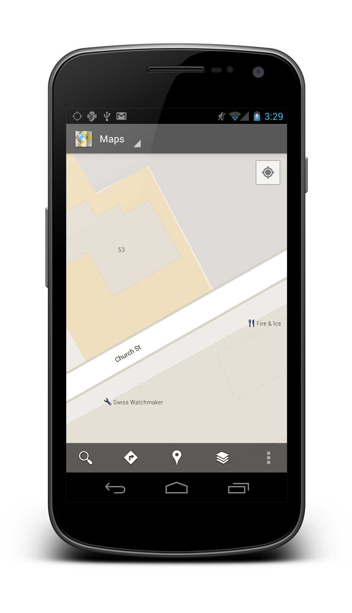
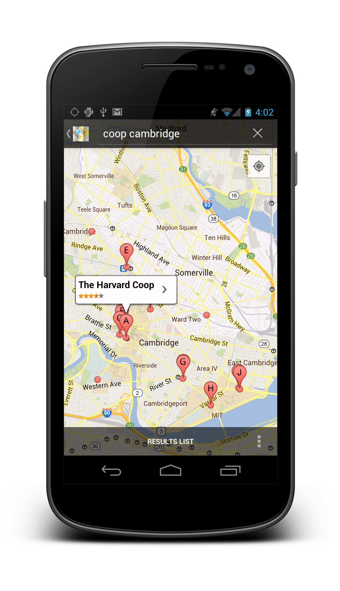
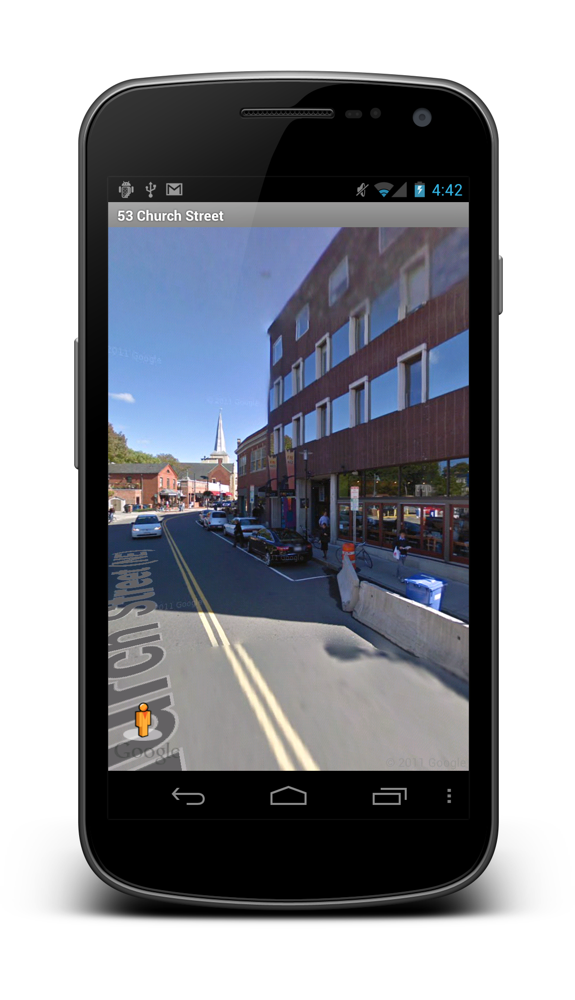

# Launching the Maps Application

The simplest way to work with maps in Xamarin.Android is to leverage
the built-in maps application shown below:

[](maps-application-images/01-mapsapplication.png#lightbox)

When you use the maps application, the map will not be part of your
application. Instead, your application will launch the maps application
and load the map externally. The next section examines how to use
Xamarin.Android to launch maps like the one above.


## Creating the Intent

Working with the maps application is as easy as creating an Intent with
an appropriate URI, setting the action to ActionView, and calling the
StartActivity method. For example, the following code launches the maps
application centered at a given latitude and longitude:

```csharp
var geoUri = Android.Net.Uri.Parse ("geo:42.374260,-71.120824");
var mapIntent = new Intent (Intent.ActionView, geoUri);
StartActivity (mapIntent);
```

This code is all that is needed to launch the map shown in the previous
screenshot. In addition to specifying latitude and longitude, the URI
scheme for maps supports several other options.


## Geo URI Scheme

The code above used the geo scheme to create a URI. This URI scheme
supports several formats, as listed below:

-   `geo:latitude,longitude` &ndash; Opens the maps application 
    centered at a lat/lon. 

-   `geo:latitude,longitude?z=zoom` &ndash; Opens the maps application 
    centered at a lat/lon and zoomed to the specified level. The zoom level
    can range from 1 to 23: 1 displays the entire Earth and 23 is the
    closest zoom level.

-   `geo:0,0?q=my+street+address` &ndash; Opens the maps application to 
    the location of a street address. 

-   `geo:0,0?q=business+near+city` &ndash; Opens the maps application 
    and displays the annotated search results. 


The versions of the URI that take a query (namely the street address or
search terms) use Google's geocoder service to retrieve the location
that is then displayed on the map. For example, the URI
`geo:0,0?q=coop+Cambridge` results in the map shown below:

[](maps-application-images/02-mapsearch.png#lightbox)


For more information about geo URI schemes, see
[Show a location on a map](http://developer.android.com/guide/components/intents-common.html#Maps).


## Street View

In addition to the geo scheme, Android also supports loading street
views from an Intent. An example of the street view application
launched from Xamarin.Android is shown below:

[](maps-application-images/03-streetview.png#lightbox)

To launch a street view, simply use the `google.streetview` URI scheme,
as demonstrated in the following code:

```csharp
var streetViewUri = Android.Net.Uri.Parse (
       "google.streetview:cbll=42.374260,-71.120824&cbp=1,90,,0,1.0&mz=20");  
var streetViewIntent = new Intent (Intent.ActionView, streetViewUri);  
StartActivity (streetViewIntent);
```

The google.streetview URI scheme used above takes the following form:

```csharp
google.streetview:cbll=lat,lng&cbp=1,yaw,,pitch,zoom&mz=mapZoom
```

As you can see, there are several parameters supported, as listed below:

-   `lat` &ndash; The latitude of the location to be shown in the
    street view.

-   `lng` &ndash; The longitude of the location to be shown in the
    street view.

-   `pitch` &ndash; Angle of street view panorama, measured from the
    center in degrees where 90 degrees is straight down and -90 degrees
    is straight up.

-   `yaw` &ndash; Center-of-view of street view panorama, measured
    clockwise in degrees from North.

-   `zoom` &ndash; Zoom multiplier for street view panorama, where 
    1.0 = normal zoom, 2.0 = zoomed 2x, 3.0 = zoomed 4x, etc.

-   `mz` &ndash; The map zoom level that will be used when going to the
    maps application from the street view.


Working with the built-in maps application or the street view is an
easy way to quickly add mapping support. However, Android's Maps API
offers finer control over the mapping experience.
