# Obtaining a Google Maps API Key

To use the Google Maps functionality in Android, you need to
register for a Maps API key with Google. Until you do this, you will
just see a blank grid instead of a map in your applications. You must
obtain a Google Maps Android API v2 key - keys from the older Google
Maps Android API key v1 will not work.

Obtaining a Maps API v2 key involves the following steps:

1. Retrieve the SHA-1 fingerprint of the keystore that is used to sign the application.
2. Create a project in the Google APIs console.
3. Obtaining the API key.

## Obtaining your Signing Key Fingerprint

To request a Maps API key from Google, you need to know the
SHA-1 fingerprint of the keystore that is used to sign the application.
Typically, this means you will have to determine the SHA-1 fingerprint
for the debug keystore, and then the SHA-1 fingerprint for the keystore
that is used to sign your application for release.

<!-- markdownlint-disable MD001 -->

# [Visual Studio](#tab/windows)

By default the keystore that is used to sign debug versions of a
Xamarin.Android application can be found at the following location:

**C:\\Users\\[USERNAME]\\AppData\\Local\\Xamarin\\Mono for Android\\debug.keystore**

Information about a keystore is obtained by running the `keytool`
command from the JDK. This tool is typically found in the Java bin
directory:

**C:\\Program Files\\Android\\jdk\\microsoft_dist_openjdk_[VERSION]\\bin\\keytool.exe**

# [Visual Studio for Mac](#tab/macos)

By default the keystore that is used to sign debug versions of a
Xamarin.Android application can be found at the following location:

**/Users/[USERNAME]/.local/share/Xamarin/Mono for Android/debug.keystore**

Information about a keystore is obtained by running the `keytool`
command from the JDK. This tool is typically found in the Java bin
directory:

**/System/Library/Java/JavaVirtualMachines/[VERSION].jdk/Contents/Home/bin/keytool**

-----

Run keytool using the following command (using the file paths shown
above):

```shell
keytool -list -v -keystore [STORE FILENAME] -alias [KEY NAME] -storepass [STORE PASSWORD] -keypass [KEY PASSWORD]
```

### Debug.keystore Example

For the default debug key (which is automatically created for you for
debugging), use this command:

# [Visual Studio](#tab/windows)

```cmd
keytool.exe -list -v -keystore "C:\Users\[USERNAME]\AppData\Local\Xamarin\Mono for Android\debug.keystore" -alias androiddebugkey -storepass android -keypass android
```

# [Visual Studio for Mac](#tab/macos)

```bash
keytool -list -v -keystore /Users/[USERNAME]/.local/share/Xamarin/Mono\ for\ Android/debug.keystore -alias androiddebugkey -storepass android -keypass android
```

-----

### Production Keys

When deploying an app to Google Play, it must be
[signed with a private key](~/android/deploy-test/signing/index.md).
The `keytool` will need to be run with the private key details, and the
resulting SHA-1 fingerprint used to create a production Google Maps API
key. Remember to update the **AndroidManifest.xml** file with the
correct Google Maps API key before deployment.

### Keytool Output

You should see something like the following output in your console
window:

```shell
Alias name: androiddebugkey
Creation date: Jan 01, 2016
Entry type: PrivateKeyEntry
Certificate chain length: 1
Certificate[1]:
Owner: CN=Android Debug, O=Android, C=US
Issuer: CN=Android Debug, O=Android, C=US
Serial number: 4aa9b300
Valid from: Mon Jan 01 08:04:04 UTC 2013 until: Mon Jan 01 18:04:04 PST 2033
Certificate fingerprints:
    MD5:  AE:9F:95:D0:A6:86:89:BC:A8:70:BA:34:FF:6A:AC:F9
    SHA1: BB:0D:AC:74:D3:21:E1:43:07:71:9B:62:90:AF:A1:66:6E:44:5D:75
    Signature algorithm name: SHA1withRSA
    Version: 3
```

You will use the SHA-1 fingerprint (listed after **SHA1**) later in this guide.

## Creating an API project

After you have retrieved the SHA-1 fingerprint of the signing keystore, it is necessary to create a new project in the Google APIs console (or add the Google Maps Android API v2 service to an existing project).

1. In a browser, navigate to the [Google Developers Console API & Services Dashboard](https://console.developers.google.com/apis/dashboard/) and click **Select a project**. Click on a project name or create a new one by clicking **NEW PROJECT**:

   [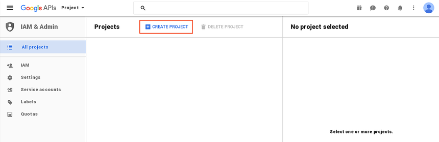](obtaining-a-google-maps-api-key-images/01-google-developer-console-vs.png#lightbox)

2. If you created a new project, enter the project name in the **New Project** dialog that is displayed. This dialog will manufacture a unique project ID that is based on your project name. Next, click the **Create** button as shown in this example:

   [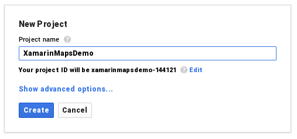](obtaining-a-google-maps-api-key-images/02-new-project-vs.png#lightbox)

3. After a minute or so, the project is created and you are taken to the **Dashboard** page of the project. From there, click **ENABLE APIS AND SERVICES**:

   [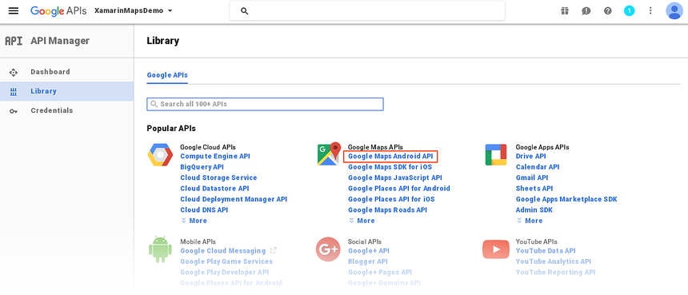](obtaining-a-google-maps-api-key-images/03-api-selection-vs.png#lightbox)

4. From the **API Library** page, click **Maps SDK for Android**. On the next page, click **ENABLE**
   to turn on the service for this project:

   [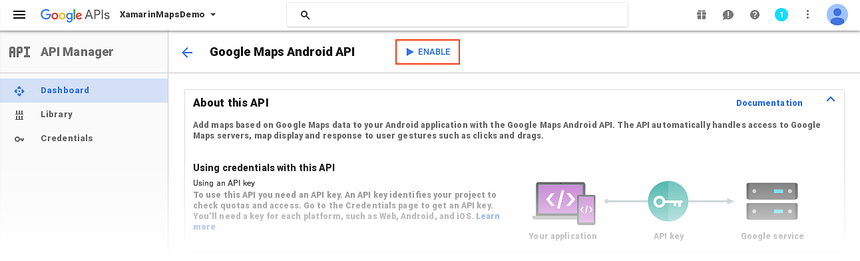](obtaining-a-google-maps-api-key-images/04-enable-api-vs.png#lightbox)

At this point the API project has been created and Google Maps Android API v2 has been added to it. However, you cannot use this API in your project until you create credentials for it. The next section explains how to create an API key and authorize a Xamarin.Android application to use this key.

## Obtaining the API Key

After the **Google Developer Console** API project has been created, it is necessary to create an Android API key. Xamarin.Android applications must have an API key before they are granted access to Android Map API v2.

1. In the **Maps SDK for Android** page that is displayed (after clicking **ENABLE** in the previous step), go to the **Credentials** tab and click the **Create credentials** button:

   [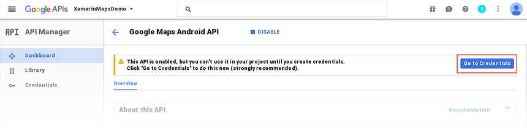](obtaining-a-google-maps-api-key-images/05-api-is-enabled-vs.png#lightbox)

2. Click **API key**:

   [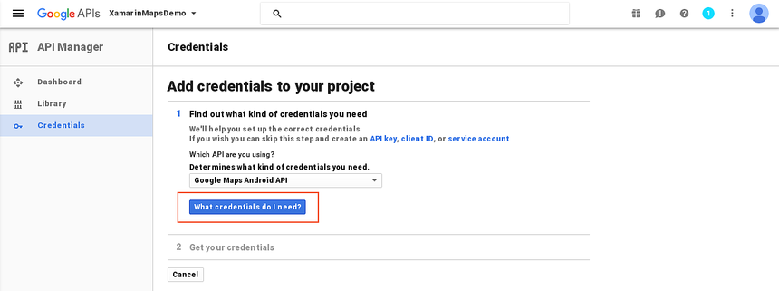](obtaining-a-google-maps-api-key-images/06-add-credentials-to-your-project-vs.png#lightbox)

3. After this button is clicked, the API key is generated. Next it is necessary to restrict this key so that only your app can call APIs with this key. Click **RESTRICT KEY**:

   [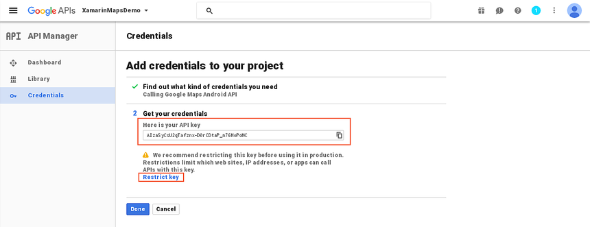](obtaining-a-google-maps-api-key-images/07-generate-api-key-vs.png#lightbox)

4. Change the **Name** field from **API Key 1** to a name that will help you remember what the key is used for (**XamarinMapsDemoKey** is used in this example). Next, click the **Android apps** radio button:

   [](obtaining-a-google-maps-api-key-images/08-key-restriction-vs.png#lightbox)

5. To add the SHA-1 fingerprint, click **+ Add package name and fingerprint**:

   [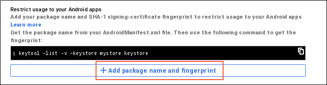](obtaining-a-google-maps-api-key-images/09-add-package-fingerprint-vs.png#lightbox)

6. Enter your app's package name and enter the SHA-1 certificate fingerprint (obtained via `keytool` as explained earlier in this guide). In the following example, the package name for `XamarinMapsDemo` is entered, followed by the SHA-1 certificate fingerprint obtained from **debug.keystore**:

   [](obtaining-a-google-maps-api-key-images/10-enter-package-and-sha1-vs.png#lightbox)

7. Note that, in order for your APK to access Google Maps, you must include SHA-1 fingerprints and package names for every keystore (debug and release) that you use to sign your APK. For example, if you use one computer for debug and another computer for generating the release APK, you should include the SHA-1 certificate fingerprint from the debug keystore of the first computer and the SHA-1 certificate fingerprint from the release keystore of the second computer. Click **+ Add package name and fingerprint** to add another fingerprint and package name as shown in this example:

   [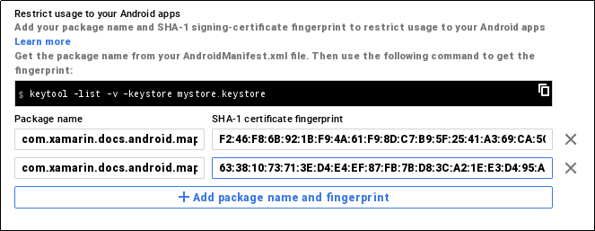](obtaining-a-google-maps-api-key-images/11-second-fingerprint-vs.png#lightbox)

8. Click the **Save** button to save your changes. Next, you are returned to the list of your API keys. If you have other API keys that you have created earlier, they will also be listed here. In this example, only one API key (created in the previous steps) is listed:

   [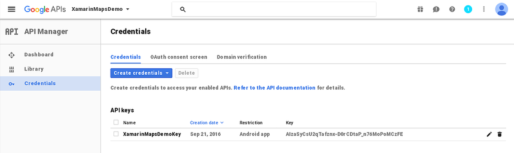](obtaining-a-google-maps-api-key-images/12-list-of-apis-vs.png#lightbox)

## Connect the project to a billable account

Beginning June,11 2018, the API key will not work if the project is not connected to a billable account (even if the service is still free for mobile apps).

1. Click the hamburger menu button and select the **Billing** page:

   [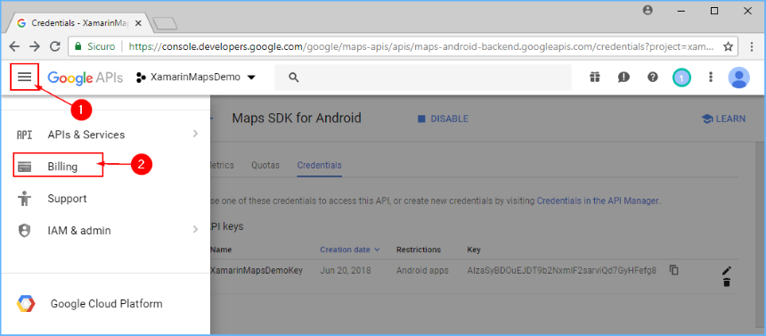](obtaining-a-google-maps-api-key-images/13-goto-billing-vs.png#lightbox)

2. Link the project to a billing account by clicking **Link a billing account** followed by **CREATE BILLING ACCOUNT** on the displayed popup (if you don't have an account, you will be guided to create a new one):

   [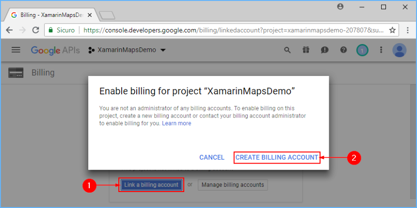](obtaining-a-google-maps-api-key-images/14-link-billing-account-vs.png#lightbox)

## Adding the Key to Your Project

Finally, add this API key to the **AndroidManifest.XML** file of your Xamarin.Android app. In the following example, `YOUR_API_KEY` is to be replaced with the API key generated in the previous steps:

```xml
<manifest xmlns:android="http://schemas.android.com/apk/res/android"
    android:versionName="4.10" package="com.xamarin.docs.android.mapsandlocationdemo"
    android:versionCode="10">
...
  <application android:label="@string/app_name">
    <!-- Put your Google Maps V2 API Key here. -->
    <meta-data android:name="com.google.android.maps.v2.API_KEY" android:value="YOUR_API_KEY" />
    <meta-data android:name="com.google.android.gms.version" android:value="@integer/google_play_services_version" />
  </application>
</manifest>
```

## Related Links

- [Google APIs Console](https://code.google.com/apis/console/)
- [The Google Maps API Key](https://developers.google.com/maps/documentation/android/start#the_google_maps_api_key)
- [keytool](https://docs.oracle.com/javase/6/docs/technotes/tools/windows/keytool.html.)
