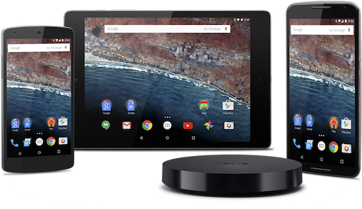
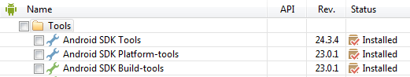
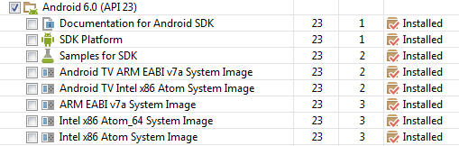
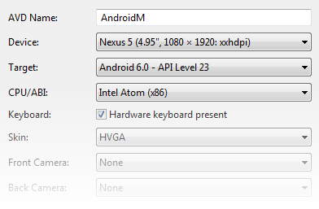

# Marshmallow Features

_This article helps you get started using in using Xamarin.Android to develop apps for Android 6.0 Marshmallow._

This article provides an outline of the new features in Android 6.0 
Marshmallow, explains how to prepare Xamarin.Android for Android 
Marshmallow development, and provides links to sample applications that 
illustrate how to make use of new Android Marshmallow features in 
Xamarin.Android apps. 

## Overview

[Android 6.0 Marshmallow](https://developer.android.com/about/versions/marshmallow/index.html),
is the next major Android release after Android Lollipop.
Xamarin.Android supports Android Marshmallow and includes:

- **API 23/Android 6.0 Bindings** &ndash; Android 6.0 adds many new 
    APIs for the new features described below; these APIs are available 
    to Xamarin.Android apps when you target API Level 23. For more 
    information about Android 6.0 APIs, see 
    [Android 6.0 APIs](https://developer.android.com/reference). 

Although the Marshmallow release is mainly focused on "polish and 
quality", it also provides many new features of interest to 
Xamarin.Android developers. These features include: 

- **Runtime Permissions** &ndash; This enhancement makes it possible 
    for users to approve security permissions on a case-by-case basis 
    at run time. 

- **Authentication Improvements** &ndash; Starting with Android 
    Marshmallow, apps can now use fingerprint sensors to authenticate 
    users, and a new *confirm credential* feature minimizes the need 
    for entering passwords. 

- **App Linking** &ndash; This feature helps to eliminate the 
    necessity of having the **App Chooser** pop up by automatically 
    associating apps with web domains. 

- **Direct Share** &ndash; You can define *direct share targets* that 
    make sharing quick and intuitive for users; this feature allows 
    uers to share content with other apps. 

- **Voice Interactions** &ndash; This new API allows you to build 
    conversational voice features into your app. 

- **4K Display Mode** &ndash; In Android Marshmallow, your app can 
    request a 4K display resolution on hardware that supports it. 

- **New Audio Features** &ndash; Starting with Marshmallow, Android 
    now supports the MIDI protocol. It also provides new classes to 
    create digital audio capture and playback objects, and it offers 
    new API hooks for associating audio and input devices. 

- **New Video Features** &ndash; Marshmallow provides a new class that 
    helps apps render audio and video streams in sync; this class also 
    provides support for dynamic playback rate. 

- **Android for Work** &ndash; Marshmallow includes enhanced controls 
    for corporate-owned, single-user devices. It supports silent 
    install and uninstall of apps by the device owner, auto-acceptance 
    of system updates, improved certificate management, data usage 
    tracking, permissions management, and work status notifications. 

- **Material Design Support Library** &ndash; The new *Design Support 
    Library* provides design components and patterns that makes it 
    easier for you to build Material Design look and feel into your 
    app. 

In addition, many core Android library updates were released with
Android M, and these updates provide new features for both Android M
and earlier versions of Android.

In addition, many core Android library updates were released with 
Android Marshmallow, and these updates provide new features for both 
Android Marshmallow and earlier versions of Android. This article 
explains how to get started building apps with Android Marshmallow, and 
it provides an overview of the new feature highlights in Android 6.0. 

## Requirements

The following is required to use the new Android Marshmallow features 
in Xamarin-based apps: 

- **Xamarin.Android** &ndash; Xamarin.Android 5.1.7.12 or later must be
    installed and configured with either Visual Studio or Xamarin
    Studio.

- **Visual Studio for Mac** or **Visual Studio** &ndash; If you are using 
    Visual Studio for Mac, version 5.9.7.22 or later is 
    required. If you are using Visual Studio, version 3.11.1537 or 
    later of the Xamarin tools for Visual Studio is required. 

- **Android SDK** &ndash; Android SDK 6.0 (API 23) or later must be 
    installed via the Android SDK Manager.

- **Java Developer Kit** &ndash; Xamarin.Android requires
    [JDK 1.8](https://www.oracle.com/technetwork/java/javase/downloads/jdk8-downloads-2133151.html) or
    later if you are developing for API level 24 or greater (JDK 1.8 also supports API levels earlier
    than 24, including Marshmallow). The 64-bit version of JDK 1.8 is required if you
    are using custom controls or the Forms Previewer.

You can continue to use 
[JDK 1.7](https://www.oracle.com/technetwork/java/javase/downloads/jdk7-downloads-1880260.html) 
if you are developing specifically for API level 23 or earlier. 

## Getting Started

To get started using Android Marshmallow with Xamarin.Android, you must 
download and install the latest tools and SDK packages before you can 
create an Android Marshmallow project: 

1. Install the latest Xamarin updates from the **Stable** channel. 

2. Install the Android 6.0 Marshmallow SDK packages and tools.

3. Create a new Xamarin.Android project that targets Android 6.0 
    Marshmallow (API Level 23). 

4. Configure an emulator or device for Android Marshmallow.

Each of these steps is explained in the following sections:

### Install Xamarin Updates

To update Xamarin so that it includes support for Android 6.0 
Marshmallow, change the update channel to **Stable** and install 
all updates. For more information about installing updates from the updates 
channel, see [Change the Updates Channel](https://github.com/xamarin/recipes/tree/master/Recipes/cross-platform/ide/change_updates_channel). 

### Install the Android 6.0 SDK

To create a Xamarin.Android project for Android Marshmallow, you must first
use the Android SDK Manager to install the Android 6.0 SDK:

- Start the Android SDK Manager (in Visual Studio for Mac, use
    **Tools > SDK Manager**; in Visual Studio,
    use **Tools > Android > Android SDK Manager**) and install
    the latest Android SDK Tools:

    

- Also, install the latest **Android 6.0** SDK packages:

    

You must install Android SDK Tools revision 24.3.4 or later.
For more information about using the Android SDK Manager to install the
Android 6.0 SDK, see
[SDK Manager](https://developer.android.com/tools/help/sdk-manager.html).

### Start a Xamarin.Android Project

Create a new Xamarin.Android project. If you are new to Android 
development with Xamarin, see 
[Hello, Android](~/android/get-started/hello-android/index.md) to 
learn about creating Android projects. 

When you create an Android project, you must configure the version
settings to target Android 6.0 MarshMallow. To target your project for Marshmallow, you
must configure your project for **API level 23 (Xamarin.Android v6.0 Support)**. 
For more about configuring Android API level levels, see 
[Understanding Android API Levels](~/android/app-fundamentals/android-api-levels.md).

### Configure an Emulator or Device

If you are using an emulator, start the Android AVD Manager and create a new
device using the following settings:

- Device: Nexus 5, 6, or 9.
- Target: Android 6.0 - API Level 23
- ABI: x86

For example, this virtual device is configured to emulate a Nexus 5:

If you are using a physical device such as a Nexus 5, 6, or 9, you can
install a preview image of Android Marshmallow. For more information about
updating your device to Android Marshmallow, see
[Hardware System Images](https://developer.android.com/preview/download.html#images).

## New Features

Many of the changes introduced in Android Marshmallow are focused on 
improving the Android user experience, increasing performance, and 
fixing bugs. However, Marshmallow also introduced some extensive 
changes to the fundamentals of the Android platform. The following 
sections highlight these enhancements and provide links to help you get 
started in using the new Android Marshmallow features in your app. 

### Runtime Permissions

The Android Permissions system has been significantly optimized and 
simplified since Android Lollipop. In Android Marshmallow, users grant 
permissions on a case-by-case basis at runtime rather than at install 
time. To support this feature on Android Marshmallow and later, you 
design your app to prompt the user for permissions at runtime (in the 
context of where the permissions are needed). This change makes it 
easier for users to start using your app immediately because it 
streamlines the process of installing and upgrading your app. 

See [Requesting Runtime Permissions in Android Marshmallow](https://blog.xamarin.com/requesting-runtime-permissions-in-android-marshmallow/)
for more details (including code examples) about implementing Runtime Permissions in Xamarin.Android apps.
Xamarin also provides a sample app that illustrates how runtime permissions
work in Android Marshmallow (and later):
[RuntimePermissions](/samples/xamarin/monodroid-samples/android-m-runtimepermissions).

This sample app demonstrates the following:

- How to check and request permissions at run time.
- How to declare permissions for Android M devices.

To use this sample app:

1. Tap the **Camera** or **Contacts** buttons to display a permissions request dialog.
2. Grant permission to view Camera or Contacts fragments.

For more information about the new runtime permissions features
in Android Marshmallow, see 
[Working with System Permissions](https://developer.android.com/preview/features/runtime-permissions.html).

### Authentication Enhancements

Android Marshmallow includes two authentication enhancements that help eliminate
the need for passwords:

- **Fingerprint Authentication** &ndash; Uses a fingerprint scan to authenticate users.

- **Confirm Credential** &ndash; Authenticates users based on how long the device has
    been unlocked.

The links and sample apps described next can help you become familiar
with these new features.

#### Fingerprint Authentication

On devices that support fingerprint scanning hardware, you can use the
new `FingerPrintManager` class to authenticate a user.
For more information about the fingerprint authentication feature
in Android Marshmallow, see [Fingerprint
Authentication](https://android-developers.googleblog.com/2015/10/new-in-android-samples-authenticating.html).

Xamarin provides a sample app that illustrates how to use registered
fingerprints to authenticate a user in your app:
[FingerprintDialog](/samples/xamarin/monodroid-samples/android-m-fingerprintdialog).

To use this sample app:

1. Touch the **Purchase** button to open a fingerprint authentication dialog.
2. Scan in your registered fingerprint to authenticate.

Note that this sample app requires a device with a fingerprint reader.
This app does not store your fingerprint (or your password).

#### Voice Interactions

The new Voice Interactions feature introduced in Android Marshmallow allows users of
your app to use their voice to confirm actions and select from a list of
options. For more information about Voice Interactions, see 
[Overview of the Voice Interaction API](https://developers.google.com/voice-actions/interaction/). 

See [Add a Conversation to your Android App with Voice Interactions](https://blog.xamarin.com/add-a-conversation-to-your-android-app-with-voice-interactions/)
for more details (including code examples) about implementing Voice Interactions in Xamarin.Android apps.
A sample app is available that illustrates how to use the Voice Interaction API
in a Xamarin.Android app:
[Voice Interactions](https://github.com/jamesmontemagno/MarshmallowSamples/tree/master/VoiceInteractions).

#### Confirm Credential

Using the new *confirm credential* feature of Android Marshmallow, you can free
users from having to remember and enter app-specific passwords by
authenticating them based on how long their device has been unlocked.
To do this, you use the new `SetUserAuthenticationValidityDurationSeconds`
method of the `KeyGenerator`. Use the `KeyGuardManager`'s
`CreateConfirmDeviceCredentialIntent` method to re-authenticate
the user from within your app. For more information about this
new feature in Android Marshmallow, see [Confirm
Credential](https://developer.android.com/about/versions/marshmallow/android-6.0#confirm-credential).

Xamarin provides a sample app that illustrates how to use device credentials
(such as PIN, pattern, or password) in your app:
[ConfirmCredential](/samples/xamarin/monodroid-samples/android-m-confirmcredential)

To use this sample app:

1. Setup a secure lock screen on your device (**Secure > Security > Screenlock**).
2. Tap the **Purchase** button and confirm the secure lock screen credentials.

### Chrome Custom Tabs

App developers face a choice when a user taps a URL: the app can either 
launch a browser or use an in-app browser based on a `WebView`. Both 
options present challenges &ndash; launching the browser is a heavy 
context switch that isn't customizable, while `WebView`s do not share 
state with the browser. Also, use of `WebView`s can add extra 
maintenance overhead. 

*Chrome Custom Tabs* makes it possible for you to easily and elegantly 
display websites with the power of Chrome without having your users 
leave your app. This feature gives your app more control over the 
user's web experience; it make transitions between native and web 
content more seamless without having to resort to a `WebView`. Your app 
can also affect how Chrome looks and feels by customizing the 
following: 

- Toolbar color

- Enter and exit animations

- Custom actions in the Chrome toolbar and overflow menu

- Chrome pre-start and content pre-fetch (for faster loading)

To take advantage of this feature in your Xamarin.Android app, download and install the
[Android Support Custom Tabs Library](https://www.nuget.org/packages/Xamarin.Android.Support.CustomTabs/).
For more information about this feature, see
[Chrome Custom Tabs](https://developer.chrome.com/multidevice/android/customtabs).

### Material Design Support Library

Android Lollipop introduced
[Material Design](https://www.google.com/design/spec/material-design/introduction.html)
as a new design language to refresh the Android experience (see
[Material Theme](~/android/user-interface/material-theme.md) for
information about using material design in Xamarin.Android apps). With
Android Marshmallow, Google introduced the *Android Design Support Library* to
make it easier for app developers to adopt material design look and
feel. This library includes the following components:

- **CoordinatorLayout** &ndash; The new `CoordinatorLayout` widget is
    similar to but more powerful than a `FrameLayout`. You can use
    `CoordinatorLayout` as a container for child views or as a
    top-level layout, and it provides a `layout_anchor` attribute that
    can be used to anchor views relative to other views.

- **Collapsing Toolbars** &ndash; The new `CollapsingToolbarLayout` is a
    collapsing app bar that is a wrapper for `Toolbar`. (Note that the
    *app bar* is what was formerly referred to as the *action bar*.)

- **Floating Action Button** &ndash; A round button that denotes the
    primary action on your app's interface.

- **Floating Labels for Editing Text** &ndash; Uses a new
    `TextInputLayout` widget (which wraps `EditText`) to show a floating
    label when a hint is hidden when a user inputs text.

- **Navigation View** &ndash; The new `NavigationView` widget helps
    you use the navigation drawer in a way that is easier for users
    to navigate.

- **Snackbar** &ndash; The new `SnackBar` widget is a lightweight
    feedback mechanism (similar to a toast) that displays a brief
    message at the bottom of the screen, appearing above all other
    elements on the screen.

- **Material Tabs** &ndash; The new `TabLayout` widget provides a
    horizontal layout for displaying tabs as way to implement top-level
    navigation in your app.

To take advantage of the
[Design Support Library](https://developer.android.com/tools/support-library/features.html#design)
in your Xamarin.Android app, download and install the Xamarin 
[Xamarin Support Library Design](https://www.nuget.org/packages/Xamarin.Android.Support.Design/)
NuGet package.

See [Beautiful Material Design with the Android Support Design Library](https://blog.xamarin.com/add-beautiful-material-design-with-the-android-support-design-library/) for more details (including code examples) about using the Material Design Support Library in Xamarin.Android apps.
Xamarin provides a sample app that demos the new Android Design library 
on Xamarin.Android &ndash; [Cheesesquare](/samples/xamarin/monodroid-samples/android50-cheesesquare).
This sample demonstrates the following features of the Design library:

- Collapsing toolbar
- Floating action button
- View anchoring
- NavigationView
- Snackbar

For more information about the Design library, see
[Android Design Support Library](https://android-developers.googleblog.com/2015/05/android-design-support-library.html)
in the Android Developer's blog.

### Additional Library Updates

In addition to Android Marshmallow, Google has announced related 
updates to several core Android libraries. Xamarin provides 
Xamarin.Android support for these updates through several 
preview-release NuGet packages: 

- [Google Play Services](https://www.nuget.org/packages?q=Xamarin+Google+Play+Services) 
    &ndash; The latest version of Google Play Services includes the new 
    *App Invites* feature, which makes it possible for users to share 
    their app with friends. For more information about this feature, 
    see 
    [Expand Your App's Reach with Google's App Invites](https://blog.xamarin.com/expand-your-apps-reach-with-googles-app-invites/). 

- [Android Support Libraries](https://www.nuget.org/packages?q=xamarin+support+library) 
    &ndash; These NuGets offer features that are only available for 
    library APIs while providing backward-compatible versions of the 
    Android framework APIs. 

- [Android Wearable Library](https://www.nuget.org/packages/Xamarin.Android.Wear) 
    &ndash; this NuGet includes Google Play Services bindings. The 
    latest version of the wearable library brings new features 
    (including easier navigation for custom apps) to the Android Wear 
    platform. 

## Summary

This article introduced Android Marshmallow and explained
how to install and configure the latest tools and packages for
Xamarin.Android development on Marshmallow. It also provided an
overview of the most exciting new Android Marshmallow features for
Xamarin.Android development.

## Related Links

- [Android 6.0 Marshmallow](https://developer.android.com/about/versions/marshmallow/index.html)
- [Get the Android SDK](https://developer.android.com/sdk/index.html#Other)
- [Feature Overview](https://developer.android.com/reference)
- [Release Notes](https://github.com/xamarin/release-notes-archive/blob/master/release-notes/android/xamarin.android_5/xamarin.android_5.1.99/index.md)
- [RuntimePermissions (sample)](/samples/xamarin/monodroid-samples/android-m-runtimepermissions)
- [ConfirmCredential (sample)](/samples/xamarin/monodroid-samples/android-m-confirmcredential)
- [FingerprintDialog (sample)](/samples/xamarin/monodroid-samples/android-m-fingerprintdialog)
