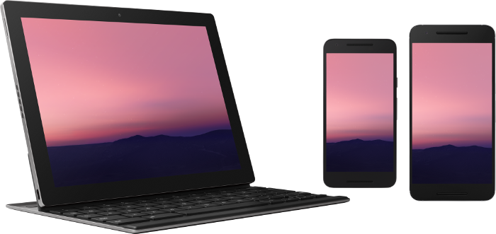
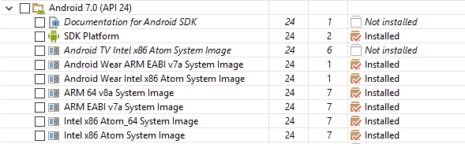
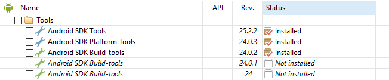
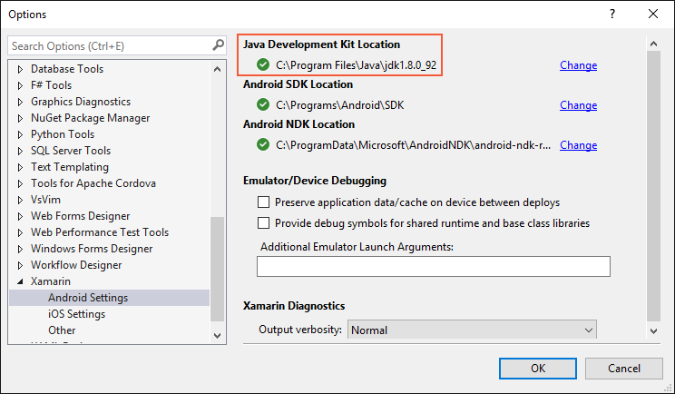
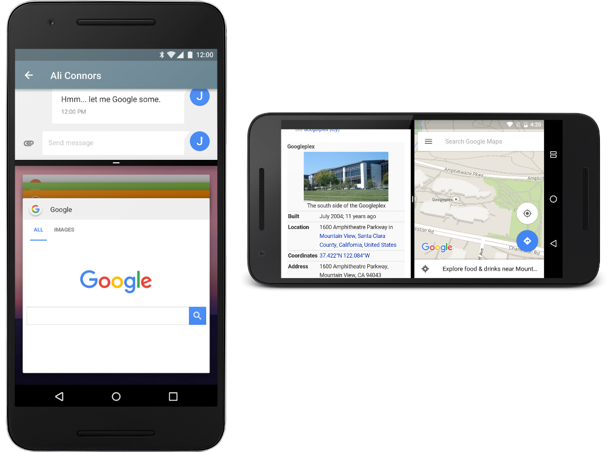
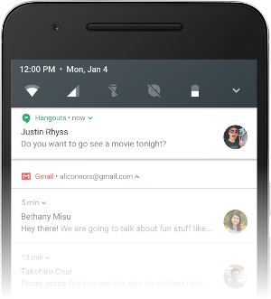

# Nougat Features

_How to get started using Xamarin.Android to develop apps for Android Nougat._

This article provides an outline of the features introduced in Android
Nougat, explains how to prepare Xamarin.Android for Android Nougat
development, and provides links to sample applications that illustrate
how to use Android Nougat features in Xamarin.Android apps.

## Overview

[Android Nougat](https://developer.android.com/about/versions/nougat/android-7.0.html)
is Google's followup to Android 6.0 Marshmallow. Xamarin.Android
provides support for **Android 7.x Bindings** in Xamarin Android 7.0
and later. Android Nougat adds many new APIs for the Nougat features
described below; these APIs are available to Xamarin.Android apps when
you use Xamarin.Android 7.0.

[](nougat-images/android-n-hero.png#lightbox)

For more information about Android 7.x APIs, see
[Android API Reference](https://developer.android.com/reference).
For a list of known Xamarin.Android 7.0 issues, please see the
[release notes](https://github.com/xamarin/release-notes-archive/blob/master/release-notes/android/xamarin.android_7/xamarin.android_7.0/index.md).

Android Nougat provides many new features of interest to Xamarin.Android
developers. These features include:

- **Multi-window support** &ndash; This enhancement makes it possible
    for users to open two apps on the screen at once.

- **Notification Enhancements** &ndash; The redesigned notifications
    system in Android Nougat includes a *Direct Reply* feature that allow
    users to quickly respond to text messages directly from the
    notification UI. Also, if your app creates notifications for
    received messages, the new *bundled notifications* feature can
    bundle notifications together as a single group when more than one
    message is received.

- **Data Saver** &ndash; This feature is a new system service that
    helps reduce cellular data use by apps; it gives users control over
    how apps use cellular data.

In addition, Android Nougat brings many other enhancements of interest to
app developers such as a new network security configuration feature,
Doze on the Go, key attestation, new Quick Settings APIs, multi-locale
support, ICU4J APIs, WebView enhancements, access to Java 8 language
features, scoped directory access, a custom pointer API, platform
VR support, virtual files, and background processing optimizations.

This article explains how to get started building apps with Android
Nougat to try out the new features and plan migration or feature work
to target the new Android Nougat platform.

## Requirements

The following is required to use the new Android Nougat features in
Xamarin-based apps:

- **Visual Studio or Visual Studio for Mac** &ndash; If you are using Visual
    Studio, version 4.2.0.628 or later of Visual Studio Tools for Xamarin is
    required. If you are using Visual Studio for Mac, version 6.1.0 or later
    of Visual Studio for Mac is required.

- **Xamarin.Android** &ndash; Xamarin.Android 7.0 or later must
    be installed and configured with either Visual Studio or Visual Studio for Mac.

- **Android SDK** - Android SDK 7.0 (API 24) or later must be installed
    via the Android SDK Manager.

- **Java Developer Kit** &ndash; Xamarin Android 7.0 development requires
    [JDK 8](https://www.oracle.com/technetwork/java/javase/downloads/jdk8-downloads-2133151.html)
    or later if you are developing for API level 24 or greater (JDK 8
    also supports API levels earlier than 24). The 64-bit version of
    JDK 8 is required if you are using custom controls or the Forms
    Previewer.

> [!IMPORTANT]
> Xamarin.Android does not support JDK 9.

Note that apps must be rebuilt with Xamarin C6SR4 or later to
work reliably with Android Nougat. Because Android Nougat can link only to
[NDK-provided native libraries](https://developer.android.com/about/versions/nougat/android-7.0-changes.html),
existing apps using libraries such as **Mono.Data.Sqlite.dll** may
crash when running on Android Nougat if they are not properly rebuilt.

## Getting Started

To get started using Android Nougat with Xamarin.Android, you must
download and install the latest tools and SDK packages before you can
create an Android Nougat project:

1. Install the latest Xamarin.Android updates from the Xamarin.

2. Install the **Android 7.0 (API 24)** packages and tools or later.

3. Create a new Xamarin.Android project that targets Android Nougat.

4. Configure an emulator or device for Android Nougat.

Each of these steps is explained in the following sections:

### Install Xamarin Updates

To add Xamarin support for Android Nougat, change the updates channel in
Visual Studio or Visual Studio for Mac to the Stable channel and apply the
latest updates. If you also need features that are currently available
only in the Alpha or Beta channel, you can switch to the Alpha or Beta
channel (the Alpha and Beta channels also provide support for Android
7.x). For information about how to change the
updates (releases) channel, see
[Changing the Updates Channel](https://github.com/xamarin/recipes/tree/master/Recipes/cross-platform/ide/change_updates_channel).

### Install the Android SDK

To create a project with Xamarin Android 7.0, you must first use the
Android SDK Manager to install **SDK Platform Android N (API 24)** or
later. You must also install the latest **Android SDK Tools**:

1. Start the Android SDK Manager (in Visual Studio for Mac, use
    **Tools > Open Android SDK Manager&hellip;**; in Visual Studio,
    use **Tools > Android > Android SDK Manager**).

2. Install **Android 7.0 (API 24)** or later:

    [](nougat-images/preview-packages.png#lightbox)

3. Install the latest Android SDK tools:

    [](nougat-images/preview-tools.png#lightbox)

    You must install Android SDK Tools revision 25.2.2 or later, Android
    SDK Platform tools 24.0.3 or later, and Android SDK Build tools 24.0.2
    or later.

4. Verify that the **Java Development Kit Location**
    is configured for JDK 1.8:

    [](nougat-images/use-jdk-1.8.png#lightbox)

    To view this setting in Visual Studio, click **Tools > Options >
    Xamarin > Android Settings**. In Visual Studio for Mac,
    click **Preferences > Projects > SDK Locations > Android**.

### Start a Xamarin.Android Project

Create a new Xamarin.Android project. If you are new to Android
development with Xamarin, see
[Hello, Android](~/android/get-started/hello-android/index.md) to
learn about creating Xamarin.Android projects.

When you create an Android project, you must configure the version
settings to target Android 7.0 or later. For example, to target your
project for Android 7.0, you must configure the target Android API
level of your project to **Android 7.0 (API 24 - Nougat)**. It is
recommended that you set your target framework level to API 24 or
later. For more about configuring Android API level levels, see
[Understanding Android API Levels](~/android/app-fundamentals/android-api-levels.md).

> [!NOTE]
> Currently you must set the **Minimum Android
version** to **Android 7.0 (API 24 - Nougat)** to deploy your
app to Android Nougat devices or emulators.

### Configure an Emulator or Device

If you are using an emulator, start the Android AVD Manager and create a new
device using the following settings:

- Device: Nexus 5X, Nexus 6, Nexus 6P, Nexus Player, Nexus 9, or Pixel C.
- Target: Android 7.0 - API Level 24
- ABI: x86 or x86\_64

For example, this virtual device is configured to emulate a Nexus 6:

[](nougat-images/android-n-avd.png#lightbox)

If you are using a physical device such as a Nexus 5X, 6, or 9, you can
either update your device through automatic over the air (OTA) updates
or download a system image and flash your device directly. For
more information about manually updating your device to Android Nougat,
see [OTA Images for Nexus Devices](https://developers.google.com/android/nexus/ota).

Note that Nexus 5 devices are not supported by Android Nougat.

## New Features

Android Nougat introduces a variety of new features and capabilities,
such as Multi-window Support, Notifications enhancements, and Data
Saver. The following sections highlight these features and provide
links to help you get started using them in your app.

### Multi-Window Mode

Multi-window mode makes it possible for users to open two apps at once
with full multitasking support. These apps can run side-by-side
(landscape) or one-above-the-other (portrait) in split-screen mode.
Users can drag a divider between the apps to resize them, and they can
cut and paste content the between apps. When two apps are presented in
multi-window mode, the selected activity continues to run while the
unselected activity is paused but still visible. Multi-window
mode does not modify the Android activity lifecycle.

[](nougat-images/multi-window-mode.png#lightbox)

You can configure how the activities of your Xamarin.Android app
support multi-window mode. For example, you can configure attributes
that set the minimum size and the default height and width of your app
in multi-window mode. You can use the new `Activity.IsInMultiWindowMode`
property to determine if your activity is in multi-window mode. For
example:

```csharp
if (!IsInMultiWindowMode) {
    multiDisabledMessage.Visibility = ViewStates.Visible;
} else {
    multiDisabledMessage.Visibility = ViewStates.Gone;
}
```

The [MultiWindowPlayground](/samples/xamarin/monodroid-samples/android-n-multiwindowplayground)
sample app includes C# code that demonstrates how to take advantage of
multiple window user interfaces with your app.

For more information about multi-window mode, see the
[Multi-Window Support](https://developer.android.com/guide/topics/ui/multi-window.html).

### Enhanced Notifications

Android Nougat introduces a redesigned notification system. It features a
new Direct Reply feature that makes it possible for users to quickly
reply to notifications for incoming text messages directly in the
notification UI. Starting with Android 7.0, notification messages can be
bundled together as a single group when more than one message is
received. Also, developers can customize notification views, leverage
system decorations in notifications, and take advantage of new
notification templates when generating notifications.

#### Direct Reply

When a user receives a notification for incoming message, Android
Nougat makes it possible to reply to the message within the
notification (rather than open up the messaging app to send a reply).
This inline reply feature makes it possible for users to quickly
respond to an SMS or text message directly within the notification
interface:

[](nougat-images/notifications-inline-reply.png#lightbox)

To support this feature in your app, you must add *inline reply
actions* to your app via a
[RemoteInput](xref:Android.App.RemoteInput)
object so that users can reply via text directly from the notification UI.
For example, the following code builds a `RemoteInput` for receiving text input,
builds a pending intent for the reply action, and creates a remote
input enabled action:

```csharp
// Build a RemoteInput for receiving text input:
var remoteInput = new Android.Support.V4.App.RemoteInput.Builder (EXTRA_REMOTE_REPLY)
    .SetLabel (GetString (Resource.String.reply))
    .Build ();

// Build a Pending Intent for the reply action to trigger:
PendingIntent replyIntent = PendingIntent.GetBroadcast (ApplicationContext,
                                conversation.ConversationId,
                                GetMessageReplyIntent (conversation.ConversationId),
                                PendingIntentFlags.UpdateCurrent);

// Build an Android 7.0 compatible Remote Input enabled action:
NotificationCompat.Action actionReplyByRemoteInput = new NotificationCompat.Action.Builder (
    Resource.Drawable.notification_icon,
    GetString (Resource.String.reply),
    replyIntent).AddRemoteInput (remoteInput).Build ();
```

This action is added to the notification:

```csharp
// Create the notification:
NotificationCompat.Builder builder = new NotificationCompat.Builder (ApplicationContext)
   .SetSmallIcon (Resource.Drawable.notification_icon)
   ...
   .AddAction (actionReplyByRemoteInput);
```

The [Messaging Service](/samples/xamarin/monodroid-samples/android-n-messagingservice)
sample app includes C# code that demonstrates how to extend
notifications with a `RemoteInput` object. For more information about
adding inline reply actions to your app for Android 7.0 or later, see
the Android
[Replying to Notifications](https://developer.android.com/guide/topics/ui/notifiers/notifications.html#direct)
topic.

#### Bundled Notifications

Android Nougat can group notification messages together (for example, by
message topic) and display the group rather than each separate message.
This *bundled notifications* feature makes it possible for users to
dismiss or archive a group of notifications in one action. The user
can slide down to expand the bundle of notifications to view each
notification in detail:

[](nougat-images/bundled-notifications.png#lightbox)

To support bundled notifications, your app can use the
[Builder.SetGroup](xref:Android.App.Notification.Builder.SetGroup*)
method to bundle similar notifications. For more information about
bundled notification groups in Android N, see the Android
[Bundling Notifications](https://developer.android.com/guide/topics/ui/notifiers/notifications.html#bundle)
topic.

#### Custom Views

Android Nougat makes it possible for you to create
custom notification views with system notification headers, actions,
and expandable layouts. For more information about custom notification
views in Android Nougat, see the Android
[Notification Enhancements](https://developer.android.com/about/versions/nougat/android-7.0.html#notification_enhancements)
topic.

### Data Saver

Beginning with Android Nougat, users can enable a new *Data Saver*
setting that blocks background data usage. This setting also signals
your app to use less data in the foreground wherever possible. The
[ConnectivityManager](xref:Android.Net.ConnectivityManager) has
been extended in Android Nougat so that your app can check whether the
user has enabled Data Saver so that your app can make an effort to
limit its data usage when Data Saver is enabled.

For more information about the new Data Saver feature in Android Nougat,
see the Android
[Optimizing Network Data Usage](https://developer.android.com/training/basics/network-ops/data-saver.html)
topic.

### App Shortcuts

Android 7.1 introduced an *App Shortcuts* feature that makes it possible
for users to quickly start common or recommended tasks with your app.
To activate the menu of shortcuts, the user long-presses the app icon
for a second or more &ndash; the menu appears with a quick vibration.
Releasing the press causes the menu to remain:

[](nougat-images/app-shortcuts.png#lightbox)

This feature is available only API level 25 or higher.
For more information about the new App Shortcuts feature in Android 7.1,
see the Android [App Shortcuts](https://developer.android.com/guide/topics/ui/shortcuts.html)
topic.

### Sample Code

Several Xamarin.Android samples are available to show you how to take
advantage of Android Nougat features:

- [MultiWindowPlayground](/samples/xamarin/monodroid-samples/android-n-multiwindowplayground)
    demonstrates the use of the multi-window API available in Android
    Nougat. You can switch the sample app into multi-windows mode to see how
    it affects the app's lifecycle and behavior.

- [Messaging Service](/samples/xamarin/monodroid-samples/android-n-messagingservice)
    is a simple service that sends notifications using the `NotificationCompatManager`. It also
    extends the notification with a `RemoteInput` object to allow Android Nougat devices to reply via
    text directly from the notification without having to open an app.

- [Active Notifications](/samples/xamarin/monodroid-samples/android-n-activenotifications)
    demonstrates how to use the `NotificationManager` API to tell you
    how many notifications your application is currently displaying.

- [Scoped Directory Access](/samples/xamarin/monodroid-samples/android-n-scopeddirectoryaccess)
    Demonstrates how to use the scoped directory access API to easily
    access specific directories. This serves as an alternative to
    having to define `READ_EXTERNAL_STORAGE` or `WRITE_EXTERNAL_STORAGE`
    permissions in your manifest.

- [Direct Boot](/samples/xamarin/monodroid-samples/android-n-directboot)
    Illustrates how to store data in a device-encrypted storage which is always available
    while the device is booted both before and after any user credentials(PIN/Pattern/Password)
    are entered.

## Summary

This article introduced Android Nougat and explained how to install
and configure the latest tools and packages for Xamarin.Android
development on Android Nougat. It also provided an overview of the key
features available in Android Nougat, with links to example source code to
help you get started in creating apps for Android Nougat.

## Related Links

- [Android 7.1 For Developers](https://developer.android.com/about/versions/nougat/android-7.1.html)
- [Xamarin Android 7.0 Release Notes](https://github.com/xamarin/release-notes-archive/blob/master/release-notes/android/xamarin.android_7/xamarin.android_7.0/index.md)
