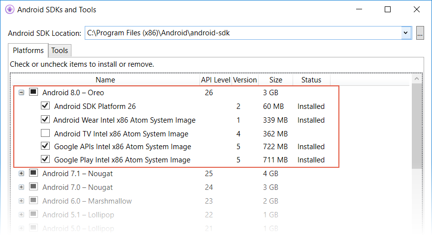
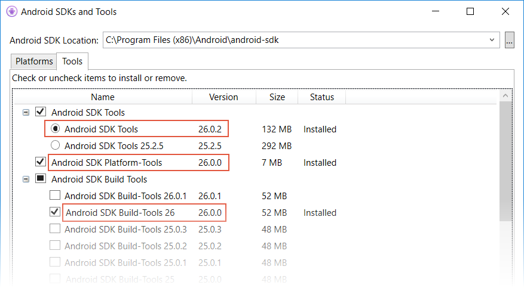
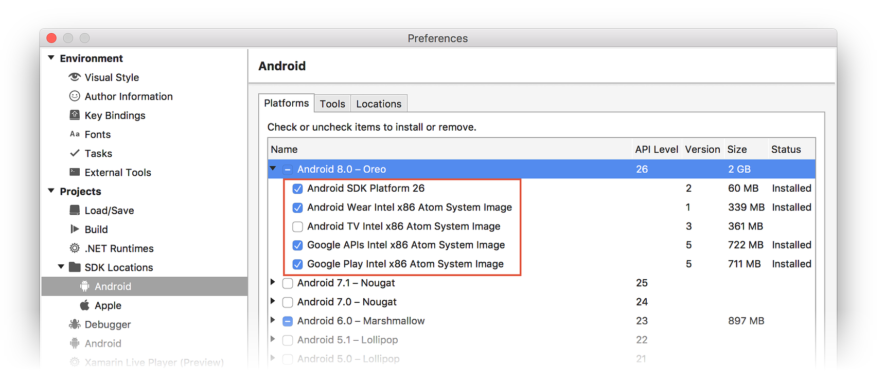
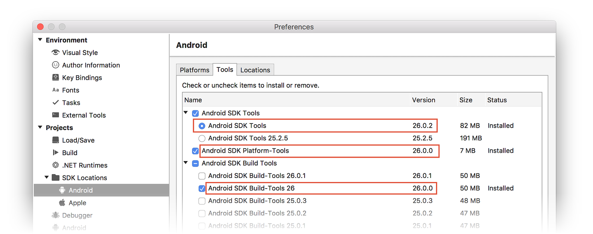
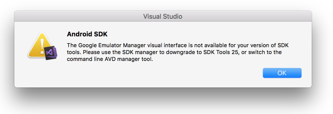
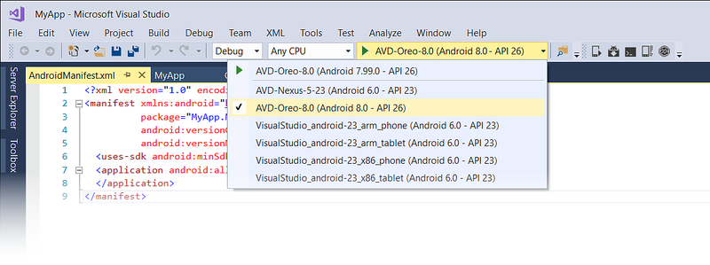
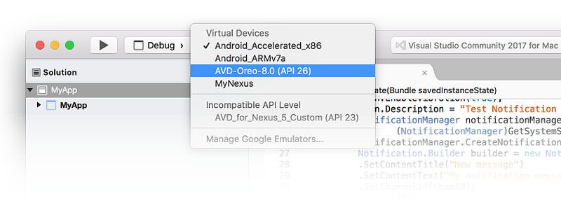
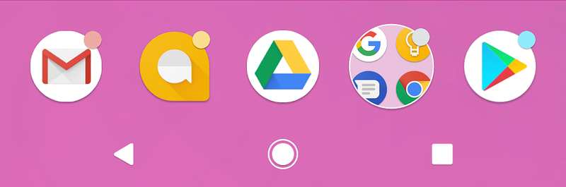

# Oreo Features

_How to get started using Xamarin.Android to develop apps for the latest version of Android._

[Android 8.0 Oreo](https://developer.android.com/index.html) is the
latest version of Android available from Google. Android Oreo offers
many new features of interest to Xamarin.Android developers. These
features include notification channels, notification badges, custom
fonts in XML, downloadable fonts, autofill, and picture in picture
(PIP). Android Oreo includes new APIs for these new capabilities, and
these APIs are available to Xamarin.Android apps when you use
Xamarin.Android 8.0 and later.

[](oreo-images/01-android-o-logo.png#lightbox)

This article is structured to help you get started in developing
Xamarin.Android apps for Android 8.0 Oreo. It explains how to install
the necessary updates, configure the SDK, and create an emulator (or
device) for testing. It also provides an outline of the new features in
Android 8.0 Oreo, with links to sample apps that illustrate how to use
Android Oreo features in Xamarin.Android apps.

## Requirements

The following is required to use Android Oreo features in Xamarin-based
apps:

- **Visual Studio** &ndash; If you are using Windows, version 15.5 
    or later of Visual Studio is required.  If you are using
    a Mac, Visual Studio for Mac version 7.2.0 is 
    required.

- **Xamarin.Android** &ndash; Xamarin.Android 8.0 or later must
    be installed and configured with Visual Studio.

- **Android SDK** &ndash; Android SDK 8.0 (API 26) or later must be 
    installed via the Android SDK Manager.

## Getting Started

To get started using Android Oreo with Xamarin.Android, you must download
and install the latest tools and SDK packages before you can create an
Android Oreo project:

1. Update to the latest version of Visual Studio.

2. Install the **Android 8.0.0 (API 26)** or later packages and tools
   via the SDK Manager.

3. Create a new Xamarin.Android project that targets Android Oreo (API 26).

4. Configure an emulator or device for testing Android Oreo apps.

Each of these steps is explained in the following sections:

### Update Visual Studio and Xamarin.Android

To add Android Oreo support to Visual Studio, do the following:

<!-- markdownlint-disable MD001 -->

# [Visual Studio](#tab/windows)

- For Visual Studio 2019, use the [SDK Manager](~/android/get-started/installation/android-sdk.md) to install API level 26.0 or later.

- If you are using Visual Studio 2017:

    1. Update to Visual Studio 2017 version 15.7 or later (see
       [Update Visual Studio 2017](/visualstudio/install/update-visual-studio)).

    2. Use the [SDK Manager](~/android/get-started/installation/android-sdk.md) to install
       API level 26.0 or later.

# [Visual Studio for Mac](#tab/macos)

- Update to the latest stable version of Visual Studio for Mac as explained in
    [Updating Visual Studio for Mac](/visualstudio/mac/update).

-----

For more information about Xamarin support for Android Oreo, see the
[Xamarin.Android 8.0 release notes](/xamarin/android/release-notes/8/8.0/).

### Install the Android SDK

To create a project with Xamarin.Android 8.0, you must first use the
Xamarin Android SDK Manager to install the SDK platform for **Android
8.0 - Oreo** or later. You must also install Android SDK Tools 26.0 or
later.

# [Visual Studio](#tab/windows)

1. Start the SDK Manager (in Visual Studio, click **Tools >
   Android > Android SDK Manager**).

2. Install the **Android 8.0 - Oreo** packages. If you are using the
   Android SDK emulator, be sure to include the **x86** system images that you
   will need:

    [](oreo-images/win/01-android-o-packages.png#lightbox)

3. Install **Android SDK Tools 26.0.2** or later, **Android SDK
   Platform-Tools 26.0.0** or later, and **Android SDK Build-Tools
   26.0.0** (or later):

    [](oreo-images/win/02-sdk-tools.png#lightbox)

# [Visual Studio for Mac](#tab/macos)

1. Start the SDK Manager (in Visual Studio for Mac, click **Tools > SDK Manager**).

2. Install the **Android 8.0 - Oreo** SDK packages. If you are using the
   Android SDK emulator, be sure to include the **x86** system images
   that you will need:

    [](oreo-images/mac/01-android-o-packages.png#lightbox)

3. Install **Android SDK Tools 26.0.2** or later, **Android SDK
   Platform-Tools 26.0.0** or later, and **Android SDK Build-Tools
   26.0.0** (or later):

    [](oreo-images/mac/02-sdk-tools.png#lightbox)

-----

### Start a Xamarin.Android Project

Create a new Xamarin.Android project. If you are new to Android
development with Xamarin, see
[Hello, Android](~/android/get-started/hello-android/index.md) to
learn about creating Xamarin.Android projects.

When you create an Android project, you must configure the version
settings to target Android 8.0 or later. For example, to target your
project for Android 8.0, you must configure the target Android API
level of your project to **Android 8.0 (API 26)**. It is
recommended that you also set your target framework level to API 26 or
later. For more about configuring Android API level levels, see
[Understanding Android API Levels](~/android/app-fundamentals/android-api-levels.md).

### Configure an Emulator or Device

If you attempt to launch the default Google GUI-based AVD Manager after
installing Android SDK Tools 26.0 or later, you may get the following
error dialog, which instructs you to use the command line AVD manager
tool **avdmanager** instead:

# [Visual Studio](#tab/windows)


# [Visual Studio for Mac](#tab/macos)



-----

This message is displayed because Google no longer provides a standalone
GUI AVD manager that supports API 26.0 and later. For Android 8.0 Oreo,
you must use either the Xamarin Android Emulator Manager or the
command-line `avdmanager` tool to create virtual devices for Android
Oreo.

To use the Android Device Manager to create and manage virtual
devices, see
[Managing Virtual Devices with the Android Device Manager](~/android/get-started/installation/android-emulator/device-manager.md).
To create virtual devices without the Android Device Manager,
follow the steps in the next section.

#### Creating Virtual Devices Using avdmanager

To use **avdmanager** to create a new virtual device, follow these
steps:

# [Visual Studio](#tab/windows)

1. Open a Command Prompt window and set `JAVA_HOME` to the location of
    the Java SDK on your computer. For a typical Xamarin installation,
    you can use the following command:

    ```cmd
    setx JAVA_HOME "C:\Program Files\Java\jdk1.8.0_131"
    ```

2. Add the location of the Android SDK `bin` folder to your `PATH`.
    For a typical Xamarin installation, you can use the following
    command:

    ```cmd
    setx PATH "%PATH%;C:\Program Files (x86)\Android\android-sdk\tools\bin"
    ```

3. Close the Command Prompt window and open a new Command Prompt
    window. Create a new virtual device by using the
    [avdmanager](https://developer.android.com/studio/command-line/avdmanager.html)
    command. For example, to create an AVD named **AVD-Oreo-8.0** using
    the x86 system image for API level 26, use the following command:

    ```cmd
    avdmanager create avd -n AVD-Oreo-8.0 -k "system-images;android-26;google_apis;x86"
    ```

4. When you are prompted with **Do you wish to create a custom
    hardware profile
    [no]** you can enter **no** and accept the default hardware
    profile. If you say **yes**, **avdmanager** will prompt you with a
    list of questions for customizing the hardware profile.

After you **avdmanager** to create your virtual device, it will be
included in the device pull-down menu:

[](oreo-images/win/04-android-o-avd.png#lightbox)

# [Visual Studio for Mac](#tab/macos)

1. Open a **Terminal** window and change to the location of the
    Android SDK tools directory on your Mac. For a typical Xamarin
    installation, you can use the following command:

    ```bash
    cd ~/Library/Developer/Xamarin/android-sdk-macosx/tools/bin
    ```

2. Create a new virtual device by using the
    [avdmanager](https://developer.android.com/studio/command-line/avdmanager.html)
    command. For example, to create an AVD named **AVD-Oreo-8.0** using
    the x86 system image for API level 26, use the following command:

    ```bash
    avdmanager create avd -n AVD-Oreo-8.0 -k "system-images;android-26;google_apis;x86"
    ```

3. When you are prompted with **Do you wish to create a custom
    hardware profile
    [no]** you can enter **no** and accept the default hardware
    profile. If you say **yes**, **avdmanager** will prompt you with a
    list of questions for customizing the hardware profile.

After you use **avdmanager** to create your virtual device, it will be
included in the device pull-down menu:

[](oreo-images/mac/04-android-o-avd.png#lightbox)

-----

For more information about configuring an Android emulator for testing
and debugging, see
[Debugging on the Android Emulator](~/android/deploy-test/debugging/debug-on-emulator.md).

If you are using a physical device such as a Nexus or a Pixel, you can
either update your device through automatic over the air (OTA) updates
or download a system image and flash your device directly. For
more information about manually updating your device to Android Oreo,
see [Factory Images for Nexus and Pixel Devices](https://developers.google.com/android/images).

## New Features

Android Oreo introduces a variety of new features and capabilities,
such as notification channels, notification badges, custom fonts in
XML, downloadable fonts, autofill, and picture-in-picture. The
following sections highlight these features and provide links to help
you get started using them in your app.

### Notification Channels

*Notification Channels* are app-defined categories for notifications.
You can create a notification channel for each type of notification
that you need to send, and you can create notification channels to
reflect choices made by users of your app. The new notification
channels feature makes it possible for you to give users fine-grained
control over different kinds of notifications. For example, if you are
implementing a messaging app, you can create separate notification
channels for each conversation group that is created by a user.

[Notification Channels](~/android/app-fundamentals/notifications/local-notifications.md#notif-chan)
explains how to create a notification channel and use it for posting
local notifications. For a real-world code example, see the
[NotificationChannels](/samples/xamarin/monodroid-samples/android-o-notificationchannels)
sample; this sample app manages two channels and sets additional
notification options.

### Notification Badges

Notification badges are small dots that appear over app icons as shown
in this screenshot:

[](oreo-images/02-badges.png#lightbox)

These dots indicate that there are new notifications for one or more
notification channels in the app associated with that app icon &ndash;
these are notifications that the user has not yet dismissed or acted
upon. Users can long-press on an icon to glance at the notifications
associated with a notification badge, dismissing or acting on
notifications from the long-press menu that appeaars.

For more information about notification badges, see the Android
Developer
[Notification Badges](https://developer.android.com/guide/topics/ui/notifiers/notifications.html#Badges)
topic.

### Custom Fonts in XML

Android Oreo introduces *Fonts in XML*, which makes it possible for you to
incorporate custom fonts as resources. OpenType (**.otf**) and TrueType
(**.ttf**) font formats are supported. To add fonts as resources, do the
following:

1. Create a **Resources/font** folder.

2. Copy your font files (example, **.ttf** and **.otf** files) to
   **Resources/font**. 

3. If necessary, rename each font file so that it adheres to the
   Android file naming conventions (i.e., use only lowercase *a-z*,
   *0-9*, and underscores in file names). For example, the font file
   `Pacifico-Regular.ttf` could be renamed to something like
   `pacifico.ttf`.

4. Apply the custom font by using the new `android:fontFamily`
   attribute in your layout XML. For example, the following `TextView`
   declaration uses the added **pacifico.ttf** font resource:

   ```xml
   <TextView
     android:text="Example Text in Pacifico Regular"
     android:layout_width="wrap_content"
     android:layout_height="wrap_content"
     android:fontFamily="@font/pacifico" />
   ```

You can also create a font family XML file that describes multiple
fonts as well as style and weight details. For more information, see
the Android Developer
[Fonts in XML](https://developer.android.com/guide/topics/ui/look-and-feel/fonts-in-xml.html)
topic.

### Downloadable Fonts

Beginning with Android Oreo, apps can request fonts from a provider rather
than bundling them into the APK. Fonts are downloaded from the network
only as needed. This feature reduces APK size, conserving phone memory
and cellular data usage. You can also use this feature on Android API
versions 14 and higher by installing the Android Support Library 26
package.

When your app needs a font, you create a `FontsRequest` object
(specifying the font to download) and then pass it to a
`FontsContract` method to download the font. The following steps
describe the font download process in more detail:

1. Instantiate a [FontRequest](https://developer.android.com/reference/android/provider/FontRequest.html) object. 

2. Subclass and instantiate 
    [FontsContract.FontRequestCallback](https://developer.android.com/reference/android/provider/FontsContract.FontRequestCallback.html).

3. Implement the [FontRequestCallback.OnTypeFaceRetrieved](https://developer.android.com/reference/android/provider/FontsContract.FontRequestCallback.html#onTypefaceRetrieved%28android.graphics.Typeface%29)  method, which is used to
    handle completion of the font request.

4. Implement the [FontRequestCallback.OnTypeFaceRequestFailed](https://developer.android.com/reference/android/provider/FontsContract.FontRequestCallback.html#onTypefaceRequestFailed%28int%29) method, which is used to inform your app of any errors that
    take place during the font request process.

5. Call the [FontsContract.RequestFonts](https://developer.android.com/reference/android/provider/FontsContract.html#requestFonts(android.content.Context,%20android.provider.FontRequest,%20android.os.Handler,%20android.os.CancellationSignal,%20android.provider.FontsContract.FontRequestCallback)) method
    to retrieve the font from the font provider. 

When you call the `RequestFonts` method, it first checks to see if the
font is locally cached (from a previous call to `RequestFont`). If it
is not cached, it calls the font provider, retrieves the font
asynchronously, and then passes the results back to your app by
invoking your `OnTypeFaceRetrieved` method.

The [Downloadable Fonts](/samples/xamarin/monodroid-samples/android-o-downloadablefonts)
sample demonstrates how to use the Downloadable Fonts feature
introduced in Android Oreo. 

For more information about downloading fonts, see the Android Developer
[Downloadable Fonts](https://developer.android.com/guide/topics/ui/look-and-feel/downloadable-fonts.html)
topic.

### Autofill

The new _Autofill_ framework in Android Oreo makes it easier for users to
handle repetitive tasks such as login, account creation, and credit
card transactions. Users spend less time re-typing information (which
can lead to input errors). Before your app can work with the Autofill
Framework, an autofill service must be enabled in the system settings
(users can enable or disable autofill).

The [AutofillFramework](/samples/xamarin/monodroid-samples/android-o-autofillframework)
sample demonstrates the use of the Autofill Framework. It includes
implementations of client Activities with views that should be
autofilled, and a Service that can provide autofill data to client
Activities.

For more information about the new Autofill feature and how to optimize
your app for autofill, see the Android Developer
[Autofill Framework](https://developer.android.com/guide/topics/text/autofill.html)
topic.

### Picture in Picture (PIP)

Android Oreo makes it possible for an Activity to launch in
picture-in-picture (PIP) mode, overlaying the screen of another
Activity. This feature is intended for video playback.

To specify that your app's Activity can use PIP mode, set the following
flag to true in the Android manifest:

```xml
android:supportsPictureInPicture
```

To specify how your activity should behave when it is in PIP mode, you
use the new
[PictureInPictureParams](https://developer.android.com/reference/android/app/PictureInPictureParams.html)
object. `PictureInPictureParams` represents a set of parameters that
you use to initialize and update an Activity in PIP mode (for example,
the Activity's preferred aspect ratio). The following new PIP methods
were added to `Activity` in Android Oreo:

- [EnterPictureInPictureMode](https://developer.android.com/reference/android/app/Activity.html#enterPictureInPictureMode%28android.app.PictureInPictureParams%29)
    &ndash; puts the Activity in PIP mode. The Activity is placed in the corner of the screen, and the rest of the screen is
    filled with the previous Activity that was on the screen.

- [SetPictureInPictureParams](https://developer.android.com/reference/android/app/Activity.html#setPictureInPictureParams%28android.app.PictureInPictureParams%29)
    &ndash; Updates the Activity's PIP configuration settings (for example, a change in aspect ratio).

The [PictureInPicture](/samples/xamarin/monodroid-samples/android-o-pictureinpicture)
sample demonstrates basic usage of the Picture-in-Picture (PiP) mode
for handheld devices introduced in Oreo. The sample plays a video which
continues uninterrupted while switching back and forth between display
modes or other activities.

### Other Features

Android Oreo contains many other new features such as the Emoji support
library, Location API, background limits, wide-gamut color for apps,
new audio codecs, WebView enhancements, improved keyboard navigation
support, and a new AAudio (pro audio) API for high-performance
low-latency audio, For more information about these features, see the
Android Developer
[Android Oreo Features and APIs](https://developer.android.com/about/versions/oreo/android-8.0.html) topic.

## Behavior Changes

Android Oreo includes a variety of system and API behavior changes that can
have an impact on the functionality of existing apps. These changes
are described as follows.

### Background Execution Limits

To improve the user experience, Android Oreo imposes limitations on what
apps can do while running in the background. For example, if the user
is watching a video or playing a game, an app running in the background
could impair the performance of a video-intensive app running in the
foreground. As a result, Android Oreo places the following restrictions on
apps that are not directly interacting with the user:

1. **Background Service Limitations** &ndash; When an app is running
    in the background, it has a window of several minutes in which it is
    still allowed to create and use services. At the end of that window,
    Android stops the app's background service and treats it as
    being _idle_.

2. **Broadcast Limitations** &ndash; Android 7.0 (API 25) placed limitations
    on broadcasts that an app registers to receive. Android Oreo makes
    these limitations more stringent. For example, Android Oreo apps can no
    longer register broadcast receivers for implicit broadcasts in their
    manifests.

For more information about the new background execution limits, see the
Android Developer
[Background Execution Limits](https://developer.android.com/about/versions/oreo/background.html)
topic.

### Breaking Changes

Apps that target Android Oreo or higher must modify their apps to support
the following changes, where applicable:

- Android Oreo deprecates the ability to set the priority of individual
  notifications. Instead, you set a recommended importance level when
  creating a notification channel. The importance level you assign to
  a notification channel applies to all notification messages that
  you post to it.

- For apps targeting Android Oreo, `PendingIntent.GetService()` does
  not work due to new limits placed on services started in the
  background. If you are targeting Android Oreo, you should use
  [PendingIntent.GetBroadcast](xref:Android.App.PendingIntent.GetBroadcast*) instead.  

## Sample Code

Several Xamarin.Android samples are available to show you how to take
advantage of Android Oreo features:

- [NotificationsChannels](/samples/xamarin/monodroid-samples/android-o-notificationchannels)
    demonstrates how to use the new Notification Channels system introduced in Android 
    Oreo. This sample manages two notifications channels: one with default importance
    and the other with high importance.

- [PictureInPicture](/samples/xamarin/monodroid-samples/android-o-pictureinpicture)
    demonstrates basic usage of the Picture-in-Picture (PiP) mode for
    handheld devices introduced in Oreo. The sample plays a video which
    continues uninterrupted while switching back and forth between
    display modes or other activities.

- [AutofillFramework](/samples/xamarin/monodroid-samples/android-o-autofillframework)
    demonstrates the use of the Autofill Framework. It includes implementations of client Activities with views that 
    should be autofilled, and a Service that can provide autofill data to client Activities.

- [Downloadable Fonts](/samples/xamarin/monodroid-samples/android-o-downloadablefonts)
    provides an example of how to use the Downloadable Fonts feature
    described earlier.

- [EmojiCompat](/samples/xamarin/monodroid-samples/android-o-emojicompat)
    demonstrates usage of EmojiCompat support library. You can use this library to prevent your app from 
    showing missing emoji characters as "tofu" characters.

- [Location Updates Pending Intent](/samples/xamarin/monodroid-samples/android-o-androidplaylocation-locupdpendintent)
    illustrates usage of the Location API to get updates about a
    device's location using a `PendingIntent`.

- [Location Updates Foreground Service](/samples/xamarin/monodroid-samples/android-o-androidplaylocation-locupdfgservice)
    demonstrates how to use the Location API to get updates about a
    device's location using a bound and started foreground service.

## Video

> [!VIDEO https://youtube.com/embed/OuvEcaMO-Ho]

**Android 8.0 Oreo development with C#**

## Summary

This article introduced Android Oreo and explained how to install and
configure the latest tools and packages for Xamarin.Android development
on Android Oreo. It provided an overview of the key features available
in Android Oreo, with links to example source code for several new
features. It included links to API documentation and Android Developer
topics to help you get started in creating apps for Android Oreo. It
also highlighted the most important Android Oreo behavior changes that
could impact existing apps.

## Related Links

- [Android 8.0 Oreo](https://developer.android.com/index.html)