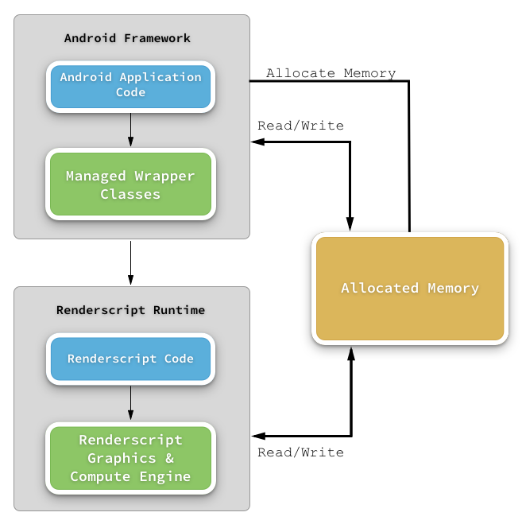

# An Introduction to Renderscript

_This guide introduces Renderscript and explains how to use the intrinsic Renderscript API's in a Xamarin.Android application that targets API level 17 or higher._

## Overview

Renderscript is a programming framework created by Google for the
purpose of improving the performance of Android applications that
require extensive computational resources. It is a low level, high
performance API based on
[C99](http://en.wikipedia.org/wiki/C99). Because it is a low level API
that will run on CPUs, GPUs, or DSPs, Renderscript is well suited for
Android apps that may need to perform any of the following:

* Graphics
* Image Processing
* Encryption
* Signal Processing
* Mathematical Routines

Renderscript will use `clang` and compile the scripts to LLVM byte code
which is bundled into the APK. When the app is run for the first time,
the LLVM byte code will be compiled into machine code for the
processors on the device. This architecture allows an Android
application to exploit the advantages of machine code without the
developers themselves having to write it for each processor on the
device themselves.

There are two components to a Renderscript routine:

1. **The Renderscript runtime** &ndash; This is the native APIs that
   are responsible for executing the Renderscript. This includes any
   Renderscripts written for the application.

2. **Managed Wrappers from the Android Framework** &ndash; Managed
   classes that allow an Android app to control and interact with the
   Renderscript runtime and scripts. In addition to the framework
   provided classes for controlling the Renderscript runtime, the
   Android toolchain will examine the Renderscript source code and
   generate managed wrapper classes for use by the Android application.

The following diagram illustrates how these components relate:



There are three important concepts for using Renderscripts in an
Android application:

1. **A context** &ndash; A managed API provided by the Android SDK that
   allocates resources to Renderscript and allows the Android app to
   pass and receive data from the Renderscript.

2. **A _compute kernel_** &ndash; Also known as the _root kernel_ or
   _kernel_, this a routine that does the work. The kernel is very
   similar to a C function; it is a parallelizable routine that will be
   run over all the data in allocated memory .

3. **Allocated Memory** &ndash; Data is passed to and from a kernel
   through an
   _[Allocation](https://developer.xamarin.com/api/type/Android.Renderscripts.Allocation/)_. A
   kernel may have one input and/or one output Allocation.

The [Android.Renderscripts](https://developer.xamarin.com/api/namespace/Android.Renderscripts/)
namespace contains the classes for interacting with the Renderscript
runtime. In particular, the
[`Renderscript`](https://developer.xamarin.com/api/type/Android.Renderscripts.RenderScript/) class
will manage the lifecycle and resources of the Renderscript engine. The
Android app must initialize one or more
[`Android.Renderscripts.Allocation`](https://developer.xamarin.com/api/type/Android.Renderscripts.Allocation/)
objects. An Allocation is a managed API that is responsible for
allocation and accessing the memory that is shared between the Android
app and the Renderscript runtime. Typically, one Allocation is created
for input, and optionally another Allocation is created to hold the
output of the kernel. The Renderscript runtime engine and the
associated managed wrapper classes will manage access to the memory
held by the Allocations, there is no need for an Android app developer
to do any extra work.

An Allocation will contain one or more
[Android.Renderscripts.Elements](https://developer.xamarin.com/api/type/Android.Renderscripts.Element/).
Elements are a specialized type that describe data in each Allocation.
The Element types of the output Allocation must match the types of
the input Element. When executing, a Renderscript will iterate over
each Element in the input Allocation in parallel, and write the results
to the output Allocation. There are two types of Elements:

- **simple type** &ndash; Conceptually this is the same as a C data
  type, `float` or a `char`.

- **complex type** &ndash; This type is similar to a C `struct`.

The Renderscript engine will perform a runtime check to ensure that the
Elements in each Allocation are compatible with what is required by the
kernel. If the data type of the Elements in the Allocation do not match
the data type that the kernel is expecting, an exception will be
thrown.

All Renderscript kernels will be wrapped by a type that is a descendant
of the
[`Android.Renderscripts.Script`](https://developer.xamarin.com/api/type/Android.Renderscripts.Script/)
class. The `Script` class is used to set parameters for a Renderscript,
set the appropriate `Allocations`, and run the Renderscript. There are
two `Script` subclasses in the Android SDK:


- **`Android.Renderscripts.ScriptIntrinsic`** &ndash; Some of the more
  common Renderscript tasks are bundled in the Android SDK and are
  accessible by a subclass of the
  [ScriptIntrinsic](https://developer.xamarin.com/api/type/Android.Renderscripts.ScriptIntrinsic/)
  class. There is no need for a developer take any extra steps to use
  these scripts in their application as they are already provided.

- **`ScriptC_XXXXX`** &ndash; Also known as _user scripts_, these are
  scripts that are written by developers and packaged in the APK. At
  compile time, the Android toolchain will generate managed wrapper
  classes that will allow the scripts to be used in the Android app.
  The name of these generated classes is the name of the Renderscript
  file, prefixed with `ScriptC_`. Writing and incorporating user
  scripts is not officially supported by Xamarin.Android and beyond the
  scope of this guide.

Of these two types, only the `StringIntrinsic` is supported by
Xamarin.Android. This guide will discuss how to use intrinsic scripts
in a Xamarin.Android application.

## Requirements

This guide is for Xamarin.Android applications that target API level 17
or higher. The use of _user scripts_ is not covered in this guide.

The [Xamarin.Android V8 Support Library](https://www.nuget.org/packages/Xamarin.Android.Support.v8.RenderScript/)
backports the instrinsic Renderscript API's for apps that target older
versions of the Android SDK. Adding this package to a Xamarin.Android
project should allow apps that target older versions of the Android SDK
to leverage the intrinsic scripts.

## Using Intrinsic Renderscripts in Xamarin.Android

The intrinsic scripts are a great way to perform intensive computing
tasks with a minimal amount of additional code. They have been hand
tuned to offer optimal performance on a large cross section of devices.
It is not uncommon for an intrinsic script to run 10x faster than
managed code and 2-3x times after than a custom C implementation. Many
of the typical processing scenarios are covered by the intrinsic
scripts. This list of the intrinsic scripts describes the current
scripts in Xamarin.Android:

- [ScriptIntrinsic3DLUT](https://developer.xamarin.com/api/type/Android.Renderscripts.ScriptIntrinsic3DLUT//) &ndash; Converts RGB to RGBA using a 3D lookup table. 

- [ScriptIntrinsicBLAS](https://developer.android.com/reference/android/renderscript/ScriptIntrinsicBLAS.html) &ndash; Provideshigh performance Renderscript APIs to [BLAS](http://www.netlib.org/blas/). The BLAS (Basic Linear Algebra Subprograms) are routines that provide standard building blocks for performing basic vector and matrix operations. 

- [ScriptIntrinsicBlend](https://developer.xamarin.com/api/type/Android.Renderscripts.ScriptIntrinsicBlend) &ndash; Blends two Allocations together.

- [ScriptIntrinsicBlur](https://developer.xamarin.com/api/type/Android.Renderscripts.ScriptIntrinsicBlur) &ndash; Applies a Gaussian blur to an Allocation.

- [ScriptIntrinsicColorMatrix](https://developer.xamarin.com/api/type/Android.Renderscripts.ScriptIntrinsicColorMatrix/) &ndash; Applies a color matrix to an Allocation (i.e. change colours, adjust hue).

- [ScriptIntrinsicConvolve3x3](https://developer.xamarin.com/api/type/Android.Renderscripts.ScriptIntrinsicConvolve3x3/) &ndash; Applies a 3x3 color matrix to an Allocation.

- [ScriptIntrinsicConvolve5x5](https://developer.xamarin.com/api/type/Android.Renderscripts.ScriptIntrinsicConvolve5x5/) &ndash; Applies a 5x5 color matrix to an Allocation.

- [ScriptIntrinsicHistogram](https://developer.xamarin.com/api/type/Android.Renderscripts.ScriptIntrinsicHistogram/) &ndash; An intrinsic histogram filter.

- [ScriptIntrinsicLUT](https://developer.xamarin.com/api/type/Android.Renderscripts.ScriptIntrinsicLUT/) &ndash; Applies a per-channel lookup table to a buffer.

- [ScriptIntrinsicResize](https://developer.xamarin.com/api/type/Android.Renderscripts.ScriptIntrinsicResize/) &ndash; Script for performing the resize of a 2D allocation.

- [ScriptIntrinsicYuvToRGB](https://developer.xamarin.com/api/type/Android.Renderscripts.ScriptIntrinsicYuvToRGB/) &ndash; Converts a YUV buffer to RGB.

Please consult the API documentation for details on each of the
intrinsic scripts.

The basic steps for using Renderscript in an Android application are
described next.

**Create a Renderscript Context** &ndash; The
[`Renderscript`](https://developer.xamarin.com/api/type/Android.Renderscripts.RenderScript/)
class is a managed wrapper around the Renderscript context and will
control initialization, resource management, and clean up. The
Renderscript object is created using the `RenderScript.Create`
factory method, which takes an Android Context (such as an
Activity) as a parameter. The following line of code demonstrates
how to initialize the Renderscript context:

```csharp
Android.Renderscripts.RenderScript renderScript = RenderScript.Create(this);
```

**Create Allocations** &ndash; Depending on the intrinsic script,
it may be necessary to create one or two `Allocation`s. The
[`Android.Renderscripts.Allocation`](https://developer.xamarin.com/api/type/Android.Renderscripts.Allocation/)
class has several factory methods to help with instantiating an
allocation for an intrinsic. As an example, the following code
snippet demonstrates how to create Allocation for Bitmaps.

```csharp
Android.Graphics.Bitmap originalBitmap;
Android.Renderscripts.Allocation inputAllocation = Allocation.CreateFromBitmap(renderScript,
                                                     originalBitmap,
                                                     Allocation.MipmapControl.MipmapFull,
                                                     AllocationUsage.Script);
```

Often, it will be necessary to create an `Allocation` to hold the
output data of a script. This following snippet shows how to use
the `Allocation.CreateTyped` helper to instantiate a second
`Allocation` that the same type as the original:

```csharp
Android.Renderscripts.Allocation outputAllocation = Allocation.CreateTyped(renderScript, inputAllocation.Type);
```

**Instantiate the Script wrapper** &ndash; Each of the intrinsic
script wrapper classes should have helper methods (typically called
`Create`)for instantiating a wrapper object for that script. The
following code snippet is an example of how to instantiate a
`ScriptIntrinsicBlur` blur object. The `Element.U8_4` helper method
will create an Element that describes a data type that is 4 fields
of 8-bit, unsigned integer values, suitable for holding the data of
a `Bitmap` object:

```csharp
Android.Renderscripts.ScriptIntrinsicBlur blurScript = ScriptIntrinsicBlur.Create(renderScript, Element.U8_4(renderScript));
```

**Assign Allocation(s), Set Parameters, & Run Script** &ndash; The
`Script` class provides a `ForEach` method to actually run the
Renderscript. This method will iterate over each `Element` in the
`Allocation` holding the input data. In some cases, it may be
necessary to provide an `Allocation` that holds the output.
`ForEach` will overwrite the contents of the output Allocation. To
carry on with the code snippets from the previous steps, this
example shows how to assign an input Allocation, set a parameter,
and then finally run the script (copying the results to the output
Allocation):

```csharp
blurScript.SetInput(inputAllocation);
blurScript.SetRadius(25);  // Set a pamaeter
blurScript.ForEach(outputAllocation);
```

You may wish to check out the
[Blur an Image with Renderscript](https://github.com/xamarin/recipes/tree/master/Recipes/android/other_ux/drawing/blur_an_image_with_renderscript)
recipe, it is a complete example of how to use an intrinsic script in
Xamarin.Android.

## Summary

This guide introduced Renderscript and how to use it in a
Xamarin.Android application. It briefly discussed what Renderscript is
and how it works in an Android application. It described some of the
key components in Renderscript and the difference between _user
scripts_ and _instrinsic scripts_. Finally, this guide discussed the
steps in using an intrinsic script in a Xamarin.Android application.


## Related Links

- [Android.Renderscripts namespace](https://developer.xamarin.com/api/namespace/Android.Renderscripts/)
- [Blur an Image with Renderscript](https://github.com/xamarin/recipes/tree/master/Recipes/android/other_ux/drawing/blur_an_image_with_renderscript)
- [Renderscript](https://developer.android.com/guide/topics/renderscript/compute.html)
- [Tutorial: Getting Started with Renderscript](https://software.intel.com/en-us/articles/renderscript-basic-sample-for-android-os)
