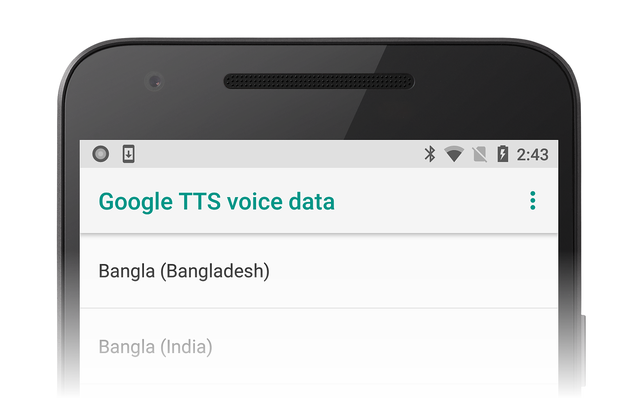
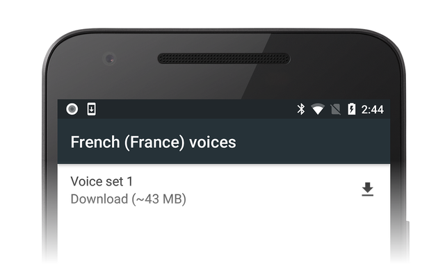

# Android Speech

_This article covers the basics of using the very powerful Android.Speech namespace. Since its inception, Android has been able to recognize speech and output it as text. It is a relatively simple process. For text to speech, however, the process is more involved, as not only does the speech engine have to be taken into account, but also the languages available and installed from the Text To Speech (TTS) system._

## Speech Overview

Having a system, which "understands" human speech and enunciates what is being typed—Speech to
Text, and Text to Speech—is an ever growing area within mobile development as the demand for natural
communication with our devices rises. There are many instances where having a feature that converts
text into speech, or vice versa, is a very useful tool to incorporate into your android application.

For example, with the clamp down on mobile phone use while driving, users want a hands free way of
operating their devices. The plethora of different Android form factors—such as Android Wear—and
the ever-widening inclusion of those able to use Android devices (such as tablets and note pads), has
created a larger focus on great TTS applications.

Google supplies the developer with a rich set of APIs in the Android.Speech namespace to cover most
instances of making a device "speech aware" (such as software designed for the blind).  The namespace
includes the facility to allow text to be translated into speech through `Android.Speech.Tts`, control
over the engine used to perform the translation, as well as a number of `RecognizerIntent`s which allow
speech to be converted to text.

While the facilities are there for speech to be understood, there are limitations based on the hardware
used. It is unlikely that the device will successfully interpret everything spoken to it in every
language available.

## Requirements

There are no special requirements for this guide, other than your device having a microphone and speaker.

The core of an Android device interpreting speech is the use of an `Intent` with a corresponding `OnActivityResult`.
It is important, though, to recognize that the speech is not understood—but interpreted to text. The difference is
important.

### The difference between understanding and interpreting

A simple definition of understanding is that you are able to determine by tone and context the real meaning of what
is being said. To interpret just means to take the words and output them in another form.

Consider the following simple example that is used in everyday conversation:

<kbd>Hello, how are you?</kbd>

Without inflection (emphasis placed on specific words or parts of words), it is a simple question. However,
if a slow pace is applied to the line, the person listening will detect that the asker is not too happy and perhaps
needs cheering up or that the asker is unwell. If the emphasis is placed on "are", the person asking is usually more
interested in the response.

Without fairly powerful audio processing to make use of the inflection, and a degree of artificial intelligence
(AI) to understand the context, the software cannot even begin to understand what was said—the best a simple phone
can do is convert the speech to text.

## Setting up

Before using the speech system, it is always wise to check to ensure the device has a microphone. There would be
little point trying to run your app on a Kindle or Google note pad without a microphone installed.

The code sample below demonstrates querying if a microphone is available and if not, to create an alert. If no
microphone is available at this point you would either quit the activity or disable the ability to record the speech.

```csharp
string rec = Android.Content.PM.PackageManager.FeatureMicrophone;
if (rec != "android.hardware.microphone")
{
    var alert = new AlertDialog.Builder(recButton.Context);
    alert.SetTitle("You don't seem to have a microphone to record with");
    alert.SetPositiveButton("OK", (sender, e) =>
    {
        return;
    });
    alert.Show();
}
```

### Creating the intent

The intent for the speech system uses a particular type of intent called the `RecognizerIntent`. This intent controls
a large number of parameters, including how long to wait with silence until the recording is considered over, any
additional languages to recognize and output, and any text to include on the `Intent`’s modal dialog as means of
instruction. In this snippet, `VOICE` is a `readonly int` used for recognition in `OnActivityResult`.

```csharp
var voiceIntent = new Intent(RecognizerIntent.ActionRecognizeSpeech);
voiceIntent.PutExtra(RecognizerIntent.ExtraLanguageModel, RecognizerIntent.LanguageModelFreeForm);
voiceIntent.PutExtra(RecognizerIntent.ExtraPrompt, Application.Context.GetString(Resource.String.messageSpeakNow));
voiceIntent.PutExtra(RecognizerIntent.ExtraSpeechInputCompleteSilenceLengthMillis, 1500);
voiceIntent.PutExtra(RecognizerIntent.ExtraSpeechInputPossiblyCompleteSilenceLengthMillis, 1500);
voiceIntent.PutExtra(RecognizerIntent.ExtraSpeechInputMinimumLengthMillis, 15000);
voiceIntent.PutExtra(RecognizerIntent.ExtraMaxResults, 1);
voiceIntent.PutExtra(RecognizerIntent.ExtraLanguage, Java.Util.Locale.Default);
StartActivityForResult(voiceIntent, VOICE);
```

### Conversion of the speech

The text interpreted from the speech will be delivered within the `Intent`, which is returned when the activity has been
completed and is accessed via `GetStringArrayListExtra(RecognizerIntent.ExtraResults)`. This will return an
`IList<string>`, of which the index can be used and displayed, depending on the number of languages requested in the
caller intent (and specified in the `RecognizerIntent.ExtraMaxResults`). As with any list though, it is worth
checking to ensure that there is data to be displayed.

When listening for the return value of a `StartActivityForResult`, the `OnActivityResult` method has to be supplied.

In the example below, `textBox` is a `TextBox` used for outputting what has been dictated. It could equally be used
to pass the text to some form of interpreter and from there, the application can compare the text and branch to
another part of the application.

```csharp
protected override void OnActivityResult(int requestCode, Result resultVal, Intent data)
{
    if (requestCode == VOICE)
    {
        if (resultVal == Result.Ok)
        {
            var matches = data.GetStringArrayListExtra(RecognizerIntent.ExtraResults);
            if (matches.Count != 0)
            {
                string textInput = textBox.Text + matches[0];
                textBox.Text = textInput;
                switch (matches[0].Substring(0, 5).ToLower())
                {
                    case "north":
                        MovePlayer(0);
                        break;
                    case "south":
                        MovePlayer(1);
                        break;
                }
            }
            else
            {
                textBox.Text = "No speech was recognised";
            }
        }
        base.OnActivityResult(requestCode, resultVal, data);
    }
}
```

## Text to Speech

Text to speech is not quite the reverse of speech to text and relies on two key components; a text-to-speech
engine being installed on the device and a language being installed.

Largely, Android devices come with the default Google TTS service installed and at least one language. This is
established when the device is first set up and will be based on where the device is at the time (for example,
a phone set up in Germany will install the German language, whereas one in America will have American English).

### Step 1 - Instantiating TextToSpeech

`TextToSpeech` can take up to 3 parameters, the first two are required with the third being optional
(`AppContext`, `IOnInitListener`, `engine`). The listener is used to bind to the service and test for failure
with the engine being any number of available Android text to speech engines. At a minimum, the device will
have Google’s own engine.

### Step 2 - Finding the languages available

The `Java.Util.Locale` class contains a helpful method called `GetAvailableLocales()`. This list of languages
supported by the speech engine can then be tested against the installed languages.

It is a trivial matter to generate the list of "understood" languages. There will always be a default language
(the language the user set when they first set their device up), so in this example the `List<string>` has
"Default" as the first parameter, the remainder of the list will be filled depending on the result of the
`textToSpeech.IsLanguageAvailable(locale)`.

```csharp
var langAvailable = new List<string>{ "Default" };
var localesAvailable = Java.Util.Locale.GetAvailableLocales().ToList();
foreach (var locale in localesAvailable)
{
    var res = textToSpeech.IsLanguageAvailable(locale);
    switch (res)
    {
        case LanguageAvailableResult.Available:
          langAvailable.Add(locale.DisplayLanguage);
          break;
        case LanguageAvailableResult.CountryAvailable:
          langAvailable.Add(locale.DisplayLanguage);
          break;
        case LanguageAvailableResult.CountryVarAvailable:
          langAvailable.Add(locale.DisplayLanguage);
          break;
    }
}
langAvailable = langAvailable.OrderBy(t => t).Distinct().ToList();
```

This code calls
[TextToSpeech.IsLanguageAvailable](xref:Android.Speech.Tts.TextToSpeech.IsLanguageAvailable*)
to test if the language package for a given locale is already present on the device.
This method returns a
[LanguageAvailableResult](xref:Android.Speech.Tts.LanguageAvailableResult),
which indicates whether the language for
the passed locale is available. If `LanguageAvailableResult` indicates
that the language is `NotSupported`, then there is no voice package
available (even for download) for that language. If
`LanguageAvailableResult` is set to `MissingData`, then it is possible
to download a new language package as explained below in Step 4.

### Step 3 - Setting the speed and pitch

Android allows the user to alter the sound of the speech by altering the `SpeechRate` and `Pitch` (the rate of
speed and the tone of the speech). This goes from 0 to 1, with "normal" speech being 1 for both.

### Step 4 - Testing and loading new languages

Downloading a new language is performed by using an `Intent`. The
result of this intent causes the
[OnActivityResult](xref:Android.App.Activity.OnActivityResult*)
method to be invoked. Unlike the speech-to-text example (which used the
[RecognizerIntent](xref:Android.Speech.RecognizerIntent)
as a `PutExtra` parameter to the `Intent`), the testing and loading `Intent`s are `Action`-based:

- [TextToSpeech.Engine.ActionCheckTtsData](xref:Android.Speech.Tts.TextToSpeech.Engine.ActionCheckTtsData)
    &ndash; Starts an activity from the platform `TextToSpeech` engine
    to verify proper installation and availability of language
    resources on the device.

- [TextToSpeech.Engine.ActionInstallTtsData](xref:Android.Speech.Tts.TextToSpeech.Engine.ActionInstallTtsData)
    &ndash; Starts an activity that prompts the user to download the necessary
    languages.

The following code example illustrates how to use these actions to test
for language resources and download a new language:

```csharp
var checkTTSIntent = new Intent();
checkTTSIntent.SetAction(TextToSpeech.Engine.ActionCheckTtsData);
StartActivityForResult(checkTTSIntent, NeedLang);
//
protected override void OnActivityResult(int req, Result res, Intent data)
{
    if (req == NeedLang)
    {
        var installTTS = new Intent();
        installTTS.SetAction(TextToSpeech.Engine.ActionInstallTtsData);
        StartActivity(installTTS);
    }
}
```

`TextToSpeech.Engine.ActionCheckTtsData` tests for the availability of
language resources. `OnActivityResult` is invoked when this test
completes. If language resources need to be downloaded,
`OnActivityResult` fires off the
`TextToSpeech.Engine.ActionInstallTtsData` action to start an activity
that allows the user to download the necessary languages. Note that
this `OnActivityResult` implementation does not check the `Result` code
because, in this simplified example, the determination has already been
made that the language package needs to be downloaded.

The `TextToSpeech.Engine.ActionInstallTtsData` action causes the
**Google TTS voice data** activity to be presented to the user for
choosing languages to download:



As an example, the user might pick French and click the download icon
to download French voice data:



Installation of this data happens automatically after the download completes.

### Step 5 - The IOnInitListener

For an activity to be able to convert the text to speech, the interface method `OnInit` has to be implemented
(this is the second parameter specified for the instantiation of the `TextToSpeech` class). This initializes
the listener and tests the result.

The listener should test for both `OperationResult.Success` and `OperationResult.Failure` at a minimum.
The following example shows just that:

```csharp
void TextToSpeech.IOnInitListener.OnInit(OperationResult status)
{
    // if we get an error, default to the default language
    if (status == OperationResult.Error)
        textToSpeech.SetLanguage(Java.Util.Locale.Default);
    // if the listener is ok, set the lang
    if (status == OperationResult.Success)
        textToSpeech.SetLanguage(lang);
}
```

## Summary

In this guide we have looked at the basics of converting text to speech and speech to text and possible methods
of how to include them within your own apps. While they do not cover every particular case, you should now
have a basic understanding of how speech is interpreted, how to install new languages, and how to increase
the inclusivity of your apps.

## Related Links

- [Xamarin.Forms DependencyService](/samples/xamarin/xamarin-forms-samples/dependencyservice//)
- [Text to Speech (sample)](/samples/xamarin/monodroid-samples/platformfeatures-texttospeech)
- [Speech to Text (sample)](/samples/xamarin/monodroid-samples/platformfeatures-speechtotext)
- [Android.Speech namespace](xref:Android.Speech)
- [Android.Speech.Tts namespace](xref:Android.Speech.Tts)