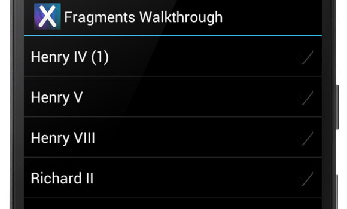
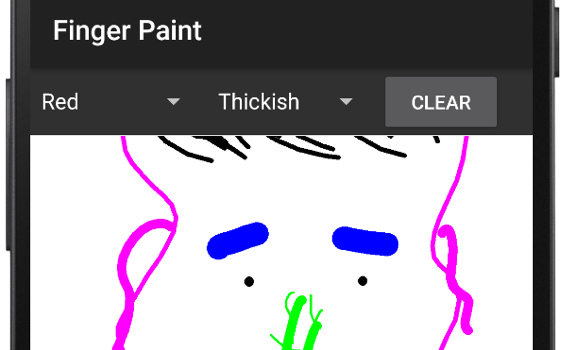
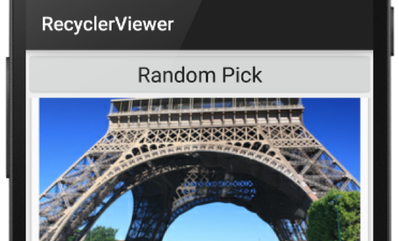
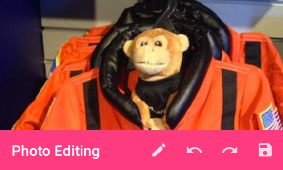

# Xamarin.Android samples

These Xamarin Android sample apps and code demos can help you get started building mobile apps with C# and Xamarin.

[All Xamarin.Android samples](/samples/browse/?products=xamarin&term=Xamarin.Android)

:::row:::
    :::column:::

### [Material Design](/samples/xamarin/monodroid-samples/android50-googleio2014master/)

This sample demonstrates the new Material Design APIs introduced in Android Lollipop.
  :::column-end:::
    :::column:::

### [Google Play Services](/samples/xamarin/monodroid-samples/googleplayservices/)

This solution uses the Xamarin Google Play Services NuGet to demonstrate a few uses of the maps API.
  :::column-end:::
    :::column:::

### [Flash Card Pager](/samples/xamarin/monodroid-samples/userinterface-flashcardpager/)

This sample demonstrates how to use ViewPager and PagerTabStrip together to implement an app that presents a series of math problems on flash cards.
  :::column-end:::
:::row-end:::

:::row:::
    :::column:::

### [Fragments](/samples/xamarin/monodroid-samples/fragmentswalkthrough/)

Fragments are self-contained, modular components that are used to help address the complexity of writing applications that may run on screens of different sizes.
    :::column-end:::
    :::column:::

### [Finger Paint](/samples/xamarin/monodroid-samples/applicationfundamentals-fingerpaint/)

Colorful finger-painting app using multi-touch tracking on Android.
    :::column-end:::
    :::column:::

### [RecyclerViewer](/samples/xamarin/monodroid-samples/android50-recyclerviewer/)

Use this sample to learn how to use the new CardView and RecyclerView widgets introduced with Android 5.0 Lollipop.
    :::column-end:::
:::row-end:::

:::row:::
    :::column:::

### [Toolbar](/samples/xamarin/monodroid-samples/android50-toolbar/)

Android sample replacing the ActionBar with the new ToolBar in Android 5.0 Lollipop.
    :::column-end:::
    :::column:::

### [WatchFace](/samples/xamarin/monodroid-samples/wear-watchface/)

How to implement a custom Android Wear watch face.
    :::column-end:::
    :::column:::
    :::column-end:::
:::row-end:::

## All samples

For the complete set of Xamarin Android sample apps and code demos see [All Xamarin.Android samples](/samples/browse/?products=xamarin&term=Xamarin.Android).