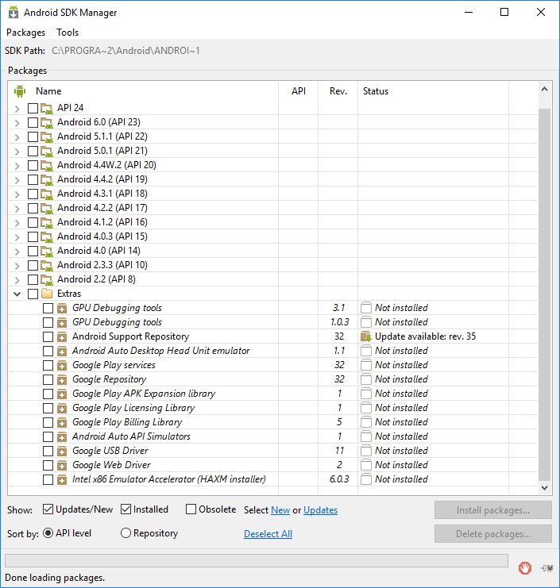

# How can I manually install the Android Support libraries required by the Xamarin.Android.Support packages?

## Example steps for Xamarin.Android.Support.v4 

# [Visual Studio](#tab/windows)

Download the desired Xamarin.Android.Support NuGet package (for
example by installing it with the NuGet package manager).

Use `ildasm` to check which version of **android_m2repository.zip**
the NuGet package needs:

```cmd
ildasm /caverbal /text /item:Xamarin.Android.Support.v4 packages\Xamarin.Android.Support.v4.23.4.0.1\lib\MonoAndroid403\Xamarin.Android.Support.v4.dll | findstr SourceUrl
```
Example output:

```cmd
property string 'SourceUrl' = string('https://dl-ssl.google.com/android/repository/android_m2repository_r32.zip')
property string 'SourceUrl' = string('https://dl-ssl.google.com/android/repository/android_m2repository_r32.zip')
property string 'SourceUrl' = string('https://dl-ssl.google.com/android/repository/android_m2repository_r32.zip')
```

Download **android\_m2repository.zip** from Google using the URL
returned from **ildasm**. Alternately, you can check which version of
the _Android Support Repository_ you currently have installed in the
Android SDK Manager:



If the version matches the one you need for the NuGet package, then
you don't have to download anything new. You can instead re-zip the
existing **m2repository** directory that is located under
**extras\\android** in the _SDK Path_ (as shown the top of the
Android SDK Manager window).

Calculate the MD5 hash of the URL returned from **ildasm**. Format the
resulting string to use all uppercase letters and no spaces. For
example, adjust the `$url` variable as needed and then run the
following 2 lines (based on
[the original C# code from Xamarin.Android](https://github.com/xamarin/xamarin-android/blob/8e8a4dd90f26eb39172876cc52181b6639e20524/src/Xamarin.Android.Build.Tasks/Tasks/GetAdditionalResourcesFromAssemblies.cs#L208))
in PowerShell:

```powershell
$url = "https://dl-ssl.google.com/android/repository/android_m2repository_r32.zip"
(([System.Security.Cryptography.MD5]::Create()).ComputeHash([System.Text.Encoding]::UTF8.GetBytes($url)) | %{ $_.ToString("X02") }) -join ""
```
Example output:

```powershell
F16A3455987DBAE5783F058F19F7FCDF
```

Copy **android\_m2repository.zip** into the
**%LOCALAPPDATA%\\Xamarin\\zips\\** folder. Rename the file to
use the MD5 hash from the previous MD5 hash calculating step. For example:

**%LOCALAPPDATA%\\Xamarin\\zips\\F16A3455987DBAE5783F058F19F7FCDF.zip**

(Optional) Unzip the file into **%LOCALAPPDATA%\\Xamarin\\Xamarin.Android.Support.v4\\23.4.0.0\\content\\**
(creating a **content\\m2repository** subdirectory). If you skip
this step, then the first build that uses the library will take a
little longer because it will need to complete this step.
The version number for the subdirectory (**23.4.0.0** in this
example) is not quite the same as the NuGet package version. You
can use `ildasm` to find the correct version number:

```cmd
ildasm /caverbal /text /item:Xamarin.Android.Support.v4 packages\Xamarin.Android.Support.v4.23.4.0.1\lib\MonoAndroid403\Xamarin.Android.Support.v4.dll | findstr /C:"string 'Version'"
```
Example output:

```cmd
property string 'Version' = string('23.4.0.0')}
property string 'Version' = string('23.4.0.0')}
property string 'Version' = string('23.4.0.0')}
```

# [Visual Studio for Mac](#tab/macos)

Download the desired Xamarin.Android.Support NuGet package (for
example by installing it with the NuGet package manager).

Double-click the _Xamarin.Android.Support.v4_ assembly under the
_References_ section of the Android project in Visual Studio for
Mac to open the assembly in the Assembly Browser. Ensure that the
_Language_ drop-down is set to _C#_ and select the top-level
_Xamarin.Android.Support.v4_ assembly from the Assembly Browser
navigation tree. Locate the `SourceUrl` property under one of the
`IncludeAndroidResourcesFrom` or `JavaLibraryReference` attributes:

```csharp
[assembly: IncludeAndroidResourcesFrom ("./", PackageName = "Xamarin.Android.Support.v4", SourceUrl = "https://dl-ssl.google.com/android/repository/android_m2repository_r32.zip", EmbeddedArchive = "m2repository/com/android/support/support-v4/23.4.0/support-v4-23.4.0.aar", Version = "23.4.0.0")]
```

Download **android\_m2repository.zip** from Google using the
`SourceUrl` returned from **ildasm**. Alternately, you can check which
version of the _Android Support Repository_ you currently have
installed in the Android SDK Manager:


If the version matches the one you need for the NuGet package, then
you don't have to download anything new. You can instead re-zip the
existing **m2repository** directory that is located under
**extras/android** in the _SDK Path_ (as shown the top of the
Android SDK Manager window).

Calculate the MD5 hash of the URL returned from **ildasm**. Format the
resulting string to use all uppercase letters and no spaces. For
example, adjust the URL string as needed and then run the following
command in a **Terminal.app** command prompt:

```bash
echo -n "https://dl-ssl.google.com/android/repository/android_m2repository_r32.zip" | md5 | tr '[:lower:]' '[:upper:]'
```

Another option is to use the `csharp` interpreter to run
[the same C# code that Xamarin.Android itself uses](https://github.com/xamarin/xamarin-android/blob/8e8a4dd90f26eb39172876cc52181b6639e20524/src/Xamarin.Android.Build.Tasks/Tasks/GetAdditionalResourcesFromAssemblies.cs#L208).
To do that, adjust the `url` variable as needed and then run the
following command in a **Terminal.app** command prompt:

```bash
csharp -e 'var url = "https://dl-ssl.google.com/android/repository/android_m2repository_r32.zip"; string.Concat((System.Security.Cryptography.MD5.Create().ComputeHash(System.Text.Encoding.UTF8.GetBytes(url))).Select(b => b.ToString("X02")))'
```
Example output:

```bash
F16A3455987DBAE5783F058F19F7FCDF
```

Copy **android\_m2repository.zip** to the
**$HOME/.local/share/Xamarin/zips/** folder. Rename the file to use the
MD5 hash from the previous MD5 hash calculating step. For example:

**$HOME/.local/share/Xamarin/zips/F16A3455987DBAE5783F058F19F7FCDF.zip**

(Optional) Unzip the file into: 

**$HOME/.local/share/Xamarin/Xamarin.Android.Support.v4/23.4.0.0/content/**

(creating a **content/m2repository** subdirectory). If you skip
this step, then the first build that uses the library will take a
little longer because it will need to complete this step.

The version number for the subdirectory (**23.4.0.0** in this example)
is not quite the same as the NuGet package version. As in the
**ildasm** step earlier, you can use the Assembly Browser in Visual
Studio for Mac to find the correct version number. Look for the
`Version` property under one of the `IncludeAndroidResourcesFrom` or
`JavaLibraryReference` attributes:

```csharp
[assembly: IncludeAndroidResourcesFrom ("./", PackageName = "Xamarin.Android.Support.v4", SourceUrl = "https://dl-ssl.google.com/android/repository/android_m2repository_r32.zip", EmbeddedArchive = "m2repository/com/android/support/support-v4/23.4.0/support-v4-23.4.0.aar", Version = "23.4.0.0")]
```

-----


## Additional references

- [Bug 43245](https://bugzilla.xamarin.com/show_bug.cgi?id=43245) –
  Inaccurate "Download failed. Please download {0} and put it to the
  {1} directory." and "Please install package: '{0}' available in SDK
  installer" error messages related to Xamarin.Android.Support packages

### Next Steps

This document discusses the current behavior as of August 2016. The
technique described in this document is not part of the stable testing
suite for Xamarin, so it could break in the future.

For further assistance, to contact us, or if this issue remains even
after utilizing the above information, please see
[What support options are available for
Xamarin?](~/cross-platform/troubleshooting/support-options.md) for
information on contact options, suggestions, as well as how to file a
new bug if needed.

