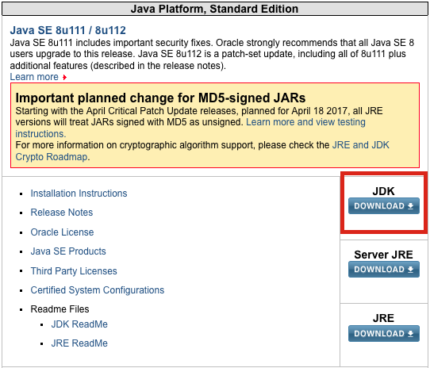
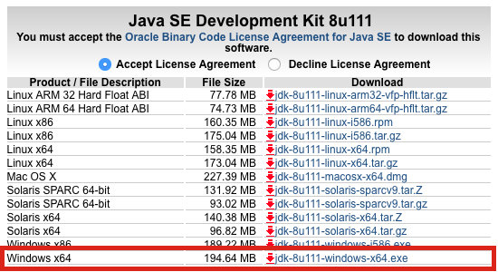
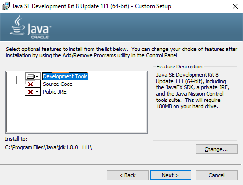
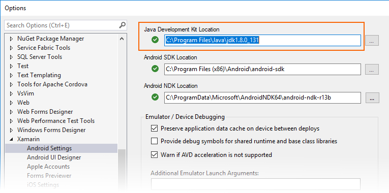
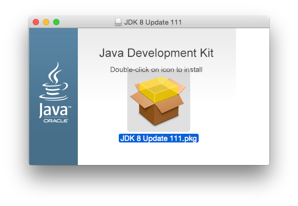
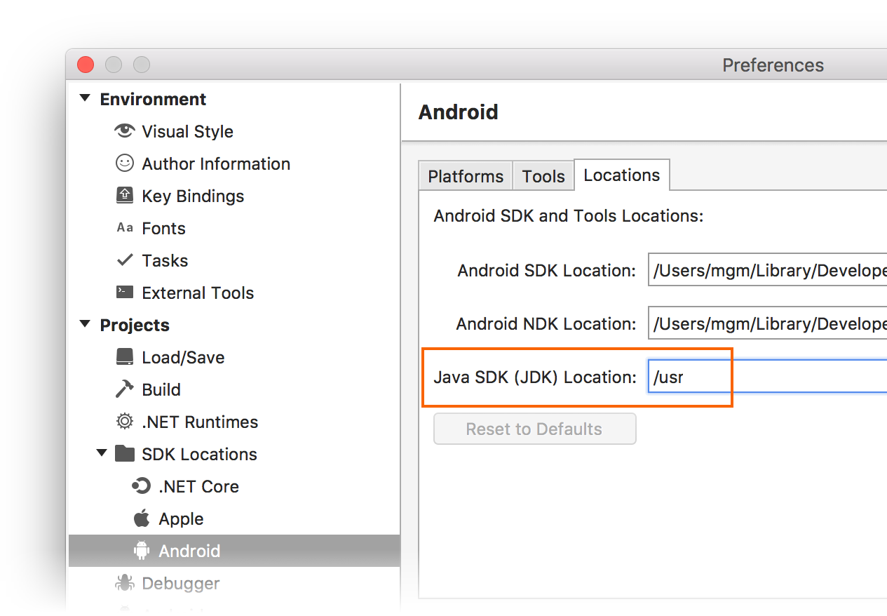

# How do I update the Java Development Kit (JDK) version?

_This article illustrates how to update the Java Development Kit (JDK) version on Windows and Mac._

## Overview

Xamarin.Android uses the Java Development Kit (JDK) to integrate with
the Android SDK for building Android apps and running the Android
designer. The latest versions of the Android SDK (API 24 and higher)
require JDK 8 (1.8). Alternately, you can install the
[Microsoft Mobile OpenJDK Preview](~/android/get-started/installation/openjdk.md). 
The Microsoft Mobile OpenJDK will eventually replace JDK 8 for Xamarin.Android
development.

To update to the Microsoft Mobile OpenJDK, see
[Microsoft Mobile OpenJDK Preview](~/android/get-started/installation/openjdk.md). 
To update to JDK 8, follow these steps:

# [Visual Studio](#tab/windows)

1.  Download JDK 8 (1.8) from the [Oracle website](http://www.oracle.com/technetwork/java/javase/downloads/index.html):

    

2.  Pick the 64-bit version to allow rendering of 
    [custom controls](https://developer.xamarin.com/releases/vs/xamarin.vs_4/xamarin.vs_4.2/#androiddesignercustomcontrols)
    in the Xamarin Android designer:

    

3.  Run the .exe and install the **Development Tools**:

    

4.  Open Visual Studio and update the **Java Development Kit Location**
    to point to the new JDK under **Tools > Options > Xamarin > Android
    Settings > Java Development Kit Location**:

    

Be sure to restart Visual Studio after updating the location.

# [Visual Studio for Mac](#tab/macos)

1.  Download JDK 8 (1.8) from the [Oracle website](http://www.oracle.com/technetwork/java/javase/downloads/index.html):

    

2.  Open the .dmg file and run the .pkg installer:

    

Mac OS will automatically set the new JDK version as the default by
updating **/System/Library/Frameworks/JavaVM.framework/Versions/Current**. 
You can then double-check that the **Java SDK (JDK)** location is set to
the expected default of **/usr** under **Visual Studio for Mac > Preferences >
Projects > SDK Locations > Android > Locations > Java SDK (JDK) Location**:

-----

