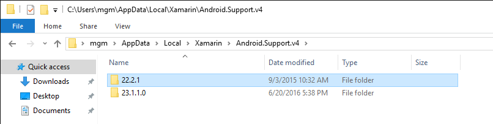
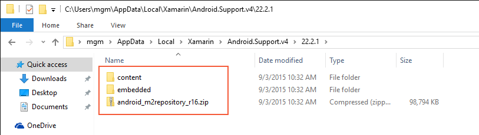
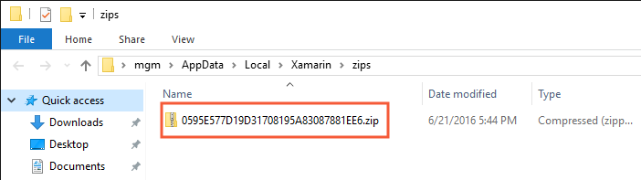
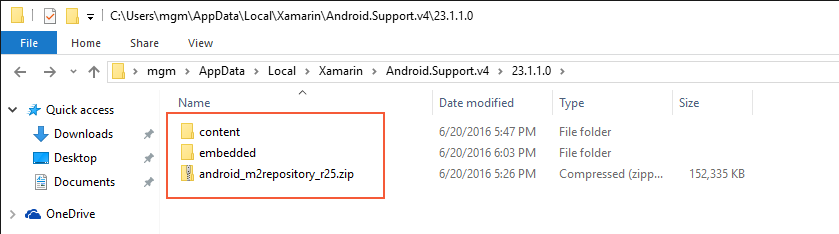
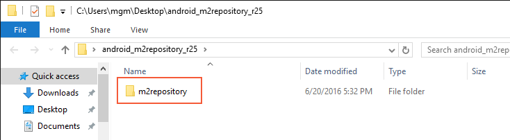
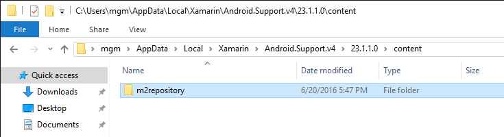
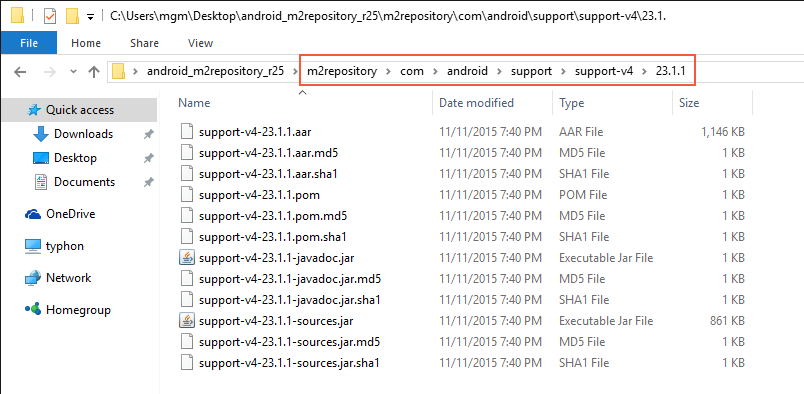
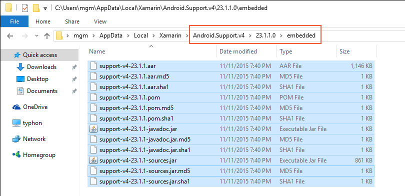

# Resolving Library Installation Errors

_In some cases, you may get errors while installing Android support libraries. This guide provides workarounds for some common errors._

## Overview

While building a Xamarin.Android app project, you may get build errors
when Visual Studio or Visual Studio for Mac attempt to download and install
dependency libraries. Many of these errors are caused by network
connectivity issues, file corruption, or versioning problems. This
guide describes the most common support library installation errors and
provides the steps to work around these issues and get your app project
building again.

## Errors While Downloading m2Repository

You may see **m2repository** errors when referencing a NuGet package of
the Android Support Libraries or Google Play services. The error message
resembles the following:

```shell
Download failed. Please download https://dl-ssl.google.com/android/repository/android_m2repository_r16.zip and extract it to the C:\Users\mgm\AppData\Local\Xamarin\Android.Support.v4\22.2.1\content directory.
```

This example is for **android\_m2repository\_r16**, but you may see this
same error message for a different version such as
**android\_m2repository\_r18** or **android\_m2repository\_r25**.

### Automatic Recovery from m2repository Errors

Often, this issue can be remedied by deleting the problematic library
and rebuilding according to these steps:

1. Navigate to the support library directory on your computer:

    - On Windows, support libraries are located at
        **C:\\Users\\_username_\\AppData\\Local\\Xamarin**.

    - On Mac OS X, support libraries are located at **/Users/_username_/.local/share/Xamarin**.

2. Locate the library and version folder corresponding to the error
   message. For example, the library and version folder for the above
   error message is located at **Android.Support.v4\\22.2.1**:

    [](resolving-library-installation-errors-images/01-example-location.png#lightbox)

3. Delete the contents of the version folder. Be sure to remove the
   **.zip** file as well as the **content** and **embedded**
   subdirectories within this folder. For the example error message
   shown above, the files and subdirectories shown in this screenshot
   (**content**, **embedded**, and **android_m2repository_r16.zip**)
   are to be deleted:

    [](resolving-library-installation-errors-images/02-example-folder-vs.png#lightbox)

   Note that it is important to delete the *entire* contents of this
   folder. Although this folder may initially contain the "missing"
   **android\_m2repository\_r16.zip** file, this file may have been
   partially downloaded or corrupted.

4. Rebuild the project &ndash; doing so will cause the build process to
   re-download the missing library.

In most cases, these steps will resolve the build error and allow you
to continue. If deleting this library does not resolve the build error,
you must manually download and install the **android\_m2repository\_r_nn_.zip**
file as described in the next section.

### Manually Downloading m2repository

If you have tried using the automatic recovery steps above and still
have build errors, you can manually download the
**android\_m2repository\_r_nn_.zip** file (using a web browser) and
install it according to the following steps. This procedure is also
useful if you do not have internet access on your development computer
but you are able to download the archive using a different computer.

1. Download the **android\_m2repository\_r_nn_.zip** file that corresponds to
    the error message &ndash; links are provided in the following list (along with
    the corresponding MD5 hash of each link's URL):

    - [android\_m2repository\_r33.zip](https://dl-ssl.google.com/android/repository/android_m2repository_r33.zip)
        &ndash; 5FB756A25962361D17BBE99C3B3FCC44

    - [android\_m2repository\_r32.zip](https://dl-ssl.google.com/android/repository/android_m2repository_r32.zip)
        &ndash; F16A3455987DBAE5783F058F19F7FCDF

    - [android\_m2repository\_r31.zip](https://dl-ssl.google.com/android/repository/android_m2repository_r31.zip)
        &ndash; 99A8907CE2324316E754A95E4C2D786E

    - [android\_m2repository\_r30.zip](https://dl-ssl.google.com/android/repository/android_m2repository_r30.zip)
        &ndash; 05AD180B8BDC7C21D6BCB94DDE7F2C8F

    - [android\_m2repository\_r29.zip](https://dl-ssl.google.com/android/repository/android_m2repository_r29.zip)
        &ndash; 2A3A8A6D6826EF6CC653030E7D695C41

    - [android\_m2repository\_r28.zip](https://dl-ssl.google.com/android/repository/android_m2repository_r28.zip)
        &ndash; 17BE247580748F1EDB72E9F374AA0223

    - [android\_m2repository\_r27.zip](https://dl-ssl.google.com/android/repository/android_m2repository_r27.zip)
        &ndash; C9FD4FCD69D7D12B1D9DF076B7BE4E1C

    - [android\_m2repository\_r26.zip](https://dl-ssl.google.com/android/repository/android_m2repository_r26.zip)
        &ndash; 8157FC1C311BB36420C1D8992AF54A4D

    - [android\_m2repository\_r25.zip](https://dl-ssl.google.com/android/repository/android_m2repository_r25.zip)
        &ndash; 0B3F1796C97C707339FB13AE8507AF50

    - [android\_m2repository\_r24.zip](https://dl-ssl.google.com/android/repository/android_m2repository_r24.zip)
        &ndash; 8E3C9EC713781EDFE1EFBC5974136BEA

    - [android\_m2repository\_r23.zip](https://dl-ssl.google.com/android/repository/android_m2repository_r23.zip)
        &ndash; D5BB66B3640FD9B9C6362C9DB5AB0FE7

    - [android\_m2repository\_r22.zip](https://dl-ssl.google.com/android/repository/android_m2repository_r22.zip)
        &ndash; 96659D653BDE0FAEDB818170891F2BB0

    - [android\_m2repository\_r21.zip](https://dl-ssl.google.com/android/repository/android_m2repository_r21.zip)
        &ndash; CD3223F2EFE068A26682B9E9C4B6FBB5

    - [android\_m2repository\_r20.zip](https://dl-ssl.google.com/android/repository/android_m2repository_r20.zip)
        &ndash; 650E58DF02DB1A832386FA4A2DE46B1A

    - [android\_m2repository\_r19.zip](https://dl-ssl.google.com/android/repository/android_m2repository_r19.zip)
        &ndash; 263B062D6EFAA8AEE39E9460B8A5851A

    - [android\_m2repository\_r18.zip](https://dl-ssl.google.com/android/repository/android_m2repository_r18.zip)
        &ndash; 25947AD38DCB4865ABEB61522FAFDA0E

    - [android\_m2repository\_r17.zip](https://dl-ssl.google.com/android/repository/android_m2repository_r17.zip)
        &ndash; 49054774F44AE5F35A6BA9D3C117EFD8

    - [android\_m2repository\_r16.zip](https://dl-ssl.google.com/android/repository/android_m2repository_r16.zip)
        &ndash; 0595E577D19D31708195A83087881EE6

    If the **m2repository** archive is not shown in this table, you can create
    the download URL by prepending `https://dl-ssl.google.com/android/repository/` to
    the name of the **m2repository** to download. For example,
    use **https://dl-ssl.google.com/android/repository/android\_m2repository\_r10.zip**
    to download **android\_m2repository\_r10.zip**.

2. Rename the file to the corresponding MD5 hash of the download URL
    as shown in the above table. For example, if you downloaded
    **android\_m2repository\_r25.zip**, rename it to
    **0B3F1796C97C707339FB13AE8507AF50.zip**. If the MD5 hash for the
    download URL of the downloaded file is not shown in the table, you
    can use an [online MD5 generator](http://www.webconfs.com/online-md5-generator.php) to
    convert the URL to an MD5 hash string.

3. Copy the file to the Xamarin **zips** folder:

    - On Windows, this folder is located at
        **C:\\Users\\***username***\\AppData\\Local\\Xamarin\\zips**.

    - On Mac OS X, this folder is located at **/Users/***username***/.local/share/Xamarin/zips**.

    For example, the following screenshot illustrates the result when
    **android\_m2repository\_r16.zip** is downloaded and renamed to the MD5 hash
    of its download URL on Windows:

    [](resolving-library-installation-errors-images/03-md5-rename-vs.png#lightbox)

If this procedure does not resolve the build error, you must
manually download the **android\_m2repository\_r_nn_.zip** file,
unzip it, and install its contents as described in the next section.

### Manually Downloading and Installing m2repository Files

The fully manual process for recovering from **m2repository** errors entails
downloading the **android\_m2repository\_r_nn_.zip** file (using a web browser),
unzipping it, and copying its contents to the support library
directory on your computer. In the following example, we'll recover
from this error message:

```shell
Unzipping failed. Please download https://dl-ssl.google.com/android/repository/android_m2repository_r25.zip and extract it to the C:\Users\mgm\AppData\Local\Xamarin\Android.Support.v4\23.1.1\content directory.
```

Use the following steps to download **m2repository** and install
its contents:

1. Delete the contents of the library folder corresponding to the
    error message. For example, in the above error message you would
    delete the contents of
    **C:\\Users\\***username***\\AppData\\Local\\Xamarin\\Android.Support.v4\\23.1.1.0**.
    As described earlier, you must delete the entire contents of this
    directory:

    [](resolving-library-installation-errors-images/04-delete-contents-vs.png#lightbox)

2. Download the **android\_m2repository\_r_nn_.zip** file from Google that
    corresponds to the error message (see the table in the previous section
    for links).

3. Extract this **.zip** archive to any location (such as the
    Desktop). This should create a directory that corresponds to the
    name of the **.zip** archive. Within this directory, you should
    find a subdirectory called **m2repository**:

    [](resolving-library-installation-errors-images/05-m2repository-vs.png#lightbox)

4. In the versioned library directory that you purged in step 1,
    re-create the **content** and **embedded** subdirectories. For
    example, the following screenshot illustrates **content** and
    **embedded** subdirectories being created in the **23.1.1.0** folder
    for **android\_m2repository\_r25.zip**:

    [](resolving-library-installation-errors-images/06-recreate-folders-vs.png#lightbox)

5. Copy **m2repository** from the extracted **.zip** into the **content** directory
    that you created in the previous step:

    [](resolving-library-installation-errors-images/07-copied-m2repository-vs.png#lightbox)

6. In the extracted **.zip** directory, browse to
    **m2repository\\com\\android\\support\\support-v4** and open the folder corresponding
    the version number created above (in this example, **23.1.1**):

    [](resolving-library-installation-errors-images/08-zip-contents-vs.png#lightbox)

7. Copy all of the files in this folder to the **embedded** directory created in
    step 4:

    [](resolving-library-installation-errors-images/09-copied-vs.png#lightbox)

8. Verify that all files are copied over. The **embedded** directory
    should now contain files such as **.jar**, **.aar**, and **.pom**.

9. Unzip the contents of any extracted **.aar** files to the **embedded**
    directory. On Windows, append a **.zip** extension to the **.aar**
    file, open it, and copy the contents to the **embedded** directory.
    On macOS, unzip the **.aar** file by using the **unzip** command in
    the Terminal (for example, **unzip file.aar**).

At this point, you have manually installed the missing components
and your project should build without errors. If not, verify that
you have downloaded the **m2repository** **.zip** archive version that
corresponds exactly to the version in the error message, and verify
that you have installed its contents in the correct locations as
described in the above steps.

## Summary

This article explained how to recover from common errors that can take
place during the automatic download and installation of dependency
libraries. It described how to delete the problematic library and
rebuild the project as a way to re-download and re-install the library.
It described how to download the library and install it in the **zips**
folder. It also described a more involved procedure for manually
downloading and installing the necessary files as a way to work around
issues that cannot be resolved via automatic means.
