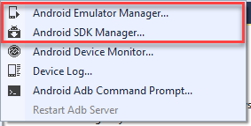

# Changes to the Android SDK Tooling

_Changes to how the Android SDK manages the installed API levels and AVDs._

## Changes to  Android SDK Tooling

In modern versions of the SDK Tools for Android, Google has removed the
existing AVD and SDK managers in favour of new CLI (Command Line Interface)
tooling. The former **android** program has been removed and the
GUI (Graphical User Interface) managers in Visual Studio for Mac and
older versions of Xamarin for Visual Studio will no longer work past
version 25.2.5 of Android SDK Tools.




Attempting to use the **android** program via the command line will
result in an error message like the following:

```shell
The "android" command is deprecated.
For manual SDK, AVD, and project management, please use Android Studio.
For command-line tools, use tools\bin\sdkmanager.bat
and tools\bin\avdmanager.bat
```

Thus you will need to use the CLI tools to manage and update your
emulators and Android SDK.

### CLI Tools

The following programs now make up the command line interface for the
Android SDK tools:

#### sdkmanager

**Added In:** Android SDK Tools 25.2.3 (November, 2016) and higher.

There is a new program called **sdkmanager** in the **tools/bin**
folder of your Android SDK. This tool is used to maintain the Android
SDK at the command line. For more information about using this tool,
see [sdkmanager](https://developer.android.com/studio/command-line/sdkmanager.html).

#### avdmanager

**Added In:** Android SDK Tools 25.3.0 (March, 2017) and higher.

There is a new program called **avdmanager** in the **tools/bin**
folder of your Android SDK. This tool is used to maintain the AVDs for
the Google Android Emulator. For more information about using this
tool, see [avdmanager](https://developer.android.com/studio/command-line/avdmanager.html).

### Downgrading

You can downgrade your **Android SDK Tools** version by installing a
previous version of the Android SDK from the
[Android Developer website](https://developer.android.com/studio/index.html).

### Using the old GUI

You can still use the original GUI by running the **android** program
inside your **tools** folder as long as you are on **Android SDK
Tools** version **25.2.5** or lower.


## Related Links

- [Android SDK Setup](~/android/get-started/installation/android-sdk.md)
- [Understanding Android API levels](~/android/app-fundamentals/android-api-levels.md)
- [SDK Tools Release Notes (Google)](https://developer.android.com/studio/releases/sdk-tools.html)
- [sdkmanager](https://developer.android.com/studio/command-line/sdkmanager.html)
- [avdmanager](https://developer.android.com/studio/command-line/avdmanager.html)
