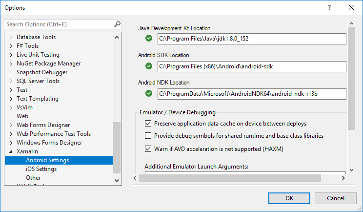

# Troubleshooting Tips

## Getting Diagnostic Information

Xamarin.Android has a few places to look when tracking down various bugs.
These include:

1. Diagnostic MSBuild output.
2. Device deployment logs.
3. Android Debug Log Output.

<a name="Diagnostic_MSBuild_Output"></a>

## Diagnostic MSBuild Output

Diagnostic MSBuild can contain additional information relating to package
building and may contain some package deployment information.

To enable diagnostic MSBuild output within Visual Studio:

1. Click  **Tools > Options...**
2. In the left-hand tree view, select  **Projects and Solutions > Build and Run**
3. In the right-hand panel, set the MSBuild build output verbosity dropdown to Diagnostic
4. Click **OK**
5. Clean and rebuild your package.
6. Diagnostic output is visible within the Output panel.

To enable diagnostic MSBuild output within Visual Studio for Mac/OS X:

1. Click  **Visual Studio for Mac > Preferences...**
2. In the left-hand tree view, select  **Projects > Build**
3. In the right-hand panel, set the Log verbosity drop-down to Diagnostic
4. Click **OK**
5. Restart Visual Studio for Mac
6. Clean and rebuild your package.
7. Diagnostic output is visible within the Errors Pad (**View > Pads > Errors** ), by clicking the Build Output button.

## Device Deployment Logs

To enable device deployment logging within Visual Studio:

1. **Tools > Options...**>
2. In the left-hand tree view, select  **Xamarin > Android Settings**
3. In the right-hand panel, enable the [X]  **extension debug logging (writes monodroid.log to your desktop)** check box.
4. Log messages are written to the monodroid.log file on your desktop.

Visual Studio for Mac always writes device deployment logs. FInding them is
slightly more difficult; a *AndroidUtils* log file is created for every
day + time that a deployment occurs, for example: **AndroidTools-2012-10-24_12-35-45.log**.

- On Windows, log files are written to  `%LOCALAPPDATA%\XamarinStudio-{VERSION}\Logs`.
- On OS X, log files are written to  `$HOME/Library/Logs/XamarinStudio-{VERSION}`.

## Android Debug Log Output

Android will write many messages to the
[Android Debug Log](~/android/deploy-test/debugging/android-debug-log.md).
Xamarin.Android uses Android system properties to control the
generation of additional messages to the Android Debug Log. Android
system properties can be set through the *setprop* command within the
[Android Debug Bridge (adb)](https://developer.android.com/guide/developing/tools/adb.html):

```shell
adb shell setprop PROPERTY_NAME PROPERTY_VALUE
```

System properties are read during process startup, and thus must be
either set before the application is launched or the application must
be restarted after the system properties are changed.

### Xamarin.Android System Properties

Xamarin.Android supports the following system properties:

- *debug.mono.debug*: If a non-empty string, this is equivalent to
  `*mono-debug*`.

- *debug.mono.env*: A pipe-separated ('*|*') list of environment
  variables to export during application startup, *before* mono has
  been initialized. This allows setting environment variables that
  control mono logging.

  > [!NOTE]
  > Since the value is '*|*'-separated, the value must have
  > an extra level of quoting, as the \`*adb shell*\` command will
  > remove a set of quotes.

  > [!NOTE]
  > Android system property values can be no longer than 92
  > characters in length.

  Example:

  ```
  adb shell setprop debug.mono.env "'MONO_LOG_LEVEL=info|MONO_LOG_MASK=asm'"
  ```

- *debug.mono.log*: A comma-separated ('*,*') list of components that
  should print additional messages to the Android Debug Log. By
  default, nothing is set. Components include:

  - *all*: Print all messages
  - *gc*: Print GC-related messages.
  - *gref*: Print (weak, global) reference allocation and deallocation messages.
  - *lref*: Print local reference allocation and deallocation messages.

  > [!NOTE]
  > These are *extremely* verbose. Do not enable unless you really need to.

- *debug.mono.trace*: Allows setting the [mono --trace](http://docs.go-mono.com/?link=man%3amono(1))`=PROPERTY_VALUE`
  setting.

## Deleting `bin` and `obj`

Xamarin.Android has suffered in the past from a situation such as:

- You encounter a strange build or runtime error.
- You `Clean`, `Rebuild`, or manually delete your `bin` and `obj` directories.
- The problem goes away.

We are heavily invested into fixing problems such as these due to their impact on developer productivity.

If a problem such as this happens to you:

1. Make a mental note. What was the last action that got your project into this state?
1. Save your current build log. Try building again, and record a [diagnostic build log](#diagnostic-msbuild-output).
1. Submit a [bug report][bug].

Before deleting your `bin` and `obj` directories, zip them up and save them for later diagnosis if needed. You can probably merely `Clean` your Xamarin.Android application project to get things working again.

[bug]: https://github.com/xamarin/xamarin-android/wiki/Submitting-Bugs,-Feature-Requests,-and-Pull-Requests

## Xamarin.Android cannot resolve System.ValueTuple

This error occurs due to an incompatibility with Visual Studio.

- **Visual Studio 2017 Update 1** (version 15.1 or older) is only compatible with the **System.ValueTuple NuGet 4.3.0** (or older).

- **Visual Studio 2017 Update 2** (version 15.2 or newer) is only compatible with the **System.ValueTuple NuGet 4.3.1** (or newer).

Please choose the correct System.ValueTuple NuGet that corresponds with your Visual Studio 2017 installation.

## GC Messages

GC component messages can be viewed by setting the debug.mono.log system
property to a value that contains gc.

GC messages are generated whenever the GC executes and provides information
about how much work the GC did:

```shell
I/monodroid-gc(12331): GC cleanup summary: 81 objects tested - resurrecting 21.
```

Additional GC information such as timing information can be generated by
setting the `MONO_LOG_LEVEL` environment variable to `debug`:

```shell
adb shell setprop debug.mono.env MONO_LOG_LEVEL=debug
```

This will result in (lots of) additional Mono messages, including these
three of consequence:

```shell
D/Mono (15723): GC_BRIDGE num-objects 1 num_hash_entries 81226 sccs size 81223 init 0.00ms df1 285.36ms sort 38.56ms dfs2 50.04ms setup-cb 9.95ms free-data 106.54ms user-cb 20.12ms clenanup 0.05ms links 5523436/5523436/5523096/1 dfs passes 1104 6883/11046605
D/Mono (15723): GC_MINOR: (Nursery full) pause 2.01ms, total 287.45ms, bridge 225.60 promoted 0K major 325184K los 1816K
D/Mono ( 2073): GC_MAJOR: (user request) pause 2.17ms, total 2.47ms, bridge 28.77 major 576K/576K los 0K/16K
```

In the `GC_BRIDGE` message, `num-objects` is the
number of bridge objects this pass is considering, and `num_hash_entries` is the number of objects processed during this
invocation of the bridge code.

In the `GC_MINOR` and `GC_MAJOR` messages, `total` is the amount of time while the world is paused (no threads
are executing), while `bridge` is the amount of time taken in the
bridge processing code (which deals with the Java VM). The world is *not* paused while bridge processing occurs.

 *In general*, the larger the value of `num_hash_entries`,
the more time that the `bridge` collections will take, and the
larger the `total` time spent collecting will be.

## Global Reference Messages

To enable Global Reference loggig (GREF) logging, the *debug.mono.log*
system property must contain *gref*, e.g.:

```shell
adb shell setprop debug.mono.log gref
```

Xamarin.Android uses Android global references to provide mappings between
Java instances and the associated managed instances, as when invoking a Java
method a Java instance needs to be provided to Java.

Unfortunately, Android emulators only allow 2000 global references to exist
at a time. Hardware has a much higher limit of 52000 global references. The
lower limit can be problematic when running applications on the emulator, so
knowing *where* the instance came from can be very useful.

> [!NOTE]
> The global reference count is internal to Xamarin.Android,
> and does not (and cannot) include global references taken out by other native
> libraries loaded into the process. Use the global reference count as an
> estimate.

```shell
I/monodroid-gref(12405): +g+ grefc 108 gwrefc 0 obj-handle 0x40517468/L -> new-handle 0x40517468/L from    at Java.Lang.Object.RegisterInstance(IJavaObject instance, IntPtr value, JniHandleOwnership transfer)
I/monodroid-gref(12405):    at Java.Lang.Object.SetHandle(IntPtr value, JniHandleOwnership transfer)
I/monodroid-gref(12405):    at Java.Lang.Object..ctor(IntPtr handle, JniHandleOwnership transfer)
I/monodroid-gref(12405):    at Java.Lang.Thread+RunnableImplementor..ctor(System.Action handler, Boolean removable)
I/monodroid-gref(12405):    at Java.Lang.Thread+RunnableImplementor..ctor(System.Action handler)
I/monodroid-gref(12405):    at Android.App.Activity.RunOnUiThread(System.Action action)
I/monodroid-gref(12405):    at Mono.Samples.Hello.HelloActivity.UseLotsOfMemory(Android.Widget.TextView textview)
I/monodroid-gref(12405):    at Mono.Samples.Hello.HelloActivity.<OnCreate>m__3(System.Object o)
I/monodroid-gref(12405): handle 0x40517468; key_handle 0x40517468: Java Type: `mono/java/lang/RunnableImplementor`; MCW type: `Java.Lang.Thread+RunnableImplementor`
I/monodroid-gref(12405): Disposing handle 0x40517468
I/monodroid-gref(12405): -g- grefc 107 gwrefc 0 handle 0x40517468/L from    at Java.Lang.Object.Dispose(System.Object instance, IntPtr handle, IntPtr key_handle, JObjectRefType handle_type)
I/monodroid-gref(12405):    at Java.Lang.Object.Dispose()
I/monodroid-gref(12405):    at Java.Lang.Thread+RunnableImplementor.Run()
I/monodroid-gref(12405):    at Java.Lang.IRunnableInvoker.n_Run(IntPtr jnienv, IntPtr native__this)
I/monodroid-gref(12405):    at System.Object.c200fe6f-ac33-441b-a3a0-47659e3f6750(IntPtr , IntPtr )
I/monodroid-gref(27679): +w+ grefc 1916 gwrefc 296 obj-handle 0x406b2b98/G -> new-handle 0xde68f4bf/W from take_weak_global_ref_jni
I/monodroid-gref(27679): -w- grefc 1915 gwrefc 294 handle 0xde691aaf/W from take_global_ref_jni
```

There are four messages of consequence:

- Global reference creation: these are the lines that start with  *+g+* , and will provide a stack trace for the creating code path.
- Global reference destruction: these are the lines that start with  *-g-* , and may provide a stack trace for the code path disposing of the global reference. If the GC is disposing of the gref, no stack trace will be provided.
- Weak global reference creation: these are the lines that start with  *+w+* .
- Weak global reference destruction: these are lines that start with  *-w-* .

In all messages, The *grefc* value is the count of global references
that Xamarin.Android has created, while the *grefwc* value is the count
of weak global references that Xamarin.Android has created. The *handle*
or *obj-handle* value is the JNI handle value, and the character after
the ' */*' is the type of handle value: */L* for local reference, */G* for global references, and */W* for weak global
references.

As part of the GC process, global references (+g+) are converted into weak
global references (causing a +w+ and -g-), a Java-side GC is kicked, and then
the weak global reference is checked to see if it was collected. If it's still
alive, a new gref is created around the weak ref (+g+, -w-), otherwise the weak
ref is destroyed (-w).

## Java instance is created and wrapped by a MCW

```shell
I/monodroid-gref(27679): +g+ grefc 2211 gwrefc 0 obj-handle 0x4066df10/L -> new-handle 0x4066df10/L from ...
I/monodroid-gref(27679): handle 0x4066df10; key_handle 0x4066df10: Java Type: `android/graphics/drawable/TransitionDrawable`; MCW type: `Android.Graphics.Drawables.TransitionDrawable`
```

## A GC is being performed...

```shell
I/monodroid-gref(27679): +w+ grefc 1953 gwrefc 259 obj-handle 0x4066df10/G -> new-handle 0xde68f95f/W from take_weak_global_ref_jni
I/monodroid-gref(27679): -g- grefc 1952 gwrefc 259 handle 0x4066df10/G from take_weak_global_ref_jni
```

## Object is still alive, as handle != null
## wref turned back into a gref

```shell
I/monodroid-gref(27679): *try_take_global obj=0x4976f080 -> wref=0xde68f95f handle=0x4066df10
I/monodroid-gref(27679): +g+ grefc 1930 gwrefc 39 obj-handle 0xde68f95f/W -> new-handle 0x4066df10/G from take_global_ref_jni
I/monodroid-gref(27679): -w- grefc 1930 gwrefc 38 handle 0xde68f95f/W from take_global_ref_jni
```

## Object is dead, as handle == null
## wref is freed, no new gref created

```shell
I/monodroid-gref(27679): *try_take_global obj=0x4976f080 -> wref=0xde68f95f handle=0x0
I/monodroid-gref(27679): -w- grefc 1914 gwrefc 296 handle 0xde68f95f/W from take_global_ref_jni
```

There is one "interesting" wrinkle here: on targets running Android prior to
4.0, the gref value is equal to the address of the Java object in the Android runtime's
memory. (That is, the GC is a non-moving, conservative, collector, and it's
handing out direct references to those objects.) Thus after a +g+, +w+, -g-,
+g+, -w- sequence, the resulting gref will have the same value as the original
gref value. This makes grepping through logs fairly straightforward.

Android 4.0, however, has a moving collector and no longer hands out direct
references to Android runtime VM objects. Consequently, after a +g+, +w+, -g-, +g+, -w-
sequence, the gref value *will be different*. If the object survives
multiple GCs, it will go by several gref values, making it harder to determine
where an instance was actually allocated from.

### Querying Programmatically

You can query both the GREF and WREF counts by querying the `JniRuntime` object.

`Java.Interop.JniRuntime.CurrentRuntime.GlobalReferenceCount` - Global Reference Count

`Java.Interop.JniRuntime.CurrentRuntime.WeakGlobalReferenceCount` - Weak Reference Count

## Android Debug Logs

The [Android Debug Logs](~/android/deploy-test/debugging/android-debug-log.md) may provide additional context regarding any runtime errors you're
seeing.

## Floating-Point performance is terrible!

Alternatively, "My app runs 10x faster with the Debug build than with the
Release build!"

Xamarin.Android supports multiple device ABIs: *armeabi*,
*armeabi-v7a*, and *x86*. Device ABIs can be specified within **Project
Properties > Application tab > Supported architectures**.

Debug builds use an Android package which provides all ABIs, and thus will
use the fastest ABI for the target device.

Release builds will only include the ABIs selected in the Project Properties
tab. More than one can be selected.

*armeabi* is the default ABI, and has the broadest device support. *However*, armeabi doesn't support multi-CPU devices and hardware
floating-point, amont other things. Consequently, apps using the armeabi Release
runtime will be tied to a single core and will be using a soft-float
implementation. Both of these can contribute to significantly slower performance
for your app.

If your app requires decent floating-point performance (e.g. games), you
should enable the *armeabi-v7a* ABI. You may want to only support the *armeabi-v7a* runtime, though this means that older devices which only
support *armeabi* will be unable to run your app.

## Could not locate Android SDK

There are 2 downloads available from Google for the Android SDK for Windows.
If you choose the .exe installer, it will write registry keys that tell
Xamarin.Android where it was installed. If you choose the .zip file and unzip it
yourself, Xamarin.Android does not know where to look for the SDK. You can tell
Xamarin.Android where the SDK is in Visual Studio by going to
**Tools > Options > Xamarin > Android Settings**:

[](troubleshooting-images/01.png#lightbox)

## IDE does not display target device

Sometimes you will attempt to deploy your application to a device, but
the device you want to deploy to isn't shown in the Select Device
dialog. This can happen when the Android Debug Bridge decides to go on
vacation.

To diagnose this issue, find the
[adb program](~/android/deploy-test/debugging/android-debug-log.md),
then run:

```shell
adb devices
```

If your device isn't present, then you need to restart the Android Debug Bridge server so that your device can be found:

```shell
adb kill-server
adb start-server
```

HTC Sync software may prevent **adb start-server** from working
properly. If the **adb start-server** command doesn't print out which
port it's starting on, please exit the HTC Sync software and try
restarting the adb server.

## The specified task executable "keytool" could not be run

This means that your PATH does not contain the directory where the Java
SDK's bin directory is located. Check that you followed those steps
from the
[Installation](~/android/get-started/installation/index.md) guide.

## monodroid.exe or aresgen.exe exited with code 1

To help you debug this problem, go into Visual Studio and change the
MSBuild verbosity level, to do this, select: **Tools > Options >
Project** and **Solutions > Build** and **Run > MSBuild Project Build
Output Verbosity** and set this value to **Normal**.

Rebuild, and check Visual Studio's Output pane, which should contain the full error.

## There is not enough storage space on the device to deploy the package

This occurs when you don't start the emulator from within Visual
Studio. When starting the emulator outside of Visual Studio, you need
to pass the `-partition-size 512` options, e.g.

```shell
emulator -partition-size 512 -avd MonoDroid
```

Ensure you use the correct simulator name, i.e.
[the name you used when configuring the simulator](~/android/get-started/installation/windows.md#device).

## INSTALL\_FAILED\_INVALID\_APK when installing a package

Android package names *must* contain a period ('*.*'). Edit your package name so that it contains a period.

- Within Visual Studio:
  - Right click your project > Properties
  - Click the Android Manifest tab on the left.
  - Update the Package name field.
    - If you see the message &ldquo;No AndroidManifest.xml found. Click to add one.&rdquo;, click the link and then update the Package name field.
- Within Visual Studio for Mac:
  - Right click your project > Options.
  - Navigate to the Build / Android Application section.
  - Change the Package name field to contain a '.'.

## INSTALL\_FAILED\_MISSING\_SHARED\_LIBRARY when installing a package

A "shared library" in this context is *not* a native shared
library (*libfoo.so*) file; it is instead a library that must be
separately installed on the target device, such as Google Maps.

The Android package specifies which shared libraries are required with
the `<uses-library/>` element. If a *required* library is not present
on the target device (e.g. `//uses-library/@android:required` is
*true*, which is the default), then package installation will fail with
*INSTALL\_FAILED\_MISSING\_SHARED\_LIBRARY*.

To determine which shared libraries are required, view the *generated*
**AndroidManifest.xml** file (e.g.
**obj\\Debug\\android\\AndroidManifest.xml**) and look for the
`<uses-library/>` elements. `<uses-library/>` elements can be added
manually in your project's **Properties\\AndroidManifest.xml** file and via the
[UsesLibraryAttribute custom attribute](xref:Android.App.UsesLibraryAttribute).

For example, adding an assembly reference to
*Mono.Android.GoogleMaps.dll* will implicitly add a `<uses-library/>`
for the Google Maps shared library.

## INSTALL\_FAILED\_UPDATE\_INCOMPATIBLE when installing a package

Android packages have three requirements:

- They must contain a '.' (see previous entry)
- They must have a unique string package name (hence the reverse-tld convention seen in Android app names, e.g. com.android.chrome for the Chrome app)
- When upgrading packages, the package must have the same signing key.

Thus, imagine this scenario:

1. You build & deploy your app as a Debug app
2. You change the signing key, e.g. to use as a Release app (or because you don't like the default-provided Debug signing key)
3. You install your app without removing it first, e.g. Debug > Start Without Debugging within Visual Studio

When this happens, package installation will fail with a
INSTALL\_FAILED\_UPDATE\_INCOMPATIBLE error, because the package name
didn't change while the signing key did. The
[Android Debug Log](~/android/deploy-test/debugging/android-debug-log.md)
will also contain a message similar to:

```shell
E/PackageManager(  146): Package [PackageName] signatures do not match the previously installed version; ignoring!
```

To fix this error, completely remove the application from your device
before re-installing.

## INSTALL\_FAILED\_UID\_CHANGED when installing a package

When an Android package is installed, it is assigned a *user id* (UID).
*Sometimes*, for currently unknown reasons, when installing over an already
installed app, the installation will fail with `INSTALL_FAILED_UID_CHANGED`:

```shell
ERROR [2015-03-23 11:19:01Z]: ANDROID: Deployment failed
Mono.AndroidTools.InstallFailedException: Failure [INSTALL_FAILED_UID_CHANGED]
   at Mono.AndroidTools.Internal.AdbOutputParsing.CheckInstallSuccess(String output, String packageName)
   at Mono.AndroidTools.AndroidDevice.<>c__DisplayClass2c.<InstallPackage>b__2b(Task`1 t)
   at System.Threading.Tasks.ContinuationTaskFromResultTask`1.InnerInvoke()
   at System.Threading.Tasks.Task.Execute()
```

To work around this issue, *fully uninstall* the Android package, either by
installing the app from the Android target's GUI, or using `adb`:

```shell
$ adb uninstall @PACKAGE_NAME@
```

**DO NOT USE** `adb uninstall -k`, as this will *preserve* application data,
and thus preserve the conflicting UID on the target device.

## Release apps fail to launch on device

Does the Android Debug Log output will contain a message similar to:

```shell
D/AndroidRuntime( 1710): Shutting down VM
W/dalvikvm( 1710): threadid=1: thread exiting with uncaught exception (group=0xb412f180)
E/AndroidRuntime( 1710): FATAL EXCEPTION: main
E/AndroidRuntime( 1710): java.lang.UnsatisfiedLinkError: Couldn't load monodroid: findLibrary returned null
E/AndroidRuntime( 1710):        at java.lang.Runtime.loadLibrary(Runtime.java:365)
```

If so, there are two possible causes for this:

1. The .apk doesn't provide an ABI that the target device supports.
    For example, the .apk only contains armeabi-v7a binaries, and the
    target device only supports armeabi.

2. An [Android bug](https://code.google.com/p/android/issues/detail?id=21670). If
    this is the case, uninstall the app, cross your fingers, and
    reinstall the app.

To fix (1), edit the Project Options/Properties and
[add support for the required ABI to the list of Supported ABIs](~/android/app-fundamentals/cpu-architectures.md). To
determine which ABI you need to add, run the following adb command
against your target device:

```shell
adb shell getprop ro.product.cpu.abi
adb shell getprop ro.product.cpu.abi2
```

The output will contain the primary (and optional secondary) ABIs.

```shell
$ adb shell getprop | grep ro.product.cpu
[ro.product.cpu.abi2]: [armeabi]
[ro.product.cpu.abi]: [armeabi-v7a]
```

## The OutPath property is not set for project &ldquo;MyApp.csproj&rdquo;

This generally means you have an HP computer and the environment
variable &ldquo;Platform&rdquo; has been set to something like MCD or
HPD. This conflicts with the MSBuild Platform property that is
generally set to &ldquo;Any CPU&rdquo; or &ldquo;x86&rdquo;. You will
need to remove this environment variable from your machine before
MSBuild can function:

- Control Panel > System > Advanced > Environment Variables

Restart Visual Studio or Visual Studio for Mac and try to rebuild. Things
should now work as expected.

## java.lang.ClassCastException: mono.android.runtime.JavaObject cannot be cast to...

Xamarin.Android 4.x doesn't properly marshal nested generic types
properly. For example, consider the following C\# code using
[SimpleExpandableListAdapter](xref:Android.Widget.SimpleExpandableListAdapter):

```csharp
// BAD CODE; DO NOT USE
var groupData = new List<IDictionary<string, object>> () {
        new Dictionary<string, object> {
                { "NAME", "Group 1" },
                { "IS_EVEN", "This group is odd" },
        },
};
var childData = new List<IList<IDictionary<string, object>>> () {
        new List<IDictionary<string, object>> {
                new Dictionary<string, object> {
                        { "NAME", "Child 1" },
                        { "IS_EVEN", "This group is odd" },
                },
        },
};
mAdapter = new SimpleExpandableListAdapter (
        this,
        groupData,
        Android.Resource.Layout.SimpleExpandableListItem1,
        new string[] { "NAME", "IS_EVEN" },
        new int[] { Android.Resource.Id.Text1, Android.Resource.Id.Text2 },
        childData,
        Android.Resource.Layout.SimpleExpandableListItem2,
        new string[] { "NAME", "IS_EVEN" },
        new int[] { Android.Resource.Id.Text1, Android.Resource.Id.Text2 }
);
```

The problem is that Xamarin.Android incorrectly marshals nested generic
types. The `List<IDictionary<string, object>>` is being marshaled to a
[java.lang.ArrrayList](xref:Java.Util.ArrayList),
but the `ArrayList` is containing `mono.android.runtime.JavaObject`
instances (which reference the `Dictionary<string, object>` instances)
instead of something that implements
[java.util.Map](xref:Java.Util.IMap),
resulting in the following exception:

```shell
E/AndroidRuntime( 2991): FATAL EXCEPTION: main
E/AndroidRuntime( 2991): java.lang.ClassCastException: mono.android.runtime.JavaObject cannot be cast to java.util.Map
E/AndroidRuntime( 2991):        at android.widget.SimpleExpandableListAdapter.getGroupView(SimpleExpandableListAdapter.java:278)
E/AndroidRuntime( 2991):        at android.widget.ExpandableListConnector.getView(ExpandableListConnector.java:446)
E/AndroidRuntime( 2991):        at android.widget.AbsListView.obtainView(AbsListView.java:2271)
E/AndroidRuntime( 2991):        at android.widget.ListView.makeAndAddView(ListView.java:1769)
E/AndroidRuntime( 2991):        at android.widget.ListView.fillDown(ListView.java:672)
E/AndroidRuntime( 2991):        at android.widget.ListView.fillFromTop(ListView.java:733)
E/AndroidRuntime( 2991):        at android.widget.ListView.layoutChildren(ListView.java:1622)
```

The workaround is to use the provided
[Java Collection types](~/android/internals/api-design.md) instead
of the `System.Collections.Generic` types for the &ldquo;inner&rdquo;
types. This will result in appropriate Java types when marshaling the
instances. (The following code is more complicated than necessary in
order to reduce gref lifetimes. It can be simplified to altering the
original code via `s/List/JavaList/g` and
`s/Dictionary/JavaDictionary/g` if gref lifetimes aren't a worry.)

```csharp
// insert good code here
using (var groupData = new JavaList<IDictionary<string, object>> ()) {
    using (var groupEntry = new JavaDictionary<string, object> ()) {
        groupEntry.Add ("NAME", "Group 1");
        groupEntry.Add ("IS_EVEN", "This group is odd");
        groupData.Add (groupEntry);
    }
    using (var childData = new JavaList<IList<IDictionary<string, object>>> ()) {
        using (var childEntry = new JavaList<IDictionary<string, object>> ())
        using (var childEntryDict = new JavaDictionary<string, object> ()) {
            childEntryDict.Add ("NAME", "Child 1");
            childEntryDict.Add ("IS_EVEN", "This child is odd.");
            childEntry.Add (childEntryDict);
            childData.Add (childEntry);
        }
        mAdapter = new SimpleExpandableListAdapter (
            this,
            groupData,
            Android.Resource.Layout.SimpleExpandableListItem1,
            new string[] { "NAME", "IS_EVEN" },
            new int[] { Android.Resource.Id.Text1, Android.Resource.Id.Text2 },
            childData,
            Android.Resource.Layout.SimpleExpandableListItem2,
            new string[] { "NAME", "IS_EVEN" },
            new int[] { Android.Resource.Id.Text1, Android.Resource.Id.Text2 }
        );
    }
}
```

[This will be fixed in a future release](https://bugzilla.xamarin.com/show_bug.cgi?id=5401).

## Unexpected NullReferenceExceptions

Occasionally the
[Android Debug Log](~/android/deploy-test/debugging/android-debug-log.md)
will mention NullReferenceExceptions that &ldquo;cannot happen,&rdquo;
or come from Mono for Android runtime code shortly before the app dies:

```shell
E/mono(15202): Unhandled Exception: System.NullReferenceException: Object reference not set to an instance of an object
E/mono(15202):   at Java.Lang.Object.GetObject (IntPtr handle, System.Type type, Boolean owned)
E/mono(15202):   at Java.Lang.Object._GetObject[IOnTouchListener] (IntPtr handle, Boolean owned)
E/mono(15202):   at Java.Lang.Object.GetObject[IOnTouchListener] (IntPtr handle, Boolean owned)
E/mono(15202):   at Android.Views.View+IOnTouchListenerAdapter.n_OnTouch_Landroid_view_View_Landroid_view_MotionEvent_(IntPtr jnienv, IntPtr native__this, IntPtr native_v, IntPtr native_e)
E/mono(15202):   at (wrapper dynamic-method) object:b039cbb0-15e9-4f47-87ce-442060701362 (intptr,intptr,intptr,intptr)
```

or

```shell
E/mono    ( 4176): Unhandled Exception:
E/mono    ( 4176): System.NullReferenceException: Object reference not set to an instance of an object
E/mono    ( 4176): at Android.Runtime.JNIEnv.NewString (string)
E/mono    ( 4176): at Android.Util.Log.Info (string,string)
```

This can happen when the Android runtime decides to abort the process,
which can happen for any number of reasons, including hitting the
target's GREF limit or doing something &ldquo;wrong&rdquo; with JNI.

To see if this is the case, check the Android Debug Log for a message
from your process similar to:

```shell
E/dalvikvm(  123): VM aborting
```

## Abort due to Global Reference Exhaustion

The Android runtime's JNI layer only supports a limited number of JNI
object references to be valid at any given point in time. When this
limit is exceeded, things break.

The GREF (*global reference*) limit is 2000 references in the emulator, and ~52000 references on hardware.

You know you're starting to create too many GREFs when you see messages such as this in the Android Debug Log:

```shell
D/dalvikvm(  602): GREF has increased to 1801
```

When you reach the GREF limit, a message such as the following is printed:

```shell
D/dalvikvm(  602): GREF has increased to 2001
W/dalvikvm(  602): Last 10 entries in JNI global reference table:
W/dalvikvm(  602):  1991: 0x4057eff8 cls=Landroid/graphics/Point; (20 bytes)
W/dalvikvm(  602):  1992: 0x4057f010 cls=Landroid/graphics/Point; (28 bytes)
W/dalvikvm(  602):  1993: 0x40698e70 cls=Landroid/graphics/Point; (20 bytes)
W/dalvikvm(  602):  1994: 0x40698e88 cls=Landroid/graphics/Point; (20 bytes)
W/dalvikvm(  602):  1995: 0x40698ea0 cls=Landroid/graphics/Point; (28 bytes)
W/dalvikvm(  602):  1996: 0x406981f0 cls=Landroid/graphics/Point; (20 bytes)
W/dalvikvm(  602):  1997: 0x40698208 cls=Landroid/graphics/Point; (20 bytes)
W/dalvikvm(  602):  1998: 0x40698220 cls=Landroid/graphics/Point; (28 bytes)
W/dalvikvm(  602):  1999: 0x406956a8 cls=Landroid/graphics/Point; (20 bytes)
W/dalvikvm(  602):  2000: 0x406956c0 cls=Landroid/graphics/Point; (20 bytes)
W/dalvikvm(  602): JNI global reference table summary (2001 entries):
W/dalvikvm(  602):    51 of Ljava/lang/Class; 164B (41 unique)
W/dalvikvm(  602):    46 of Ljava/lang/Class; 188B (17 unique)
W/dalvikvm(  602):     6 of Ljava/lang/Class; 212B (6 unique)
W/dalvikvm(  602):    11 of Ljava/lang/Class; 236B (7 unique)
W/dalvikvm(  602):     3 of Ljava/lang/Class; 260B (3 unique)
W/dalvikvm(  602):     4 of Ljava/lang/Class; 284B (2 unique)
W/dalvikvm(  602):     8 of Ljava/lang/Class; 308B (6 unique)
W/dalvikvm(  602):     1 of Ljava/lang/Class; 316B
W/dalvikvm(  602):     4 of Ljava/lang/Class; 332B (3 unique)
W/dalvikvm(  602):     1 of Ljava/lang/Class; 356B
W/dalvikvm(  602):     2 of Ljava/lang/Class; 380B (1 unique)
W/dalvikvm(  602):     1 of Ljava/lang/Class; 428B
W/dalvikvm(  602):     1 of Ljava/lang/Class; 452B
W/dalvikvm(  602):     1 of Ljava/lang/Class; 476B
W/dalvikvm(  602):     2 of Ljava/lang/Class; 500B (1 unique)
W/dalvikvm(  602):     1 of Ljava/lang/Class; 548B
W/dalvikvm(  602):     1 of Ljava/lang/Class; 572B
W/dalvikvm(  602):     2 of Ljava/lang/Class; 596B (2 unique)
W/dalvikvm(  602):     1 of Ljava/lang/Class; 692B
W/dalvikvm(  602):     1 of Ljava/lang/Class; 956B
W/dalvikvm(  602):     1 of Ljava/lang/Class; 1004B
W/dalvikvm(  602):     1 of Ljava/lang/Class; 1148B
W/dalvikvm(  602):     2 of Ljava/lang/Class; 1172B (1 unique)
W/dalvikvm(  602):     1 of Ljava/lang/Class; 1316B
W/dalvikvm(  602):     1 of Ljava/lang/Class; 3428B
W/dalvikvm(  602):     1 of Ljava/lang/Class; 3452B
W/dalvikvm(  602):     1 of Ljava/lang/String; 28B
W/dalvikvm(  602):     2 of Ldalvik/system/VMRuntime; 12B (1 unique)
W/dalvikvm(  602):    10 of Ljava/lang/ref/WeakReference; 28B (10 unique)
W/dalvikvm(  602):     1 of Ldalvik/system/PathClassLoader; 44B
W/dalvikvm(  602):  1553 of Landroid/graphics/Point; 20B (1553 unique)
W/dalvikvm(  602):   261 of Landroid/graphics/Point; 28B (261 unique)
W/dalvikvm(  602):     1 of Landroid/view/MotionEvent; 100B
W/dalvikvm(  602):     1 of Landroid/app/ActivityThread$ApplicationThread; 28B
W/dalvikvm(  602):     1 of Landroid/content/ContentProvider$Transport; 28B
W/dalvikvm(  602):     1 of Landroid/view/Surface$CompatibleCanvas; 44B
W/dalvikvm(  602):     1 of Landroid/view/inputmethod/InputMethodManager$ControlledInputConnectionWrapper; 36B
W/dalvikvm(  602):     1 of Landroid/view/ViewRoot$1; 12B
W/dalvikvm(  602):     1 of Landroid/view/ViewRoot$W; 28B
W/dalvikvm(  602):     1 of Landroid/view/inputmethod/InputMethodManager$1; 28B
W/dalvikvm(  602):     1 of Landroid/view/accessibility/AccessibilityManager$1; 28B
W/dalvikvm(  602):     1 of Landroid/widget/LinearLayout$LayoutParams; 44B
W/dalvikvm(  602):     1 of Landroid/widget/LinearLayout; 332B
W/dalvikvm(  602):     2 of Lorg/apache/harmony/xnet/provider/jsse/TrustManagerImpl; 28B (1 unique)
W/dalvikvm(  602):     1 of Landroid/view/SurfaceView$MyWindow; 36B
W/dalvikvm(  602):     1 of Ltouchtest/RenderThread; 92B
W/dalvikvm(  602):     1 of Landroid/view/SurfaceView$3; 12B
W/dalvikvm(  602):     1 of Ltouchtest/DrawingView; 412B
W/dalvikvm(  602):     1 of Ltouchtest/Activity1; 180B
W/dalvikvm(  602): Memory held directly by tracked refs is 75624 bytes
E/dalvikvm(  602): Excessive JNI global references (2001)
E/dalvikvm(  602): VM aborting
```

In the above example (which, incidentally, comes from
[bug 685215](https://bugzilla.novell.com/show_bug.cgi?id=685215)) the
problem is that too many Android.Graphics.Point instances are being
created; see
[comment \#2](https://bugzilla.novell.com/show_bug.cgi?id=685215#c2)
for a list of fixes for this particular bug.

Typically, a useful solution is to find which type has too many
instances allocated &ndash; Android.Graphics.Point in the above dump
&ndash; then find where they're created in your source code and dispose
of them appropriately (so that their Java-object lifetime is
shortened). This is not always appropriate (\#685215 is multithreaded,
so the trivial solution avoids the Dispose call), but it's the first
thing to consider.

You can enable
[GREF Logging](~/android/troubleshooting/index.md)
to see when GREFs are created and how many exist.

## Abort due to JNI type mismatch

If you hand-roll JNI code, it's possible that the types won't match
correctly, e.g. if you try to invoke `java.lang.Runnable.run` on a type
that doesn't implement `java.lang.Runnable`. When this occurs, there
will be a message similar to this in the Android Debug Log:

```shell
W/dalvikvm( 123): JNI WARNING: can't call Ljava/Type;;.method on instance of Lanother/java/Type;
W/dalvikvm( 123):              in Lmono/java/lang/RunnableImplementor;.n_run:()V (CallVoidMethodA)
...
E/dalvikvm( 123): VM aborting
```

## Dynamic Code Support

### Dynamic code does not compile

To use C\# dynamic in your application or library, you have to add
System.Core.dll, Microsoft.CSharp.dll and Mono.CSharp.dll to your
project.

### In Release build, MissingMethodException occurs for dynamic code at run time.

- It is likely that your application project does not have references
  to System.Core.dll, Microsoft.CSharp.dll or Mono.CSharp.dll. Make
  sure those assemblies are referenced.

  - Keep in mind that dynamic code always costs. If you need efficient code, consider not using dynamic code.

- In the first preview, those assemblies were excluded unless types
  in each assembly are explicitly used by the application code. See
  the following for a workaround:
  [http://lists.ximian.com/pipermail/mo...il/009798.html](http://lists.ximian.com/pipermail/monodroid/2012-April/009798.html)

## Projects built with AOT+LLVM crash on x86 devices

When deploying an app built with
[AOT+LLVM](~/android/deploy-test/release-prep/index.md)
on x86-based devices, you may see an exception error message similar to
the following:

```shell
Assertion: should not be reached at /Users/.../external/mono/mono/mini/tramp-x86.c:124
Fatal signal 6 (SIGABRT), code -6 in tid 4051 (Xamarin.bug56111)
```

This is a known issue – the workaround is to disable LLVM.
