# Alternative layout views

_This topic explains how you can version layouts by using resource
qualifiers. For example, creating a version of a layout that is only
used when the device is in landscape mode and a layout version that is
only for portrait mode._

# [Visual Studio](#tab/windows)

## Creating alternative layouts

When you click the **Alternative Layout View** icon (to the left of 
**Device**), a preview pane opens to list the alternative layouts 
available in your project. If there are no alternative layouts, 
the **Default** view is presented: 

[](alternative-layout-views-images/vs/01-alt-layout-view-pane.png#lightbox)

When you click the green plus sign next to **New Version**, the 
**Create Layout Variation** dialog opens so that you can select the 
resource qualifiers for this layout variation: 

[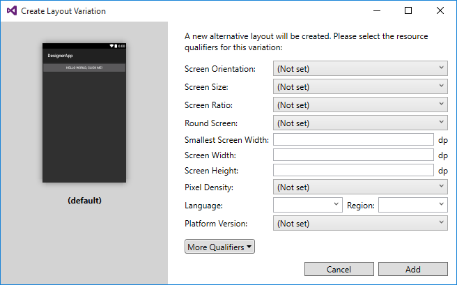](alternative-layout-views-images/vs/02-create-layout-variation.png#lightbox)

In the following example, the resource qualifier for **Screen Orientation** is set
to **Landscape**, and the **Screen Size** is changed to **Large**. This
creates a new layout version named **large-land**:

[](alternative-layout-views-images/vs/03-large-land.png#lightbox)

Note that the preview pane on the left displays the effects of the 
resource qualifier selections. Clicking **Add** creates the alternative 
layout and switches the Designer to that layout. The **Alternative 
Layout View** preview pane indicates which layout is loaded into the 
Designer via a small right pointer as indicated in the following 
screenshot: 

[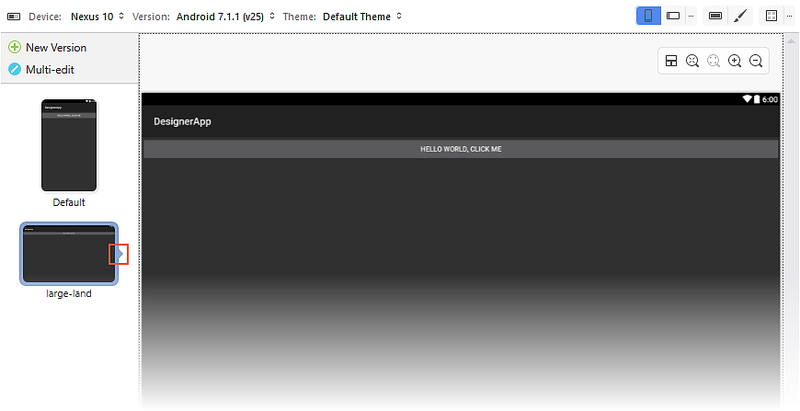](alternative-layout-views-images/vs/04-new-layout.png#lightbox)


## Editing alternative layouts

When you create alternative layouts, it is often desirable to make a
single change that applies to all forked versions of a layout. For
example, you may want to change the button text to yellow in all
layouts. If you have a large number of layouts and you need to
propagate a single change to all versions, maintenance can quickly
become cumbersome and error-prone.

To simplify the maintenance of multiple layout versions, the Designer 
provides a **Multi-edit** mode that propagates your changes across one 
or more layouts. When more than one layout is present, the 
**Multi-edit** icon is displayed: 

[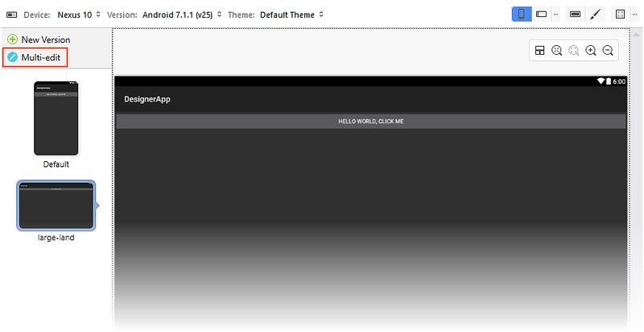](alternative-layout-views-images/vs/05-multi-layout-icon.png#lightbox)

When you click the **Multi-edit** icon, lines appear that indicate that 
the layouts are linked (as shown below); that is, when you make a 
change to one layout, that change is propagated to any linked layouts. 
You can unlink all layouts by clicking the circled icon indicated in 
the following screenshot: 

[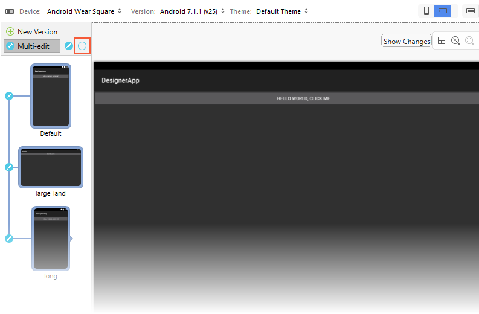](alternative-layout-views-images/vs/06-multi-linked.png#lightbox)

If you have more than two layouts, you can selectively toggle the edit 
button to the left of each layout preview to determine which layouts 
are linked together. For example, if you want to make a single change 
that propagates to the first and last of three layouts, you would first 
unlink the middle layout as shown here: 

[](alternative-layout-views-images/vs/07-unlink-middle-layout.png#lightbox)

In this example, a change made to either the **Default** or **long**
layout will be propagated to the other layout but not to the
**large-land** layout.

### Multi-Edit example 

In general, when you make a change to one layout, that same change is 
propagated to all other linked layouts. For example, adding a new 
`TextView` widget to the **Default** layout and changing its text 
string to `Portrait` will cause the same change to be made to all 
linked layouts. Here is how it looks in the **Default** layout: 

[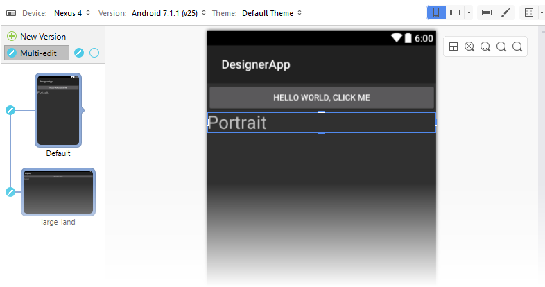](alternative-layout-views-images/vs/08-add-textview.png#lightbox)
 
The `TextView` is also added to the **large-land** layout view because 
it is linked to the **Default** layout: 

[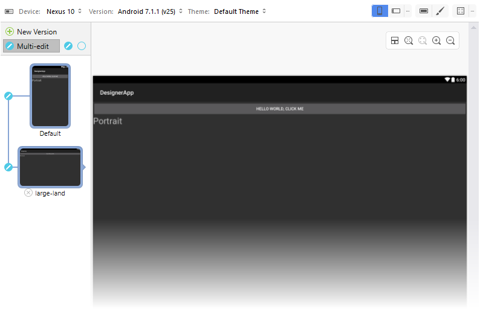](alternative-layout-views-images/vs/09-landscape-textview.png#lightbox)
 
But what if you want to make a change that is local to only one layout 
(that is, you don't want the change to be propagated to any of the 
other layouts)? To do this, you must unlink the layout that you want to 
change before you modify it, as explained next. 

### Making local changes 

Suppose we want both layouts to have the added `TextView`, but we also 
want to change the text string in the **large-land** layout to 
`Landscape` rather than `Portrait`. If we make this change to 
**large-land** while both layouts are linked, the change will propagate 
back to the **Default** layout. Therefore, we must first unlink the two 
layouts before we make the change. When we modify the text in 
**large-land** to `Landscape`, the Designer marks this change with a 
red frame to indicate that the change is local to the **large-land** 
layout and is *not* propagated back to the **Default** layout: 

[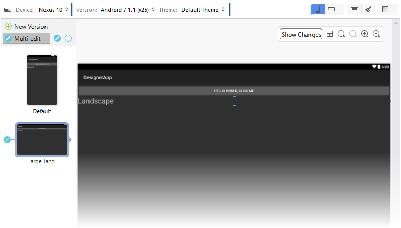](alternative-layout-views-images/vs/10-local-change.png#lightbox)
 
When you click the **Default** layout to view it, the `TextView` text 
string is still set to `Portrait`. 

## Handling conflicts 

If you decide to change the color of the text in the **Default** layout 
to green, you'll see a warning icon appear on the linked layout. 
Clicking that layout opens the layout to reveal the conflict. The 
widget that caused the conflict is highlighted with a red frame and the 
following message is displayed: *Recent changes have caused conflicts 
in this alternative layout*. 

[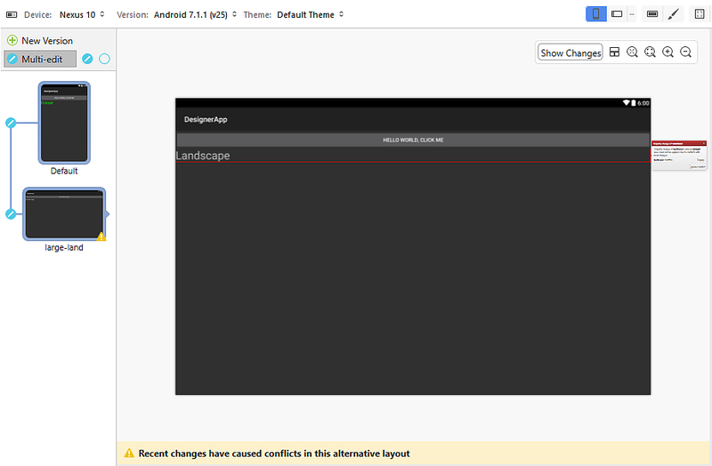](alternative-layout-views-images/vs/11-conflicting-change.png#lightbox)
 
A *conflict box* is displayed on the right of the widget to explain the 
conflict: 

[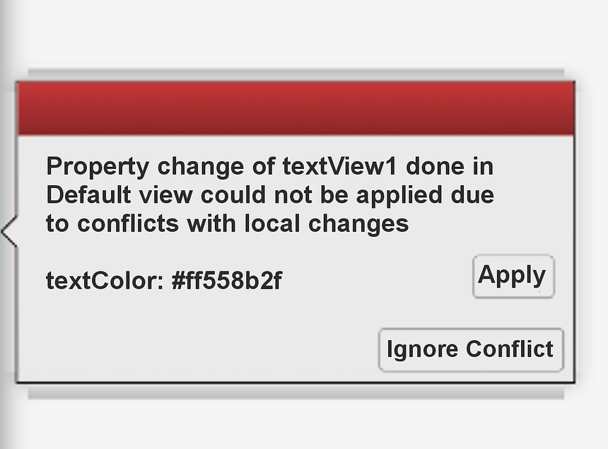](alternative-layout-views-images/xs/11-warning.png#lightbox)

The conflict box shows the list of properties that have changed and it 
lists their values. Clicking **Ignore Conflict** applies the property 
change only to this widget. Clicking **Apply** applies the property 
change to this widget as well as to the counterpart widget in the linked 
**Default** layout. If all property changes are applied, the conflict 
is automatically discarded. 

### View group conflicts 

Property changes are not the only source of conflicts. Conflicts
can be detected when inserting or removing widgets. For example,
when the **large-land** layout is unlinked from the **Default**
layout, and the `TextView` in the **large-land** layout is dragged
and dropped above the `Button`, the Designer marks the
moved widget to indicate the conflict:

[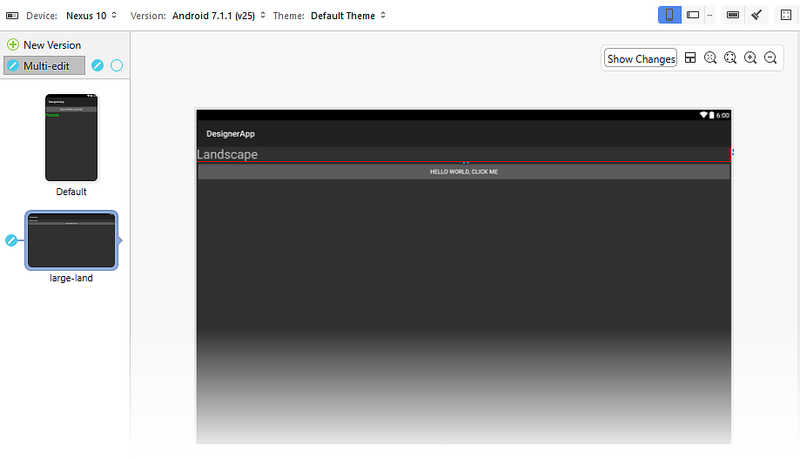](alternative-layout-views-images/vs/12-view-group-conflict.png#lightbox)
 
However, there is no marker on the `Button`. Although the position of 
the `Button` has changed, the `Button` shows no applied changes that 
are specific to the **large-land** configuration. 

If a `CheckBox` is added to the **Default** layout, another conflict is 
generated, and a warning icon is displayed over the **large-land** 
layout: 

[](alternative-layout-views-images/vs/13-checkbox-conflict.png#lightbox)
 
Clicking the **large-land** layout reveals the conflict. The 
following message is displayed: *Recent changes have caused conflicts 
in this alternative layout*: 

[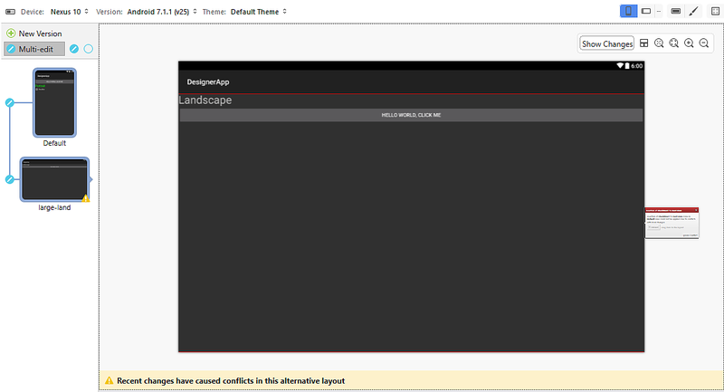](alternative-layout-views-images/vs/14-alt-layout-conflict.png#lightbox)

In addition, the conflict box displays the following message:

[](alternative-layout-views-images/xs/15-conflict-message.png#lightbox)

Adding the `CheckBox` causes a conflict because the **large-land** layout
has changes in the `LinearLayout` that contains it. However, in this
case the conflict box displays the widget that was just inserted into
the **Default** layout (the `CheckBox`).

If you click **Ignore Conflict**, the Designer resolves the conflict, 
allowing the widget displayed in the conflict box to be dragged and 
dropped into the layout where the widget is missing (in this case, the 
**large-land** layout): 

[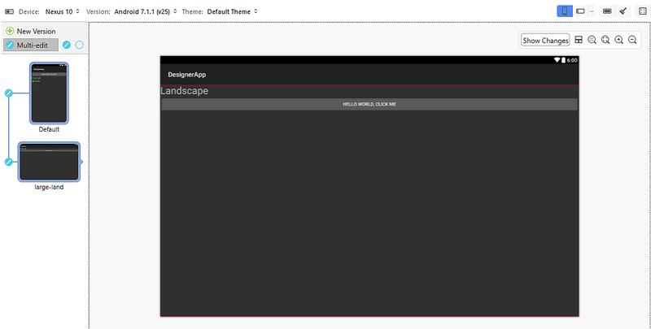](alternative-layout-views-images/vs/15-resolved-group-conflict.png#lightbox)

As seen in the previous example with the `Button`, the `CheckBox` does not
have a red change marker because only the `LinearLayout` has changes that
were applied in the **large-land** layout.


# [Visual Studio for Mac](#tab/macos)

## Creating alternative layouts

When you click the **Alternative Layout View** icon (to the left of 
**Device**), a preview pane opens to list the alternative layouts 
available in your project. If there are no alternative layouts, 
the **Default** view is presented: 

[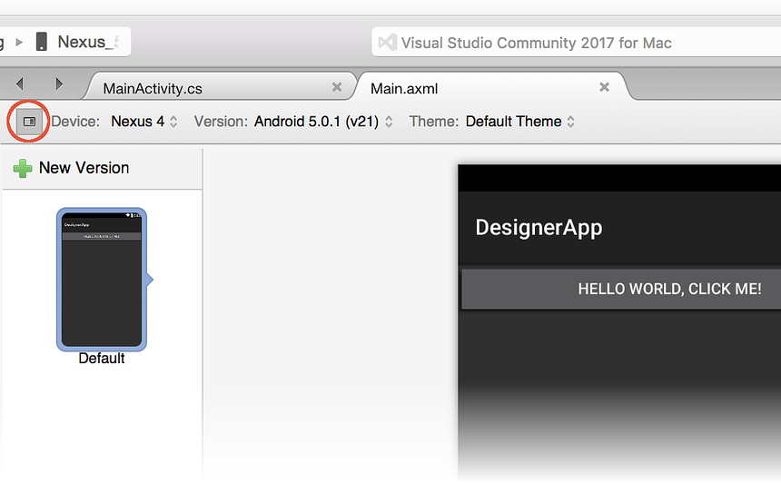](alternative-layout-views-images/xs/01-alt-layout-view-pane.png#lightbox)

When you click the green plus sign next to **New Version**, the 
**Create Layout Variation** dialog opens so that you can select the 
resource qualifiers for this layout variation: 

[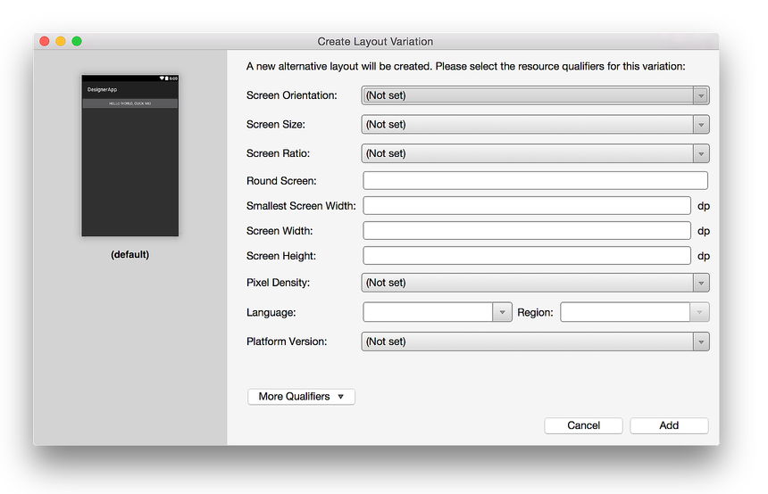](alternative-layout-views-images/xs/02-create-layout-variation.png#lightbox)

In the following example, the resource qualifier for **Screen Orientation** is set
to **Landscape**, and the **Screen Size** is changed to **Large**. This
creates a new layout version named **large-land**:

[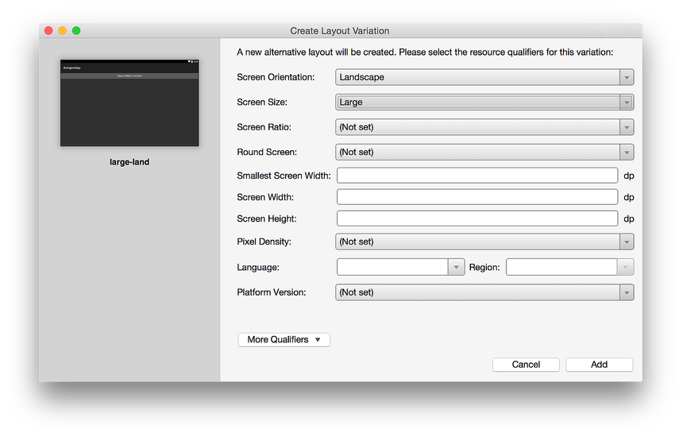](alternative-layout-views-images/xs/03-large-land.png#lightbox)

Note that the preview pane on the left displays the effects of the 
resource qualifier selections. Clicking **Add** creates the alternative 
layout and switches the Designer to that layout. The **Alternative 
Layout View** preview pane indicates which layout is loaded into the 
Designer via a small right pointer as indicated in the following 
screenshot: 

[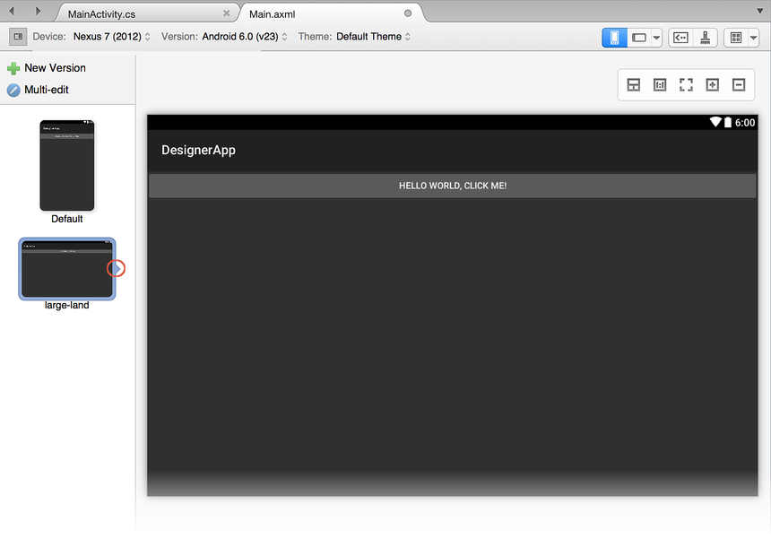](alternative-layout-views-images/xs/04-new-layout.png#lightbox)

## Editing alternative layouts

When you create alternative layouts, it is often desirable to make a
single change that applies to all forked versions of a layout. For
example, you may want to change the button text to yellow in all
layouts. If you have a large number of layouts and you need to
propagate a single change to all versions, maintenance can quickly
become cumbersome and error-prone.

To simplify the maintenance of multiple layout versions, the Designer 
provides a **Multi-edit** mode that propagates your changes across one 
or more layouts. When more than one layout is present, the 
**Multi-edit** icon is displayed: 

[](alternative-layout-views-images/xs/05-multi-layout-icon.png#lightbox)

When you click the **Multi-edit** icon, lines appear that indicate that 
the layouts are linked (as shown below); that is, when you make a 
change to one layout, that change is propagated to any linked layouts. 
You can unlink all layouts by clicking the circled icon indicated in 
the following screenshot: 

[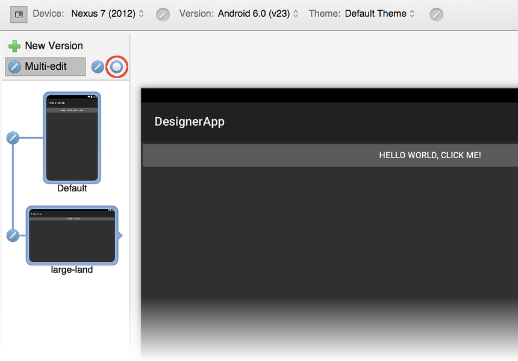](alternative-layout-views-images/xs/06a-linked.png#lightbox)

If you have more than two layouts, you can selectively toggle the edit 
button to the left of each layout preview to determine which layouts 
are linked together. For example, if you want to make a single change 
that propagates to the first and last of three layouts, you would first 
unlink the middle layout as shown here: 

[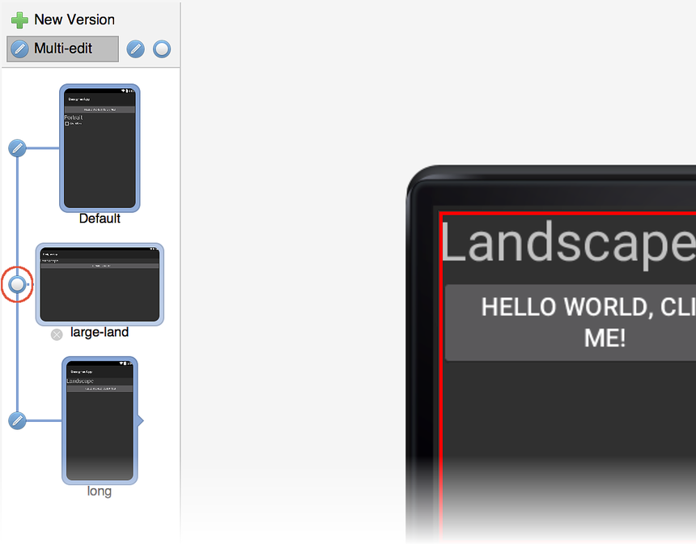](alternative-layout-views-images/xs/06b-multi-linked.png#lightbox)

In this example, a change made to either the **Default** or **long** 
layout will be propagated to other layout but not to the **large-land** 
layout. 

### Multi-Edit example 

In general, when you make a change to one layout, that same change is 
propagated to all other linked layouts. For example, adding a new 
`TextView` widget to the **Default** layout and changing its text 
string to `Portrait` will cause the same change to be made to all 
linked layouts. Here is how it looks in the **Default** layout: 

[](alternative-layout-views-images/xs/07-add-textview.png#lightbox)

The `TextView` is also added to the **large-land** layout view because 
it is linked to the **Default** layout: 

[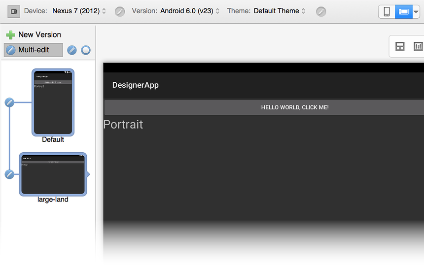](alternative-layout-views-images/xs/08-landscape-textview.png#lightbox)
 
But what if you want to make a change that is local to only one layout 
(that is, you don't want the change to be propagated to any of the 
other layouts)? To do this, you must unlink the layout that you want to 
change before you modify it, as explained next. 

### Making local changes 

Suppose we want both layouts to have the added `TextView`, but we also 
want to change the text string in the **large-land** layout to 
`Landscape` rather than `Portrait`. If we make this change to 
**large-land** while both layouts are linked, the change will propagate 
back to the **Default** layout. Therefore, we must first unlink the two 
layouts before we make the change. When we modify the text in 
**large-land** to `Landscape`, the Designer marks this change with a 
red frame to indicate that the change is local to the **large-land** 
layout and is *not* propagated back to the **Default** layout: 

[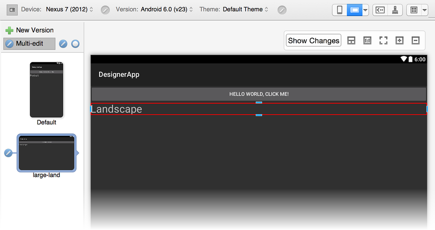](alternative-layout-views-images/xs/09-local-change.png#lightbox)

When you click the **Default** layout to view it, the `TextView` text 
string is still set to `Portrait`. 

## Handling conflicts 

If you decide to change the color of the text in the **Default** layout 
to green, you'll see a warning icon appear on the linked layout. 
Clicking that layout opens the layout to reveal the conflict. The 
widget that caused the conflict is highlighted with a red frame and the 
following message is displayed: *Recent changes have caused conflicts 
in this alternative layout*. 

[](alternative-layout-views-images/xs/10-conflict.png#lightbox)

A *conflict box* is displayed on the right of the widget to explain the 
conflict: 

[](alternative-layout-views-images/xs/11-warning.png#lightbox)

The conflict box shows the list of properties that have changed and it 
lists their values. Clicking **Ignore Conflict** applies the property 
change only to this widget. Clicking **Apply** applies the property 
change to this widget as well as to the counterpart widget in the linked 
**Default** layout. If all property changes are applied, the conflict 
is automatically discarded. 

### View group conflicts 

Property changes are not the only source of conflicts. Conflicts
can be detected when inserting or removing widgets. For example,
when the **large-land** layout is unlinked from the **Default**
layout, and the `TextView` in the **large-land** layout is dragged
and dropped above the `Button`, the Designer marks the
moved widget to indicate the conflict:

[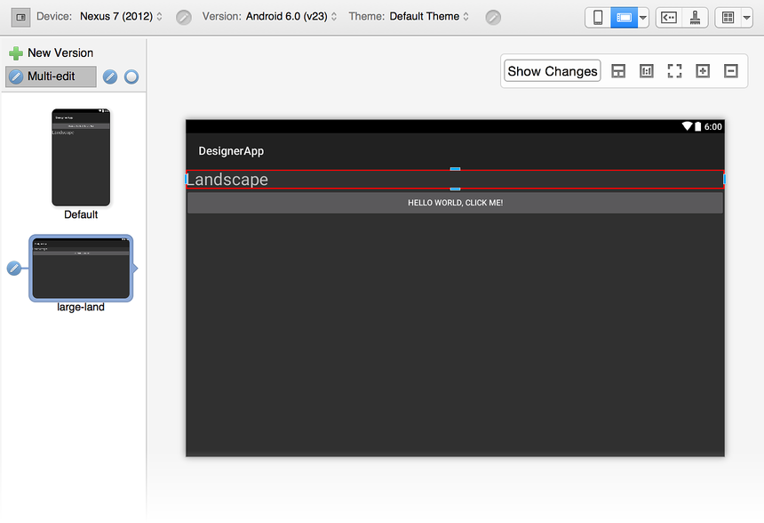](alternative-layout-views-images/xs/12-view-group-conflict.png#lightbox)
 
However, there is no marker on the `Button`. Although the position of 
the `Button` has changed, the `Button` shows no applied changes that 
are specific to the **large-land** configuration. 

If a `CheckBox` is added to the **Default** layout, another conflict is 
generated, and a warning icon is displayed over the **large-land** 
layout: 

[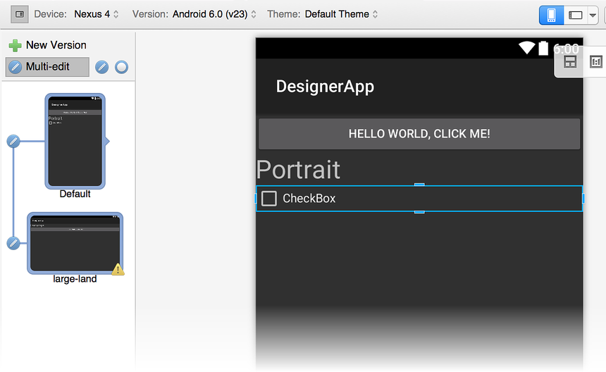](alternative-layout-views-images/xs/13-checkbox-conflict.png#lightbox)
 
Clicking the **large-land** layout reveals the conflict. The 
following message is displayed: *Recent changes have caused conflicts 
in this alternative layout*. 

[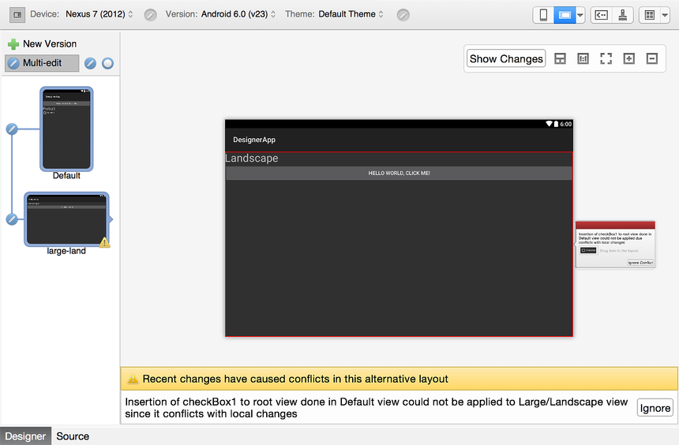](alternative-layout-views-images/xs/14-alt-layout-conflict.png#lightbox)
 
In addition, the conflict box displays the following message:

[](alternative-layout-views-images/xs/15-conflict-message.png#lightbox)

Adding the `CheckBox` causes a conflict because the **large-land** layout
has changes in the `LinearLayout` that contains it. However, in this
case the conflict box displays the widget that was just inserted into
the **Default** layout (the `CheckBox`).

If you click **Ignore Conflict**, the Designer resolves the conflict, 
allowing the widget displayed in the conflict box to be dragged and 
dropped into the layout where the widget is missing (in this case, the 
**large-land** layout): 

[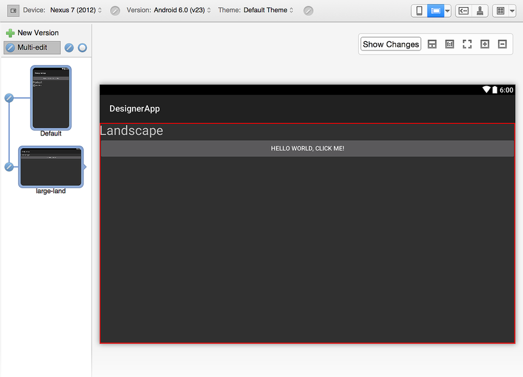](alternative-layout-views-images/xs/16-resolved-group-conflict.png#lightbox)
 
As seen in the previous example with the `Button`, the `CheckBox` does not
have a red change marker because only the `LinearLayout` has changes that
were applied in the **large-land** layout.


-----


### Conflict persistence

Conflicts are persisted in the layout file as XML comments, as shown
here:

```xml
<!-- Widget Inserted Conflict | id:__root__ | @+id/checkBox1 -->
```

Therefore, when a project is closed and reopened, all the conflicts will
still be there &ndash; even the ones that have been ignored.


