# Designer Basics

_This topic introduces Designer features, explains how to launch the Designer, describes the Design Surface, and details how to use the Properties pane to edit widget properties._

## Launching the Designer

The Designer is launched automatically when a layout is created, or it
can be launched by double-clicking an existing .axml file. For example,
double-clicking **Main.axml** in the **Resources > Layout** folder will
load the Designer as shown below:

# [Visual Studio](#tab/vswin)

[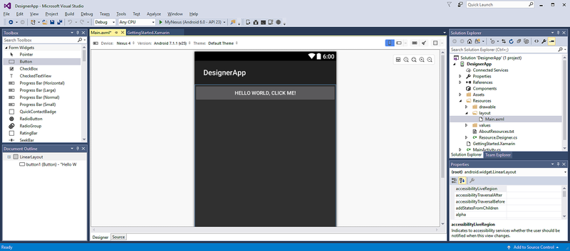](designer-basics-images/vs/01-open-designer.png#lightbox)

# [Visual Studio for Mac](#tab/vsmac)

[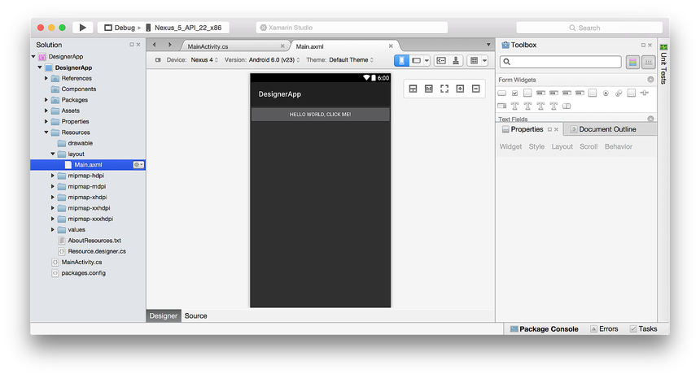](designer-basics-images/xs/01-open-designer.png#lightbox)

-----

# [Visual Studio](#tab/vswin)

Likewise, you can add a new layout by right-clicking the **layout**
folder in the **Solution Explorer** and selecting **Add > New Item... > Android Layout**:

[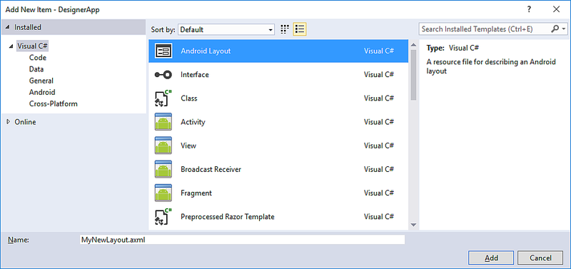](designer-basics-images/vs/02-add-new-layout.png#lightbox)

# [Visual Studio for Mac](#tab/vsmac)

Likewise, you can add a new layout by right-clicking the **layout**
folder in the **Solution Pad** and selecting **Add > New File > Android > Layout**:

[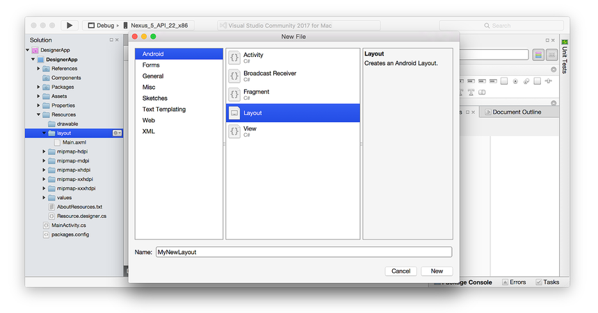](designer-basics-images/xs/02-add-new-layout.png#lightbox)

-----

This creates a new .axml file and loads it onto the Design Surface.

## Designer Features

The Designer is composed of several sections that support its various
features, as shown in the following screenshot:

# [Visual Studio](#tab/vswin)

[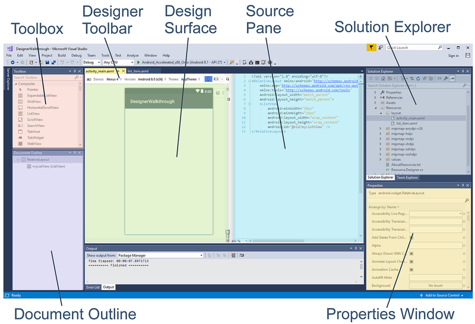](designer-basics-images/vs/03-designer-features.png#lightbox)

# [Visual Studio for Mac](#tab/vsmac)

[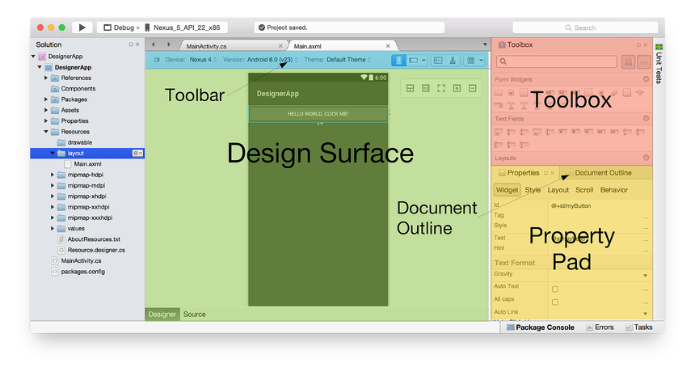](designer-basics-images/xs/03-designer-features.png#lightbox)

-----

When you edit a layout in the Designer, you use the following features
to create and shape your design:

# [Visual Studio](#tab/vswin)

-   **Design Surface** &ndash; Facilitates the visual construction of
    the user interface by giving you an editable representation of how
    the layout will appear on the device.

-   **Toolbar** &ndash; Displays a list of selectors: **Device**,
    **Version**, **Theme**, layout configuration, and Action Bar
    settings. The Toolbar also includes icons for launching the Theme
    Editor and for enabling the Material Design Grid.

-   **Toolbox** &ndash; Provides a list of widgets and layouts that you
    can drag and drop onto the Design Surface.

-   **Properties Window** &ndash; Lists the properties of the selected
    widget for viewing and editing.

-   **Document Outline** &ndash; Displays the tree of widgets that
    compose the layout. You can click an item in the tree to cause it
    to be selected in the Designer. Also, clicking an item in the tree
    loads the item's properties into the Properties window.

# [Visual Studio for Mac](#tab/vsmac)

-   **Design Surface** &ndash; Facilitates the visual construction of
    the user interface by giving you an editable representation of how
    the layout will appear on the device.

-   **Toolbar** &ndash; Displays a list of selectors: **Device**,
    **Version**, **Theme**, layout configuration, and Action Bar
    settings. The Toolbar also includes icons for launching the Theme
    Editor and for enabling the Material Design Grid.

-   **Toolbox** &ndash; Provides a list of widgets and layouts that you
    can drag and drop onto the Design Surface.

-   **Property Pad** &ndash; Lists the properties of the selected
    widget for viewing and editing.

-   **Document Outline** &ndash; Displays the tree of widgets that
    compose the layout. You can click an item in the tree to cause it
    to be selected in the Designer. Also, clicking an item in the tree
    loads the item's properties into the Property Pad.

-----

## Toolbar

The Toolbar (positioned above the Design Surface) presents
configuration selectors and tool menus:

# [Visual Studio](#tab/vswin)

[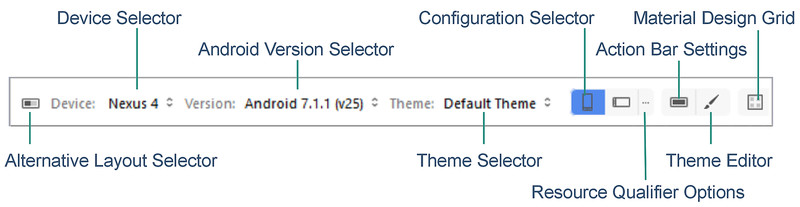](designer-basics-images/vs/04-toolbar.png#lightbox)

# [Visual Studio for Mac](#tab/vsmac)

[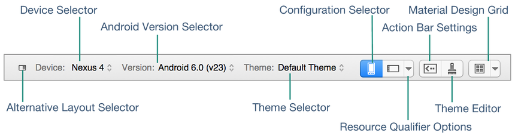](designer-basics-images/xs/04-toolbar.png#lightbox)

-----

The Toolbar provides access to the following features:

-   **Alternative Layout Selector** &ndash; Allows you to select from
    different layout versions.

-   **Device Selector** &ndash; Defines a set of qualifiers associated
    with a particular device such as screen size, resolution, and
    keyboard availability. You can also add and delete new devices.

-   **Android Version Selector** &ndash; The Android version that the
    layout is targeting. The Designer will render the layout according
    to the selected Android version.

-   **Theme Selector** &ndash; Selects the UI theme for the layout.

-   **Configuration Selector** &ndash; Selects the device configuration,
    such as *portrait* or *landscape*.

-   **Resource Qualifier Options** &ndash; Opens a dialog that
    presents drop-down menus for selecting *Language*, *UI Mode*, *Night
    Mode*, and *Round Screen* options.

-   **Action Bar Settings** &ndash; Configures the Action Bar settings
    for the layout.

-   **Theme Editor** &ndash; Opens the *Theme Editor*, which makes it
    possible for you to customize elements of the selected theme.

-   **Material Design Grid** &ndash; Enables or disables the
    *Material Design Grid*. The drop-down menu item adjacent to
    the Material Design Grid opens a dialog that enables you
    to customize the grid.

Each of these features is explained in more detail in these topics:

[Resource Qualifiers and Visualization Options](~/android/user-interface/android-designer/resource-qualifiers.md)
provides detailed information about the **Device Selector**, **Android
Version Selector**, **Theme Selector**, **Configuration Selector**, **Resource
Qualifications Options**, and **Action Bar Settings**.

[Alternative Layout Views](~/android/user-interface/android-designer/alternative-layout-views.md)
explains how to use the **Alternative Layout Selector**.

[Material Design Features](~/android/user-interface/android-designer/material-design-features.md)
provides a comprehensive overview of the **Theme Editor** and the **Material Design Grid**.

## Design Surface

The Designer makes it possible for you to drag and drop widgets from
the toolbox onto the Design Surface. When you interact with widgets in
the Designer (by either adding new widgets or repositioning existing
ones), vertical and horizontal lines are displayed to mark the
available insertion points. In the following example, a new `Button`
widget is being dragged to the Design Surface:

# [Visual Studio](#tab/vswin)

[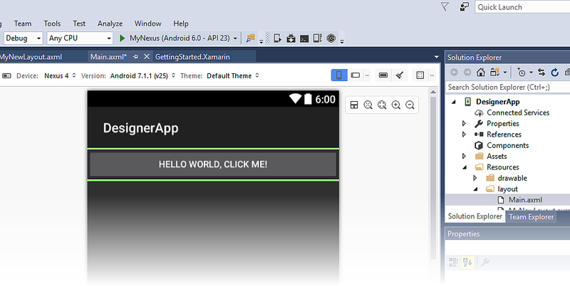](designer-basics-images/vs/05-insertion-points.png#lightbox)

# [Visual Studio for Mac](#tab/vsmac)

[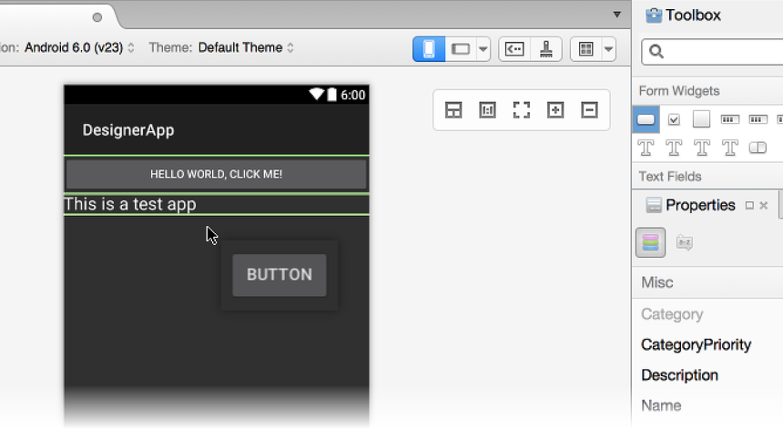](designer-basics-images/xs/05-insertion-points.png#lightbox)

-----

Additionally, widgets can be copied: you can use copy and paste to copy
a widget, or you can drag and drop an existing widget while pressing the
<kbd>Ctrl</kbd> key.

### Context Menu Commands

A context menu is available both in the Design Surface and in the
Document Outline. This menu displays commands that are available for
the selected widget and its container, making it easier for you
to perform operations on containers (which are not always easy to
select on the Design Surface). Here is an example of a context menu:

# [Visual Studio](#tab/vswin)

[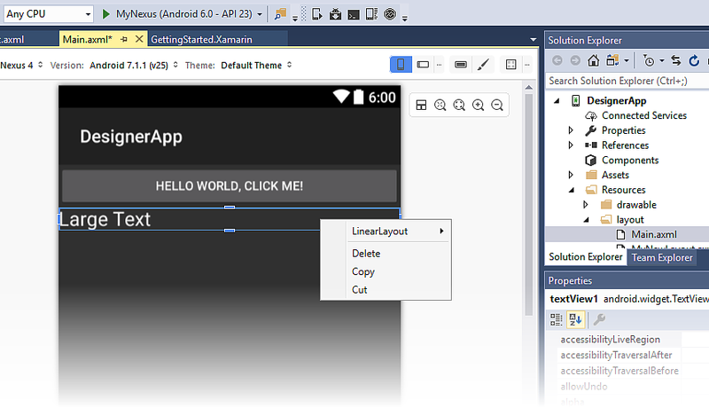](designer-basics-images/vs/06-context-menu.png#lightbox)

In this example, right-clicking a `TextView` opens a context menu that
provides several options:

-   **LinearLayout** &ndash; opens a submenu for editing the `LinearLayout`
    parent of the `TextView`.

-   **Delete**, **Copy**, and **Cut** &ndash; operations that apply to the
    right-clicked `TextView`.

# [Visual Studio for Mac](#tab/vsmac)

[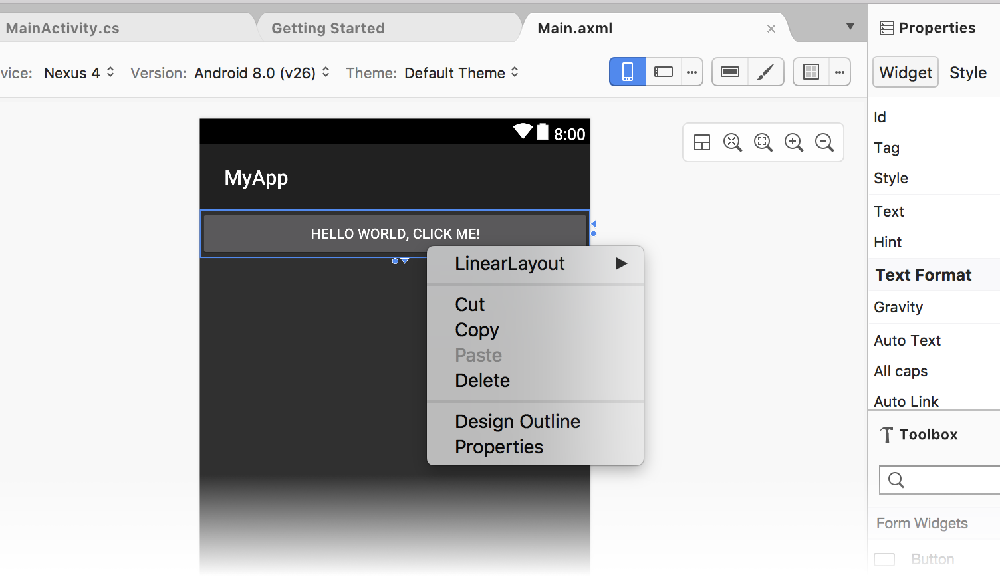](designer-basics-images/xs/06-context-menu.png#lightbox)

In this example, right-clicking a `TextView` opens a context menu that
provides several options:

-   **RelativeLayout** &ndash; opens a submenu for editing the `RelativeLayout`
    parent of the `TextView`.

-   **LinearLayout** &ndash; opens a submenu for editing the `LinearLayout`
    parent of the `TextView`.

-   **Delete**, **Copy**, and **Cut** &ndash; operations that apply to the
    right-clicked `TextView`.

-----

In this example, right-clicking a `TextView` opens a context menu that
provides several options:

-   **LinearLayout** &ndash; opens a submenu for editing the `LinearLayout`
    parent of the `TextView`.

-   **Delete**, **Copy**, and **Cut** &ndash; operations that apply to the
    right-clicked `TextView`.

### Zoom Controls

The Design Surface supports zooming via several controls as shown:

# [Visual Studio](#tab/vswin)

[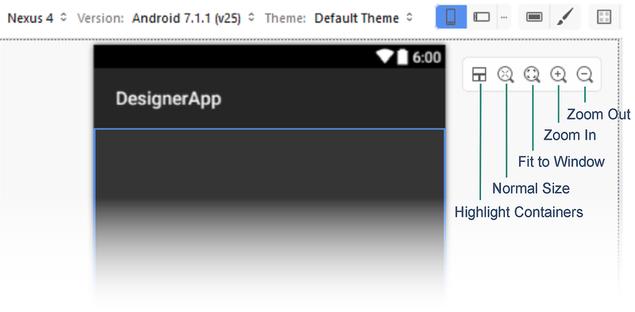](designer-basics-images/vs/07-zoom-controls.png#lightbox)

# [Visual Studio for Mac](#tab/vsmac)

[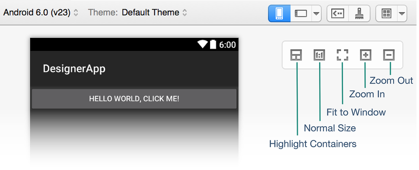](designer-basics-images/xs/07-zoom-controls.png#lightbox)

-----

These controls make it easier to see certain areas of the user
interface in the Designer:

-   **Highlight Containers** &ndash; Highlights containers on the
    Design Surface so that they are easier to locate while zooming in
    and out.

-   **Normal Size** &ndash; Renders the layout pixel-for-pixel so that
    you can see how the layout will look at the resolution of the
    selected device.

-   **Fit to Window** &ndash; Sets the zoom level so that the entire
    layout is visible on the Design Surface.

-   **Zoom In** &ndash; Zooms in incrementally with each click,
    magnifying the layout.

-   **Zoom Out** &ndash; Zooms out incrementally with each click,
    making the layout appear smaller on the Design Surface.

Note that the chosen zoom setting does not affect the user interface of
the application at runtime.

# [Visual Studio](#tab/vswin)

# [Visual Studio for Mac](#tab/vsmac)

## Property Pad

The Designer supports the editing of widget properties through the
**Property Pad**. The properties listed in the Property Pad change
depending on which widget is selected in the Designer surface. When the
`Button` in the previous example is selected, the properties for that
`Button` widget are shown:

-----

# [Visual Studio](#tab/vswin)

## Properties Window

The Designer supports the editing of widget properties through the
**Properties Window**. The properties listed in the Properties window
change depending on which widget is selected on the Design Surface.
When the `Button` in the previous example is selected, the properties
for that `Button` widget are shown:

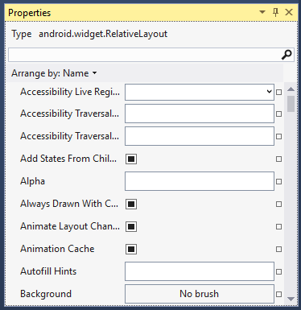

# [Visual Studio for Mac](#tab/vsmac)

## Property Pad Sections

The Property Pad is divided into several sections that group similar
properties together &ndash; this makes it easier to locate properties
of interest:

-   **Widget** &ndash; Main properties of the widget, such as `id`,
    `visibility`, `text`, etc. Properties for managing the widget's
    content are usually placed here.

-   **Style** &ndash; Properties that change the visual appearance of
    the widget, such as `font`, `text color`, `background`, etc.

-   **Layout** &ndash; Properties that set the location and size of the
    widget.

-   **Scroll** &ndash; Scrolling properties.

-   **Behavior** &ndash; Flags that set how the widget behaves.

-----

### Default Values

# [Visual Studio](#tab/vswin)

The properties of most widgets will be blank in the **Properties**
window because their values inherit from the selected Android theme.
The **Properties** window will only show values that are explicitly set
for the selected widget; it will not show values that are inherited
from the theme.

# [Visual Studio for Mac](#tab/vsmac)

The properties of most widgets will be blank in the **Property Pad**
because their values inherit from the selected Android theme. The
**Property Pad** will only show values that are explicitly set for the
selected widget; it will not show values that are inherited from the
theme.

-----

### Referencing Resources

Some properties can reference resources that are defined in files other
than the layout **.axml** file. The most common cases of this type are
`string` and `drawable` resources. However, references can also be
used for other resources, such as `Boolean` values and dimensions.
When a property supports resource references, a browse icon (an
ellipsis, &hellip;) is shown next to the text entry for the property.
This button opens a resource selector when clicked.

# [Visual Studio](#tab/vswin)

For example, the following screenshot shows the resources available
when clicking the ellipsis to the right of the text field for a
`Button` widget in the **Properties** window:

[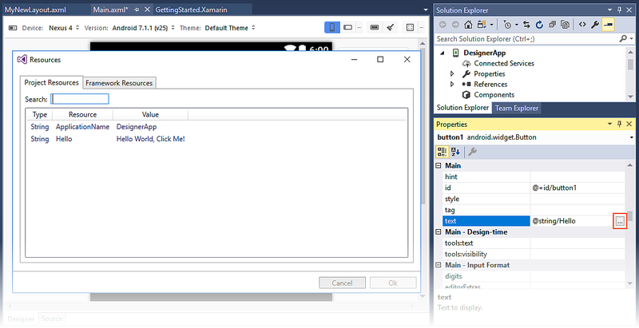](designer-basics-images/vs/09-resources.png#lightbox)

# [Visual Studio for Mac](#tab/vsmac)

For example, the following screenshot shows the resources available
when clicking the ellipsis to the right of the text field for a
`Button` widget in the **Property Pad**:

[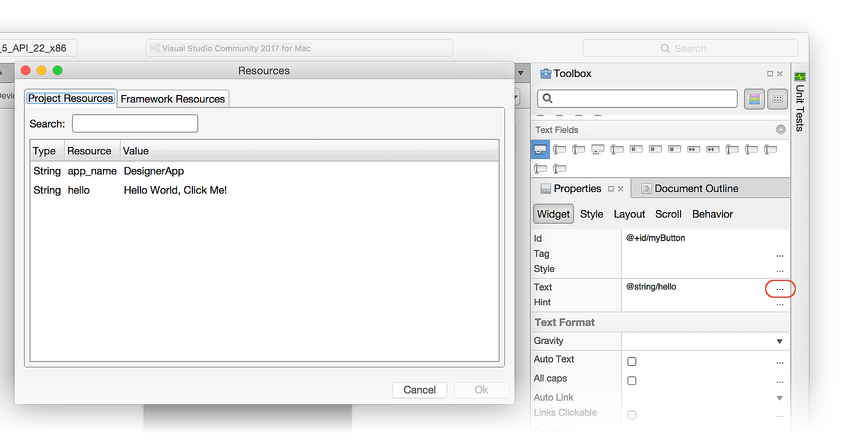](designer-basics-images/xs/09-resources.png#lightbox)

-----

The next example illustrates the resource selector for the `Src`
property of an `ImageView`:

# [Visual Studio](#tab/vswin)

[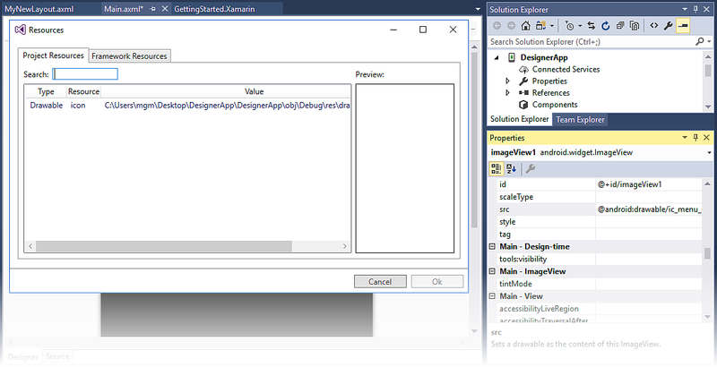](designer-basics-images/vs/10-src-resource.png#lightbox)

# [Visual Studio for Mac](#tab/vsmac)

[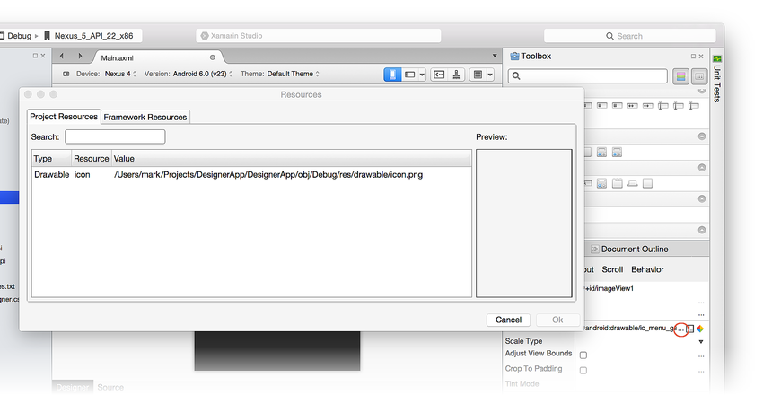](designer-basics-images/xs/10-src-resource.png#lightbox)

-----

### Boolean Property References

# [Visual Studio](#tab/vswin)

*Boolean* properties are normally chosen from a pull-down menu in the
Properties window. You can select a `true` or `false` value, or you can
select a property reference by clicking **Select Resource...**. You can
also directly enter a value such as `true` or `false`.

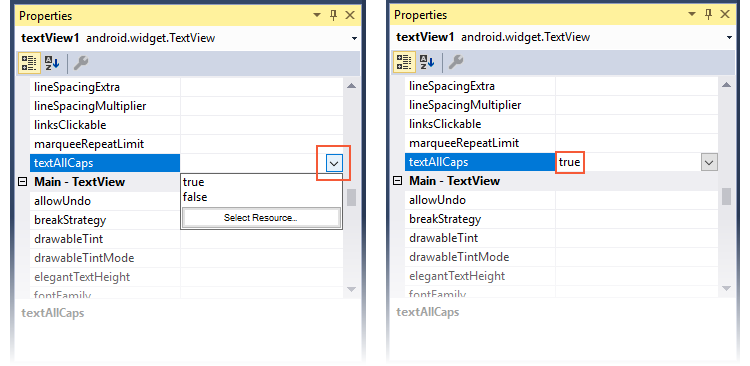

# [Visual Studio for Mac](#tab/vsmac)

*Boolean* properties are normally shown as a check box in the Property
Pad. When a `Boolean` property supports resource references, a small
check box appears next to the property. A checked checkbox means `true`
and an empty box means `false`. You can also directly enter a value
such as `true` or `false`. Hovering your mouse over the input brings up
a small text field icon. You can click on it if you wish to enter the
value manually.

[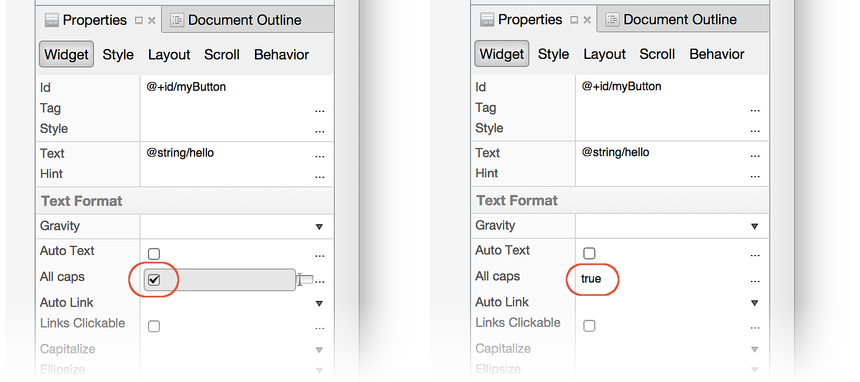](designer-basics-images/xs/12-boolean.png#lightbox)

## Grouped Properties

Some widgets have multi-value properties that are grouped together
(such as `Padding`, for example). These property values are listed in
the **Property Pad** in a single, expandable row. Some of these
properties can be edited directly in the grouped row, such as the
`Padding` property shown below:

[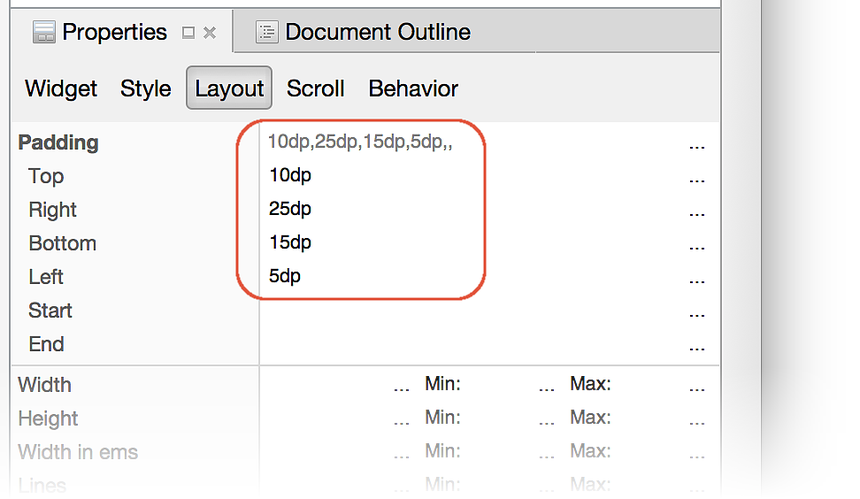](designer-basics-images/xs/13-padding-property.png#lightbox)

-----

## Editing Properties Inline

The Android Designer supports direct editing of certain properties on
the Design Surface (so you don't have to search for these properties in
the property list). Properties that can be directly edited include
text, margin, and size.

### Text

The text properties of some widgets (such as `Button` and `TextView`),
can be edited directly on the Design Surface. Double-clicking a
widget will put it into edit mode, as shown below:

# [Visual Studio](#tab/vswin)

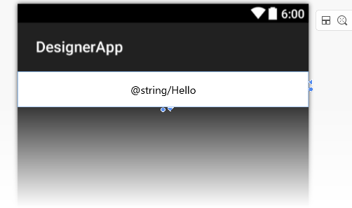

# [Visual Studio for Mac](#tab/vsmac)

[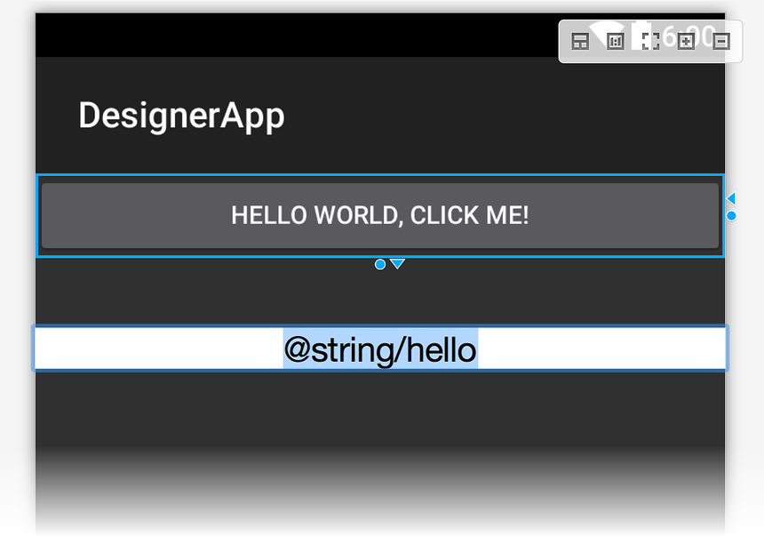](designer-basics-images/xs/14-text-resource.png#lightbox)

-----

You can enter a new text value or you can enter a new resource
string. In the following example, the `@string/hello` resource is being
replaced with the text, `CLICK THIS BUTTON`:

# [Visual Studio](#tab/vswin)

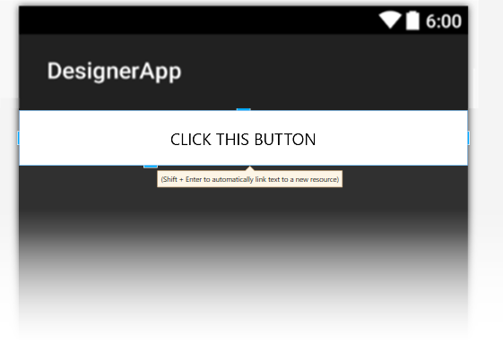

# [Visual Studio for Mac](#tab/vsmac)

[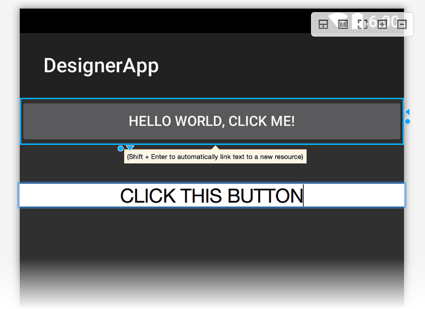](designer-basics-images/xs/15-shift-enter-resource.png#lightbox)

-----

This change is stored in the widget's `text` property; it does not
modify the value assigned to the `@string/hello` resource.
When you key in a new text string, you can press <kbd>Shift</kbd> +
<kbd>Enter</kbd> to automatically link the entered text to a new
resource.

### Margin

When you select a widget, the Designer displays handles that allow you
to change the size or margin of the widget interactively. Clicking the
widget while it is selected toggles between margin-editing mode and
size-editing mode.

When you click a widget for the first time, margin handles are
displayed. If you move the mouse to one of the handles, the Designer
displays the property that the handle will change (as shown
below for the `layout_marginLeft` property):

# [Visual Studio](#tab/vswin)

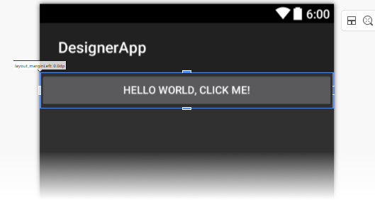

# [Visual Studio for Mac](#tab/vsmac)

[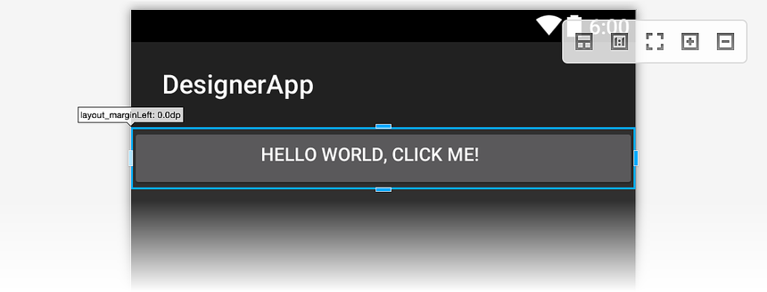](designer-basics-images/xs/16-margin-handles.png#lightbox)

-----

If a margin has already been set, dotted lines are displayed,
indicating the space that the margin occupies:

# [Visual Studio](#tab/vswin)

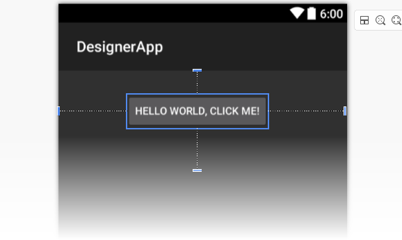

# [Visual Studio for Mac](#tab/vsmac)

[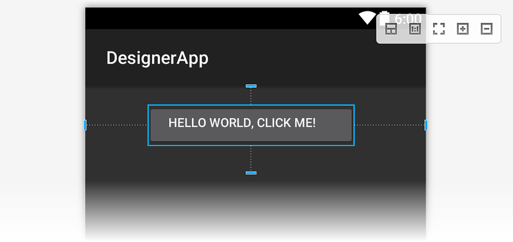](designer-basics-images/xs/17-margins-set.png#lightbox)

-----

### Size

As mentioned earlier, you can switch to size-editing mode by clicking a
widget while it is already selected. Click the triangular handle to
set the size for the indicated dimension to `wrap_content`:

# [Visual Studio](#tab/vswin)

# [Visual Studio for Mac](#tab/vsmac)

[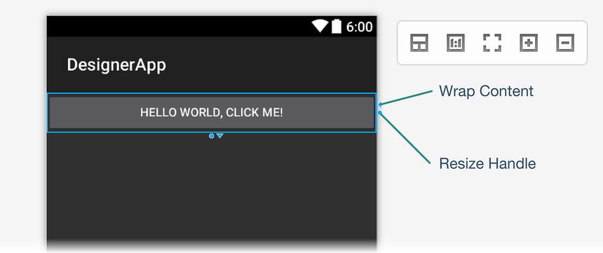](designer-basics-images/xs/18-wrap-content.png#lightbox)

-----

Clicking the **Wrap Content** handle shrinks the widget in that dimension
so that is no larger than necessary to wrap the enclosed content. In
this example, the button text shrinks horizontally as shown in the next
screenshot.

When the size value is set to **Wrap Content**, the Designer displays a
triangular handle pointing in the opposite direction for changing the
size to `match_parent`:

# [Visual Studio](#tab/vswin)

# [Visual Studio for Mac](#tab/vsmac)

[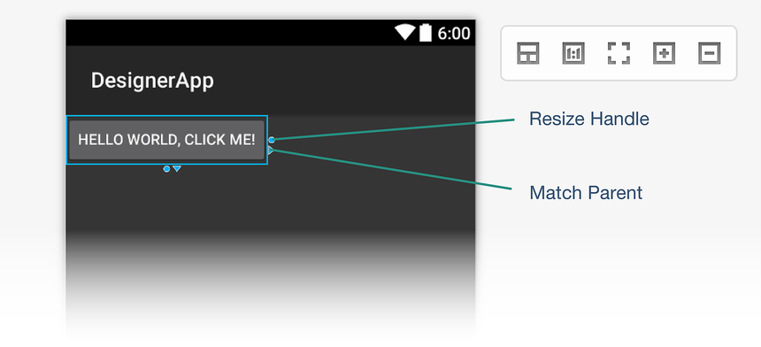](designer-basics-images/xs/19-match-parent.png#lightbox)

-----

Clicking the **Match Parent** handle restores the size in that
dimension so that it is the same as the parent widget.

Also, you can drag the circular resize handle (as shown in the above
screenshots) to resize the widget to an arbitrary `dp` value. When you
do so, both **Wrap Content** and **Match Parent** handles are presented
for that dimension:

# [Visual Studio](#tab/vswin)

# [Visual Studio for Mac](#tab/vsmac)

[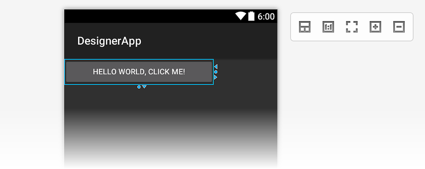](designer-basics-images/xs/20-resize-dp.png#lightbox)

-----

Not all containers allow editing the `Size` of a widget. For example,
notice that in the screenshot below with the `LinearLayout` selected,
the resize handles do not appear:

# [Visual Studio](#tab/vswin)

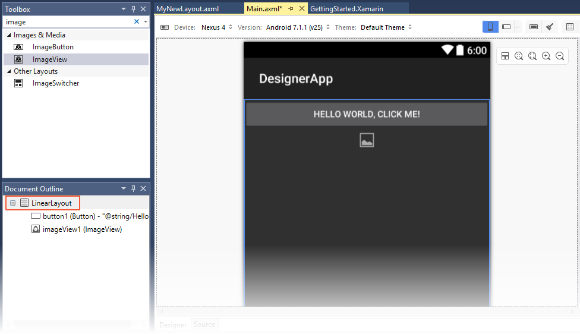

# [Visual Studio for Mac](#tab/vsmac)

[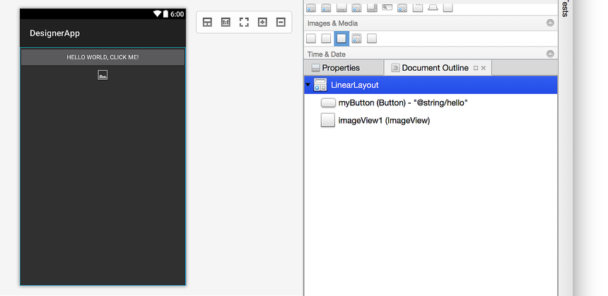](designer-basics-images/xs/20-no-resize-handles.png#lightbox)

-----

## Document Outline

The **Document Outline** displays the widget hierarchy of the layout.
In the following example, the containing `LinearLayout` widget is
selected:

# [Visual Studio](#tab/vswin)

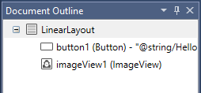

# [Visual Studio for Mac](#tab/vsmac)

[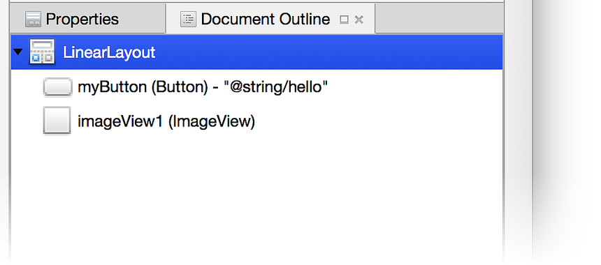](designer-basics-images/xs/22-outline-view.png#lightbox)

-----

The outline of the selected widget (in this case, a `LinearLayout`) is
also highlighted on the Design Surface. The selected widget in the
Document Outline stays in sync with its counterpart on the Design
Surface. This is useful for selecting view groups, which are not always
easy to select on the Design Surface.

The Document Outline supports copy and paste, or you can use drag and
drop. Drag and drop is supported from the Document Outline to the
Design Surface as well as from the Design Surface to the Document
Outline. Also, right-clicking an item in the Document Outline displays
the context menu for that item (the same context menu that appears when
you right-click that same widget on the Design Surface).
