# Using the Android Designer

_This topic is a walkthrough of the Xamarin.Android Designer. It demonstrates how to create a user interface for a small color browser app; this user interface is created entirely in the Designer._


## Overview

Android user interfaces can be created declaratively by using XML files
or programmatically by writing code. The Xamarin.Android Designer
allows developers to create and modify declarative layouts visually,
without having to deal with the tedium of hand-editing XML files. The
Designer also provides real-time feedback, which lets the developer
evaluate UI changes without having to redeploy the application to a
device or to an emulator. This can speed up Android UI development
tremendously. In this article, we present a walkthrough that shows how
to use the Xamarin.Android Designer to visually create a user
interface.


## Walkthrough

The objective of this walkthrough is to use the Android Designer to
create a user interface for an example color browser app that presents
a list of colors, their names, and their RGB values. We'll look at how
to add widgets to the Design Surface as well as how to lay out these
widgets visually. After that, we'll explain how to modify widgets
interactively on the Design Surface or by using the Designer's
**Property Pad**. Finally, we'll see how our design looks when we run
the app.

Let's get started!


### Creating a New Project

The first step is to create a new Xamarin.Android project.

# [Visual Studio](#tab/vswin)

Launch Visual Studio and click **New Project...** then choose the
**Visual C\# > Android > Blank App (Android)** template:

[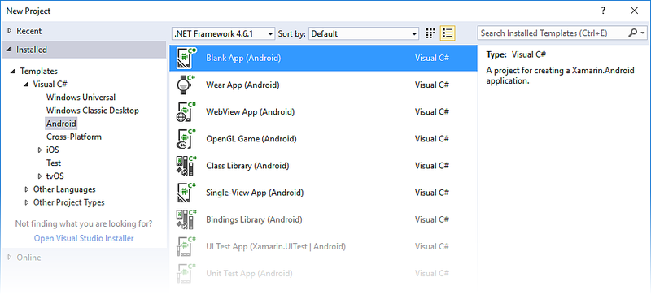](designer-walkthrough-images/vs/01-android-app.png#lightbox)

# [Visual Studio for Mac](#tab/vsmac)

Launch Visual Studio for Mac and click **New Solution...**. Choose the
**Android App** template and click **Next**:

[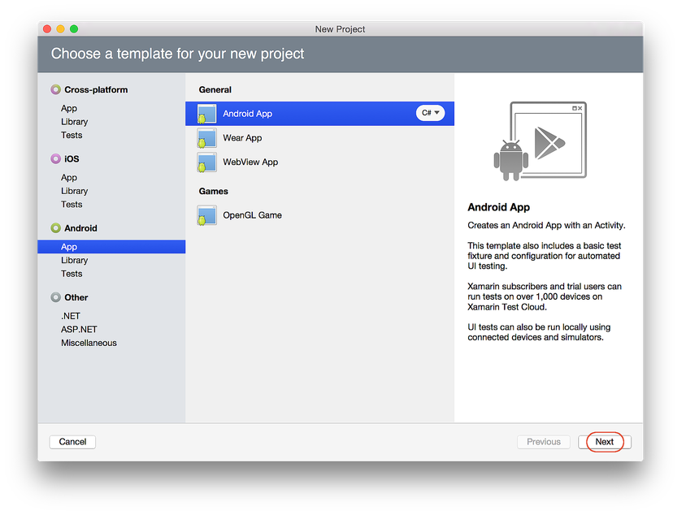](designer-walkthrough-images/xs/01-android-app.png#lightbox)

-----

# [Visual Studio](#tab/vswin)

Name the new app **DesignerWalkthrough** and click **OK**.

[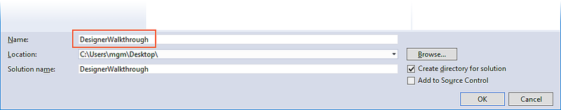](designer-walkthrough-images/vs/02-name-app.png#lightbox)

# [Visual Studio for Mac](#tab/vsmac)

Name the new app **DesignerWalkthrough**. Under **Target Platforms**,
select **Latest and Greatest** and click **Next**:

[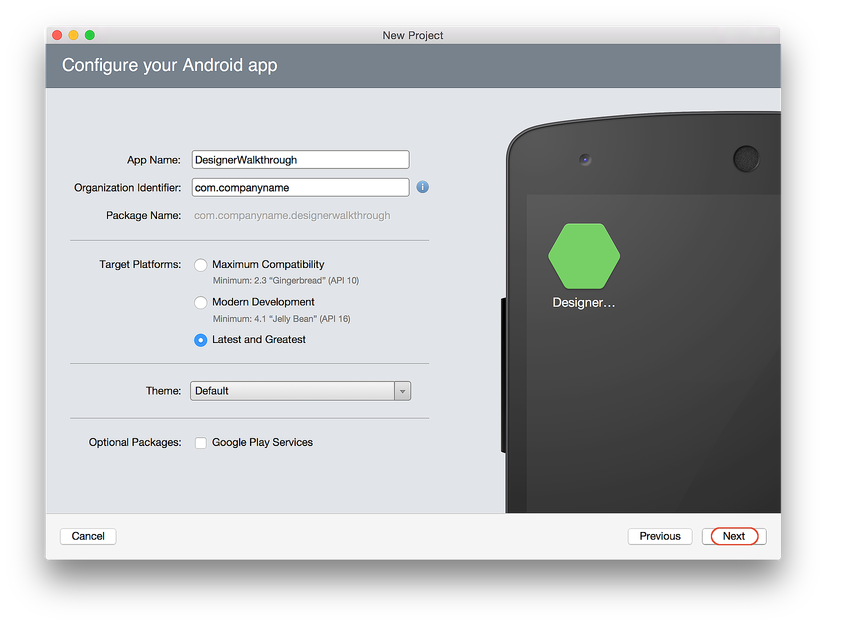](designer-walkthrough-images/xs/02-designer-walkthrough.png#lightbox)

In the next dialog screen, click **Create**.

-----


### Adding a Layout

Let's create a **LinearLayout** that we will use to hold our user
interface elements.

# [Visual Studio](#tab/vswin)

In Visual Studio, right-click **Resources/layout** in the **Solution
Explorer** and select **Add > New Item...**. In the **Add New Item**
dialog, select **Android Layout**. Name the file **ListItem.axml** and
click **Add**:

[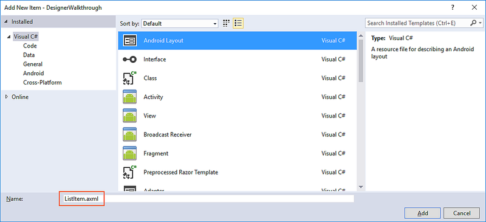](designer-walkthrough-images/vs/03-new-layout.png#lightbox)

The new **ListItem** layout is displayed in the Designer:

[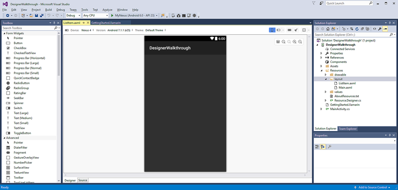](designer-walkthrough-images/vs/04-designer-view.png#lightbox)

Click the **Source** tab at the bottom of the Designer to view the XML
source for this layout:

[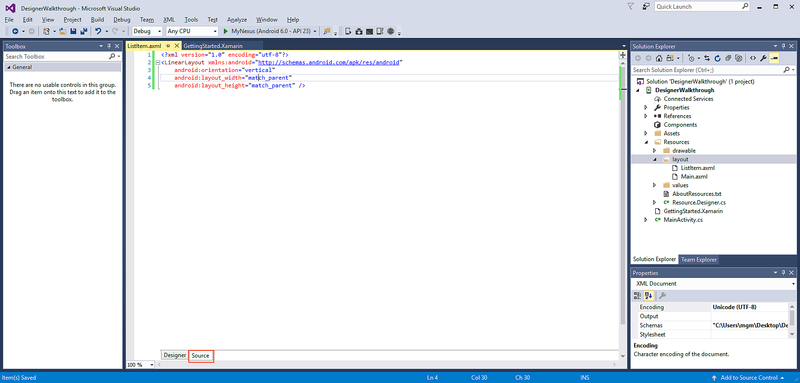](designer-walkthrough-images/vs/05-designer-xml.png#lightbox)

From the **View** menu, click **Other Windows > Document Outline** to
open the **Document Outline**. The **Document Outline** shows that the
layout currently contains a single **LinearLayout** widget:

[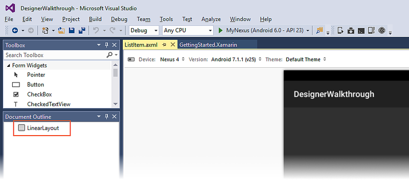](designer-walkthrough-images/vs/06-document-outline.png#lightbox)

# [Visual Studio for Mac](#tab/vsmac)

In Visual Studio for Mac, right-click **Resources/layout** in the **Solution**
pad and select **Add > New File...**. In the **New File** dialog,
select **Android > Layout**. Name the file **ListItem** and click
**New**:

[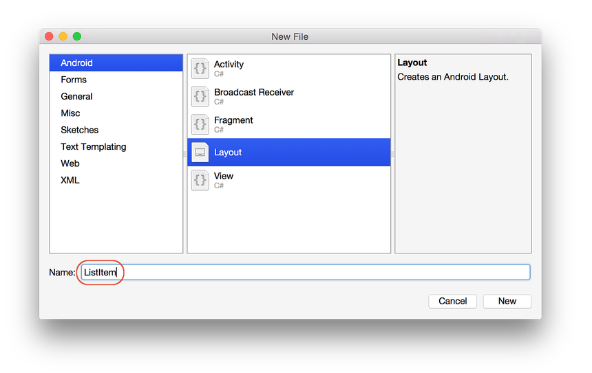](designer-walkthrough-images/xs/03-new-layout.png#lightbox)

The new **ListItem** layout is displayed in the Designer:

[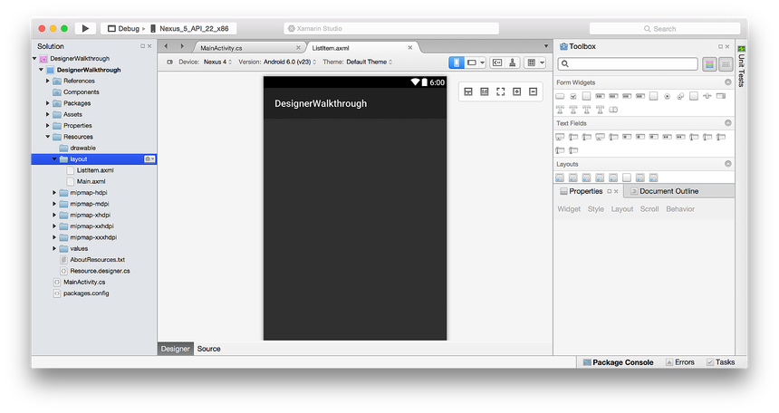](designer-walkthrough-images/xs/04-designer-view.png#lightbox)

Click the **Source** tab at the bottom of the Designer to view the XML
source for this layout. When you click the **Document Outline** tab on
the right, it shows that the layout currently contains a single
**LinearLayout** widget:

[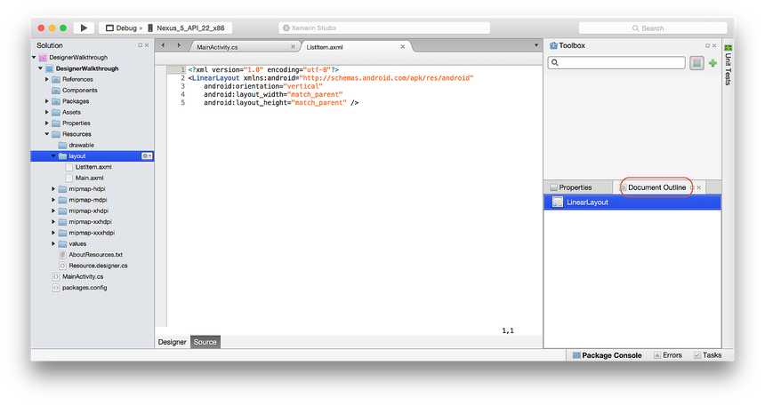](designer-walkthrough-images/xs/05-designer-xml.png#lightbox)

-----


### Creating the List Item User Interface

Next, we are going to create the user interface for the color browser app.
Click the **Designer** tab to return to the Design Surface.
In the **Toolbox**, scroll down to the **Images & Media** section and
peruse each item until you locate an *ImageView*:

# [Visual Studio](#tab/vswin)

[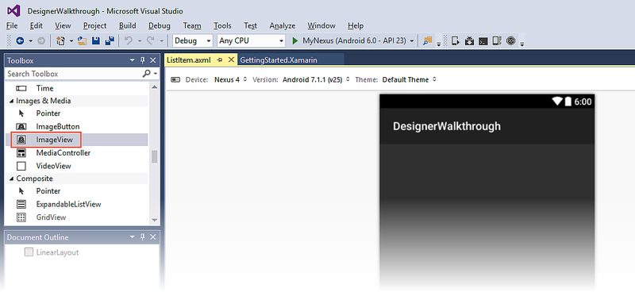](designer-walkthrough-images/vs/07-locate-imageview.png#lightbox)

# [Visual Studio for Mac](#tab/vsmac)

[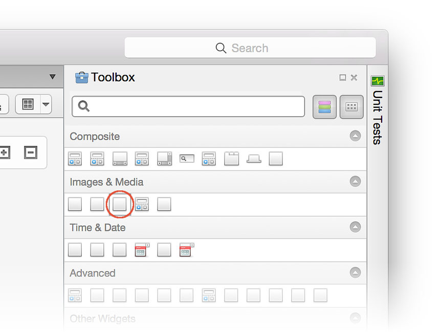](designer-walkthrough-images/xs/06-locate-imageview.png#lightbox)

-----

Alternately, you can enter *ImageView* into the search bar to locate
the `ImageView` widget:

# [Visual Studio](#tab/vswin)

[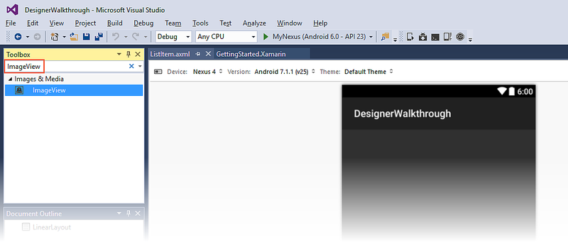](designer-walkthrough-images/vs/08-imageview-search.png#lightbox)

# [Visual Studio for Mac](#tab/vsmac)

[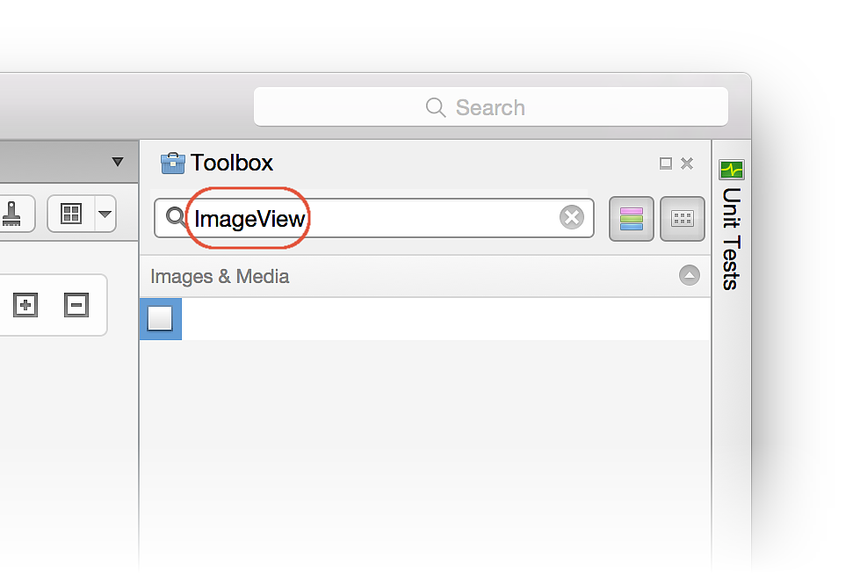](designer-walkthrough-images/xs/07-imageview-search.png#lightbox)

-----

Drag this `ImageView` onto the Design Surface:

# [Visual Studio](#tab/vswin)

[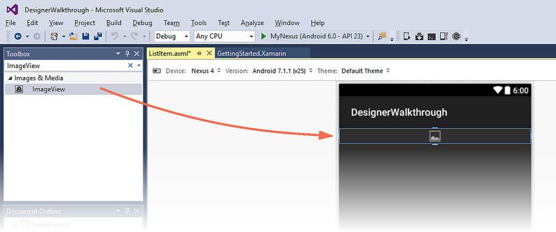](designer-walkthrough-images/vs/09-imageview-on-canvas.png#lightbox)

# [Visual Studio for Mac](#tab/vsmac)

[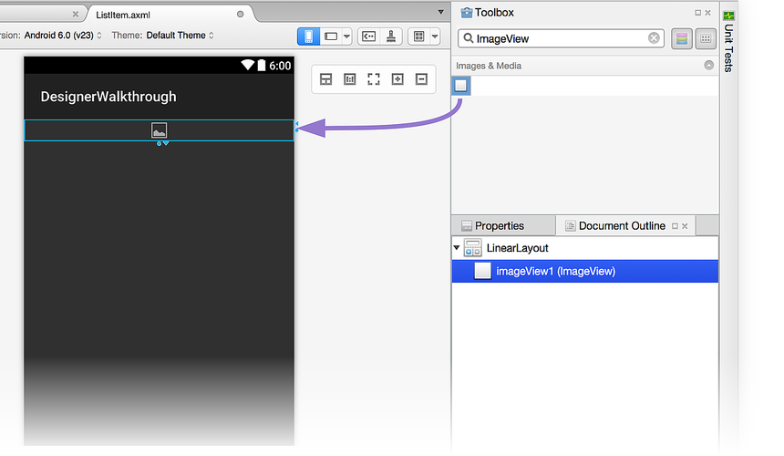](designer-walkthrough-images/xs/08-imageview-on-canvas.png#lightbox)

-----

This `ImageView` will be used to display a color swatch in our
color browser app.

Next, drag a `LinearLayout (Vertical)` widget from the **Toolbox**
into the Designer. Note that a blue outline indicates the boundaries of the
added `LinearLayout`, and the **Document Outline** shows that it resides
directly below `imageView1 (ImageView)`:

# [Visual Studio](#tab/vswin)

[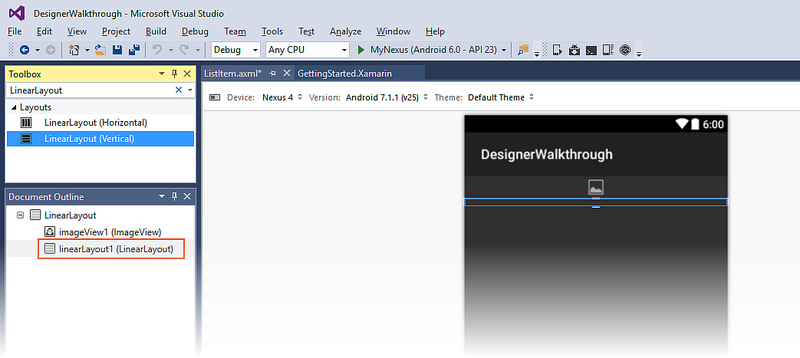](designer-walkthrough-images/vs/10-blue-outline.png#lightbox)

# [Visual Studio for Mac](#tab/vsmac)

[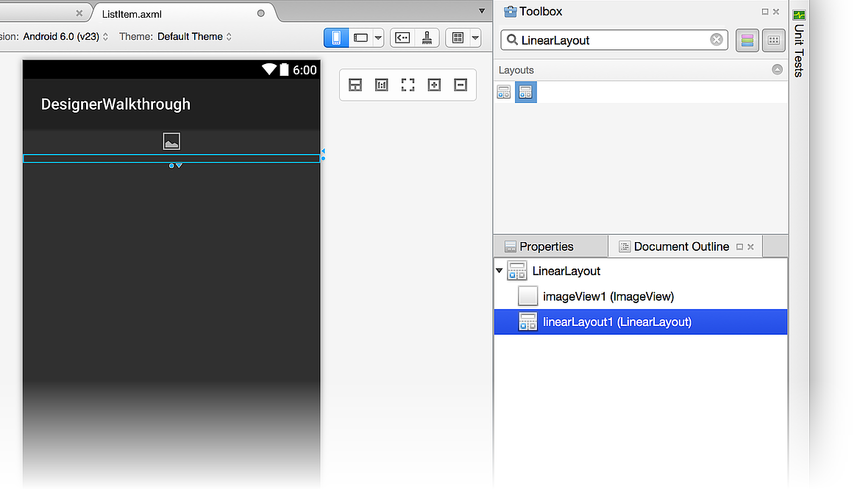](designer-walkthrough-images/xs/10-blue-outline.png#lightbox)

-----

When you select the `ImageView` in the Designer, the blue outline moves
to surround the `ImageView`; in the **Document Outline**, the selection
moves to `imageView1 (ImageView)`:

# [Visual Studio](#tab/vswin)

[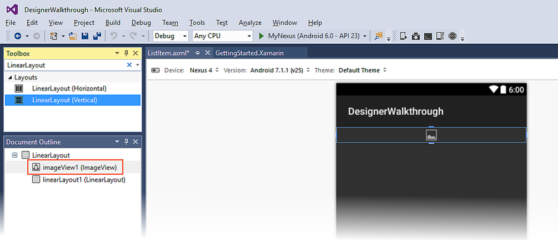](designer-walkthrough-images/vs/11-select-imageview.png#lightbox)

# [Visual Studio for Mac](#tab/vsmac)

[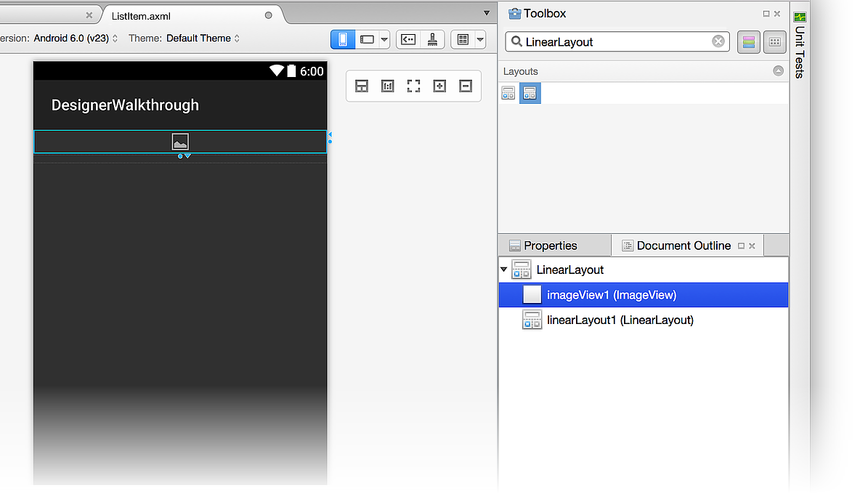](designer-walkthrough-images/xs/11-select-imageview.png#lightbox)

-----

Next, drag a `Text (Large)` widget from the **Toolbox** into the
newly-added `LinearLayout`. Notice that the Designer uses green
highlights to indicate where the new widget will be inserted:

# [Visual Studio](#tab/vswin)

[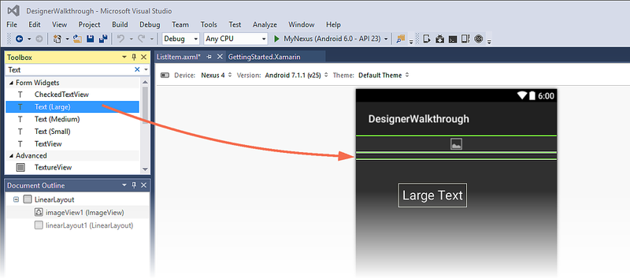](designer-walkthrough-images/vs/12-green-highlight.png#lightbox)

# [Visual Studio for Mac](#tab/vsmac)

[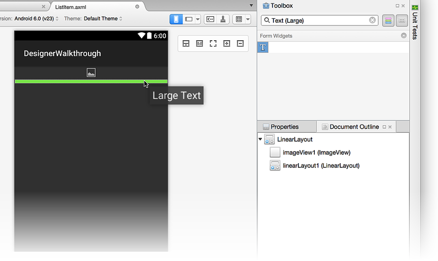](designer-walkthrough-images/xs/12-green-highlight.png#lightbox)

-----

Next, add a `Text (Small)` widget below the `Text (Large)` widget:

# [Visual Studio](#tab/vswin)

[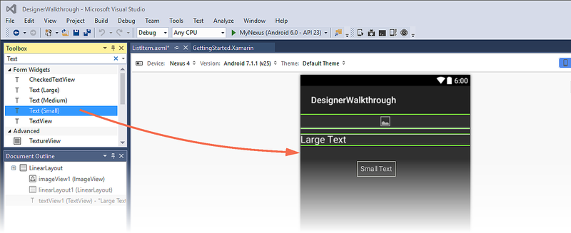](designer-walkthrough-images/vs/13-add-small-text.png#lightbox)

# [Visual Studio for Mac](#tab/vsmac)

[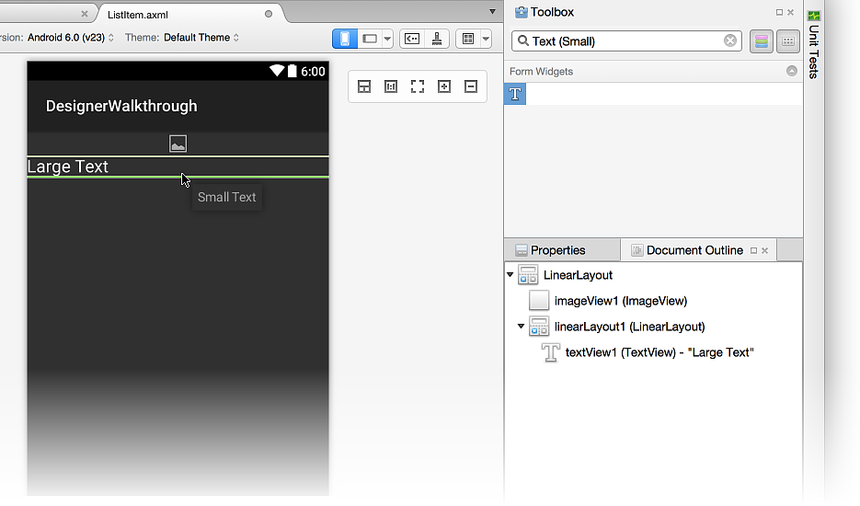](designer-walkthrough-images/xs/13-add-small-text.png#lightbox)

-----

At this point, the Designer should resemble the following screenshot:

# [Visual Studio](#tab/vswin)

[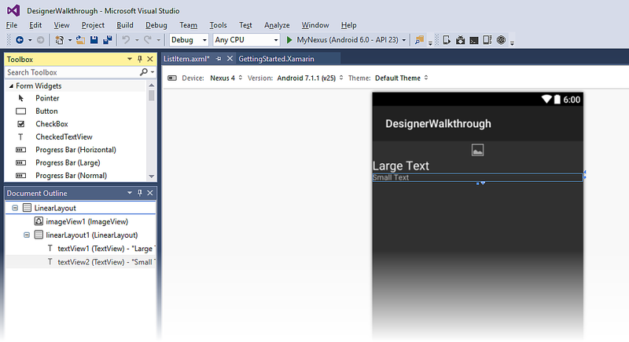](designer-walkthrough-images/vs/14-raw-layout.png#lightbox)

# [Visual Studio for Mac](#tab/vsmac)

[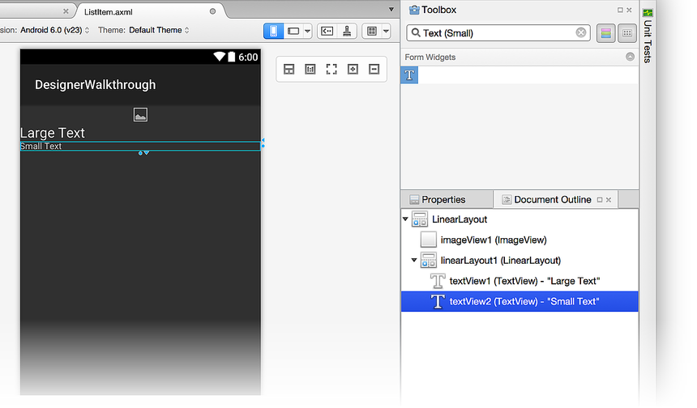](designer-walkthrough-images/xs/14-raw-layout.png#lightbox)

-----

If the two `textView` widgets are not inside `linearLayout1`, you can
drag them to `linearLayout1` in the **Document Outline** and position
them so they appear as shown in the previous screenshot (indented under
`linearLayout1`).


### Arranging the User Interface

Let's modify the UI to display the `ImageView` on the left, with the
two `TextView` widgets stacked to the right of the `ImageView`.

# [Visual Studio](#tab/vswin)

1.  Select the `ImageView`.

2.  In the **Properties window**, click the **Categorized** sort icon
    and scroll down to the **Layout - ViewGroup** section.

3.  Change the `layout_width` setting to `wrap_content`:

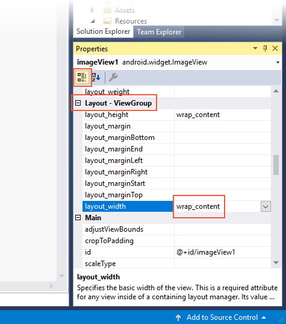

# [Visual Studio for Mac](#tab/vsmac)

1.  With the `ImageView` selected, click the **Properties** tab.

2.  Just below the **Properties** tab, click **Layout**.

3.  Scroll down to **ViewGroup** and change the `Width` setting to
    `wrap_content`:

[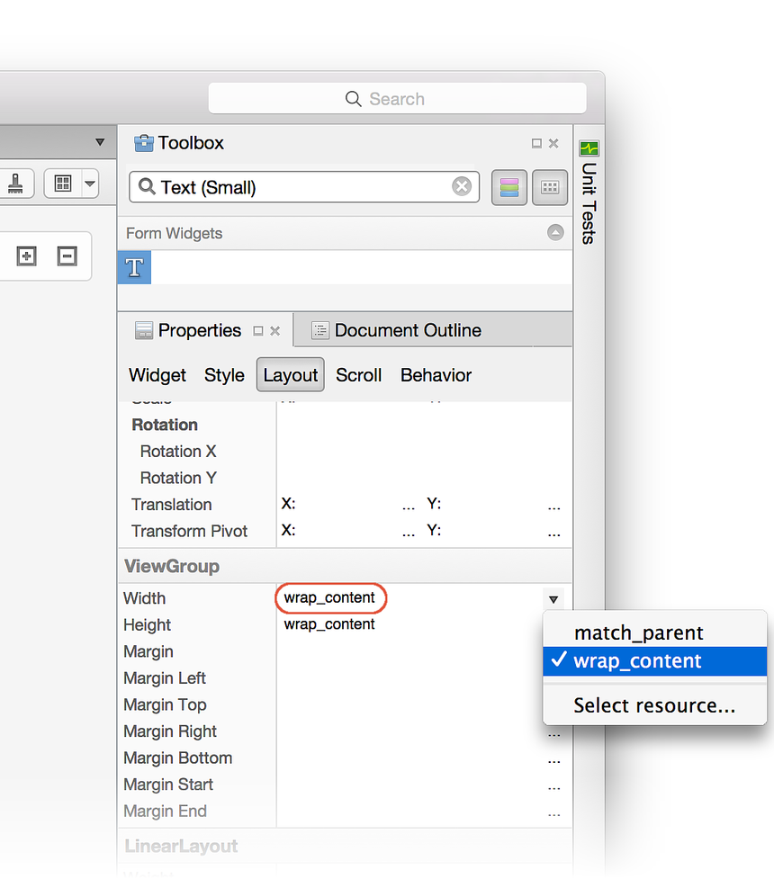](designer-walkthrough-images/xs/15-wrap-content.png#lightbox)

-----

Another way to change the `Width` setting is to click the triangle
on the right-hand side of the widget to toggle its width setting to
`wrap_content`:

[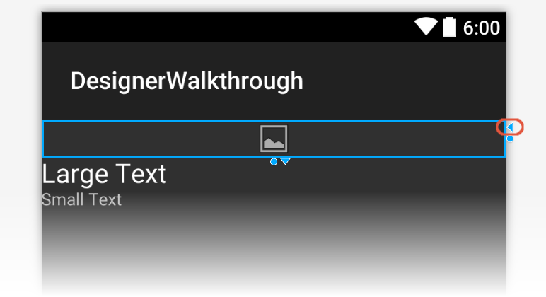](designer-walkthrough-images/xs/16-width-arrow.png#lightbox)

Clicking the triangle again returns the `Width` setting to
`match_parent`.

Next, switch to the **Document Outline** and select the
root `LinearLayout`:

# [Visual Studio](#tab/vswin)

[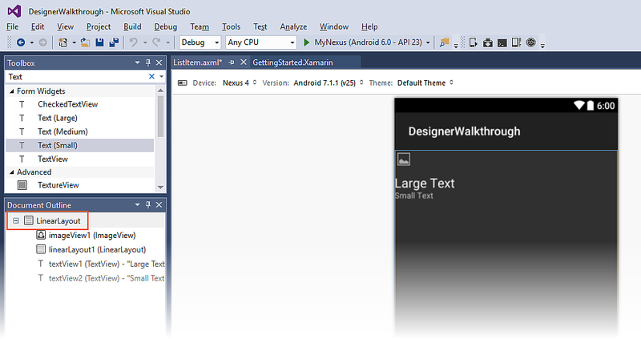](designer-walkthrough-images/vs/16-root-linearlayout.png#lightbox)

# [Visual Studio for Mac](#tab/vsmac)

[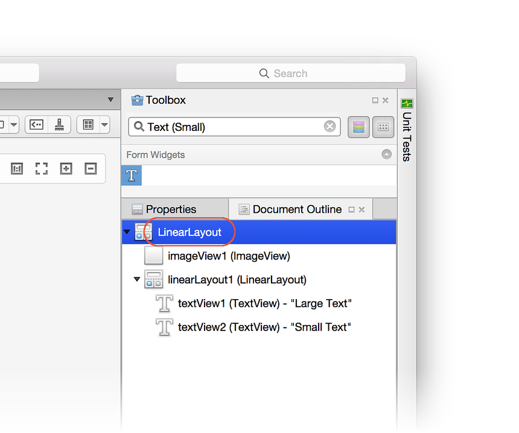](designer-walkthrough-images/xs/17-root-linearlayout.png#lightbox)

-----
# [Visual Studio](#tab/vswin)

With the root `LinearLayout` selected, return to the **Properties**
window, click the **Alphabetical** sort icon and scroll until you find
`orientation`. Change the `orientation` setting to `horizontal`:

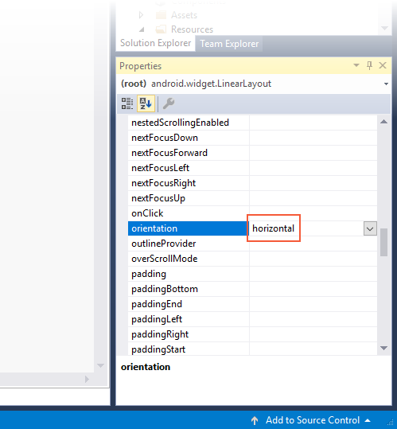

# [Visual Studio for Mac](#tab/vsmac)

With the root `LinearLayout` selected, return to the **Properties** tab
and click **Widget**. Change the `Orientation` setting to `horizontal`:

[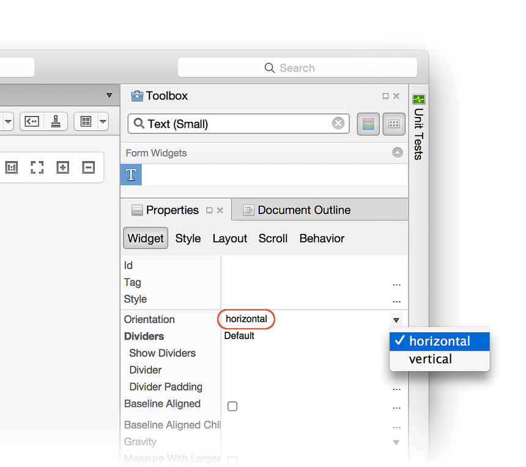](designer-walkthrough-images/xs/18-horizontal-orientation.png#lightbox)

-----

At this point, the Designer should resemble the following screenshot:

# [Visual Studio](#tab/vswin)

[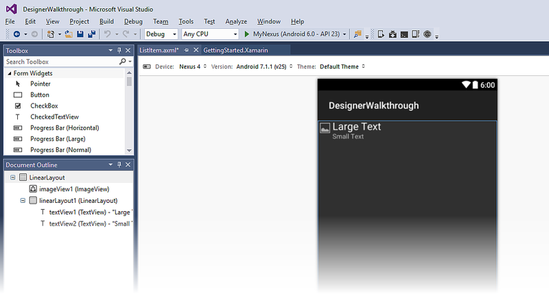](designer-walkthrough-images/vs/18-designer-layout.png#lightbox)

# [Visual Studio for Mac](#tab/vsmac)

[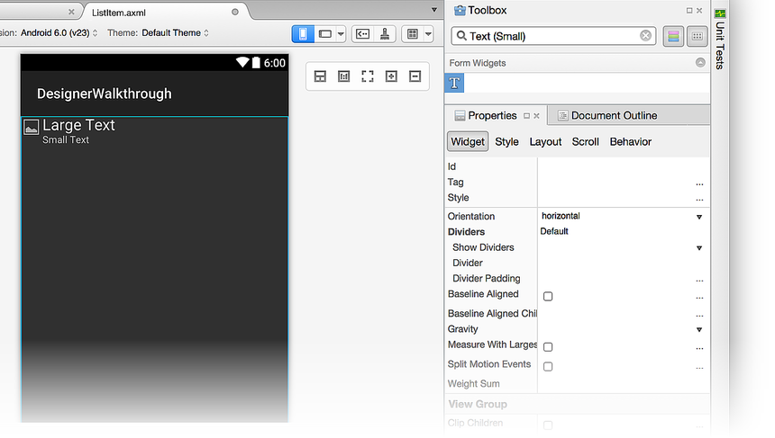](designer-walkthrough-images/xs/19-designer-layout.png#lightbox)

-----


### Modifying the Spacing

# [Visual Studio](#tab/vswin)

Next, we'll modify padding and margin settings in the UI to provide
more space between the widgets. Select the `ImageView`, click the
**Categorized** search icon in the **Properties** window and scroll
down to the **Layout** section. Change the `Min Height` to `70dp`, the
`Min Width` to `50dp`, and the `padding` to `10dp`. This applies
padding around all sides of the `ImageView` and elongates it
vertically:

[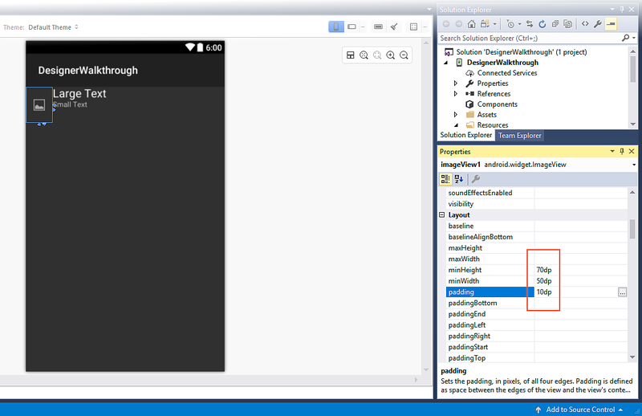](designer-walkthrough-images/vs/19-padding-widths.png#lightbox)

# [Visual Studio for Mac](#tab/vsmac)

Next, we'll modify padding and margin settings in the UI to provide
more space between the widgets. Select the `ImageView` and click the
**Layout** tab under **Properties**. Change the `Padding` to `10dp`,
the `Min Width` to `50dp`, and the `Min Height` to `70dp`. This applies
padding around all sides of the `ImageView` and elongates it
vertically:

[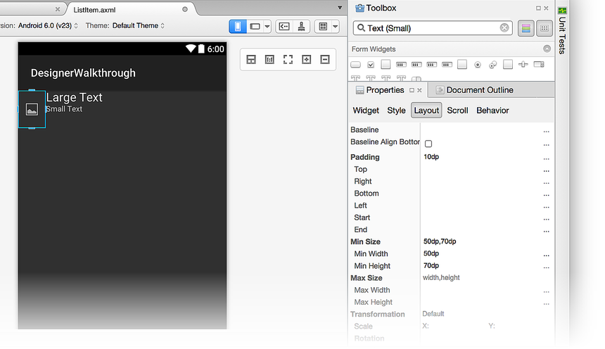](designer-walkthrough-images/xs/20-padding-widths.png#lightbox)

-----

# [Visual Studio](#tab/vswin)

The bottom, left, right, and top padding settings can be set
independently by entering values into the `paddingBottom`,
`paddingLeft`, `paddingRight`, and `paddingTop` fields, respectively.
For example, set the `paddingLeft` field to `5dp` and the
`paddingBottom`, `paddingRight`, and `paddingTop` fields to `10dp`:

[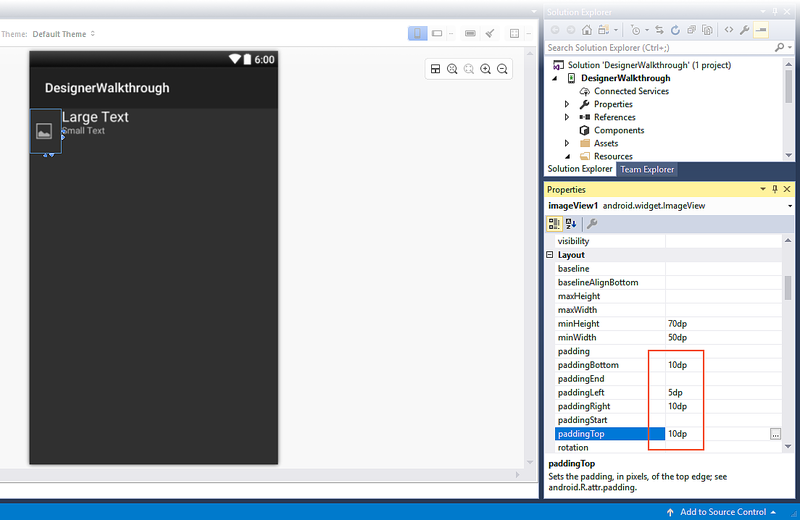](designer-walkthrough-images/vs/20-custom-padding.png#lightbox)

# [Visual Studio for Mac](#tab/vsmac)

The top, right, bottom, and left padding settings can be set
independently by entering values into the `Top`, `Right`, `Bottom`, and
`Left` padding fields, respectively. For example, set the `Left`
padding value to `5dp` and the `Top`, `Right`, and `Bottom` padding
values to `10dp`. Note that the `Padding` setting changes to a
comma-separated list of these values:

[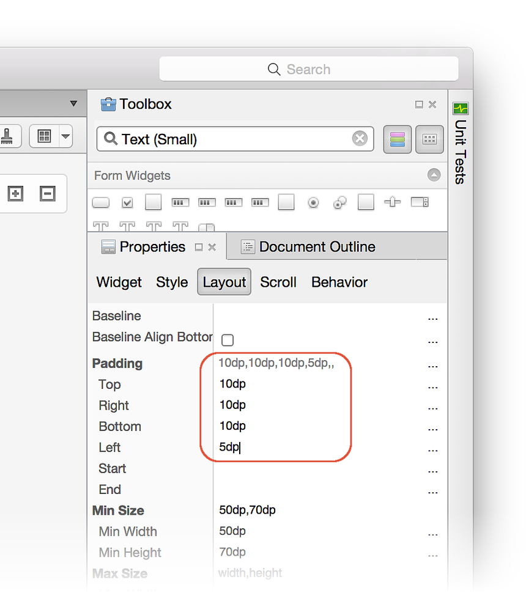](designer-walkthrough-images/xs/21-custom-padding.png#lightbox)

-----

# [Visual Studio](#tab/vswin)

Next, tweak the position of the `LinearLayout` widget that contains the
two `TextView` widgets. In the **Document Outline**, select
`linearLayout1`. In the **Properties** window, scroll to the **Layout -
ViewGroup** section. Set `layout_marginBottom`, `layout_marginLeft`,
`layout_marginRight`, and `layout_marginTop` to `5dp`, `5dp`, `0dp`,
and `5dp` respectively:

[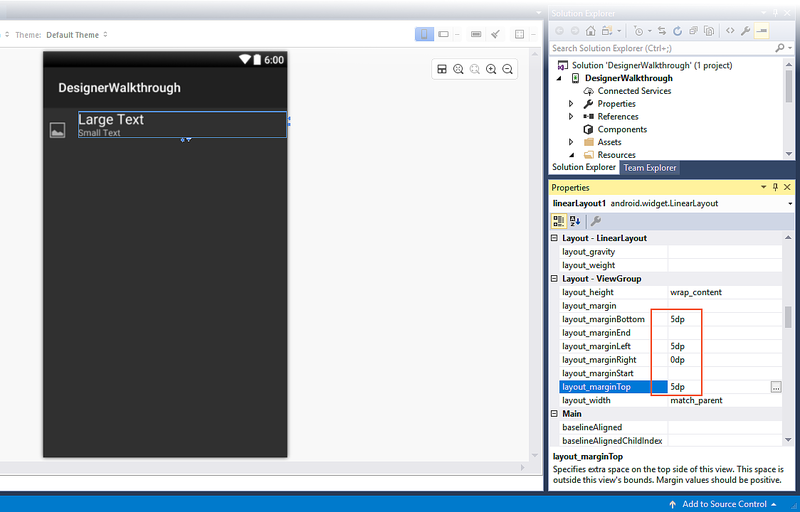](designer-walkthrough-images/vs/21-margins.png#lightbox)

# [Visual Studio for Mac](#tab/vsmac)

Next, tweak the position of the `LinearLayout` widget that contains the
two `TextView` widgets. In the **Document Outline**, select
`linearLayout1`. In the **Properties** pane, select the **Layout** tab.
Scroll down to the **ViewGroup** section and set the `Left`, `Top`,
`Right`, and `Bottom` margins to `5dp`, `5dp`, `0dp`, and `5dp`
respectively:

[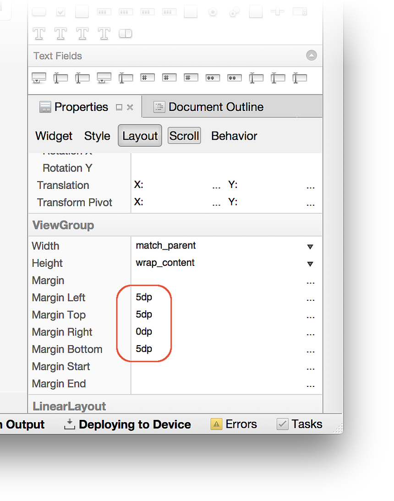](designer-walkthrough-images/xs/22-margins.png#lightbox)

-----


### Removing the Default Image

Because we're using the `ImageView` to display colors (rather than
images), let's remove the default image source added by the template.

# [Visual Studio](#tab/vswin)

1.  Select the `ImageView`.

2.  In **Properties**, find the `src` field.

3.  Clear the `src` setting so that it is blank:

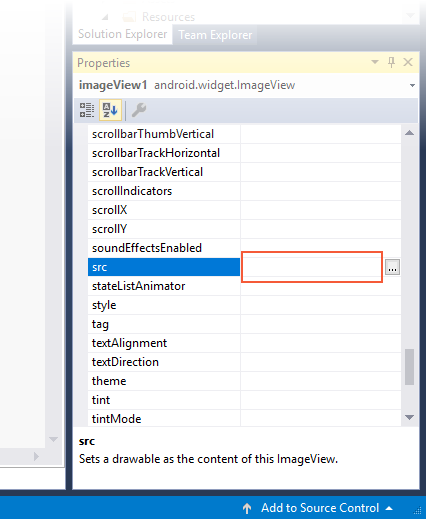

# [Visual Studio for Mac](#tab/vsmac)

1.  Select the `ImageView`.

2.  Click the **Widget** tab under **Properties**.

3.  Clear the `Src` setting so that it is blank:

[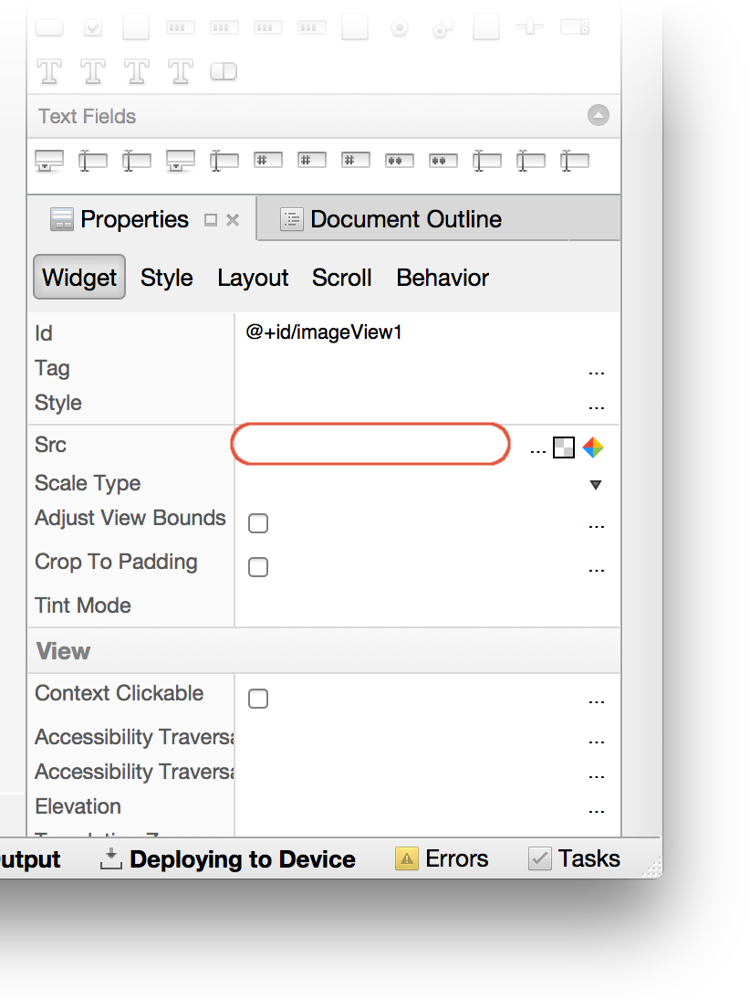](designer-walkthrough-images/xs/23-clear-src.png#lightbox)

-----


### Adding a ListView Container

Now that the **ListItem** layout is defined, we'll add a `ListView` to
the Main layout. This `ListView` will contain a list of **ListItems**.
In the **ToolBox**, locate the `ListView` widget and drag it onto the
Design Surface. The `ListView` in the Designer will be blank except for
blue lines that outline its border when it is selected. You can view
the **Document Outline** to verify that the **ListView** was added
correctly:

# [Visual Studio](#tab/vswin)

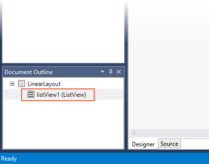

# [Visual Studio for Mac](#tab/vsmac)

[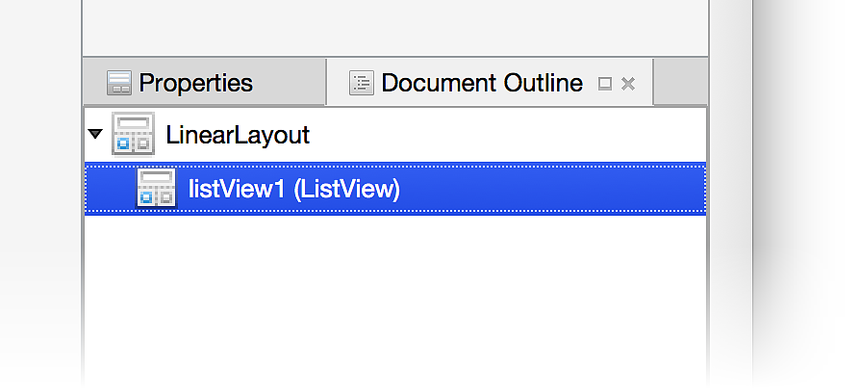](designer-walkthrough-images/xs/24-new-listview.png#lightbox)

-----

By default, the `ListView` is given an `Id` value of `@+id/listView1`.
Open the **Widget** tab under **Properties** and change the `Id` to
`@+id/myListView`:

# [Visual Studio](#tab/vswin)

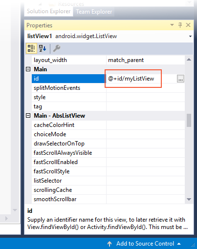

# [Visual Studio for Mac](#tab/vsmac)

[](designer-walkthrough-images/xs/25-change-id.png#lightbox)

-----

At this point, our user interface is ready to use.


### Running the Application


Open **MainActivity.cs** and replace its code with the following:

```csharp
using System;
using Android.App;
using Android.Content;
using Android.Runtime;
using Android.Views;
using Android.Widget;
using Android.OS;
using System.Collections.Generic;

namespace DesignerWalkthrough
{
    [Activity (Label = "DesignerWalkthrough", MainLauncher = true, Icon = "@drawable/icon")]
    public class MainActivity : Activity
    {
        List<ColorItem> colorItems = new List<ColorItem> ();
        ListView listView;

        protected override void OnCreate (Bundle savedInstanceState)
        {
            base.OnCreate (savedInstanceState);

            SetContentView (Resource.Layout.Main);
            listView = FindViewById<ListView> (Resource.Id.myListView);

            colorItems.Add (new ColorItem () { Color = Android.Graphics.Color.DarkRed,
                                               ColorName = "Dark Red", Code = "8B0000" });
            colorItems.Add (new ColorItem () { Color = Android.Graphics.Color.SlateBlue,
                                               ColorName = "Slate Blue", Code = "6A5ACD" });
            colorItems.Add (new ColorItem () { Color = Android.Graphics.Color.ForestGreen,
                                               ColorName = "Forest Green", Code = "228B22" });

            listView.Adapter = new ColorAdapter (this, colorItems);
        }
    }
    public class ColorAdapter : BaseAdapter<ColorItem>
    {
        List<ColorItem> items;
        Activity context;
        public ColorAdapter(Activity context, List<ColorItem> items)
            : base()
        {
            this.context = context;
            this.items = items;
        }
        public override long GetItemId(int position)
        {
            return position;
        }
        public override ColorItem this[int position]
        {
            get { return items[position]; }
        }
        public override int Count
        {
            get { return items.Count; }
        }
        public override View GetView (int position, View convertView, ViewGroup parent)
        {
            var item = items[position];

            View view = convertView;
            if (view == null) // no view to re-use, create new
                view = context.LayoutInflater.Inflate(Resource.Layout.ListItem, null);
            view.FindViewById<TextView>(Resource.Id.textView1).Text = item.ColorName;
            view.FindViewById<TextView>(Resource.Id.textView2).Text = item.Code;
            view.FindViewById<ImageView>(Resource.Id.imageView1).SetBackgroundColor(item.Color);

            return view;
        }
    }

    public class ColorItem
    {
        public string ColorName { get; set; }
        public string Code { get; set; }
        public Android.Graphics.Color Color { get; set; }
    }
}

```

This code uses a custom `ListView` adapter to load color information
and display this data in the UI we've just created. To keep this example
short, the color information is hard-coded in a list, but the adapter
could be modified to extract color information from a data source or
to calculate it on the fly. For more information about `ListView`
adapters, see
[ListViews and Adapters](~/android/user-interface/layouts/list-view/index.md).

Build and run the application. The following screenshot is an example of how the
app appears when running on a device:

[](designer-walkthrough-images/xs/26-final-screenshot.png#lightbox)


## Summary

In this article, we walked through how to use the Xamarin.Android
Designer in Visual Studio for Mac to create a user interface. Next, we
demonstrated how to create the interface for a single item in a list.
Along the way, we looked at how to add widgets and to lay them out
visually, as well as how to assign resources and to set various
properties on those widgets. In conclusion, we illustrated how the
interface we created in the Designer runs in an example application.
