# Using the Xamarin.Android Designer

_This article is a walkthrough of the Xamarin.Android Designer. It
demonstrates how to create a user interface for a small color browser
app; this user interface is created entirely in the Designer._

## Overview

Android user interfaces can be created declaratively by using XML files
or programmatically by writing code. The Xamarin.Android Designer
allows developers to create and modify declarative layouts visually,
without requiring hand-editing of XML files. The Designer also provides
real-time feedback that lets the developer evaluate UI changes without
having to redeploy the application to a device or to an emulator. These
Designer features can speed up Android UI development tremendously.
This article demonstrates how to use the Xamarin.Android Designer to
visually create a user interface.

> [!TIP]
> Newer releases of Visual Studio support opening .xml files inside the Android Designer.
>
> Both .axml and .xml files are supported in the Android Designer.

## Walkthrough

The objective of this walkthrough is to use the Android Designer to
create a user interface for an example color browser app. The color
browser app presents a list of colors, their names, and their RGB
values. You'll learn how to add widgets to the **Design Surface** as
well as how to lay out these widgets visually. After that, you'll learn
how to modify widgets interactively on the **Design Surface** or 
by using the Designer's **Properties** pane. Finally, you'll see how 
the design looks when the app runs on a device or emulator.

<!-- markdownlint-disable MD001 -->

# [Visual Studio](#tab/windows)

### Creating a new project

The first step is to create a new Xamarin.Android project. Launch
Visual Studio, click **New Project...**, and choose 
the **Visual C\# > Android > Android App (Xamarin)** template.
Name the new app **DesignerWalkthrough** and click **OK**.

[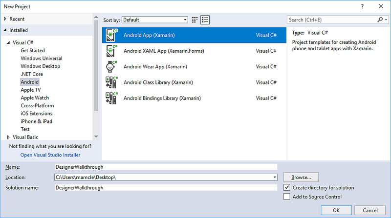](designer-walkthrough-images/vs/01-android-app-w158.png#lightbox)

In the **New Android App** dialog, choose **Blank App** and click **OK**:

[](designer-walkthrough-images/vs/02-blank-app-w158.png#lightbox)

### Adding a layout

The next step is to create a **LinearLayout** that will hold the user
interface elements. Right-click **Resources/layout** in the **Solution
Explorer** and select **Add > New Item...**. In the **Add New Item**
dialog, select **Android Layout**. Name the file **list_item** and
click **Add**:

[](designer-walkthrough-images/vs/03-new-layout-w158.png#lightbox)

The new **list_item** layout is displayed in the Designer. Notice that
two panes are displayed &ndash; the *Design Surface* for the
**list_item** is visible in the left pane while its XML source is shown
on the right pane. You can swap the positions of the **Design Surface**
and **Source** panes by clicking the **Swap Panes** icon located
between the two panes:

[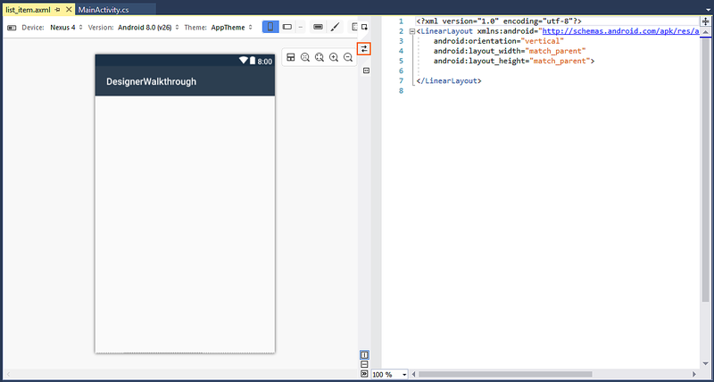](designer-walkthrough-images/vs/04-designer-view-w158.png#lightbox)

From the **View** menu, click **Other Windows > Document Outline** to
open the **Document Outline**. The **Document Outline** shows that the
layout currently contains a single **LinearLayout** widget:

[](designer-walkthrough-images/vs/06-document-outline-w158.png#lightbox)

The next step is to create the user interface for the color browser
app within this `LinearLayout`.

### Creating the List Item user interface

If the **Toolbox** pane is not showing, click the **Toolbox** tab on
the left. In the **Toolbox**, scroll down to the **Images & Media**
section and scroll down further until you locate an `ImageView`:

[](designer-walkthrough-images/vs/07-locate-imageview-w158.png#lightbox)

Alternately, you can enter *ImageView* into the search bar to locate
the `ImageView`:

[](designer-walkthrough-images/vs/08-imageview-search-w158.png#lightbox)

Drag this `ImageView` onto the Design Surface (this `ImageView` will be
used to display a color swatch in the color browser app):

[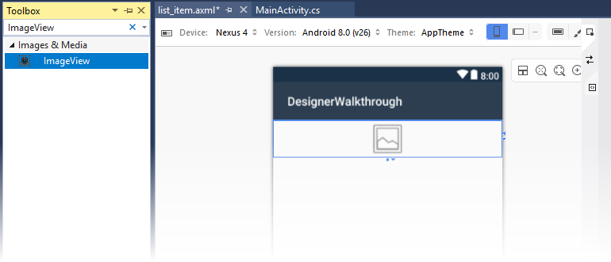](designer-walkthrough-images/vs/09-imageview-on-canvas-w158.png#lightbox)

Next, drag a `LinearLayout (Vertical)` widget from the **Toolbox** into
the Designer. Notice that a blue outline indicates the boundaries of
the added `LinearLayout`. The **Document Outline** shows that it is a
child of `LinearLayout`, located under `imageView1 (ImageView)`:

[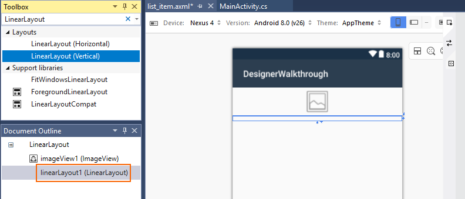](designer-walkthrough-images/vs/10-blue-outline-w158.png#lightbox)

When you select the `ImageView` in the Designer, the blue outline moves
to surround the `ImageView`. In addition, the selection moves to
`imageView1 (ImageView)` in the **Document Outline**:

[](designer-walkthrough-images/vs/11-select-imageview-w158.png#lightbox)

Next, drag a `Text (Large)` widget from the **Toolbox** into the
newly-added `LinearLayout`. Notice that the Designer uses green
highlights to indicate where the new widget will be inserted:

[](designer-walkthrough-images/vs/12-green-highlight-w158.png#lightbox)

Next, add a `Text (Small)` widget below the `Text (Large)` widget:

[](designer-walkthrough-images/vs/13-add-small-text-w158.png#lightbox)

At this point, the Designer surface should resemble the following
screenshot:

[](designer-walkthrough-images/vs/14-raw-layout-w158.png#lightbox)

If the two `textView` widgets are not inside `linearLayout1`, you can
drag them to `linearLayout1` in the **Document Outline** and position
them so they appear as shown in the previous screenshot (indented under
`linearLayout1`).

### Arranging the user interface

The next step is to modify the UI to display the `ImageView` on the
left, with the two `TextView` widgets stacked to the right of the
`ImageView`.

1. Select the `ImageView`.

2. In the **Properties window**, enter *width* in the search box
    and locate **Layout Width**.

3. Change the **Layout Width** setting to `wrap_content`:


Another way to change the `Width` setting is to click the triangle
on the right-hand side of the widget to toggle its width setting to
`wrap_content`:

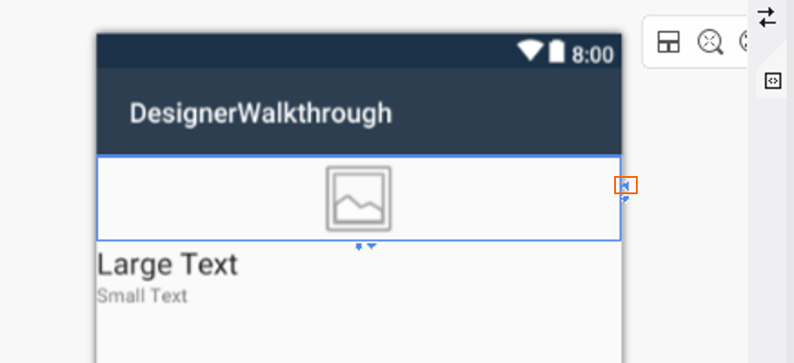

Clicking the triangle again returns the `Width` setting to
`match_parent`. Next, go to the **Document Outline** pane and select
the root `LinearLayout`:

[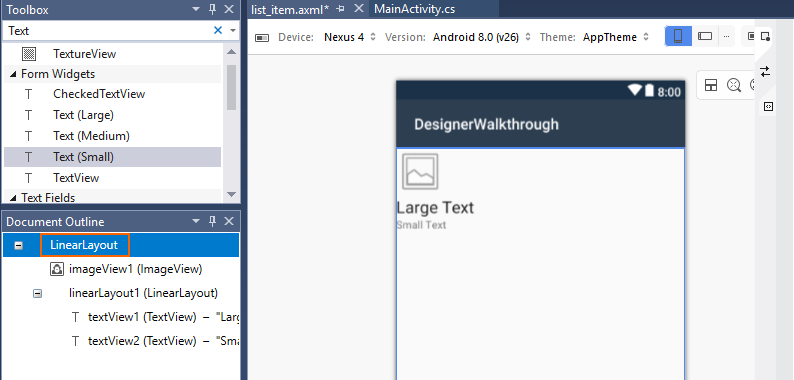](designer-walkthrough-images/vs/16-root-linearlayout-w158.png#lightbox)

With the root `LinearLayout` selected, return to the **Properties**
pane, enter *orientation* into the search box and locate the
**Orientation** setting. Change **Orientation** to `horizontal`:

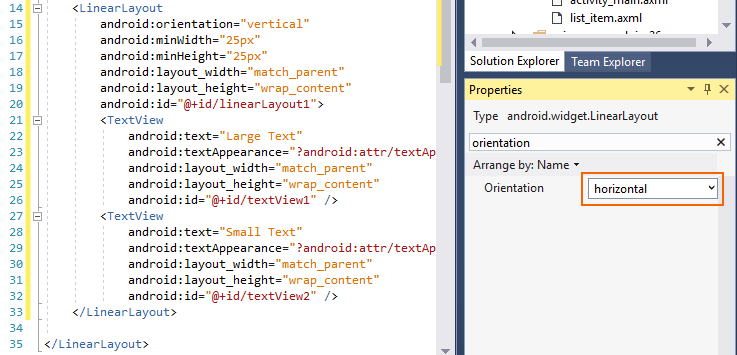

At this point, the Designer surface should resemble the following screenshot.
Notice that the `TextView` widgets have been moved to the right of the `ImageView`:

[](designer-walkthrough-images/vs/18-designer-layout-w158.png#lightbox)

### Modifying the spacing

The next step is to modify padding and margin settings in the UI to
provide more space between the widgets. Select the `ImageView` on the
Design surface. In the **Properties** pane, enter `min` in the search
box. Enter `70dp` for **Min Height** and `50dp` for **Min Width**:

[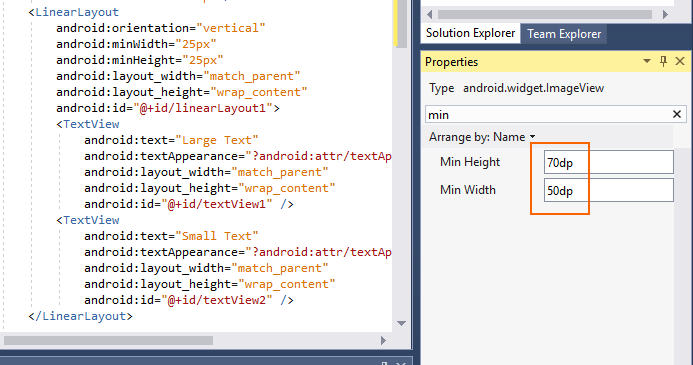](designer-walkthrough-images/vs/18b-set-height-width.png#lightbox)

In the **Properties** pane, enter `padding` in the search box and enter
`10dp` for **Padding**. These `minHeight`, `minWidth` and `padding`
settings add padding around all sides of the `ImageView` and elongate
it vertically. Notice that the layout XML changes as you enter these
values:

[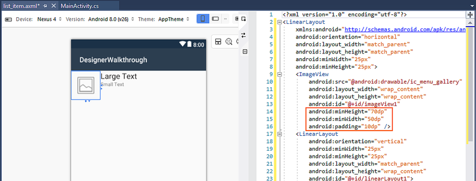](designer-walkthrough-images/vs/19-padding-widths-w158.png#lightbox)

The bottom, left, right, and top padding settings can be set
independently by entering values into the **Padding Bottom**, **Padding
Left**, **Padding Right**, and **Padding Top** fields, respectively.
For example, set the **Padding Left** field to `5dp` and the **Padding
Bottom**, **Padding Right**, and **Padding Top** fields to `10dp`:

[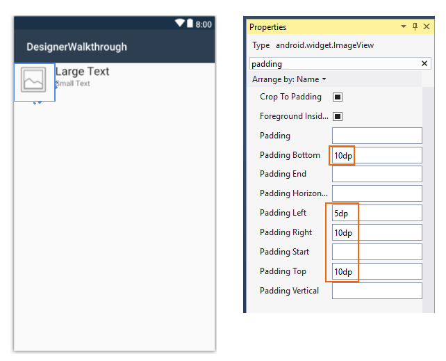](designer-walkthrough-images/vs/20-custom-padding-w158.png#lightbox)

Next, adjust the position of the `LinearLayout` widget that contains the
two `TextView` widgets. In the **Document Outline**, select
`linearLayout1`. In the **Properties** window, enter `margin` in the
search box. Set **Layout Margin Bottom**, **Layout Margin Left**, and
**Layout Margin Top** to `5dp`. Set **Layout Margin Right** to `0dp`:

[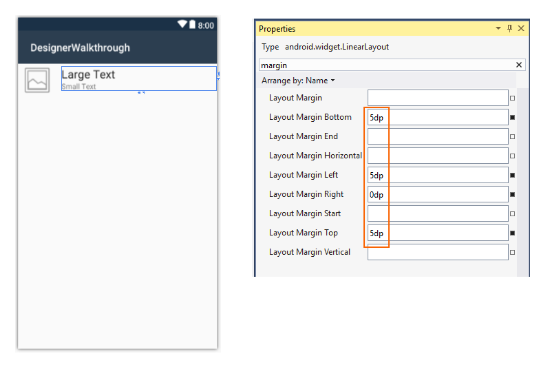](designer-walkthrough-images/vs/21-margins-w158.png#lightbox)

### Removing the default image

Because the `ImageView` is being used to display colors (rather than
images), the next step is to remove the default image source added by
the template.

1. Select the `ImageView` on the **Designer Surface**.

2. In **Properties**, enter *src* in the search box.

3. Click the small square to the right of the **Src** property setting 
    and select **Reset**:

[](designer-walkthrough-images/vs/22-clear-img-src-w158.png#lightbox)

This removes `android:src="@android:drawable/ic_menu_gallery"` from the 
source XML for that `ImageView`.

### Adding a ListView container

Now that the **list_item** layout is defined, the next step is to add a
`ListView` to the Main layout. This `ListView` will contain a list of
**list_item**. 

In the **Solution Explorer**, open
**Resources/layout/activity_main.axml**. In the **ToolBox**, locate the
`ListView` widget and drag it onto the **Design Surface**. The `ListView`
in the Designer will be blank except for blue lines that outline its
border when it is selected. You can view the **Document Outline** to
verify that the **ListView** was added correctly:

[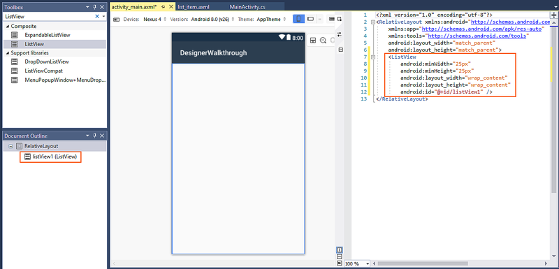](designer-walkthrough-images/vs/23-new-listview-w158.png#lightbox)

By default, the `ListView` is given an `Id` value of `@+id/listView1`.
While `listView1` is still selected in the **Document Outline**, open
the **Properties** pane, click **Arrange by**, and select **Category**.
Open **Main**, locate the **Id** property, and change its value to
`@+id/myListView`:

[](designer-walkthrough-images/vs/24-change-id-w158.png#lightbox)

At this point, the user interface is ready to use.

### Running the application

Open **MainActivity.cs** and replace its code with the following:

```csharp
using Android.App;
using Android.Widget;
using Android.Views;
using Android.OS;
using Android.Support.V7.App;
using System.Collections.Generic;

namespace DesignerWalkthrough
{
    [Activity(Label = "@string/app_name", Theme = "@style/AppTheme", MainLauncher = true)]
    public class MainActivity : AppCompatActivity
    {
        List<ColorItem> colorItems = new List<ColorItem>();
        ListView listView;

        protected override void OnCreate(Bundle savedInstanceState)
        {
            base.OnCreate(savedInstanceState);

            // Set our view from the "main" layout resource
            SetContentView(Resource.Layout.activity_main);
            listView = FindViewById<ListView>(Resource.Id.myListView);

            colorItems.Add(new ColorItem()
            {
                Color = Android.Graphics.Color.DarkRed,
                ColorName = "Dark Red",
                Code = "8B0000"
            });
            colorItems.Add(new ColorItem()
            {
                Color = Android.Graphics.Color.SlateBlue,
                ColorName = "Slate Blue",
                Code = "6A5ACD"
            });
            colorItems.Add(new ColorItem()
            {
                Color = Android.Graphics.Color.ForestGreen,
                ColorName = "Forest Green",
                Code = "228B22"
            });

            listView.Adapter = new ColorAdapter(this, colorItems);
        }
    }

    public class ColorAdapter : BaseAdapter<ColorItem>
    {
        List<ColorItem> items;
        Activity context;
        public ColorAdapter(Activity context, List<ColorItem> items)
            : base()
        {
            this.context = context;
            this.items = items;
        }
        public override long GetItemId(int position)
        {
            return position;
        }
        public override ColorItem this[int position]
        {
            get { return items[position]; }
        }
        public override int Count
        {
            get { return items.Count; }
        }
        public override View GetView(int position, View convertView, ViewGroup parent)
        {
            var item = items[position];

            View view = convertView;
            if (view == null) // no view to re-use, create new
                view = context.LayoutInflater.Inflate(Resource.Layout.list_item, null);
            view.FindViewById<TextView>(Resource.Id.textView1).Text = item.ColorName;
            view.FindViewById<TextView>(Resource.Id.textView2).Text = item.Code;
            view.FindViewById<ImageView>(Resource.Id.imageView1).SetBackgroundColor(item.Color);

            return view;
        }
    }

    public class ColorItem
    {
        public string ColorName { get; set; }
        public string Code { get; set; }
        public Android.Graphics.Color Color { get; set; }
    }
}

```

This code uses a custom `ListView` adapter to load color information
and to display this data in the UI that was just created. To keep this
example short, the color information is hard-coded in a list, but the
adapter could be modified to extract color information from a data
source or to calculate it on the fly. For more information about
`ListView` adapters, see
[ListView](~/android/user-interface/layouts/list-view/index.md).

Build and run the application. The following screenshot is an example of how the
app appears when running on a device:

[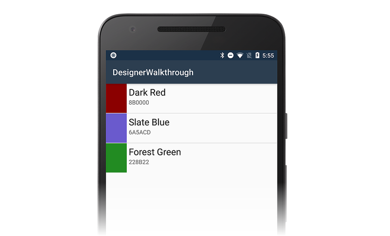](designer-walkthrough-images/vs/25-final-screenshot.png#lightbox)

# [Visual Studio for Mac](#tab/macos)

### Creating a new project

The first step is to create a new Xamarin.Android project.

Launch Visual Studio for Mac and click **New Project...**. Choose the
**Android App** template and click **Next**:

[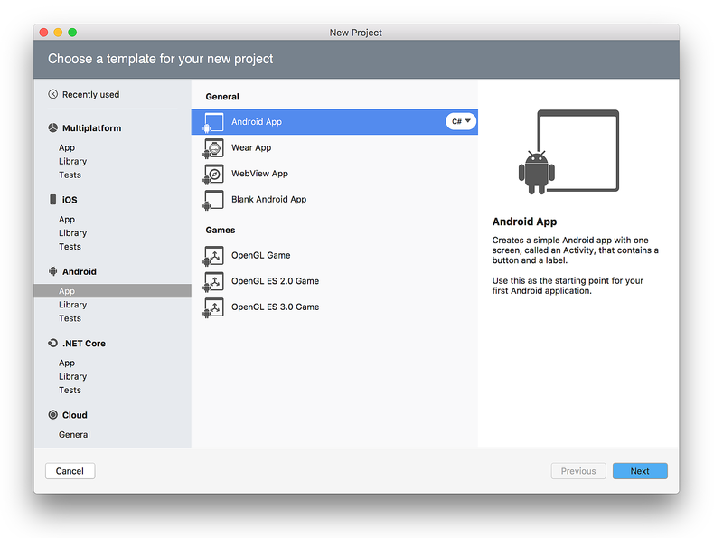](designer-walkthrough-images/xs/01-android-app-m75.png#lightbox)

Name the new app **DesignerWalkthrough**. Under **Target Platforms**,
select **Latest and Greatest** and click **Next**:

[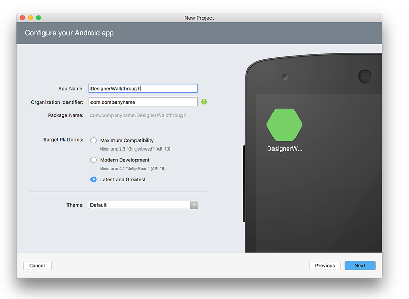](designer-walkthrough-images/xs/02-designer-walkthrough-m75.png#lightbox)

In the next dialog screen, click **Create**.

### Adding a layout

The next step is to create a **LinearLayout** that will hold the user
interface elements.

In Visual Studio for Mac, right-click **Resources/layout** in the **Solution**
pad and select **Add > New File...**. In the **New File** dialog,
select **Android > Layout**. Name the file **list_item** and click
**New**:

[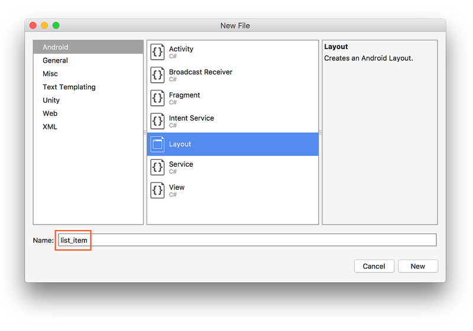](designer-walkthrough-images/xs/03-new-layout-m75.png#lightbox)

After this file is added, the new **list_item** layout is displayed on
the **Design Surface** (if you see the message, *This project contains
resources that were not compiled successfully, rendering might be
affected*, click **Build > Build All** to build the project):

[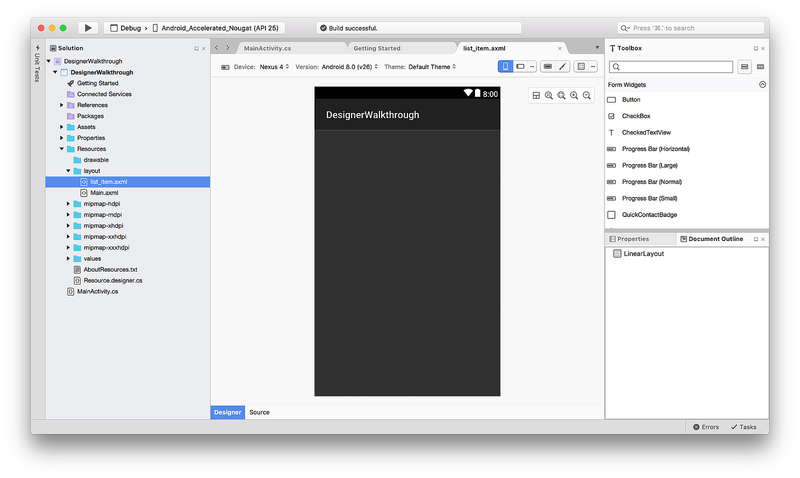](designer-walkthrough-images/xs/04-designer-view-m75.png#lightbox)

Click the **Source** tab at the bottom of the Designer to view the XML
source for this layout. When you click the **Document Outline** tab on
the right, it shows that the layout currently contains a single
**LinearLayout** widget:

[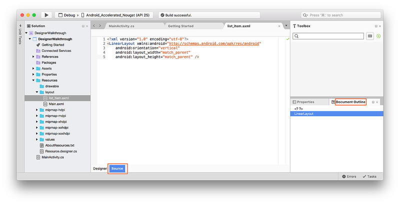](designer-walkthrough-images/xs/05-designer-xml-m75.png#lightbox)

The next step is to create the user interface for the color browser
app.

### Creating the List Item user interface

Click the **Designer** tab on the bottom of the screen to return to the
**Designer Surface**. In the **Toolbox** pane on the right, scroll down to
the **Images & Media** section and locate `ImageView`:

[](designer-walkthrough-images/xs/06-locate-imageview-m75.png#lightbox)

Alternately, you can enter *ImageView* into the search bar to locate
the `ImageView`:

[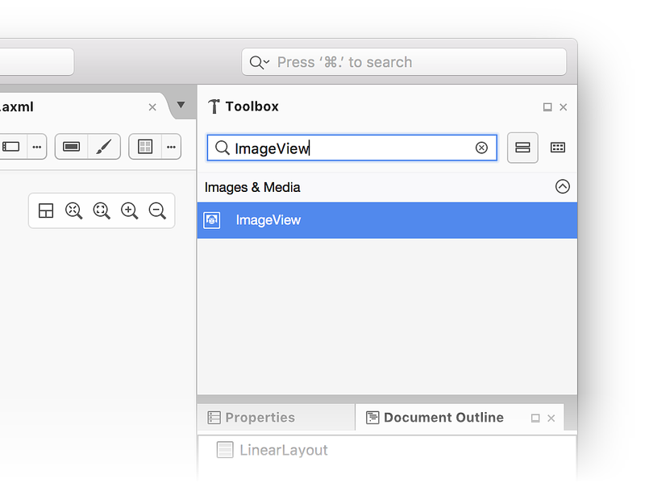](designer-walkthrough-images/xs/07-imageview-search-m75.png#lightbox)

Drag this `ImageView` onto the **Design Surface** (this `ImageView` will be
used to display a color swatch in the color browser app):

[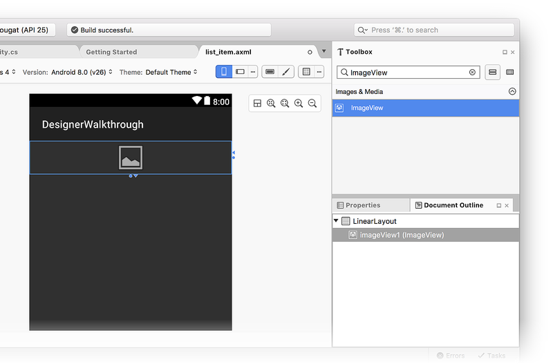](designer-walkthrough-images/xs/08-imageview-on-canvas-m75.png#lightbox)

Next, drag a `LinearLayout (Vertical)` widget from the **Toolbox** into
the **Design Surface**. Notice that a blue outline indicates the boundaries of
the added `LinearLayout`. The **Document Outline** shows that it is a
child of `LinearLayout`, located below `imageView1 (ImageView)`:

[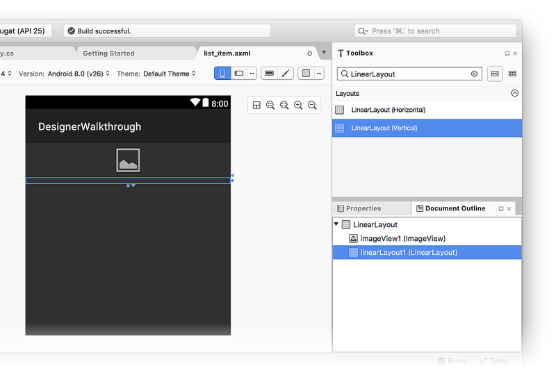](designer-walkthrough-images/xs/10-blue-outline-m75.png#lightbox)

When you select the `ImageView` in the Designer, the blue outline moves
to surround the `ImageView`. In addition, the selection moves to
`imageView1 (ImageView)` in the **Document Outline**:

[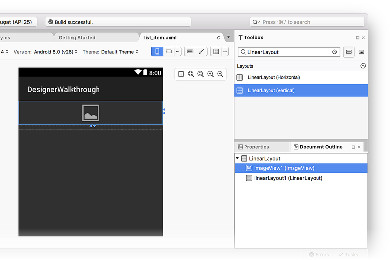](designer-walkthrough-images/xs/11-select-imageview-m75.png#lightbox)

Next, drag a `Text (Large)` widget from the **Toolbox** into the
newly-added `LinearLayout`. Notice that as you drag the mouse onto the
**Design Surface**, it highlights where the new widget will be inserted.
The `Text (Large)` widget should be located inside `linearLayout1` as
seen here:

[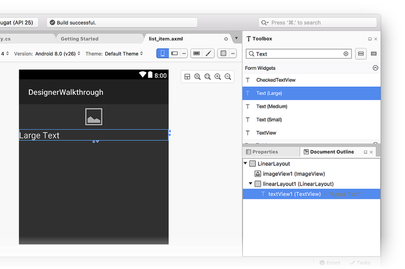](designer-walkthrough-images/xs/12-green-highlight-m75.png#lightbox)

Next, add a `Text (Small)` widget below the `Text (Large)` widget. At
this point, the **Design Surface** should resemble the following
screenshot:

[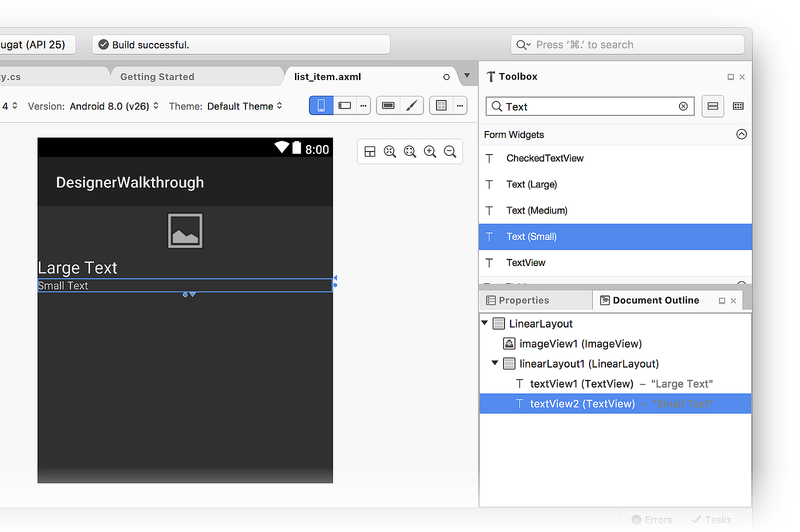](designer-walkthrough-images/xs/13-add-small-text-m75.png#lightbox)

If the two `textView` widgets are not inside `linearLayout1`, you can
drag them to `linearLayout1` in the **Document Outline** and position
them so that they appear as shown in the previous screenshot (indented under
`linearLayout1`).

### Arranging the user interface

The next step is to modify the UI to display the `ImageView` on the
left, with the two `TextView` widgets stacked to the right of the
`ImageView`.

1. With the `ImageView` selected, click the **Properties** tab.

2. Just below the **Properties** tab, click **Layout**.

3. Scroll down to **ViewGroup** and change the `Width` setting to
    `wrap_content`:

[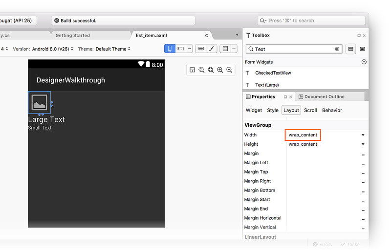](designer-walkthrough-images/xs/15-wrap-content-m75.png#lightbox)

Another way to change the `Width` setting is to click the triangle
on the right-hand side of the widget to toggle its width setting to
`wrap_content`:

[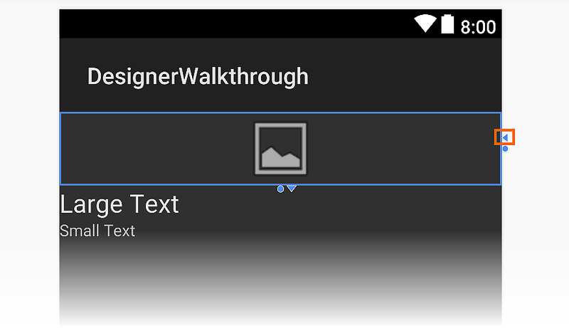](designer-walkthrough-images/xs/16-width-arrow-m75.png#lightbox)

Clicking the triangle again returns the `Width` setting to
`match_parent`. Next, go to the **Document Outline** pane and select
the root `LinearLayout`:

[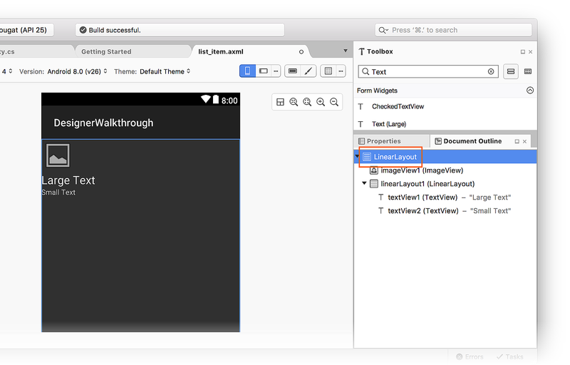](designer-walkthrough-images/xs/17-root-linearlayout-m75.png#lightbox)

With the root `LinearLayout` selected, return to the **Properties** tab
and click **Widget**. Change the `Orientation` setting to `horizontal`
as shown below. At this point, the **Design Surface** should resemble the
following screenshot. Notice that the `TextView` widgets have been
moved to the right of the `ImageView`:

[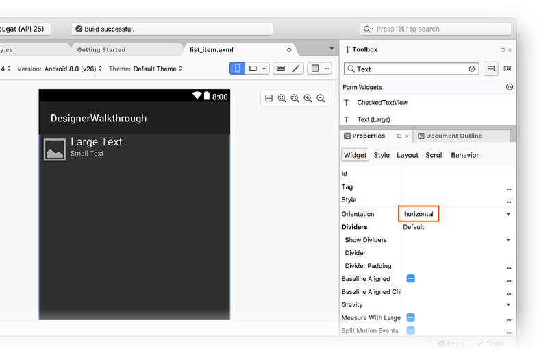](designer-walkthrough-images/xs/18-horizontal-orientation-m75.png#lightbox)

### Modifying the spacing

The next step is to modify the padding and margin settings in the UI to
provide more space between the widgets. Select the `ImageView` and
click the **Layout** tab under **Properties**. Change the `Min Width`
to `50dp`, the `Min Height` to `70dp`, and the `Padding` to `10dp`.
This applies padding around all sides of the `ImageView` and elongates
it vertically:

[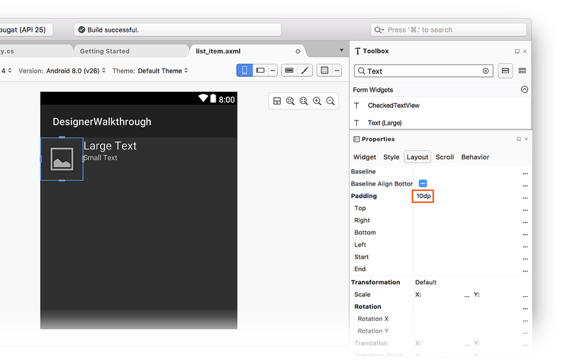](designer-walkthrough-images/xs/20-padding-widths-m75.png#lightbox)

The top, right, bottom, and left padding settings can be set
independently by entering values into the `Top`, `Right`, `Bottom`, and
`Left` padding fields, respectively. For example, set the `Left`
padding value to `5dp` and the `Top`, `Right`, and `Bottom` padding
values to `10dp`. Note that the `Padding` setting changes to a
comma-separated list of these values:

[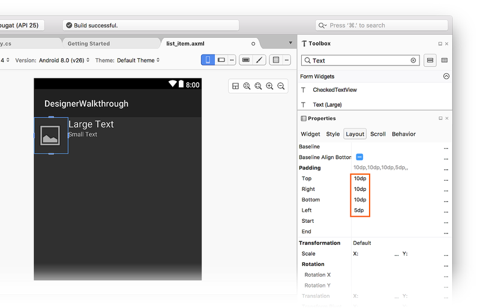](designer-walkthrough-images/xs/21-custom-padding-m75.png#lightbox)

Next, adjust the position of the `LinearLayout` widget that contains the
two `TextView` widgets. In the **Document Outline**, select
`linearLayout1`. In the **Properties** pane, select the **Layout** tab.
Scroll down to the **ViewGroup** section and set the `Left`, `Top`,
`Right`, and `Bottom` margins to `5dp`, `5dp`, `0dp`, and `5dp`
respectively:

[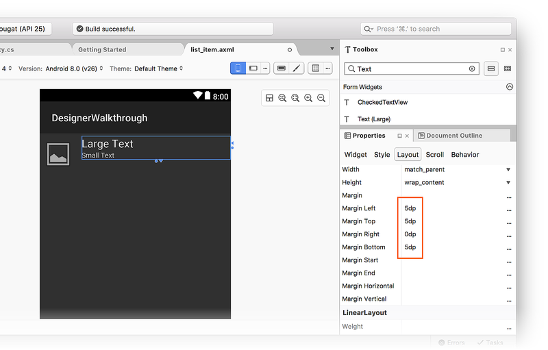](designer-walkthrough-images/xs/22-margins-m75.png#lightbox)

### Removing the default image

Because the `ImageView` is being used to display colors (rather than
images), the next step is to remove the default image source added by
the template.

1. Select the `ImageView`.

2. Click the **Widget** tab under **Properties**.

3. Clear the `Src` setting so that it is blank:

[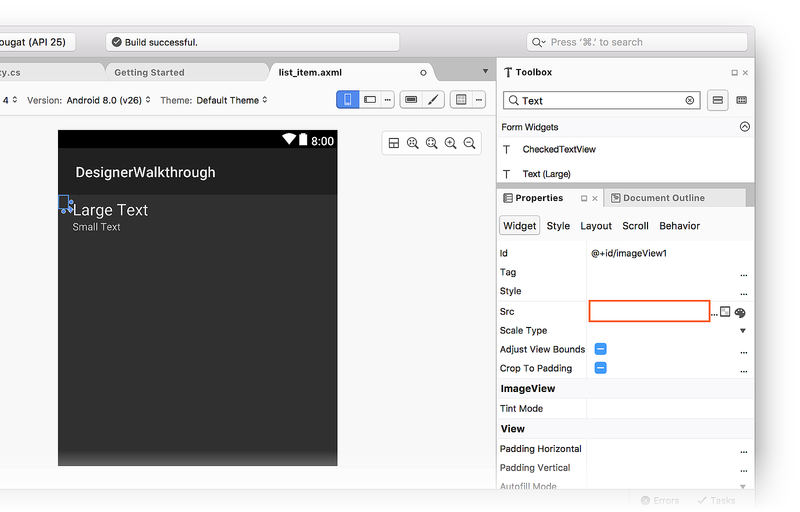](designer-walkthrough-images/xs/23-clear-src-m75.png#lightbox)

This removes `android:src="@android:drawable/ic_menu_gallery"` from the 
source XML for that `ImageView`.

### Adding a ListView container

Now that the **list_item** layout is defined, the next step is to add a
`ListView` to the Main layout. This `ListView` will contain a list of
**list_item**. 

In the **Solution Explorer**, open **Resources/layout/Main.axml**.
Click the `Button` widget (if any) and delete it. In the **ToolBox**,
locate the `ListView` widget and drag it onto the **Design Surface**.
The `ListView` in the Designer will be blank except for blue lines that
outline its border when it is selected. You can view the **Document
Outline** to verify that the **ListView** was added correctly:

[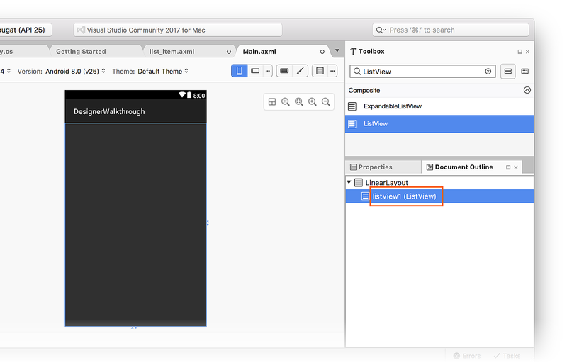](designer-walkthrough-images/xs/24-new-listview-m75.png#lightbox)

By default, the `ListView` is given an `Id` value of `@+id/listView1`.
While `listView1` is still selected in the **Document Outline**, open
the **Properties** pane, click **Arrange by**, and select **Category**.
Open **Main**, locate the **Id** property, and change its value to
`@+id/myListView`:

[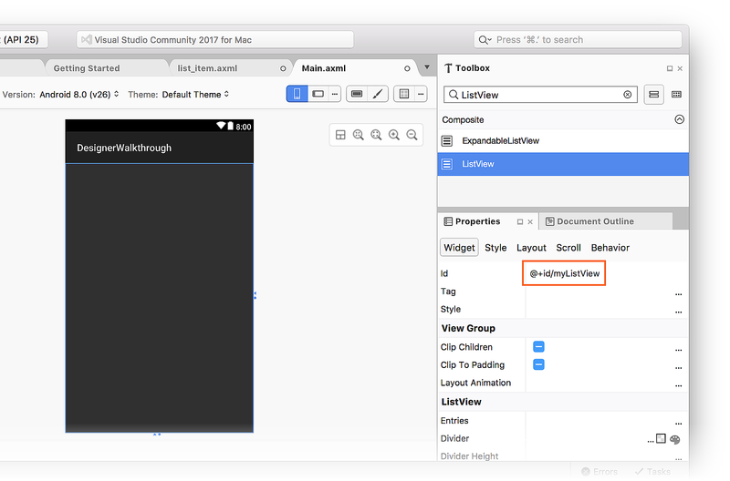](designer-walkthrough-images/xs/25-change-id-m75.png#lightbox)

At this point, the user interface is ready to use.

### Running the application

Open **MainActivity.cs** and replace its code with the following:

```csharp
using Android.App;
using Android.Widget;
using Android.Views;
using Android.OS;
using System.Collections.Generic;

namespace DesignerWalkthrough
{
    [Activity(Label = "@string/app_name", MainLauncher = true)]
    public class MainActivity : Activity
    {
        List<ColorItem> colorItems = new List<ColorItem>();
        ListView listView;

        protected override void OnCreate(Bundle savedInstanceState)
        {
            base.OnCreate(savedInstanceState);

            // Set our view from the "main" layout resource
            SetContentView(Resource.Layout.Main);
            listView = FindViewById<ListView>(Resource.Id.myListView);

            colorItems.Add(new ColorItem()
            {
                Color = Android.Graphics.Color.DarkRed,
                ColorName = "Dark Red",
                Code = "8B0000"
            });
            colorItems.Add(new ColorItem()
            {
                Color = Android.Graphics.Color.SlateBlue,
                ColorName = "Slate Blue",
                Code = "6A5ACD"
            });
            colorItems.Add(new ColorItem()
            {
                Color = Android.Graphics.Color.ForestGreen,
                ColorName = "Forest Green",
                Code = "228B22"
            });

            listView.Adapter = new ColorAdapter(this, colorItems);
        }
    }

    public class ColorAdapter : BaseAdapter<ColorItem>
    {
        List<ColorItem> items;
        Activity context;
        public ColorAdapter(Activity context, List<ColorItem> items)
            : base()
        {
            this.context = context;
            this.items = items;
        }
        public override long GetItemId(int position)
        {
            return position;
        }
        public override ColorItem this[int position]
        {
            get { return items[position]; }
        }
        public override int Count
        {
            get { return items.Count; }
        }
        public override View GetView(int position, View convertView, ViewGroup parent)
        {
            var item = items[position];

            View view = convertView;
            if (view == null) // no view to re-use, create new
                view = context.LayoutInflater.Inflate(Resource.Layout.list_item, null);
            view.FindViewById<TextView>(Resource.Id.textView1).Text = item.ColorName;
            view.FindViewById<TextView>(Resource.Id.textView2).Text = item.Code;
            view.FindViewById<ImageView>(Resource.Id.imageView1).SetBackgroundColor(item.Color);

            return view;
        }
    }

    public class ColorItem
    {
        public string ColorName { get; set; }
        public string Code { get; set; }
        public Android.Graphics.Color Color { get; set; }
    }
}
```

This code uses a custom `ListView` adapter to load color information
and to display this data in the UI that was just created. To keep this
example short, the color information is hard-coded in a list, but the
adapter could be modified to extract color information from a data
source or to calculate it on the fly. For more information about
`ListView` adapters, see
[ListView](~/android/user-interface/layouts/list-view/index.md).

Build and run the application. The following screenshot is an example of how the
app appears when running on a device:

[](designer-walkthrough-images/xs/26-final-screenshot.png#lightbox)

-----

## Summary

This article walked through the process of using the Xamarin.Android
Designer in Visual Studio to create a user interface for a basic app.
It demonstrated how to create the interface for a single item in a
list, and it illustrated how to add widgets and lay them out visually.
It also explained how to assign resources and then set various
properties on those widgets.
